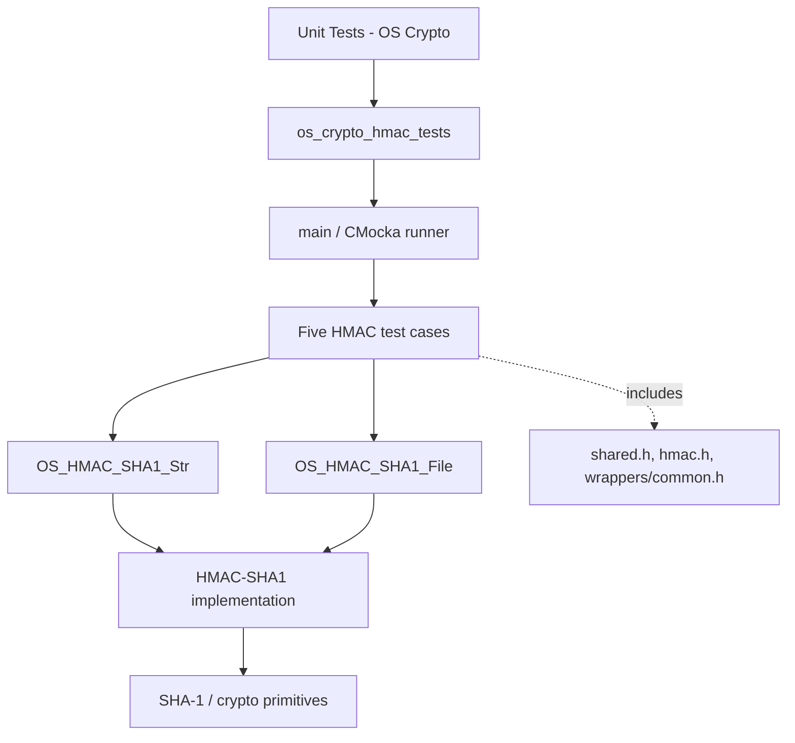
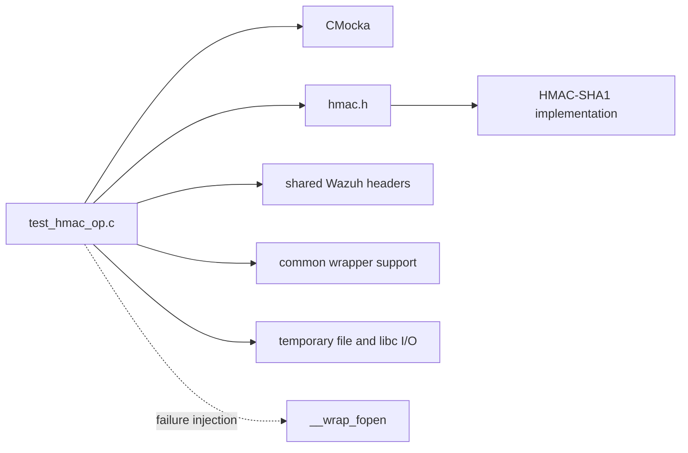
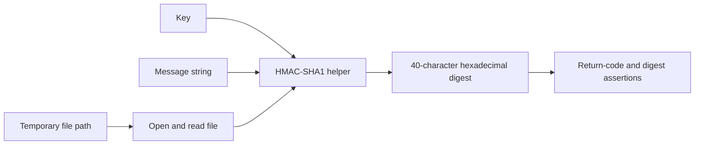
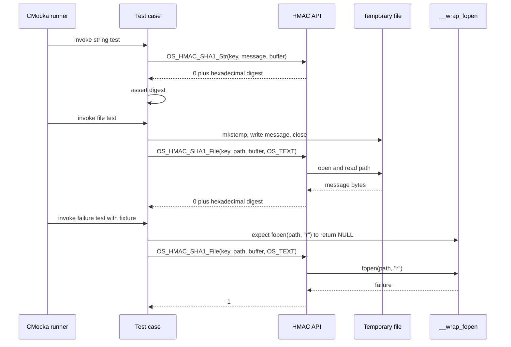

# `os_crypto_hmac_tests`

`os_crypto_hmac_tests` is the CMocka unit-test module for Wazuh’s HMAC-SHA1 helpers. It verifies deterministic hexadecimal digests for strings and files, handling of a long key, and propagation of a file-open failure. It is a leaf of the native [OS crypto module](os_crypto.md); common CMocka and wrapper conventions are described in [test infrastructure](test_infrastructure.md).

## Scope and purpose

The module is implemented by one translation unit:

| Component | Responsibility |
| --- | --- |
| `src/unit_tests/os_crypto/hmac/test_hmac_op.c` | Defines fixtures, test cases, and the CMocka runner |
| `CMUnitTest` | CMocka descriptor type used to register tests |
| `main` | Registers five tests and runs the group |
| `setup_group / teardown_group` | Toggle the global `test_mode` for the mocked failure case |
| `test_hmac_string` / `test_hmac_file` | Short-key string and file HMAC-SHA1 checks |
| `test_hmac_string_length_key` / `test_hmac_file_length_key` | Equivalent checks using a longer key |
| `test_hmac_file_popen_fail` | Verifies `OS_HMAC_SHA1_File` returns `-1` when opening fails |

The tests are black-box API tests. They call `OS_HMAC_SHA1_Str` and `OS_HMAC_SHA1_File` through `../../os_crypto/hmac/hmac.h` and validate only public return values and digest output.

## Architecture



The module is a sibling of the AES, Blowfish, MD5, SHA-1, SHA-256, and SHA-512 tests under `Unit_Tests_-_OS_Crypto`. It does not call API, database, socket, agent, or daemon components. Broader cryptographic and key-store relationships belong in [os_crypto](os_crypto.md).

## Dependencies

- `cmocka.h` supplies descriptors, registration macros, fixtures, and assertions.
- `../headers/shared.h` supplies shared Wazuh test declarations.
- `../../os_crypto/hmac/hmac.h` declares the HMAC helpers, `os_sha1`, and `OS_TEXT`.
- `../../wrappers/common.h` supplies common wrapper declarations and `test_mode` support.
- libc/project file facilities provide `mkstemp`, `write`, and `close` for temporary-file tests.



The exact production implementation and link target are build-system concerns; the test executable must link the HMAC implementation, CMocka, and unit-test support.

## Test data and expected results

| Case | Key | Message/file content | Expected HMAC-SHA1 |
| --- | --- | --- | --- |
| Short key | `test_key` | `test string` | `bcbf151b282a23e0849453f2b5732bfd8226e16a` |
| Long key | `test_key_abcdefghijklmnopqrstvwxzabcdefghijklmnopqrstvwxzabcdefgh` | `test string` | `11ff0061a90ab6490f35994b044fb281fd4dfa6a` |

The expected values are lowercase hexadecimal strings. Every test stores the result in an `os_sha1` buffer and requires a return value of `0` on success.

File tests create a unique path from `/tmp/tmp_file-XXXXXX` with `mkstemp`, write exactly the message bytes, close the descriptor, and call `OS_HMAC_SHA1_File(..., OS_TEXT)`. The source does not explicitly unlink the temporary files.

## Data flow



String cases pass the message directly to `OS_HMAC_SHA1_Str`. File cases pass a path to `OS_HMAC_SHA1_File`, which owns file access and hashing. Equivalent key/content pairs must produce the same digest.

## Execution and process flow

```mermaid
flowchart TD
    Start([Process starts]) --> Main[main]
    Main --> Register[Register five CMUnitTest entries]
    Register --> Run[cmocka_run_group_tests]
    Run --> Case{Invoke case}
    Case --> S[test_hmac_string or long-key variant]
    Case --> F[test_hmac_file or long-key variant]
    Case --> E[test_hmac_file_popen_fail]
    S --> SC[OS_HMAC_SHA1_Str]
    F --> Prep[mkstemp, write, close]
    Prep --> FC[OS_HMAC_SHA1_File]
    E --> Setup[setup_group: test_mode = 1]
    Setup --> Expect[Expect __wrap_fopen(path, "r") -> NULL]
    Expect --> EC[OS_HMAC_SHA1_File]
    SC --> Check{Return 0 and digest matches?}
    FC --> Check
    EC --> Error{Return -1?}
    Check -->|No| Fail([CMocka failure])
    Error -->|No| Fail
    Check -->|Yes| Pass([Case passes])
    Error -->|Yes| Teardown[teardown_group: test_mode = 0]
    Teardown --> Pass
    Pass --> Report[CMocka result and process exit]
```

`main` passes `NULL` group setup/teardown to the runner; the callbacks are attached only to `test_hmac_file_popen_fail` using `cmocka_unit_test_setup_teardown`.

## Component interaction



## Behavioral contract and coverage

The tests establish that:

1. `OS_HMAC_SHA1_Str` returns `0` and produces the known short-key digest.
2. `OS_HMAC_SHA1_File` returns `0` and produces the same digest for equivalent file content.
3. Both helpers correctly process the supplied longer key and produce its known digest.
4. `OS_HMAC_SHA1_File` returns `-1` when its file-open operation fails.

The long-key cases exercise the HMAC key-normalization path without duplicating that algorithm in the test. The module does not cover empty messages, embedded NUL bytes, binary mode, partial reads, null pointers, output limits, or wrong-key behavior.

## Failure handling and isolation

Successful-path assertions require both a zero return code and an exact digest match. The failure test uses CMocka expectations to replace `fopen` with a controlled failure and checks the translated `-1` result. `setup_group` and `teardown_group` reset `test_mode` so the wrapper state cannot leak into other tests.

There is no module-specific cleanup for the temporary files in the supplied source; stack buffers are reclaimed when each test returns.

## Maintenance guidance

Update this documentation and tests when changing return-code semantics, digest formatting/casing, long-key handling, `OS_TEXT` behavior, file-open error propagation, or public HMAC signatures. If the API moves to explicit byte lengths or binary buffers, use length-aware comparisons and add embedded-NUL coverage. If cleanup is tightened, preserve unique temporary-file creation for parallel test isolation.

## Source references

- `src/unit_tests/os_crypto/hmac/test_hmac_op.c`
- [os_crypto](os_crypto.md)
- [test infrastructure](test_infrastructure.md)
- [os_crypto_aes_tests](os_crypto_aes_tests.md)
- [os_crypto_blowfish_tests](os_crypto_blowfish_tests.md)
