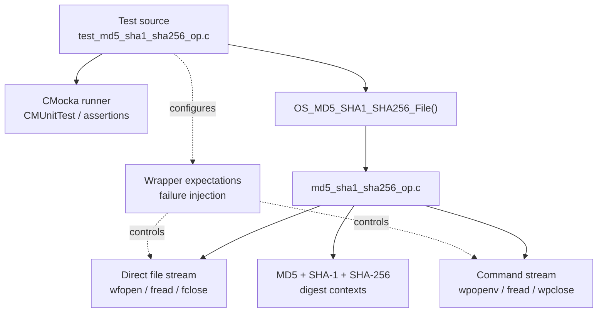
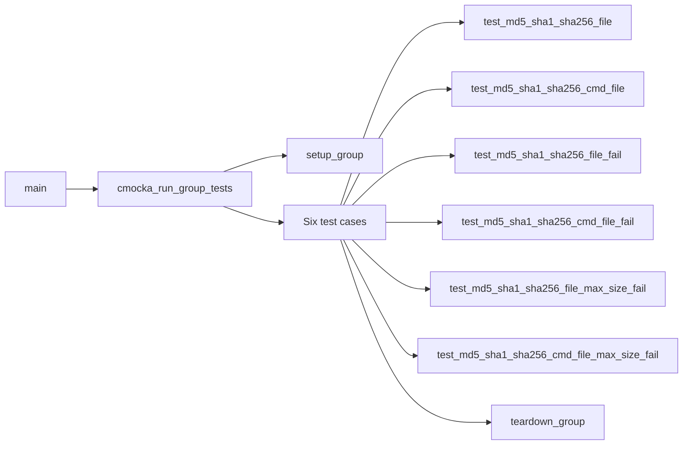
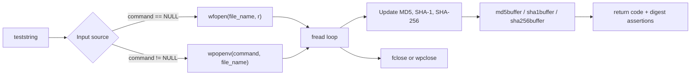
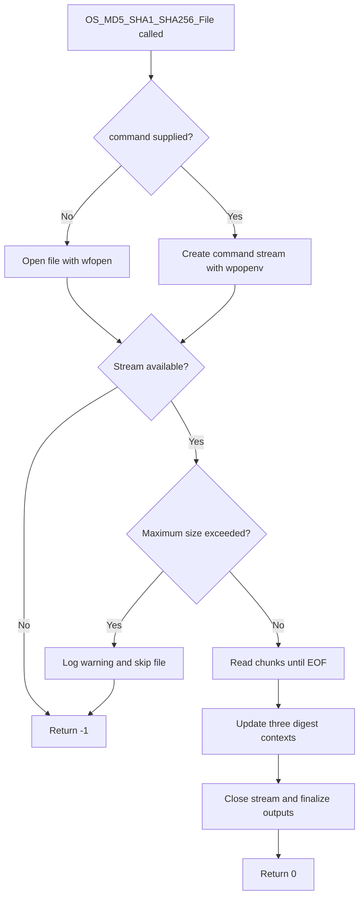
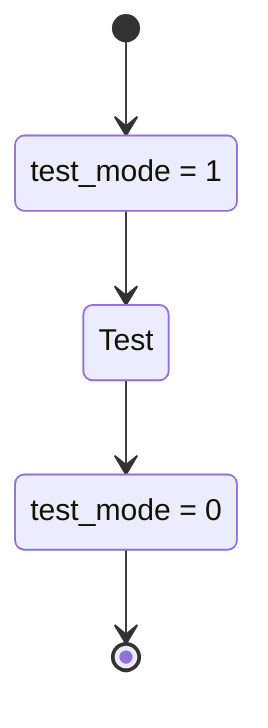
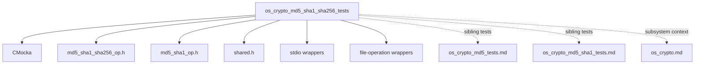

# `os_crypto_md5_sha1_sha256_tests`

`os_crypto_md5_sha1_sha256_tests` is the CMocka unit-test suite for Wazuh’s combined file-hashing helper. It exercises `OS_MD5_SHA1_SHA256_File()` through direct file input and command-output input, verifies successful MD5/SHA-1 results, and checks error handling for unavailable streams and maximum-size rejection.

The suite belongs to the native [OS crypto subsystem](os_crypto.md). Individual algorithm coverage is documented in [os_crypto_md5_tests.md](os_crypto_md5_tests.md), [os_crypto_md5_sha1_tests.md](os_crypto_md5_sha1_tests.md), and the neighboring SHA-1/SHA-256 test modules when available.

## Scope and source layout

| Item | Location / role |
| --- | --- |
| Test source | `src/unit_tests/os_crypto/md5_sha1_sha256/test_md5_sha1_sha256_op.c` |
| Test group | `os_crypto_md5_sha1_sha256_tests` |
| Production header | `src/os_crypto/md5_sha1_sha256/md5_sha1_sha256_op.h` |
| Related header | `src/os_crypto/md5_sha1/md5_sha1_op.h` |
| Framework | CMocka (`cmocka.h`) |
| Test wrappers | libc stdio, Wazuh file operations, common process wrappers |
| Primary API | `OS_MD5_SHA1_SHA256_File()` |

The API accepts a file name, an optional command vector, three output buffers, an input mode, and a maximum-size limit. The test uses `OS_TEXT` and a maximum-size argument of `20` for ordinary success cases. When `command` is `NULL`, the helper reads the named file. Otherwise it hashes command output, represented by `{"cat", NULL}` in the tests.

## Architecture



The test suite is a black-box boundary around the production helper. It supplies deterministic streams and checks the return code and digest buffers after the production function performs reading, digest updates, finalization, and cleanup.

## Component relationships

- `CMUnitTest` describes each registered CMocka case.
- `main` builds the six-test registration array and starts `cmocka_run_group_tests`.
- `setup_group` enables the shared `test_mode` flag before the test group.
- `teardown_group` restores `test_mode` to `0` afterward.
- The six test functions cover direct input, command input, stream/open failures, and size-limit failures.



## Expected test data

All successful cases model the input `teststring`:

| Digest | Expected hexadecimal value | Asserted in source? |
| --- | --- | --- |
| MD5 | `d67c5cbf5b01c9f91932e3b8def5e5f8` | Yes |
| SHA-1 | `b8473b86d4c2072ca9b08bd28e373e8253e865c4` | Yes |
| SHA-256 | `3c8727e019a42b444667a587b6001251becadabbb36bfed8087a92c18882d111` | No |

The SHA-256 expected string is declared, but the supplied source does not assert `sha256buffer`. The suite therefore proves that the SHA-256 output buffer is accepted by the API, not that its value is correct. The command-path test also contains a duplicate SHA-1 assertion where a SHA-256 assertion would be expected.

## Data flow



Successful cases configure one non-empty read followed by a zero-length read, modeling input followed by EOF. The direct path expects `wfopen` and `fclose`; the command path configures `wpopenv` and `wpclose` through wrappers.

## Test cases

### `test_md5_sha1_sha256_file`

This is the direct file path. The test configures a fake file handle, returns `teststring` from `fread`, then returns zero for EOF and expects a successful close. The helper must return `0`, and the MD5 and SHA-1 buffers must match the known values.

### `test_md5_sha1_sha256_cmd_file`

This is the command path using `{"cat", NULL}`. The test supplies a fake process handle, configures the same two reads, and expects `wpclose` to succeed. The helper must return `0` and produce the expected MD5 and SHA-1 values. SHA-256 is not asserted.

### Failure and size-limit cases

- `test_md5_sha1_sha256_cmd_file_fail` makes `wpopenv` return `NULL`; the helper must return `-1` without reading.
- `test_md5_sha1_sha256_file_fail` makes `wfopen` return `NULL`; the helper must return `-1` without reading or closing.
- `test_md5_sha1_sha256_cmd_file_max_size_fail` checks maximum-size rejection for command output.
- `test_md5_sha1_sha256_file_max_size_fail` checks maximum-size rejection for direct file input.

The size-limit tests configure a warning with the form below and require a `-1` result:

```text
'<file>' filesize is larger than the maximum allowed (0 MB). File skipped.
```

The exact size interpretation and warning formatting are production behavior and must remain synchronized with `md5_sha1_sha256_op.c`.

## Process flow



The failure tests cover stream creation, direct file opening, and maximum-size rejection. They do not inject read errors, close errors, digest-context allocation failures, or digest-finalization failures.

## Fixture lifecycle and isolation



`main` passes `setup_group` and `teardown_group` to the group runner, so the callbacks apply to the complete test group. Both callbacks return `0`, allowing execution to proceed while preventing test mode from leaking after the suite completes.

## Dependencies and related documentation



The test file directly includes CMocka, shared Wazuh definitions, the combined hashing API, and wrappers for standard I/O and Wazuh file operations. Broader cryptographic architecture and production consumers are documented in [os_crypto.md](os_crypto.md); this page focuses on the test contract.

## Maintenance guidance

Update this documentation and the test suite when changing:

- the `OS_MD5_SHA1_SHA256_File` signature or return-code contract;
- command-vector handling and process-wrapper behavior;
- `OS_TEXT`/binary mode semantics;
- maximum-size units, warning text, or rejection timing;
- digest output formatting or buffer types;
- wrapper names used for file and command streams.

Recommended additions include asserting `sha256buffer`, testing empty and multi-chunk input, injecting read and close failures, exercising binary mode, and testing filenames containing spaces or shell-sensitive characters. The duplicated SHA-1 assertion in `test_md5_sha1_sha256_cmd_file` should be replaced with a SHA-256 assertion.

## Summary

This module verifies the combined file-hashing helper across direct and command-backed input sources. It confirms successful MD5/SHA-1 output and negative returns for stream, open, and size-limit failures. SHA-256 is wired into the test invocation and expected data, but the current assertions do not validate the SHA-256 result.
