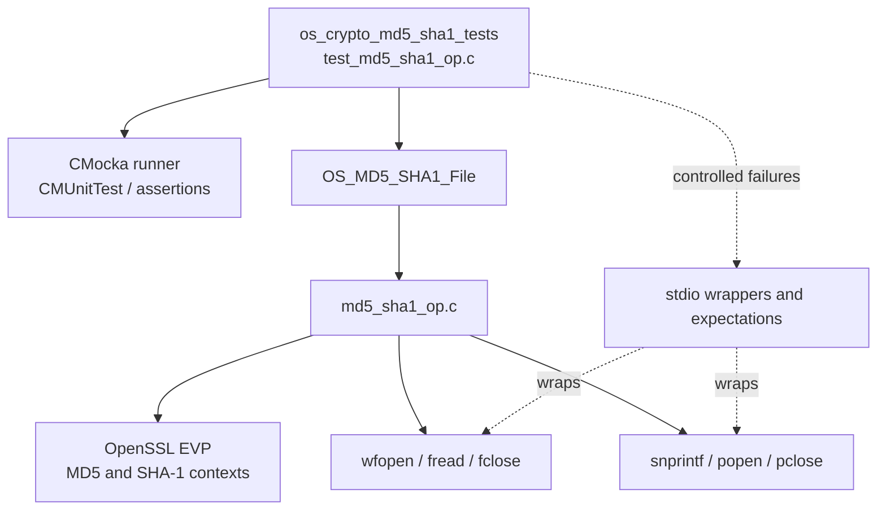
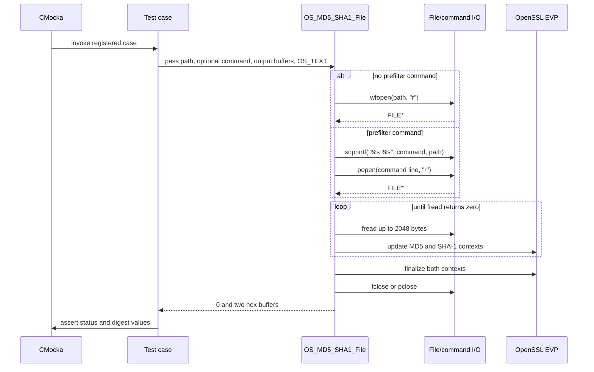
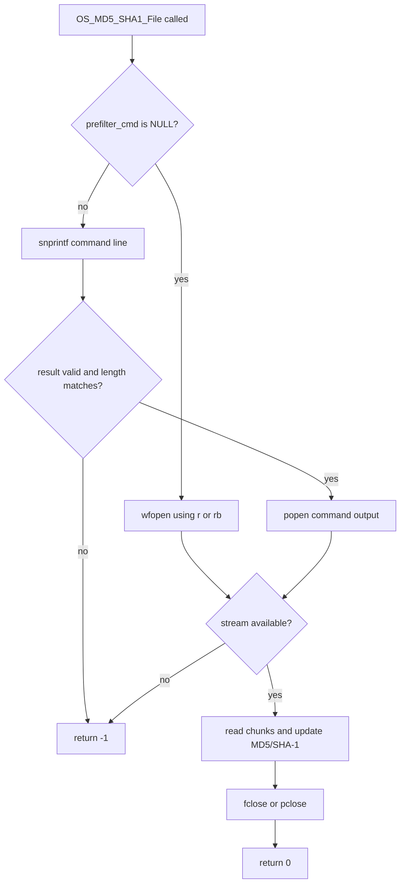
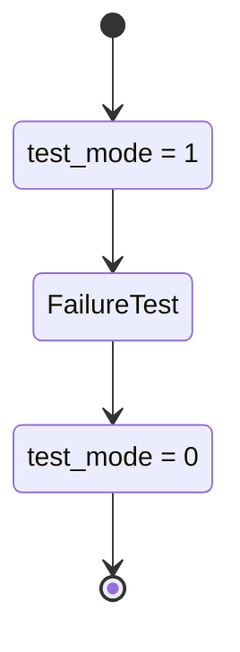
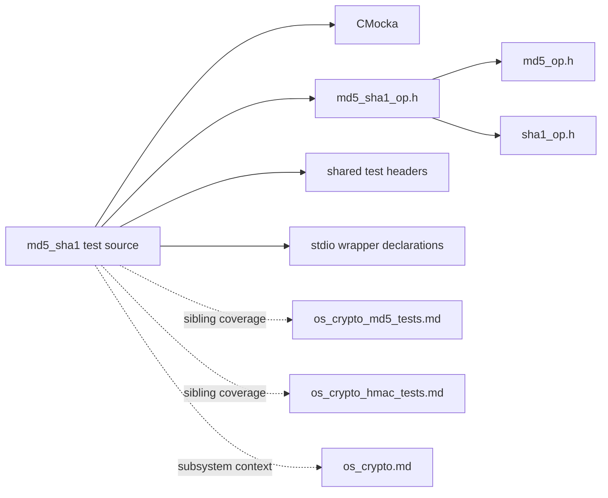

# `os_crypto_md5_sha1_tests`

`os_crypto_md5_sha1_tests` is the CMocka unit-test suite for Wazuh’s combined MD5 and SHA-1 file hashing helper. It verifies that the helper produces both digests from the same input, supports an optional prefilter command, and returns `-1` for command construction, command execution, or file-open failures.

The suite belongs to the native [OS crypto subsystem](os_crypto.md). Its neighboring algorithm tests cover individual MD5, SHA-1, HMAC, AES, Blowfish, SHA-256, and SHA-512 behavior; this module is specifically about the combined MD5/SHA-1 file API.

## Scope and source layout

| Item | Location / role |
| --- | --- |
| Test source | `src/unit_tests/os_crypto/md5_sha1/test_md5_sha1_op.c` |
| Test group | `os_crypto_md5_sha1_tests` |
| Production header | `src/os_crypto/md5_sha1/md5_sha1_op.h` |
| Production implementation | `src/os_crypto/md5_sha1/md5_sha1_op.c` |
| Test framework | CMocka (`cmocka.h`) |
| Test support | `headers/shared.h`, `wrappers/common.h`, `wrappers/libc/stdio_wrappers.h` |
| Primary API | `OS_MD5_SHA1_File()` |

The production function has the following contract:

```c
int OS_MD5_SHA1_File(const char *fname,
                     const char *prefilter_cmd,
                     os_md5 md5output,
                     os_sha1 sha1output,
                     int mode);
```

With `prefilter_cmd == NULL`, `mode` selects text (`"r"`) or binary (`"rb"`) input. With a prefilter command, the implementation builds `"<command> <file>"`, reads the command’s standard output through `popen`, and closes it with `pclose`.

## Architecture



The test file is a thin black-box layer. It creates temporary input files for successful cases, invokes the production API, and compares the two output buffers with known hexadecimal digests. CMocka wrappers inject failures without requiring a real missing executable or a naturally failing `popen` call.

## Component relationships

- `main` registers five test cases and starts `cmocka_run_group_tests`.
- `CMUnitTest` is the CMocka descriptor type used by the registration array.
- `setup_group` sets the shared `test_mode` flag to `1`; `teardown_group` restores it to `0`.
- `test_md5_sha1_file` covers direct file reading with no prefilter.
- `test_md5_sha1_cmd_file` covers the prefilter path using `cat `.
- `test_md5_sha1_cmd_file_fail` covers a missing direct input file.
- `test_md5_sha1_cmd_file_snprintf_fail` forces command-string construction to fail.
- `test_md5_sha1_cmd_file_popen_fail` forces `popen` to return `NULL`.

Only the final two failure-injection tests use setup and teardown callbacks in `main`; the other cases are registered as ordinary CMocka tests.

## Test data and expected output

Every successful test hashes the nine-byte string `teststring` and expects:

| Output | Expected hexadecimal digest |
| --- | --- |
| MD5 | `d67c5cbf5b01c9f91932e3b8def5e5f8` |
| SHA-1 | `b8473b86d4c2072ca9b08bd28e373e8253e865c4` |

The implementation initializes both EVP contexts, feeds each input chunk to both contexts, finalizes both digests, and formats MD5 as 32 lowercase hexadecimal characters and SHA-1 as 40 lowercase hexadecimal characters. The tests validate the resulting strings rather than the internal EVP state.

## Execution flow



The implementation uses a 2048-byte read buffer. The test inputs are small, so each successful path normally completes in one read followed by EOF. `OS_TEXT` causes the direct branch to use text mode; the prefilter branch always reads command output as a pipe.

## Test cases

### `test_md5_sha1_file`

The test creates a unique file with `mkstemp`, writes `teststring`, closes the descriptor, and calls:

```c
OS_MD5_SHA1_File(file_name, NULL, md5buffer, sha1buffer, OS_TEXT)
```

The expected result is `0`, followed by exact comparisons against the MD5 and SHA-1 values above. This covers direct `wfopen`, simultaneous digest updates, EOF handling, finalization, output formatting, and `fclose`.

### `test_md5_sha1_cmd_file`

This case uses the same temporary file but passes `"cat "` as `prefilter_cmd`. The production code appends the filename with a separating space, invokes `popen`, hashes the command output, and closes the pipe with `pclose`. The test requires the same two digests and a return value of `0`.

### `test_md5_sha1_cmd_file_fail`

Despite its historical name, this is the direct file-open failure case. It passes `NULL` for the prefilter and the literal path `not_existing_file`. `wfopen` cannot produce a stream, so the function must return `-1` before creating digest contexts or reading input.

### `test_md5_sha1_cmd_file_snprintf_fail`

This test supplies a temporary file and `"cat "`, then configures the wrapped `snprintf` to return `-1`. The function must reject command construction and return `-1`. The expectation also verifies the production format string `%s %s` and maximum length `OS_MAXSTR`.

### `test_md5_sha1_cmd_file_popen_fail`

This test allows `snprintf` to report a successful length, then configures `popen("", "r")` to return `NULL`. The function must return `-1` without attempting to hash or close a nonexistent pipe.

## Error and resource behavior



The tested early exits are:

| Failure point | Expected result | Resource expectation |
| --- | ---: | --- |
| `wfopen` fails | `-1` | No stream or contexts to close |
| `snprintf` fails or length is inconsistent | `-1` | No pipe opened |
| `popen` fails | `-1` | No pipe stream to close |

The implementation also has defensive cleanup for EVP context allocation failures, although those paths are not injected by this test file. Successful paths free both EVP contexts and close either the file or pipe.

## Fixture lifecycle and isolation



`setup_group` and `teardown_group` are attached only to the `snprintf` and `popen` failure tests. They enable the shared wrapper behavior for those tests and prevent the global `test_mode` value from leaking into later tests. Successful file cases use actual temporary files for input; the supplied source does not explicitly unlink those files after hashing.

## Dependency view



The production implementation depends on Wazuh file helpers and OpenSSL EVP; those runtime details are intentionally not duplicated here. See [os_crypto.md](os_crypto.md) for the subsystem boundary and [os_crypto_md5_tests.md](os_crypto_md5_tests.md) or [os_crypto_hmac_tests.md](os_crypto_hmac_tests.md) for comparable test-suite patterns.

## Maintenance guidance

Update this module when changing any of the following:

- the `OS_MD5_SHA1_File` signature, `OS_TEXT`/`OS_BINARY` mode behavior, or return-code contract;
- prefilter command formatting, length validation, or use of `popen`/`pclose`;
- digest casing, output buffer sizes, or simultaneous MD5/SHA-1 calculation;
- wrapper names or CMocka failure-injection conventions.

Useful additions would include binary-mode input, data larger than 2048 bytes, read errors, close errors, EVP allocation failures, filenames containing spaces, and empty input. When adding such cases, preserve the existing wrapper-based isolation for command and libc failure paths.

## Summary

`os_crypto_md5_sha1_tests` validates the combined file-hashing contract at two integration boundaries: direct file input and prefiltered command output. It confirms both known digests on success and verifies that failures in file opening, command construction, and pipe creation are reported as `-1`.
