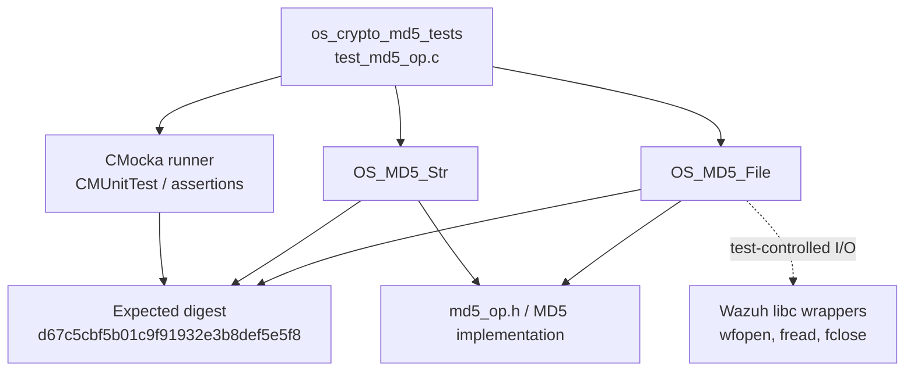
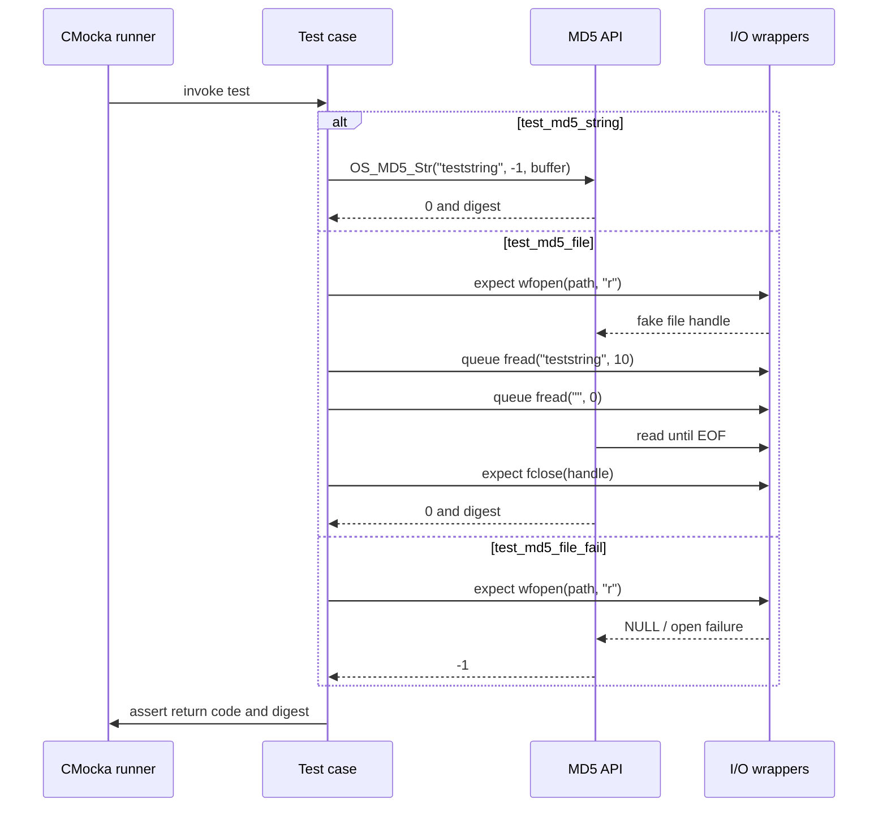
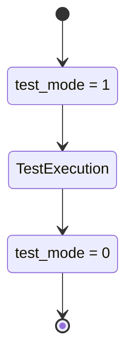
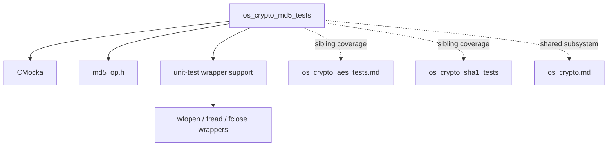

# `os_crypto_md5_tests`

The `os_crypto_md5_tests` module is the CMocka unit-test suite for Wazuh's MD5 helpers. It verifies that MD5 hashing produces the expected hexadecimal digest for an in-memory string, succeeds when hashing a file-like input, and returns an error when the file cannot be opened.

The suite is part of the broader [OS Crypto subsystem](os_crypto.md). Related algorithm suites are documented in [os_crypto_aes_tests.md](os_crypto_aes_tests.md), [os_crypto_blowfish_tests.md](os_crypto_blowfish_tests.md), and [os_crypto_hmac_tests.md](os_crypto_hmac_tests.md).

## Module location and scope

| Item | Location / value |
|---|---|
| Test source | `src/unit_tests/os_crypto/md5/test_md5_op.c` |
| Test group | `os_crypto_md5_tests` |
| Test framework | CMocka (`cmocka.h`) |
| Production API under test | `OS_MD5_Str`, `OS_MD5_File` |
| Production header | `src/os_crypto/md5/md5_op.h` |
| Common test support | `src/unit_tests/wrappers/common.h`, `src/unit_tests/os_crypto/headers/shared.h` |
| Main output type | `os_md5`, a hexadecimal MD5 digest buffer |

The module tests the public behavior of the MD5 API, not the cryptographic primitive's internal rounds. File I/O is isolated through the Wazuh test wrappers, allowing success and open-failure paths to be deterministic.

## Architecture

The suite has a small test-harness layer around the production MD5 API. The string test calls the implementation directly. The file tests replace file operations with wrapper expectations and return values, then exercise the same production API.



### Component relationships

- `main` declares the three CMocka cases and starts the group runner.
- `setup_group` and `teardown_group` manage the global `test_mode` flag used by the test infrastructure.
- `test_md5_string` validates direct string hashing.
- `test_md5_file` validates file opening, repeated reads, close handling, and the resulting digest.
- `test_md5_file_fail` validates the file-open error contract.
- The wrapper layer supplies fake file handles and read results; it prevents the test from depending on an actual filesystem path.

## Test execution flow



## Test cases

### `test_md5_string`

This is the direct, in-memory path:

1. The input is the literal `teststring`.
2. The length argument is `-1`, indicating that the helper should derive the string length according to the production API contract.
3. `OS_MD5_Str` must return `0`.
4. The output buffer must equal `d67c5cbf5b01c9f91932e3b8def5e5f8`.

This case checks both status reporting and exact digest formatting, including lowercase hexadecimal output.

### `test_md5_file`

This case models a readable file whose contents are `teststring`:

- `wfopen` is expected with the supplied path and mode `"r"`, returning fake handle `1`.
- The first `fread` returns ten bytes containing `teststring`.
- The second `fread` returns zero bytes, representing EOF.
- `fclose` is expected for handle `1` and returns success.
- `OS_MD5_File(path, buffer, OS_TEXT)` must return `0`.
- The digest must match the string case.

The path is intentionally not required to exist. Its role is an identifier passed to the mocked open operation.

### `test_md5_file_fail`

This case models an unavailable file. `wfopen` is expected with mode `"r"` and returns `0`. The test then requires `OS_MD5_File` to return `-1`. No read or close operation is configured because the implementation must stop after the open failure.

## Data flow

```mermaid
flowchart LR
    I1["teststring"] -->|OS_MD5_Str, length -1| D[MD5 digest computation]
    P["path/to/file"] --> O[wfopen(path, "r")]
    O -->|fake handle 1| Q[fread loop]
    Q --> B[bytes: teststring]
    B --> D
    D --> X[os_md5 buffer]
    X --> A[assert string equals expected digest]
    O -. returns 0 .-> E[return -1]
```

For the successful file path, the API consumes bytes until the wrapper returns a zero-length read. The test does not inspect intermediate MD5 state; it observes the final digest and return code. For the failure path, the data flow terminates at `wfopen`.

## Lifecycle and isolation



Only the two file tests use the setup/teardown callbacks in the supplied `main`; the string test is registered without callbacks. The callbacks return `0`, so setup and teardown do not cause a test skip or failure. Their purpose is to put the shared wrapper infrastructure into test mode and restore it afterward.

## Assertions and error semantics

| Operation | Success result | Failure result | Verification |
|---|---:|---:|---|
| `OS_MD5_Str` | `0` | Not covered in this file | Exact digest comparison |
| `OS_MD5_File` with readable input | `0` | Not applicable | Exact digest comparison and wrapper expectations |
| `OS_MD5_File` when `wfopen` fails | Not applicable | `-1` | Return-code assertion |

The suite therefore establishes the minimum observable contract for these paths: successful operations return zero, file-open failure returns negative one, and successful output is a 32-character lowercase MD5 digest.

## Dependency and boundary view



The suite's only production boundary is the MD5 API. The wrapper dependency is test infrastructure rather than a runtime dependency of Wazuh's MD5 implementation. Broader crypto APIs, shared key handling, and other algorithms belong in [os_crypto.md](os_crypto.md) and their dedicated module documents.

## Maintenance guidance

When changing the MD5 API or its file-reading behavior, update this suite if any of the following contracts change:

- the meaning of a `-1` string length;
- the accepted file mode or text/binary selector (`OS_TEXT`);
- the return value for an open failure;
- whether EOF is represented by a zero-length read;
- digest casing, buffer size, or output representation.

When adding cases, keep filesystem behavior mocked through the existing wrapper conventions. This preserves deterministic tests and makes failures attributable to the MD5 API rather than host filesystem state. Cross-algorithm conventions should be kept aligned with the sibling [MD5/SHA-1 tests](os_crypto_md5_sha1_tests.md) and [SHA-256 tests](os_crypto_sha256_tests.md).

## Summary

`os_crypto_md5_tests` is a focused contract suite with three cases: direct string hashing, successful mocked file hashing, and file-open failure. Its architecture deliberately separates CMocka orchestration and mocked I/O from the production MD5 API, while the expected digest provides a stable end-to-end correctness check.
