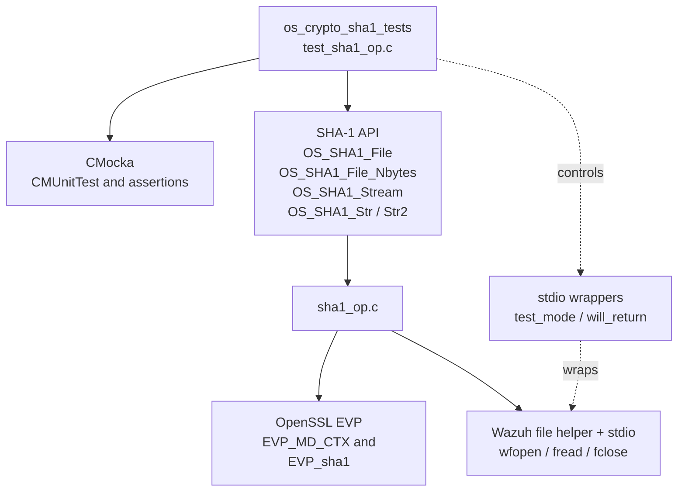
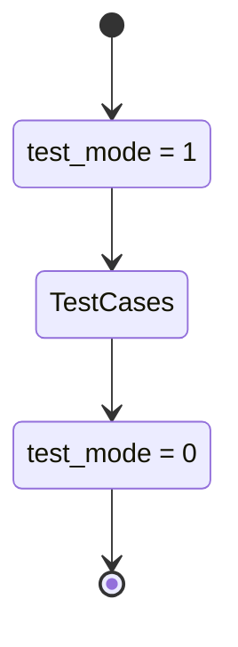
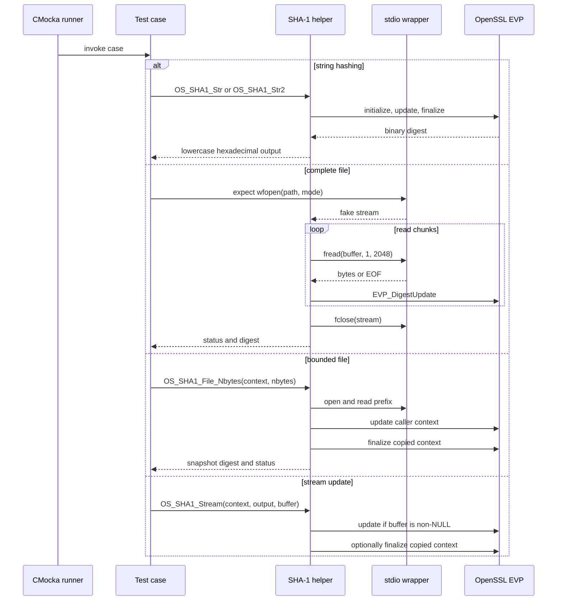
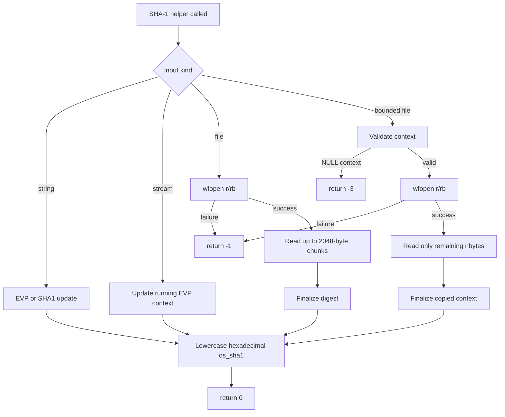
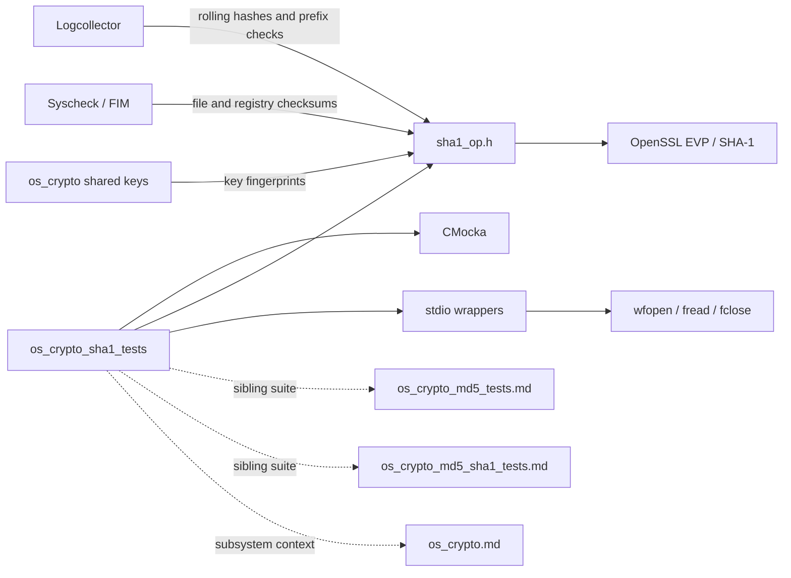

# `os_crypto_sha1_tests`

`os_crypto_sha1_tests` is the CMocka unit-test suite for Wazuh's SHA-1 helpers. It exercises whole-file hashing, bounded file-prefix hashing, incremental stream updates, and two string-hashing implementations. The suite sits below the native [OS crypto subsystem](os_crypto.md) and supplies the low-level behavior used by components such as Logcollector, FIM, agent key handling, and integrity checks.

## Scope and source layout

| Item | Location / value |
| --- | --- |
| Test source | `src/unit_tests/os_crypto/sha1/test_sha1_op.c` |
| Test group | `os_crypto_sha1_tests` |
| Production implementation | `src/os_crypto/sha1/sha1_op.c` |
| Production header | `src/os_crypto/sha1/sha1_op.h` |
| Test framework | CMocka (`cmocka.h`) |
| Test support | `src/unit_tests/os_crypto/headers/shared.h`, `wrappers/common.h`, `wrappers/libc/stdio_wrappers.h` |
| Digest type | `os_sha1`, a 41-byte buffer for 40 lowercase hexadecimal characters plus NUL |

The tests focus on observable API contracts. OpenSSL EVP internals are used by the implementation but are not mocked here; libc file operations are mocked where deterministic file-open/read/close behavior is required.

## Architecture



### Component relationships

- `main` registers ten cases and starts the CMocka group runner.
- `setup_group` sets the shared `test_mode` flag to `1`; `teardown_group` resets it to `0`.
- `OS_SHA1_File` hashes a complete file using text (`"r"`) or binary (`"rb"`) mode.
- `OS_SHA1_File_Nbytes` delegates to the bounded hashing implementation and produces a digest for a file prefix while preserving the caller's EVP context.
- `OS_SHA1_Stream` updates a running context from a NUL-terminated buffer and optionally snapshots the current digest into `output`.
- `OS_SHA1_Str` uses OpenSSL EVP and treats a negative length as `strlen(str)`; `OS_SHA1_Str2` uses the legacy OpenSSL `SHA1()` helper.
- `__wrap_wfopen`, `__wrap_fread`, and `__wrap_fclose` make file paths and stream behavior deterministic in the file tests.

## API behavior under test

| Function | Intended behavior | Covered by |
| --- | --- | --- |
| `OS_SHA1_File` | Hash a complete file and return `0`; return `-1` if opening fails | `test_sha1_file`, `test_sha1_file_fail` |
| `OS_SHA1_File_Nbytes` | Reset an existing EVP context, hash up to `nbytes`, emit a snapshot digest | `OS_SHA1_File_Nbytes_ok`, `OS_SHA1_File_Nbytes_num_bytes_exceded` |
| `OS_SHA1_File_Nbytes` with invalid context | Reject `NULL` context or `*c == NULL` | `OS_SHA1_File_Nbytes_context_null` |
| `OS_SHA1_Stream` | Append buffer contents to a context; optionally emit a non-destructive digest snapshot | `OS_SHA1_Stream_ok`, `OS_SHA1_Stream_buf_null` |
| `OS_SHA1_Str` | Hash a string or explicit byte length through EVP | `test_sha1_string` |
| `OS_SHA1_Str2` | Hash a string or explicit byte length through legacy `SHA1()` | `test_sha1_string2` |

The production implementation reads files in chunks of up to 2048 bytes. For bounded hashing, the context passed by the caller is initialized and updated, then copied to a temporary EVP context for finalization; this allows the caller's running context to remain usable.

## Test registration and lifecycle



`cmocka_run_group_tests` applies the setup and teardown callbacks to the registered group. The callbacks do not allocate fixtures or inspect `state`; they only switch wrapper behavior. `EVP_MD_CTX` objects created by the tests are explicitly freed in the context-based cases.

## Test execution flow



## Test cases

### Bounded file hashing

`OS_SHA1_File_Nbytes_context_null` passes an `EVP_MD_CTX **` whose pointed-to context is `NULL`. The helper must return `-3`, matching the documented invalid-context contract.

`OS_SHA1_File_Nbytes_unable_open_file` creates a valid EVP context but configures `wfopen(path, "rb")` to return `NULL`. The expected result is `-1`; the test then frees the caller-owned context.

`OS_SHA1_File_Nbytes_ok` configures a fake stream and two zero-byte reads, followed by a successful `fclose`. With `nbytes = 4000`, the helper must return `0`. This confirms the open/read/close path and context-based API, but it does not verify a non-empty digest because both mocked reads report EOF.

`OS_SHA1_File_Nbytes_num_bytes_exceded` uses `nbytes = 6` and is intended to cover the boundary where the requested byte count is smaller than a 2048-byte chunk. In the supplied test, the mocked read again returns zero, so the assertion establishes only a successful return and close sequence; it does not prove that exactly six bytes are consumed.

### Streaming updates

`OS_SHA1_Stream_ok` creates and initializes an EVP context, passes `"hello"`, and checks only that the call completes without an assertion failure. It does not compare `output` with a known digest.

`OS_SHA1_Stream_buf_null` passes a `NULL` buffer. The implementation skips `EVP_DigestUpdate` and, because `output` is non-NULL, snapshots the digest of the empty context. The test checks only safe completion, not the resulting empty-string SHA-1 value.

### String hashing

`test_sha1_string` hashes `"teststring"` with `OS_SHA1_Str(string, strlen(string), buffer)`. It requires return value `0` and the exact digest:

```text
b8473b86d4c2072ca9b08bd28e373e8253e865c4
```

`test_sha1_string2` repeats the same known-answer test through `OS_SHA1_Str2`, providing coverage for the legacy implementation path as well as the EVP path.

### Complete file hashing

`test_sha1_file` configures `wfopen(file_name, "r")` to return fake handle `1`, queues a mocked `fread` payload of `"teststring"` with a return count of `0`, and expects a successful `fclose`. Because the wrapper returns the configured count, the production loop sees immediate EOF. Consequently, the expected digest is the SHA-1 of empty input:

```text
da39a3ee5e6b4b0d3255bfef95601890afd80709
```

This is a notable fixture limitation: despite the mock payload name, no bytes are reported as read. The test validates successful file setup and empty-input finalization, not hashing of `teststring` from a file.

`test_sha1_file_fail` configures `wfopen("not_existing_file", "r")` to return `0`. `OS_SHA1_File` must stop at the open failure and return `-1`.

## Data flow and error paths



The production header documents the bounded API's result codes:

| Condition | Result |
| --- | ---: |
| Successful hash | `0` |
| File cannot be opened | `-1` |
| File identity check fails in `OS_SHA1_File_Nbytes_with_fp_check` | `-2` (not directly tested here) |
| Context pointer or pointed-to context is `NULL` | `-3` |

The current suite covers `0`, `-1`, and `-3`. It does not cover the optional inode/file-index validation path or read/fclose failures.

## Dependency and system integration



`OS_SHA1_Stream` is used by Logcollector readers to extend a running digest as records are consumed; `OS_SHA1_File_Nbytes` is used for restart/rotation-aware prefix verification. Other consumers and the broader key/signature architecture are documented in [os_crypto.md](os_crypto.md), so this page does not duplicate those runtime workflows.

## Coverage limitations and maintenance guidance

The suite is useful but intentionally small. When changing `sha1_op.c` or `sha1_op.h`, consider adding cases for:

- a successful non-empty `OS_SHA1_File` fixture whose `fread` return value is greater than zero;
- empty-string and `"hello"` known-answer assertions for `OS_SHA1_Stream`;
- multi-chunk files and bounded reads where `nbytes` is not a multiple of 2048;
- read errors, close errors, negative or zero `nbytes`, and context-copy/finalization failures;
- `OS_SHA1_File_Nbytes_with_fp_check` inode/file-index mismatch (`-2`);
- binary input containing NUL bytes, since the implementation's stream helper uses `strlen` and is therefore text-buffer oriented;
- `OS_SHA1_Str` with negative length and embedded NUL data, and equivalence between `OS_SHA1_Str` and `OS_SHA1_Str2`.

Keep libc interactions mocked through the existing wrapper conventions when testing failure branches. This preserves deterministic behavior and avoids confusing host filesystem state with SHA-1 implementation failures. Keep algorithm-level details separate from sibling documentation such as [os_crypto_md5_tests.md](os_crypto_md5_tests.md) and [os_crypto_md5_sha1_tests.md](os_crypto_md5_sha1_tests.md).

## Summary

`os_crypto_sha1_tests` verifies SHA-1 string known answers, file-open failures, bounded-file context validation, and safe stream updates. Its strongest correctness assertions are the two `"teststring"` string tests; the file and stream cases primarily exercise lifecycle and error behavior, with the current mocked file-read fixture intentionally resulting in the empty-input digest.
