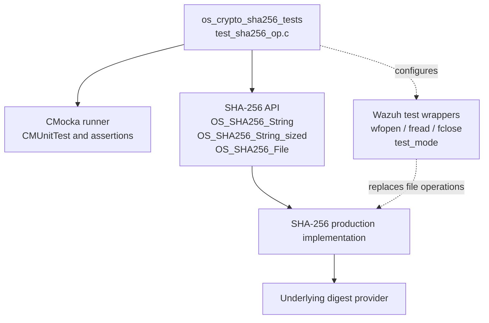
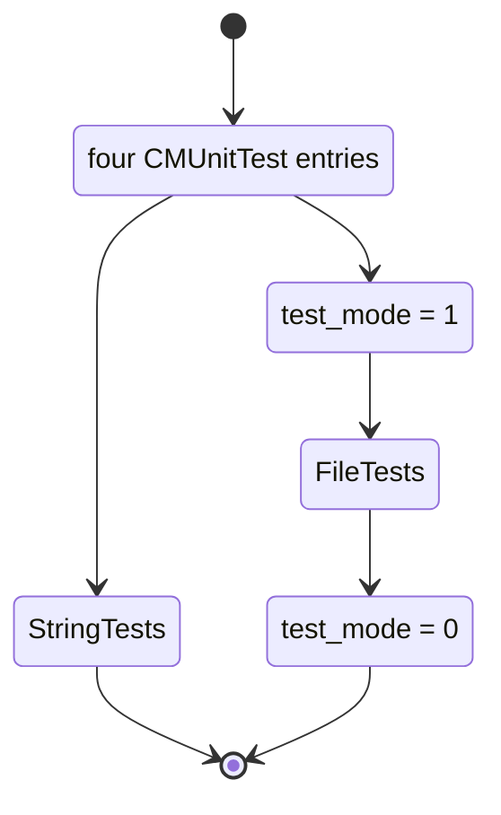
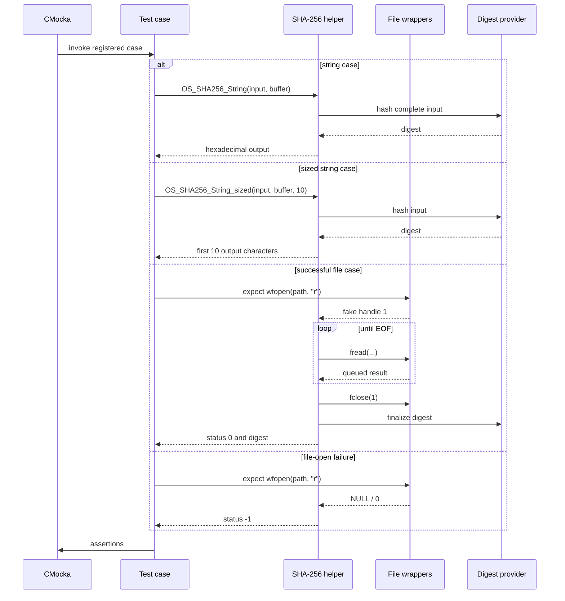
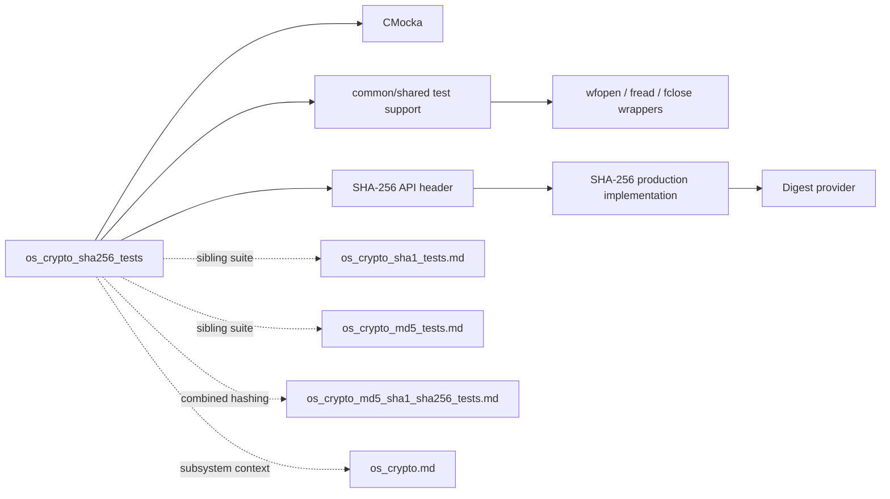

# `os_crypto_sha256_tests`

`os_crypto_sha256_tests` is the CMocka unit-test suite for Wazuh’s SHA-256 helper API. It verifies known-answer hashing for strings, prefix-sized string hashing, successful file-hash control flow, and file-open failure handling. The suite belongs to the native [OS crypto subsystem](os_crypto.md), while related algorithm-specific behavior is covered by [os_crypto_sha1_tests.md](os_crypto_sha1_tests.md), [os_crypto_md5_tests.md](os_crypto_md5_tests.md), and [os_crypto_md5_sha1_sha256_tests.md](os_crypto_md5_sha1_sha256_tests.md).

## Scope and source layout

| Item | Location / value |
|---|---|
| Test source | `src/unit_tests/os_crypto/sha256/test_sha256_op.c` |
| Test group | `os_crypto_sha256_tests` |
| Production API | `OS_SHA256_String`, `OS_SHA256_String_sized`, `OS_SHA256_File` |
| Production header | `../../os_crypto/sha256/sha256_op.h` as included by the test source |
| Test framework | CMocka (`cmocka.h`) |
| Test support | `src/unit_tests/wrappers/common.h`, `src/unit_tests/os_crypto/headers/shared.h`, and libc/file wrappers |
| Digest type | `os_sha256`, a hexadecimal SHA-256 output buffer |

The module tests the public observable contract of the SHA-256 helpers. It does not test SHA-256 compression rounds or OpenSSL internals directly; those are implementation concerns of the production crypto code.

## Architecture



### Component relationships

- `main` creates the four registered CMocka test cases and starts `cmocka_run_group_tests`.
- `setup_group` enables the shared wrapper test mode by setting `test_mode = 1`.
- `teardown_group` restores the shared state by setting `test_mode = 0`.
- `test_sha256_string` exercises the complete string API.
- `test_sha256_string_sized` exercises the output-prefix variant.
- `test_sha256_file` drives the file API through mocked open, read, and close operations.
- `test_sha256_file_fail` verifies that an open failure is surfaced without entering the read/close path.

The setup and teardown callbacks are attached only to the two file tests in `main`; the string tests are registered without group callbacks.

## Test registration and lifecycle



`setup_group` and `teardown_group` ignore the `state` argument and always return `0`. They provide isolation for wrapper-backed file tests rather than allocating a fixture or modifying production configuration.

## Test cases

### `test_sha256_string`

The test hashes the literal `teststring` using `OS_SHA256_String`. The output must equal:

```text
3c8727e019a42b444667a587b6001251becadabbb36bfed8087a92c18882d111
```

This is the strongest end-to-end correctness assertion in the module: it checks both the computed value and the expected hexadecimal representation.

### `test_sha256_string_sized`

The test calls `OS_SHA256_String_sized` with `chopped_size = 10`. The expected output is the first ten characters of the full digest:

```text
3c8727e019
```

This establishes the API’s output-size behavior for a shorter destination representation. It does not exercise a size larger than the digest, zero size, negative size, or an input containing embedded NUL bytes.

### `test_sha256_file`

The test uses the symbolic path `path/to/file`; the path does not need to exist because file I/O is wrapped.

The configured interaction is:

1. `wfopen(path, "r")` is expected and returns fake handle `1`.
2. The read wrapper is given the string `teststring`, followed by a zero-byte return representing EOF.
3. `fclose` is expected for handle `1` and returns success.
4. `OS_SHA256_File(path, buffer, OS_TEXT)` must return `0`.
5. The output must equal the SHA-256 digest of empty input:

```text
e3b0c44298fc1c149afbf4c8996fb92427ae41e4649b934ca495991b7852b855
```

The expected empty-input digest is significant. Although the fixture names a `teststring` payload, the subsequent mocked read reports zero bytes, so the production implementation has no reported file content to hash. The test therefore validates file lifecycle and empty-input finalization rather than proving that `teststring` was consumed from a file.

### `test_sha256_file_fail`

The test configures `wfopen("path/to/non-existing/file", "r")` to return `0`. `OS_SHA256_File` must return `-1`. No `fread` or `fclose` expectation is configured because the implementation should stop after the open failure.

## Test execution flow



## Data flow and error paths

```mermaid
flowchart TD
    Start[Invoke SHA-256 helper] --> Kind{Input form}
    Kind -->|string| S[Hash complete string]
    Kind -->|sized string| SS[Hash string and limit output]
    Kind -->|file| Open[wfopen(path, "r")]
    Open -->|failure| OpenErr[Return -1]
    Open -->|success| Read[Read through wrapper]
    Read -->|zero bytes / EOF| Final[Finalize current digest]
    Read -->|bytes reported| Update[Update digest state]
    Update --> Read
    Final --> FileOK[Return 0 and hex digest]
    S --> StringAssert[Compare full known answer]
    SS --> SizedAssert[Compare 10-character output]
    StringAssert --> Done[Pass or fail assertion]
    SizedAssert --> Done
    FileOK --> EmptyAssert[Compare empty-input known answer]
    EmptyAssert --> Done
    OpenErr --> Done
```

The supplied source explicitly verifies two result-code branches for `OS_SHA256_File`: success (`0`) and inability to open (`-1`). Read errors, close errors, binary mode, and allocation/finalization failures are not represented in this file.

## Dependency and system placement



At runtime, SHA-256 outputs are consumed by broader Wazuh integrity and security features, including FIM/syscheck checksums and package or data-integrity workflows. Those consumers are documented in [os_crypto.md](os_crypto.md) and the relevant subsystem pages; this module documents only the unit-test boundary.

## Coverage limitations and maintenance guidance

When changing the SHA-256 implementation or its public header, consider adding tests for:

- a successful non-empty file fixture whose mocked `fread` reports a positive byte count;
- multi-chunk files and exact EOF behavior;
- binary mode (`OS_BINARY`) and input containing NUL bytes;
- read failure, close failure, invalid path, and output-buffer boundary conditions;
- `OS_SHA256_String_sized` sizes of zero, the full digest length, and values larger than the digest length;
- empty strings, long strings, and explicit input lengths if the production API supports them;
- allocation or digest-finalization failures through the project’s existing wrapper conventions.

Keep file interactions mocked through the existing wrapper layer. This makes the tests deterministic and keeps filesystem state from obscuring failures in the production hashing code. Preserve the known-answer values when refactoring unless the output encoding contract intentionally changes.

## Summary

`os_crypto_sha256_tests` is a compact contract suite with four cases: complete string hashing, bounded string-output hashing, successful mocked file hashing, and file-open failure. Its exact string assertions validate SHA-256 correctness, while the file tests validate wrapper-controlled lifecycle and error behavior. The current file-success fixture reports EOF immediately, so its empty-input digest should be understood as a test of the no-data path rather than of file hashing for `teststring`.
