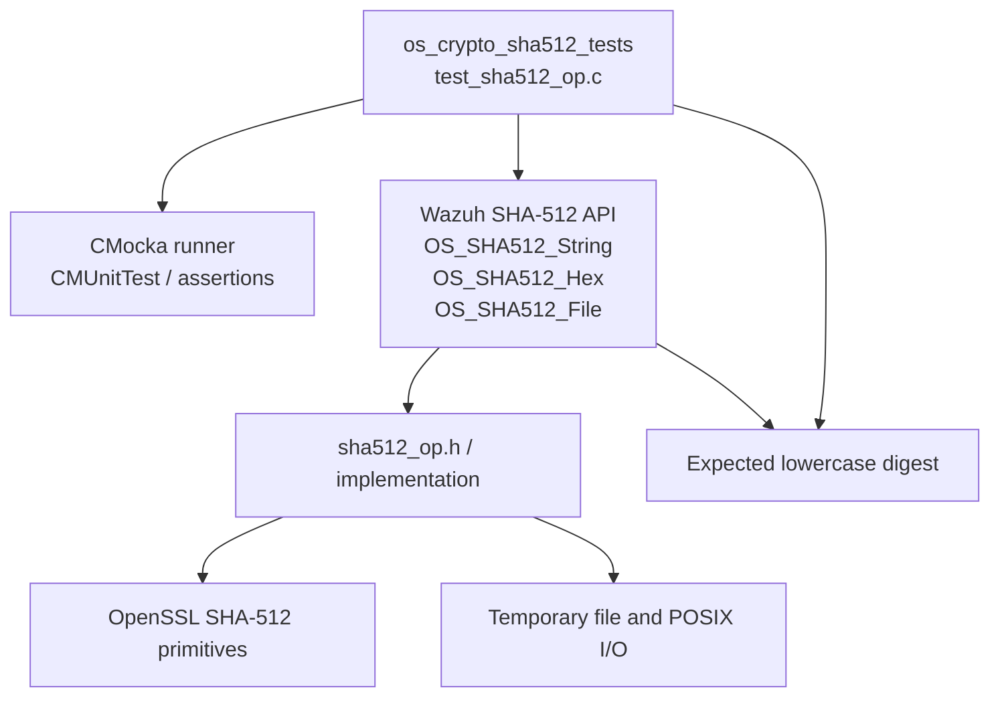
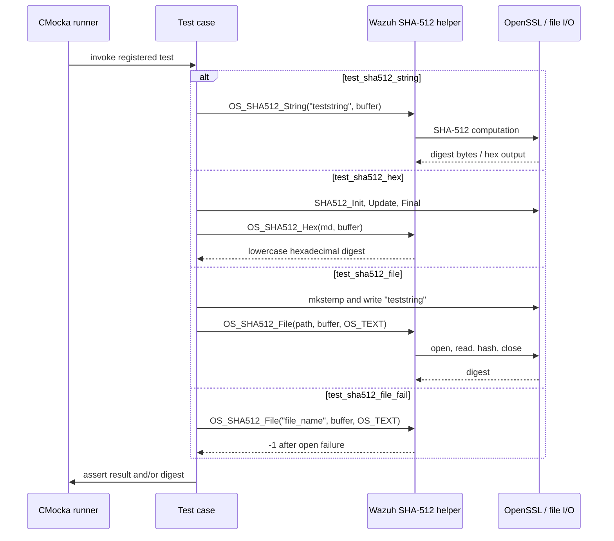
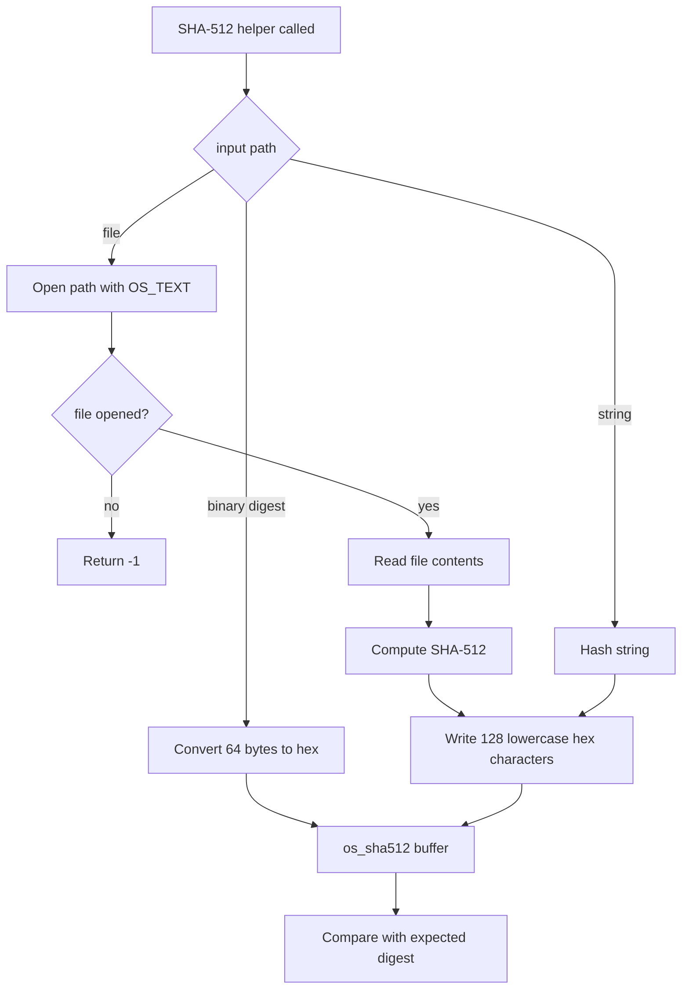
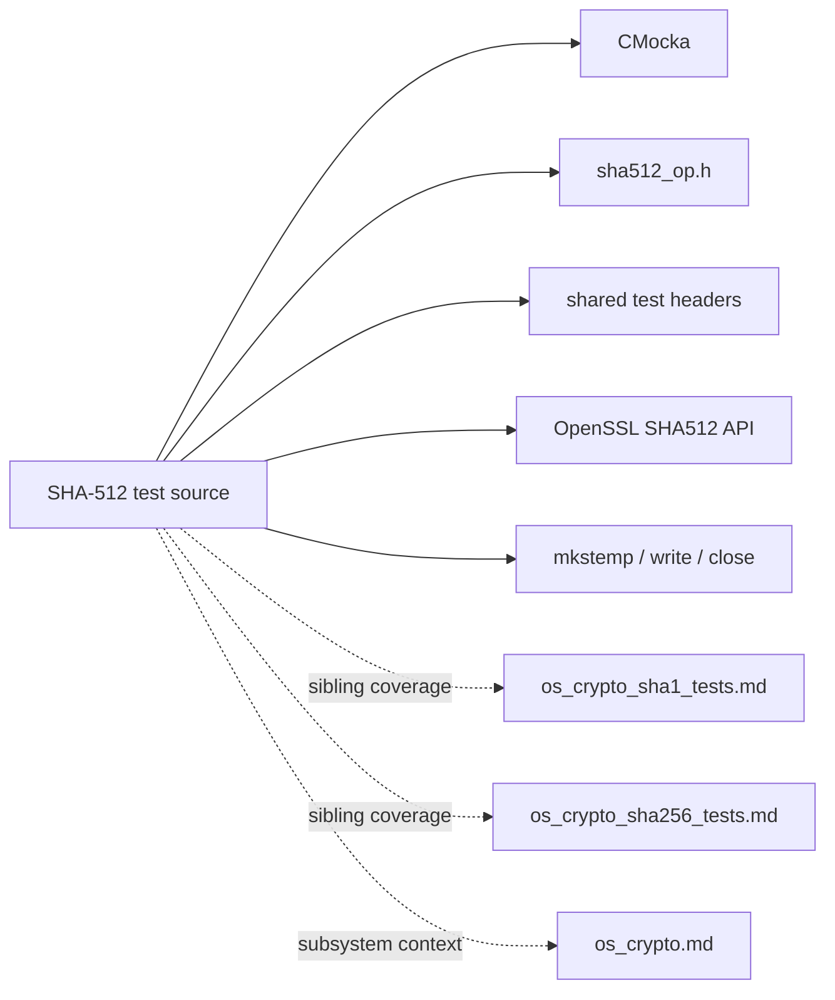

# `os_crypto_sha512_tests`

`os_crypto_sha512_tests` is the CMocka unit-test suite for Wazuh's SHA-512 helpers. It verifies known-answer hashing for an in-memory string, conversion of a binary SHA-512 digest to lowercase hexadecimal, successful hashing of a temporary file, and the error returned when a file cannot be opened.

The suite is part of the native [OS crypto subsystem](os_crypto.md). Related algorithm coverage is documented in [os_crypto_sha1_tests.md](os_crypto_sha1_tests.md), [os_crypto_sha256_tests.md](os_crypto_sha256_tests.md), and [os_crypto_md5_tests.md](os_crypto_md5_tests.md).

## Scope and source layout

| Item | Location / value |
|---|---|
| Test source | `src/unit_tests/os_crypto/sha512/test_sha512_op.c` |
| Test group | `os_crypto_sha512_tests` |
| Test framework | CMocka (`cmocka.h`) |
| Production header | `src/os_crypto/sha512/sha512_op.h` |
| Production API | `OS_SHA512_String`, `OS_SHA512_Hex`, `OS_SHA512_File` |
| Test support | `src/unit_tests/wrappers/common.h`, `src/unit_tests/os_crypto/headers/shared.h` |
| Output type | `os_sha512`, a 129-byte lowercase hexadecimal digest buffer |

The tests exercise public behavior rather than SHA-512's internal compression rounds. OpenSSL's `SHA512_*` primitives are used directly only to create the expected binary digest for the hexadecimal conversion test.

## Architecture



### Component relationships

- `main` declares the four test cases and invokes `cmocka_run_group_tests`.
- `CMUnitTest` is the CMocka registration type used to build the test suite.
- `test_sha512_string` validates the high-level string helper.
- `test_sha512_hex` validates formatting of an already-computed binary digest.
- `test_sha512_file` validates file reading and digest generation for a temporary file.
- `test_sha512_file_fail` validates the file-open failure contract.

No suite setup or teardown callback is registered in `main`; each test owns its local buffers and, in the file case, its temporary-file setup.

## Test execution flow



## Test cases

### `test_sha512_string`

The test hashes the literal `teststring` through `OS_SHA512_String`. It compares the output with the known SHA-512 digest:

```text
6253b39071e5df8b5098f59202d414c37a17d6a38a875ef5f8c7d89b0212b028692d3d2090ce03ae1de66c862fa8a561e57ed9eb7935ce627344f742c0931d72
```

This confirms the helper's end-to-end digest computation and its hexadecimal representation.

### `test_sha512_hex`

This test separates binary hashing from formatting. It computes the SHA-512 digest of `teststring` manually with `SHA512_Init`, `SHA512_Update`, and `SHA512_Final`, then passes the 64-byte binary result to `OS_SHA512_Hex`. The formatted output must equal the same 128-character lowercase digest shown above.

The case therefore checks byte-to-hex conversion independently of `OS_SHA512_String`.

### `test_sha512_file`

The test creates a unique path using the `/tmp/tmp_file-XXXXXX` template, writes `teststring` to the returned descriptor, closes the descriptor, and calls:

```c
OS_SHA512_File(file_name, buffer, OS_TEXT)
```

The function must return `0`, and the output must equal the known digest. `OS_TEXT` selects the text-file input mode. The source does not explicitly unlink the temporary file after the assertion, so repeated runs may leave temporary files if the operating system does not clean them independently.

### `test_sha512_file_fail`

The test passes the path `file_name`, which is expected not to be openable, and requires `OS_SHA512_File` to return `-1`. It does not assert a digest because no input stream exists.

## Data flow and error paths



| Operation | Success result | Failure result | Verification |
|---|---:|---:|---|
| `OS_SHA512_String` | Digest in `os_sha512` | Not covered | Exact known-answer comparison |
| `OS_SHA512_Hex` | 128-character lowercase hex output | Not covered | Exact known-answer comparison |
| `OS_SHA512_File` with readable file | `0` and digest | Not applicable | Return code and digest |
| `OS_SHA512_File` with unavailable file | Not applicable | `-1` | Return-code assertion |

The file test uses the host's temporary-file and standard descriptor APIs; unlike some neighboring crypto suites, this source does not configure CMocka wrapper expectations for `fopen`/`fread`/`fclose`.

## Dependency and subsystem boundaries



The production implementation and its broader callers are intentionally not duplicated here. Use [os_crypto.md](os_crypto.md) for subsystem-level relationships, and the sibling algorithm documents for comparable test-harness conventions.

## Maintenance guidance

Update this document and the test suite when changing:

- the `OS_SHA512_String`, `OS_SHA512_Hex`, or `OS_SHA512_File` signatures;
- the `OS_TEXT` file-mode behavior or file-open return code;
- digest casing, buffer size, or output length;
- temporary-file setup requirements or supported input modes.

Useful additional cases would cover empty strings/files, binary input, data larger than one read buffer, read failures, and cleanup of the temporary file. Keep the known-answer digest synchronized with the input literal if either changes.

## Summary

`os_crypto_sha512_tests` is a focused four-case contract suite. It validates SHA-512 string hashing, independent binary-to-hex formatting, successful file hashing, and the `-1` error path for an unavailable file. Its only production boundary is the Wazuh SHA-512 helper API, with OpenSSL and temporary-file I/O supplying the underlying computation and fixture data.
