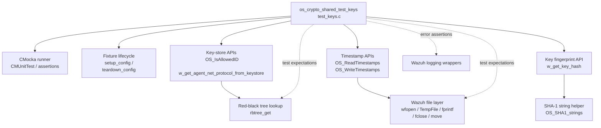
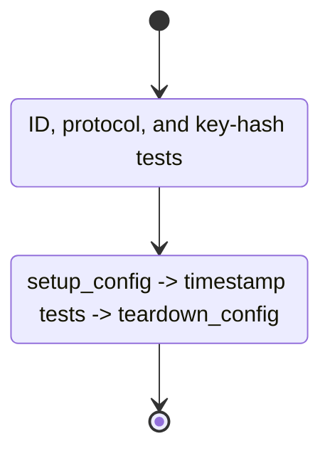
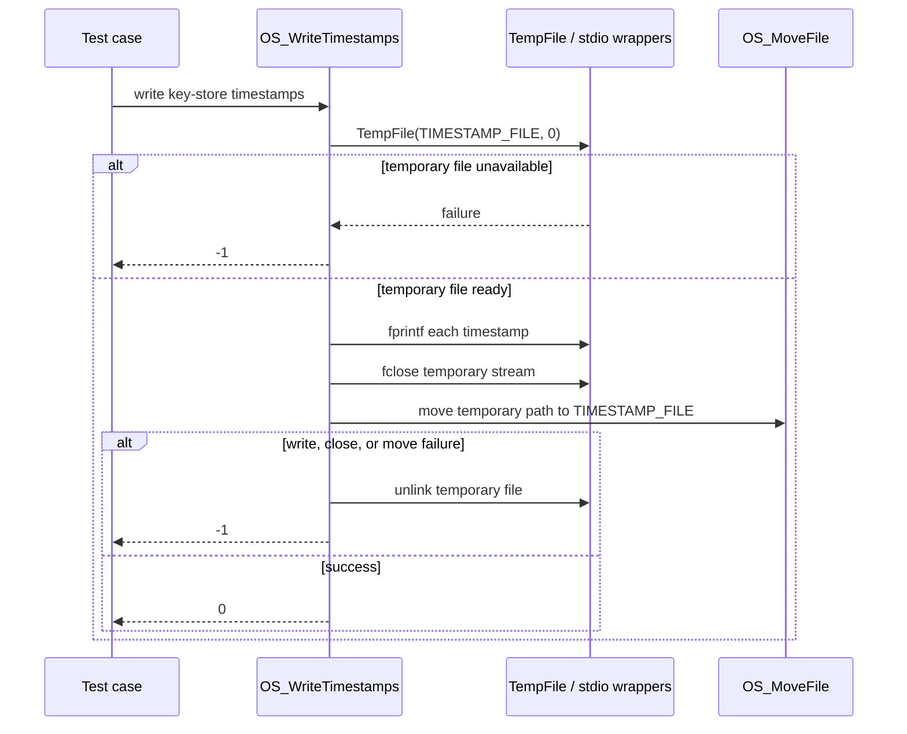
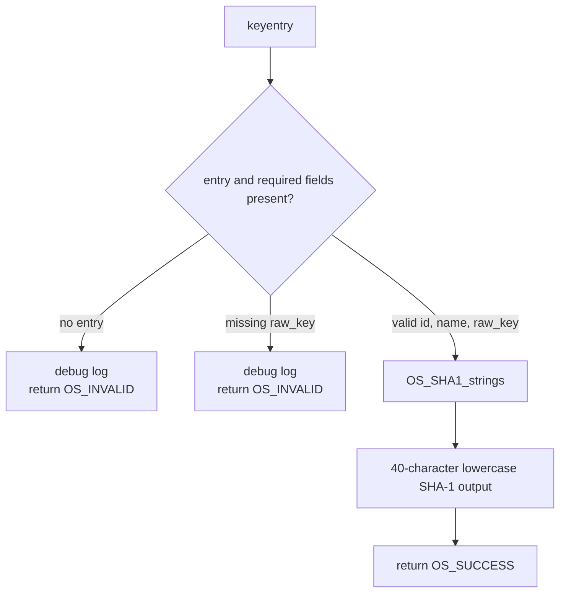
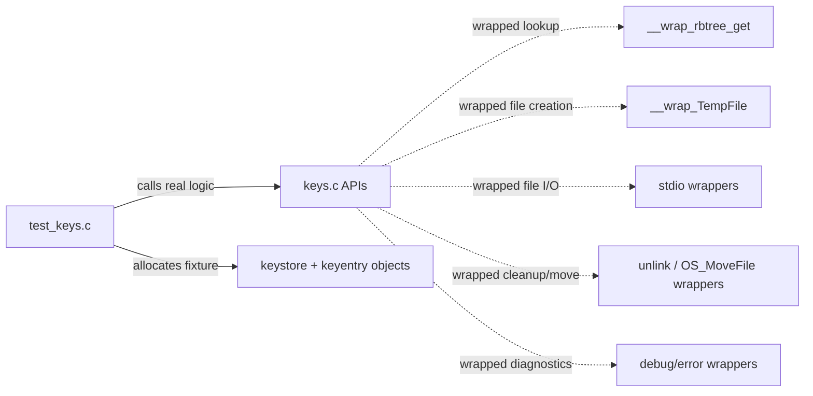
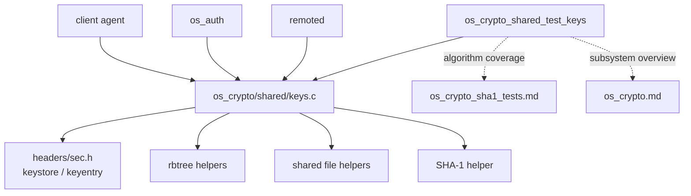

# `os_crypto_shared_test_keys`

`os_crypto_shared_test_keys` is the CMocka unit-test module for shared Wazuh key-store helpers. It validates agent-ID authorization, lookup of an agent's network protocol, persistence and parsing of agent timestamps, and generation of an agent-key SHA-1 fingerprint. The tests exercise the public behavior of `src/os_crypto/shared/keys.c` through the key-store types declared in `src/headers/sec.h`.

The production key-store lifecycle and its use by `remoted`, `os_auth`, and agent communication are documented in [os_crypto.md](os_crypto.md). This page describes only the focused test module.

## Module scope

| Item | Location / value |
| --- | --- |
| Test source | `src/unit_tests/os_crypto/shared/test_keys.c` |
| Test group | `os_crypto_shared_test_keys` |
| Test framework | CMocka (`cmocka.h`) |
| Primary production area | `src/os_crypto/shared/keys.c` |
| Key-store structures | `keystore`, `keyentry`, `os_ip`, `os_ipv4` |
| Main collaborators | red-black-tree lookup, Wazuh file helpers, SHA-1 helper, logging wrappers |

The module is a unit-test boundary rather than a runtime component. It constructs small in-memory stores and replaces filesystem and tree operations with deterministic expectations where necessary.

## Architecture



### Component relationships

- `main` registers the CMocka cases and starts `cmocka_run_group_tests`.
- `setup_config` creates two `keyentry` objects: agent `001` with no timestamp and agent `002` with timestamp `1628683533`. It also enables the shared wrapper `test_mode`.
- `teardown_config` releases the allocated IP and key-entry structures and disables `test_mode`.
- `OS_IsAllowedID` and `w_get_agent_net_protocol_from_keystore` resolve an agent ID through `keystore.keytree_id`.
- Timestamp tests use `TIMESTAMP_FILE`, a temporary-file write path, and a red-black-tree lookup to associate a parsed ID with its existing `keyentry`.
- `w_get_key_hash` validates key-entry data and delegates digest generation to the shared SHA-1 implementation.

## Test registration and lifecycle



The direct cases do not need the two-entry fixture. Timestamp and write tests use `cmocka_unit_test_setup_teardown`, so each case receives an isolated store and restores the global wrapper mode afterward. The fixture uses literal strings and allocated IP structures; it does not load a real `client.keys` file.

## Functional coverage

### Agent-ID authorization

`OS_IsAllowedID` is tested at three boundaries:

| Case | Setup | Expected result |
| --- | --- | ---: |
| `test_OS_IsAllowedID_id_NULL` | A `NULL` ID | `-1` |
| `test_OS_IsAllowedID_entry_NULL` | Tree lookup returns no `keyentry` | `-1` |
| `test_OS_IsAllowedID_entry_OK` | Tree lookup returns an entry with `keyid = 0` | `0` |

The tests explicitly verify that the production call asks `keytree_id` for the supplied ID. A successful lookup returns the entry's numeric `keyid`; a missing input or entry is rejected.

### Network protocol lookup

`w_get_agent_net_protocol_from_keystore` reuses the ID lookup path and then reads `keyentry.net_protocol` from the resolved entry.

- `test_w_get_agent_net_protocol_from_keystore_key_NULL` checks that a missing tree entry returns `-1`.
- `test_w_get_agent_net_protocol_from_keystore_OK` creates an entry with `net_protocol = 1` and expects `1`.

The test does not distinguish protocol enum values; it verifies propagation of the stored value and the missing-entry error path.

### Timestamp parsing

`OS_ReadTimestamps` reads timestamp records from `TIMESTAMP_FILE`. The valid fixture line is:

```text
001 agent1 1.1.1.1 2021-08-11 14:36:11
```

`test_OS_ReadTimestamps_valid_line` expects the ID tree lookup for `001`, then verifies that `keyentries[0]->time_added` equals the result of `mktime` for the parsed `struct tm`. The pre-existing timestamp for agent `002` must remain unchanged.

`test_OS_ReadTimestamps_wrong_line` supplies `000 wrong line` and expects the function to ignore the malformed record and return `0`. `test_OS_ReadTimestamps_file_missing` models `ENOENT` and expects `0`, treating a missing timestamp file as an empty/initial state. The source also contains a file-error case for non-`ENOENT` failures, which expects `-1`.

```mermaid
flowchart LR
    P[ TIMESTAMP_FILE ] --> O{wfopen("r")}
    O -->|ENOENT| Empty[Return 0\nno prior timestamps]
    O -->|other open error| Fail[Return -1]
    O -->|stream| L[Read lines]
    L --> V{line format valid?}
    V -->|no| Skip[Ignore malformed line]
    V -->|yes| Q[rbtree_get by agent ID]
    Q --> U[Update keyentry.time_added]
    Skip --> L
    U --> L
    L -->|EOF| Done[Close file and return 0]
```

### Timestamp persistence

`OS_WriteTimestamps` is tested as an atomic write workflow:

1. Call `TempFile(TIMESTAMP_FILE, 0)` to create a temporary destination.
2. Write timestamp records with `fprintf`.
3. Close the temporary stream.
4. Move the temporary file over `TIMESTAMP_FILE` with `OS_MoveFile`.

`test_OS_WriteTimestamps_file_write` verifies the successful path and the formatted record for agent `002`. The failure cases cover temporary-file creation, write failure, close failure, and move failure. Write, close, and move failures remove the temporary file and return `-1`; write and close failures also verify the expected `ENOSPC` diagnostic.



### Agent-key fingerprinting

`w_get_key_hash` produces a SHA-1 fingerprint from the key-entry identity and raw key material. The success fixture uses:

```text
id      = 001
name    = debian10
raw_key = 6dd186d1740f6c80d4d380ebe72c8061db175881e07e809eb44404c836a7ef96
```

`test_w_get_key_hash_success` expects:

```text
e0735a4a2c9bf633bac9b58f194cc8649537b394
```

The empty-parameter and empty-value cases expect `OS_INVALID` and verify a debug message. These cases establish that the helper rejects a missing entry and an entry without `raw_key` before attempting hashing.



The underlying SHA-1 API and its broader consumers are covered in [os_crypto_sha1_tests.md](os_crypto_sha1_tests.md); this module only verifies the key-specific composition and validation contract.

## Mocked boundaries and isolation

The test source includes Wazuh's shared headers plus wrapper headers for debug logging, red-black-tree operations, and stdio. `__wrap_TempFile` returns configured file names, streams, and status values and checks the requested source path and copy flag. Timestamp tests similarly configure `wfopen`, `fgets`, `fprintf`, `fclose`, `unlink`, and `OS_MoveFile` expectations.



This isolation prevents dependence on the host's queue directory, timestamp file, or agent configuration. It also lets each error path assert cleanup behavior, not just the final return value.

## Dependency and system context



At runtime, key-store lookups support trusted-agent identification and transport selection for Wazuh communication. Timestamp persistence supports tracking when an agent key was added. The test module itself has no network or daemon interaction; those integration flows belong to [os_crypto.md](os_crypto.md), [remoted.md](remoted.md), and [os_auth.md](os_auth.md) when available.

## Coverage boundaries and maintenance guidance

The supplied tests establish these observable contracts:

- null and missing-ID lookups are rejected;
- successful ID lookups return the stored key ID;
- protocol lookup returns the stored entry value;
- missing timestamp files are non-fatal, while malformed lines are ignored;
- valid timestamps update only the matching entry;
- timestamp writes are temporary-file based and clean up after failures;
- key hashing rejects incomplete entries and returns a known SHA-1 digest for valid input.

They do not cover every operation in `keys.c`, including IP authorization, dynamic-ID authorization, socket association, key-file loading, key-file rewriting, key-store reload, or concurrent access. Those behaviors should be tested in the corresponding key-store or daemon suites rather than inferred from this module.

When changing `keys.c`, `sec.h`, timestamp formatting, or key-hash input composition, update the expectations here and preserve the wrapper assertions for temporary-file cleanup and tree lookup. If the protocol representation changes from a raw integer to an enum, add explicit tests for each supported value instead of retaining only the current `1` fixture.
