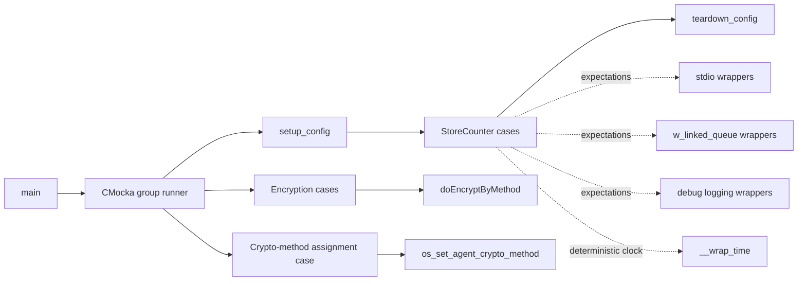
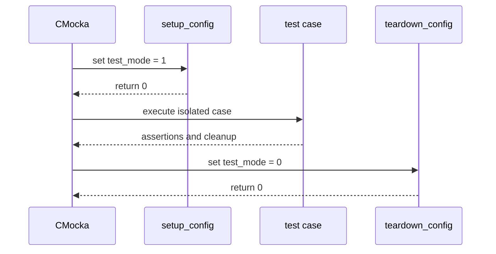
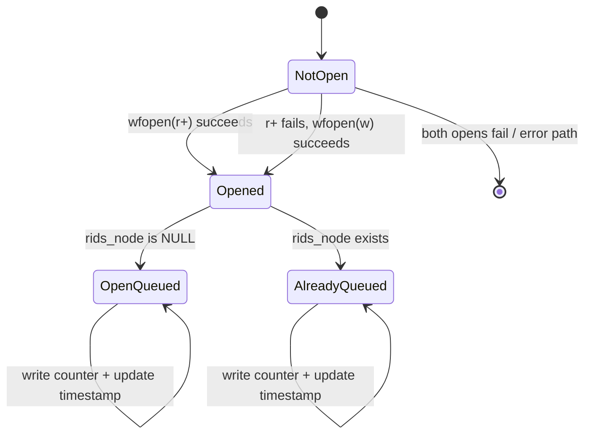
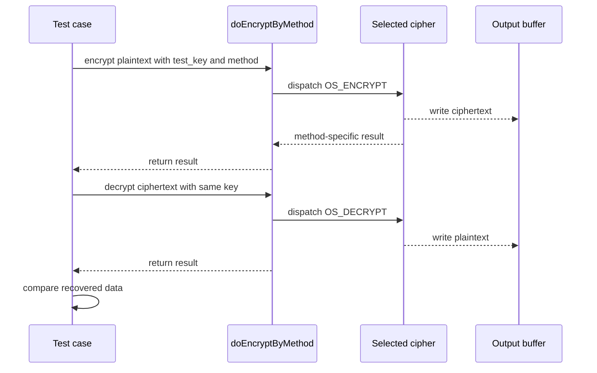
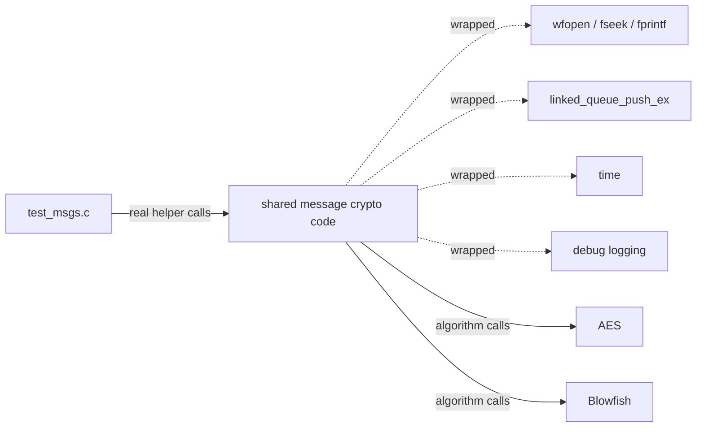

# `os_crypto_shared_test_msgs`

`os_crypto_shared_test_msgs` is the CMocka unit-test module for shared Wazuh message cryptography and RID-counter persistence. The test source exercises two production responsibilities: selecting an agent's configured cipher and maintaining per-agent request identifiers in `queue/rids/<agent-id>` files.

The module is a test boundary, not a runtime daemon. The wider cryptographic subsystem—key loading, authorization, hashing, and package signatures—is described in [os_crypto.md](os_crypto.md). Agent key-store behavior and related fixtures are covered in [os_crypto_shared_test_keys.md](os_crypto_shared_test_keys.md).

## Scope and source components

| Component | Responsibility |
| --- | --- |
| `src/unit_tests/os_crypto/shared/test_msgs.c` | Defines fixtures, wrappers, test cases, and the CMocka runner |
| `CMUnitTest` | Describes the eight registered unit tests |
| `setup_config` / `teardown_config` | Enables and restores Wazuh `test_mode` for wrapped-I/O cases |
| `__wrap_time` | Makes timestamp updates deterministic through CMocka expectations |
| `StoreCounter` | Production helper under test for writing global/local RIDs and queueing the open RID stream |
| `doEncryptByMethod` | Production helper under test for AES, Blowfish, and invalid-method dispatch |
| `os_set_agent_crypto_method` | Production key-store helper under test for assigning an agent cipher |

The source forward-declares `StoreCounter` and `doEncryptByMethod`; therefore their implementation is linked from the shared OS-crypto message code rather than defined in this translation unit. The exact production file is not included in the supplied module tree, so this document describes the observable contract established by the tests.

## Position in the system

```mermaid
graph TB
    Suite[Unit Tests - OS Crypto] --> T[os_crypto_shared_test_msgs]
    T --> M[Shared message / RID helpers]
    M --> KS[keystore + keyentry]
    M --> Q[w_linked_queue_t]
    M --> FS[Wazuh file and path helpers]
    M --> CLK[time()]
    M --> BF[Blowfish implementation]
    M --> AES[AES implementation]

    KS -. production consumers .-> REM[remoted]
    KS -. production consumers .-> AUTH[os_auth]
    KS -. production consumers .-> AGENT[client agent]
    T -. related tests .-> KEYTEST[os_crypto_shared_test_keys.md]
    M -. subsystem context .-> CRYPTO[os_crypto.md]
```

At runtime, the tested helpers support secure agent communication. `StoreCounter` persists request-counter state associated with an agent key entry, while `doEncryptByMethod` selects the symmetric cipher used by higher-level secure-message code. The unit test isolates these helpers from actual sockets, persistent files, and wall-clock time.

## Test architecture



`main` registers four `StoreCounter` cases with setup/teardown callbacks and four direct cases. The direct encryption and method-assignment tests do not use the fixture callbacks. CMocka returns the aggregate result as the process exit status.

### Fixture lifecycle



The setup and teardown functions intentionally do not allocate the `keystore`; each `StoreCounter` test builds its own minimal store. Their purpose is to activate the test-aware Wazuh wrappers and restore global state after the case.

## `StoreCounter`: RID persistence and queue management

`StoreCounter(const keystore *keys, int id, unsigned int global, unsigned int local)` is tested with agent index `id = 0`, global counter `1`, and local counter `2`. The expected serialized payload is:

```text
1:2:
```

The selected `keyentry` has ID `001`. Its `fp` member represents an already-open RID file, and `rids_node` records whether that entry is already present in `keys->opened_fp_queue`.

### Control flow

```mermaid
flowchart TD
    A[StoreCounter(keys, id, global, local)] --> B[Resolve keyentry by id]
    B --> C{keyentry.fp exists?}
    C -->|No| D[Open queue/rids/<agent-id> in r+ mode]
    D --> E{Open succeeded?}
    E -->|No, ENOENT/EACCES path| F[Retry with w mode]
    E -->|Yes| G[Assign stream to keyentry]
    F --> G
    C -->|Yes| H[Reuse existing stream]
    G --> I[Seek/write global:local:]
    H --> I
    I --> J[Update keyentry.updating_time from time()]
    J --> K{rids_node exists?}
    K -->|No| L[Push keyentry into opened_fp_queue]
    K -->|Yes| M[Keep existing queue node]
    L --> N[Return]
    M --> N
```

The flow above reflects the test-observable behavior: opening is attempted only when `fp` is null, the file receives the counter pair, the update timestamp is refreshed, and the entry is either pushed or updated in the open-file queue.

### Covered branches

| Test | Scenario | Key assertions |
| --- | --- | --- |
| `test_StoreCounter_updating_rids` | Existing `fp` and existing `rids_node` | Reuses stream `1234`, writes `1:2:`, logs “Updating rids_node…”, queue remains at one element |
| `test_StoreCounter_pushing_rids` | Existing `fp`, null `rids_node` | Writes the counter, logs “Pushing rids_node…”, creates one queue element, updates `updating_time` |
| `test_StoreCounter_pushing_rids_fp_null` | Null `fp`, first open succeeds with `r+` | Opens `queue/rids/001`, writes and queues the entry |
| `test_StoreCounter_fail_first_open` | First `r+` open fails; fallback `w` open succeeds | Verifies both open attempts, then the normal write-and-queue path |

The tests use the sentinel stream value `1234` and do not touch the real filesystem. They also verify the formatted stream and debug messages through wrapped `fprintf`, `wfopen`, and logging functions.

### State model



The queue is an ownership/indexing aid for open RID streams. The tests explicitly free the queue and allocated key-entry objects after each case, which documents the fixture's ownership assumptions even though the production helper itself is not a constructor.

## `doEncryptByMethod`: algorithm dispatch

The helper accepts input, output, character key, byte length, an action (`OS_ENCRYPT` or `OS_DECRYPT`), and a method identifier.

```mermaid
flowchart TD
    A[doEncryptByMethod(input, output, key, size, action, method)] --> B{method}
    B -->|W_METH_BLOWFISH| C[Blowfish operation]
    B -->|W_METH_AES| D[AES operation]
    B -->|Other| E[Return OS_INVALID]
    C --> F[Return success indicator]
    D --> G[Return AES result / output length]
```

The tests establish these method-specific contracts:

| Test | Input and action | Expected result |
| --- | --- | --- |
| `test_encrypt_by_method_blowfish` | Encrypt then decrypt `"test string"` with `W_METH_BLOWFISH` | Both calls return `1`; decrypted buffer equals the original C string |
| `test_encrypt_by_method_aes` | Encrypt then decrypt with `W_METH_AES` | Encrypt returns `16`; decrypt returns `11`; recovered bytes match the plaintext length |
| `test_encrypt_by_method_default` | Encrypt with method `2` | Returns `OS_INVALID`; output remains initialized to zero |

The Blowfish case validates a string round trip and is related to [os_crypto_blowfish_tests.md](os_crypto_blowfish_tests.md). The AES case validates the shared dispatcher’s expected block-oriented return values; algorithm-specific behavior belongs in [os_crypto_aes_tests.md](os_crypto_aes_tests.md). This module does not assert ciphertext bytes, padding layout, wrong-key behavior, or buffer-boundary handling.

### Encryption interaction



## `os_set_agent_crypto_method`: key-entry configuration

`test_set_agent_crypto_method` creates a one-entry `keystore`, assigns agent ID `001`, and calls `os_set_agent_crypto_method(keys, W_METH_BLOWFISH)`. It asserts that `keyentries[0]->crypto_method` becomes `W_METH_BLOWFISH`.

```mermaid
flowchart LR
    K[keystore] --> E[keyentries[0]]
    E --> I[agent 001]
    S[os_set_agent_crypto_method(keys, W_METH_BLOWFISH)] --> E
    E --> R[crypto_method = W_METH_BLOWFISH]
```

This verifies assignment to the configured key-entry set, not encryption itself. The `keystore` and `keyentry` structures are declared in the native security headers and are discussed in the key-store section of [os_crypto.md](os_crypto.md).

## Mocking and isolation strategy



The module uses wrapper expectations to control side effects:

- `__wrap_time` returns the test timestamp `123456789` and checks that production calls `time(0)`.
- `wfopen` is configured to return the sentinel stream or `NULL`, allowing both normal and fallback open paths to be tested.
- `fseek` and `fprintf` are expected to succeed and are checked for the stream and exact serialized counter text.
- `linked_queue_push_ex` expectations validate the queue and key-entry pointers passed to the queue layer.
- `__wrap__mdebug2` validates whether the implementation reports an update or a push/open operation.

This design avoids dependence on host clock state, file permissions, directory contents, and queue files while still checking the helper’s interaction protocol.

## Failure behavior and maintenance notes

The tests cover successful file opening, fallback opening after an initial failure, reuse of an open stream, queue insertion, timestamp refresh, supported cipher dispatch, invalid method rejection, and cipher round trips. They do not directly cover a failed fallback open, failed seek/write, invalid null arguments, concurrent calls, or queue insertion failure.

When modifying the production helpers:

1. Preserve the `global:local:` RID serialization format unless the on-disk protocol is intentionally versioned.
2. Keep `updating_time` and `rids_node` transitions consistent with queue ownership.
3. Preserve explicit rejection of unknown encryption methods through `OS_INVALID`.
4. Update the wrapped expectations if file-opening mode, log text, or cipher return semantics intentionally change.
5. Add tests for new error branches before relying on them in secure-message paths.

## References

- [os_crypto.md](os_crypto.md) — production crypto architecture and key-store consumers
- [os_crypto_shared_test_keys.md](os_crypto_shared_test_keys.md) — neighboring key-store tests
- [os_crypto_blowfish_tests.md](os_crypto_blowfish_tests.md) — direct Blowfish round-trip coverage
- [os_crypto_aes_tests.md](os_crypto_aes_tests.md) — direct AES coverage
- [shared_lib_data_structures.md](shared_lib_data_structures.md) — linked queue and supporting data structures
- Source: `src/unit_tests/os_crypto/shared/test_msgs.c`
