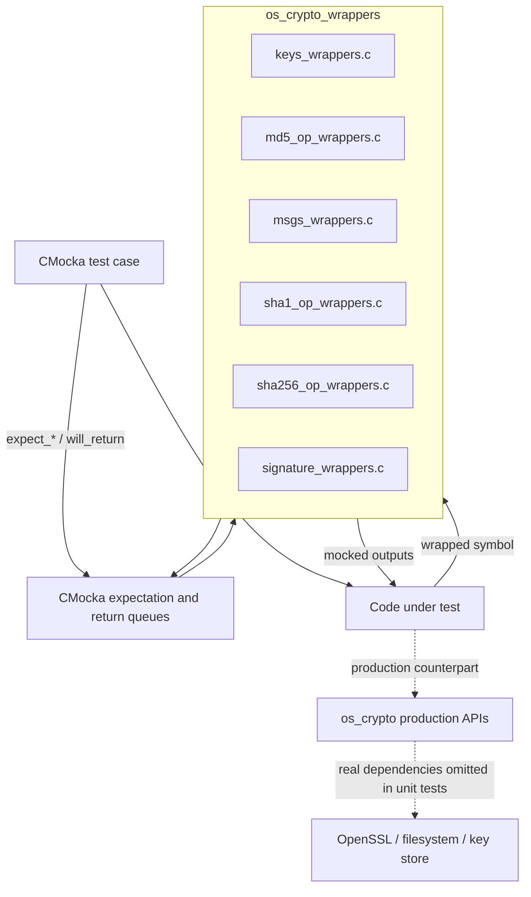
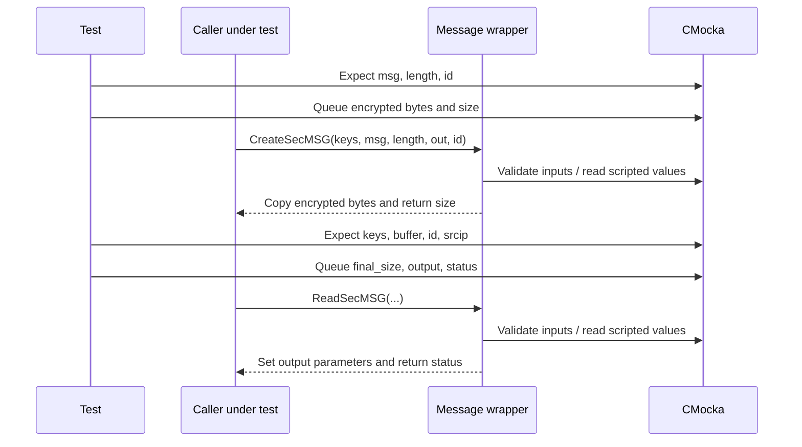
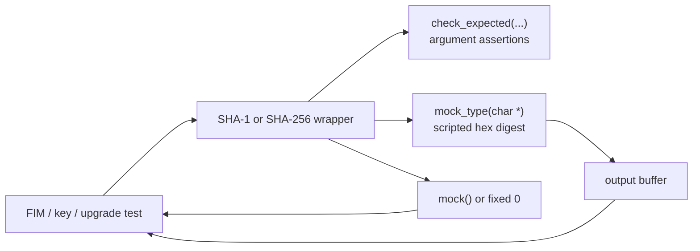
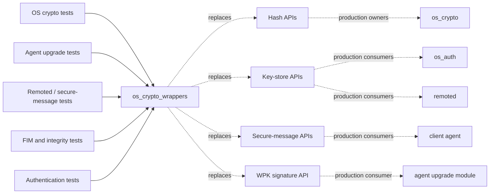
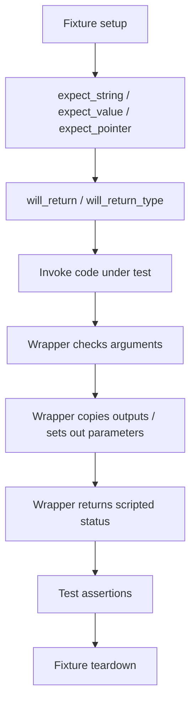
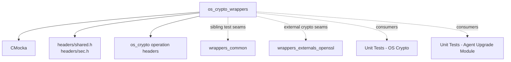

# `os_crypto_wrappers` — Cryptographic Test Doubles

`os_crypto_wrappers` is the CMocka-based unit-test wrapper layer for Wazuh’s native cryptographic APIs. It replaces hashing, secure-message, key-store, and WPK-signature functions with deterministic test doubles so tests can assert inputs and control return values without performing real cryptographic work, reading keys, opening sockets, or verifying packages.

The production APIs being replaced are documented in [`os_crypto.md`](os_crypto.md). The wrappers are consumed by OS-crypto tests and by other native-daemon tests that exercise authentication, remoted communication, file integrity, or agent upgrades; see [`Unit_Tests_-_OS_Crypto.md`](Unit_Tests_-_OS_Crypto.md) and [`Unit_Tests_-_Agent_Upgrade_Module.md`](Unit_Tests_-_Agent_Upgrade_Module.md).

## Scope and role

The module contains six wrapper source files under `src/unit_tests/wrappers/wazuh/os_crypto/`:

| Wrapper file | Mocked API family | Main test purpose |
|---|---|---|
| `keys_wrappers.c` | Key-store lookup, socket association, key cleanup | Model authorization and key-store state transitions. |
| `md5_op_wrappers.c` | MD5 and combined MD5/SHA-1/SHA-256 file hashing | Supply known digests and exercise success/failure branches. |
| `msgs_wrappers.c` | Secure-message creation and reading | Model encryption/decryption and parsing outcomes. |
| `sha1_op_wrappers.c` | SHA-1 file, string, stream, and bounded-file operations | Test integrity and file-change handling deterministically. |
| `sha256_op_wrappers.c` | SHA-256 string hashing | Supply a known digest without OpenSSL. |
| `signature_wrappers.c` | WPK unsigning | Test package-upgrade flows without certificate and signature processing. |

These files are test infrastructure, not runtime cryptography. They are linked through the project’s wrapper/interposition configuration, commonly using linker wrapping (`__wrap_*`), and are active only in unit-test binaries.

## Architecture

The central contract is simple: each wrapper validates selected arguments with CMocka, obtains configured values with `mock()` or `mock_type()`, writes deterministic output where appropriate, and returns the scripted result.

## Component details

### Key-store wrappers

`keys_wrappers.c` isolates callers from the `keystore` and `keyentry` implementation defined in `headers/sec.h`.

| Wrapper | Arguments checked | Result behavior |
|---|---|---|
| `__wrap_OS_IsAllowedDynamicID` | `id`, `srcip` | Returns `mock()`. |
| `__wrap_OS_IsAllowedID` | `id` | Returns `mock()`. |
| `__wrap_OS_IsAllowedIP` | `srcip` | Returns `mock()`. |
| `__wrap_OS_AddSocket` | `keys`, agent index `i`, socket `sock` | Returns `mock()`. |
| `__wrap_OS_DeleteSocket` | `sock` | Returns `mock()`. |
| `__wrap_OS_FreeKey` | `key` | Verifies the pointer and returns without freeing it. |
| `__wrap_OS_DupKeyEntry` | `key` | Returns `mock_type(keyentry *)`. |

The key-store pointer is intentionally unused for lookup and deletion wrappers: tests validate the logical lookup parameters rather than requiring a populated red-black-tree store. `OS_FreeKey` is also deliberately non-destructive, preventing a test double from invalidating fixture-owned memory.

### MD5 wrappers

`md5_op_wrappers.c` covers string and file hashing plus the combined digest operation.

- `__wrap_OS_MD5_File` checks `fname` and `mode`, copies a scripted digest into `output`, then returns a scripted status.
- `__wrap_OS_MD5_Str` checks the string and signed `length`, copies a scripted digest, and returns a scripted status.
- `__wrap_OS_MD5_SHA1_SHA256_File` checks the file name, prefilter pointer, all three output buffers, mode, and maximum size, then returns a scripted status.
- `expect_OS_MD5_File_call` and `expect_OS_MD5_SHA1_SHA256_File_call` are convenience helpers that configure common expectations and return values.

The combined wrapper does not populate its output buffers itself; callers that need output contents configure the pointed-to buffers in the fixture before invocation.

### Secure-message wrappers

`msgs_wrappers.c` models the message boundary used by encrypted agent-manager traffic.

`__wrap_CreateSecMSG` obtains a mocked size, copies mocked encrypted data into `msg_encrypted`, and returns that size. `__wrap_ReadSecMSG` sets `*final_size` and `*output` from the mock queue and returns a mocked integer status. The cleartext and buffer-size parameters are accepted for ABI compatibility but are not independently checked.

### SHA-1 and SHA-256 wrappers

`sha1_op_wrappers.c` replaces all major SHA-1 entry points:

- `__wrap_OS_SHA1_File` — whole-file digest, checking file name and mode.
- `__wrap_OS_SHA1_File_Nbytes` — bounded digest, checking file name, mode, and byte count.
- `__wrap_OS_SHA1_File_Nbytes_with_fp_check` — bounded digest with inode/file-handle check; the type of `fd_check` is platform-specific (`ino_t` on POSIX and `DWORD` on Windows).
- `__wrap_OS_SHA1_Str` — string/buffer digest, checking string and length.
- `__wrap_OS_SHA1_Stream` — streaming update/finalization seam, checking the supplied buffer.

File and string wrappers copy a scripted hexadecimal digest into the destination and return a scripted status, except `OS_SHA1_Str`, which always returns `0` after validating and writing its digest. The stream wrapper has no return value and only writes the scripted digest when its output argument is used by the caller.

`sha256_op_wrappers.c` provides `__wrap_OS_SHA256_String`, which checks the source string, copies a scripted 64-character digest, and returns `0`.

### WPK signature wrapper

`signature_wrappers.c` provides `__wrap_w_wpk_unsign`. It checks only `source` and returns a scripted status. The target path and CA-store pointer are ignored by the wrapper because package extraction, certificate validation, and RSA verification are outside the unit under test.

This seam is especially important to agent-upgrade tests: it allows tests to cover accepted, rejected, and error-handling paths without constructing a signed WPK or depending on OpenSSL certificate stores. The production trust boundary remains `w_wpk_unsign` in [`os_crypto.md`](os_crypto.md).

## Interaction with the wider system

The wrappers can therefore be viewed as a dependency inversion layer: production callers retain their real signatures, while tests substitute behavior at the symbol boundary. Detailed production responsibilities should remain in [`os_crypto.md`](os_crypto.md); this document describes only the substitution behavior.

## Test lifecycle and mock contract

Typical CMocka setup uses:

- `expect_string` for textual inputs such as file names, IDs, IP addresses, and messages.
- `expect_value` for lengths, modes, socket descriptors, byte limits, and numeric IDs.
- `expect_pointer`/`check_expected_ptr` for opaque structures and pointer identity.
- `will_return` for integer statuses or sizes.
- `will_return_type` / `mock_type` for digest strings, `keyentry *`, and output pointers.

Expectation order matters. A wrapper may consume several queued values in one call, so fixtures must enqueue values in the same order as the implementation reads them. Output buffers must be large enough for the wrapper’s fixed copy lengths: the SHA-1 wrappers use 41 bytes, SHA-256 uses 65 bytes, and MD5 uses the `os_md5` object size.

## Error-path modeling

The module is designed primarily for branch control rather than cryptographic correctness. Tests can model:

- authorization denial by returning a failing value from `OS_IsAllowed*`;
- socket association failure through `OS_AddSocket` or `OS_DeleteSocket`;
- missing or invalid keys through `OS_DupKeyEntry` and `OS_FreeKey` interactions;
- hashing failures through scripted MD5/SHA-1 statuses;
- file replacement or bounded-read failures through `OS_SHA1_File_Nbytes_with_fp_check`;
- malformed/encryption failures through `ReadSecMSG` status and output values;
- invalid or valid upgrade packages through `w_wpk_unsign` return values.

The wrappers do not validate digest format, perform encryption, inspect certificate chains, or free production resources. Those behaviors belong to the production implementations and to integration tests.

## Dependencies and related modules

- [`wrappers_common.md`](wrappers_common.md) — shared loop, time, and test-global controls used alongside specialized wrappers.
- [`wrappers_externals_openssl.md`](wrappers_externals_openssl.md) — lower-level OpenSSL mocks for tests that need to control library calls directly.
- [`Unit_Tests_-_OS_Crypto.md`](Unit_Tests_-_OS_Crypto.md) — unit-test suites for AES, Blowfish, HMAC, MD5, SHA-1, SHA-256, SHA-512, key management, and secure messages.
- [`Unit_Tests_-_OS_Auth.md`](Unit_Tests_-_OS_Auth.md) — authentication tests that may use key and message seams.
- [`Unit_Tests_-_Remoted.md`](Unit_Tests_-_Remoted.md) — secure transport and agent communication tests.
- [`Unit_Tests_-_Agent_Upgrade_Module.md`](Unit_Tests_-_Agent_Upgrade_Module.md) — upgrade tests using the WPK unsigning seam.

## Source inventory

| Source | Exported wrapper symbols |
|---|---|
| `src/unit_tests/wrappers/wazuh/os_crypto/keys_wrappers.c` | `__wrap_OS_IsAllowedDynamicID`, `__wrap_OS_DeleteSocket`, `__wrap_OS_IsAllowedIP`, `__wrap_OS_IsAllowedID`, `__wrap_OS_DupKeyEntry`, `__wrap_OS_AddSocket`, `__wrap_OS_FreeKey` |
| `src/unit_tests/wrappers/wazuh/os_crypto/md5_op_wrappers.c` | `__wrap_OS_MD5_File`, `__wrap_OS_MD5_Str`, `__wrap_OS_MD5_SHA1_SHA256_File`, `expect_OS_MD5_File_call`, `expect_OS_MD5_SHA1_SHA256_File_call` |
| `src/unit_tests/wrappers/wazuh/os_crypto/msgs_wrappers.c` | `__wrap_CreateSecMSG`, `__wrap_ReadSecMSG` |
| `src/unit_tests/wrappers/wazuh/os_crypto/sha1_op_wrappers.c` | `__wrap_OS_SHA1_File`, `__wrap_OS_SHA1_File_Nbytes`, `__wrap_OS_SHA1_File_Nbytes_with_fp_check`, `__wrap_OS_SHA1_Str`, `__wrap_OS_SHA1_Stream` |
| `src/unit_tests/wrappers/wazuh/os_crypto/sha256_op_wrappers.c` | `__wrap_OS_SHA256_String` |
| `src/unit_tests/wrappers/wazuh/os_crypto/signature_wrappers.c` | `__wrap_w_wpk_unsign` |
