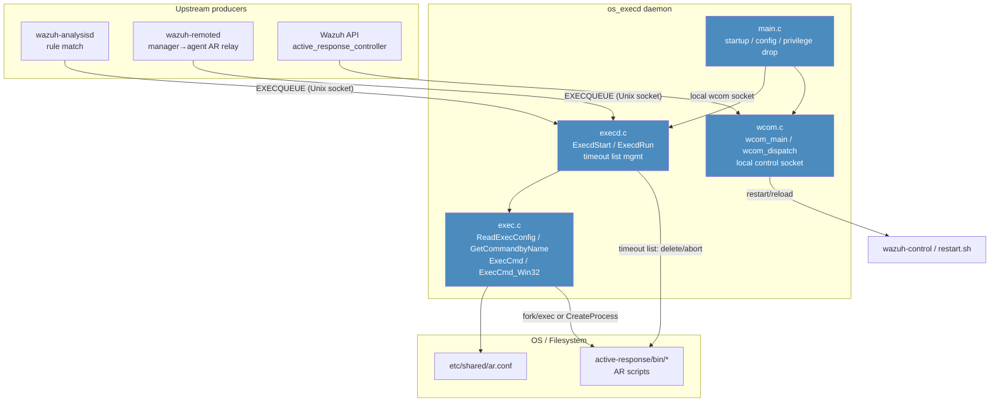
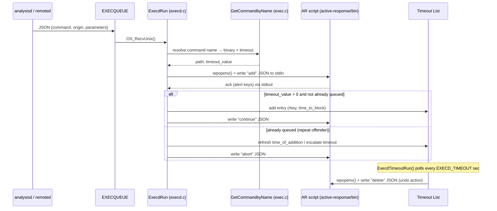

# os_execd — Active Response Execution Daemon

## 1. Purpose and Overview

`os_execd` (binary `wazuh-execd`) is the Wazuh daemon responsible for **executing Active Response (AR) commands** on both agents and managers. It is the final link in the Active Response pipeline: when `wazuh-analysisd` (or, on an agent, `wazuh-remoted`) decides that a rule match requires an automated remediation action, it sends a JSON-formatted execution request through a local message queue. `os_execd` receives that request, resolves it to a configured AR script/binary, launches it, and manages its lifecycle — including deferred/queued **timeout-based reversal** of the response (e.g., automatically unblocking an IP after N seconds) and de-duplication of repeated commands from "repeat offenders".

It also exposes a small local control socket (`wcom`) that lets other Wazuh components (mainly the API, `wazuh-modulesd`/agent upgrade module, and the cluster) query configuration, trigger a restart/reload of the whole Wazuh stack, or push/uncompress WPK-style files used during upgrades.

### Key Responsibilities
- Parse `ossec.conf` `<command>`/`<active-response>` blocks (`ar.conf`) into an in-memory table of available AR commands (name → binary path → default timeout).
- Listen on the `EXECQUEUE` local queue for JSON execution requests coming from `analysisd`/`remoted`.
- Fork/exec (POSIX) or `CreateProcess` (Windows) the resolved AR binary, feeding it the alert JSON via stdin.
- Maintain a **timeout list**: commands that must be automatically "undone" (a symmetrical `delete`/`abort` invocation of the same script) after a configurable time window.
- Implement **repeated-offender escalation**: if the same key (IP, user, etc.) triggers the same AR multiple times, timeouts are progressively increased using the `repeated_offenders_timeout` internal option.
- Serve a local Unix/TCP control socket (`wcom_main`) that dispatches administrative commands: `restart`, `reload`, `lock_restart`, `getconfig`, `unmerge`, `uncompress`, `check-manager-configuration`.
- Gracefully flush all pending (not-yet-timed-out) AR "undo" commands on shutdown so the system is never left in a permanently altered state.

## 2. Architecture Overview

`os_execd` is a small, single-purpose native daemon written in C, part of the broader **[Agent & Manager Native Daemons (C)](Agent_&_Manager_Native_Daemons_(C).md)** module family (alongside `remoted`, `monitord`, `os_auth`, etc.). It relies on the shared C runtime (`shared_lib`) for logging, process spawning (`wpopenv`), queue I/O, and JSON handling, and it is invoked by the higher-level `wazuh_modules` daemon and `analysisd`/`remoted` through Active Response messages produced by the framework's [`active_response_module`](active_response_module.md) (`framework/wazuh/active_response.py`, `framework/wazuh/core/active_response.py`).

### Process/Message Flow

## 3. Sub-Modules

The module's five source files are organized into three functional areas, each documented in detail in its own file:

| Sub-module | Files | Responsibility | Documentation |
|---|---|---|---|
| **Daemon Lifecycle** | `main.c` | Process bootstrap: CLI argument parsing, privilege drop, config test mode, daemonization, PID file, starting the `wcom` thread and the main receive loop | [os_execd_daemon_lifecycle.md](os_execd_daemon_lifecycle.md) |
| **Response Execution Engine** | `execd.c`, `exec.c`, `execd.h` | Loading of `ar.conf`, resolving command names to binaries, executing AR scripts, managing the timeout/undo list, repeated-offender escalation, graceful shutdown | [os_execd_response_engine.md](os_execd_response_engine.md) |
| **Remote Command Dispatcher (wcom)** | `wcom.c` | Local control socket protocol used by the API/cluster/upgrade module to request `restart`, `reload`, `lock_restart`, `getconfig`, `unmerge`, `uncompress`, and manager configuration validation | [os_execd_remote_commands.md](os_execd_remote_commands.md) |

## 4. Relationship to Other Modules

- **[active_response_module](active_response_module.md)** — The Python/framework layer (`framework/wazuh/active_response.py`, `framework/wazuh/core/active_response.py`, and the `active_response_controller` API endpoint) is what *originates* the JSON messages that `os_execd` ultimately executes. `os_execd` is the native-side consumer of that pipeline.
- **[Agent_&_Manager_Native_Daemons_(C)](Agent_&_Manager_Native_Daemons_(C).md)** — Parent module tree; `os_execd` shares the `shared_lib` utility code (queues, process spawning, JSON, logging) with sibling daemons such as `remoted`, `monitord`, and `os_auth`.
- **`wazuh_modules` / Agent Upgrade Module** — Uses the `wcom` socket's `unmerge`/`uncompress`/`restart` commands during WPK-based agent upgrades (see `agent_upgrade_module` under *Wazuh Modules Daemon (C)*).
- **Cluster** — The `wcom getconfig cluster` command bridges to the cluster local socket to expose cluster configuration through the same administrative channel.
- **Unit Tests** — Covered by [`Unit_Tests_-_OS_Execd`](Unit_Tests_-_OS_Execd.md) (`test_execd.c`, `test_get_command_by_name.c`, `test_win_execd.c`) and indirectly by [`Unit_Test_Wrappers_&_Mocks`](Unit_Test_Wrappers_&_Mocks.md) (`os_execd_wrappers.c`).

## 5. Configuration Files Touched

- `etc/shared/ar.conf` — the "name - command - timeout" formatted list of available Active Responses, parsed by `ReadExecConfig()`.
- `etc/ossec.conf` — read via `ExecdConfig()` for `<active-response>` blocks, internal options (`execd.debug`, repeated offender timeouts), and logging configuration.
- `active-response/bin/*` — the actual executable scripts/binaries invoked for each configured AR.

See also **[Configuration_Data_Structures_(C_Headers)](Configuration_Data_Structures_(C_Headers).md)** → `Active_Response_Config` (`src/config/active-response.h`) for the config data structures (`ar_command`, `active_response`) that back `ExecdConfig()`.
