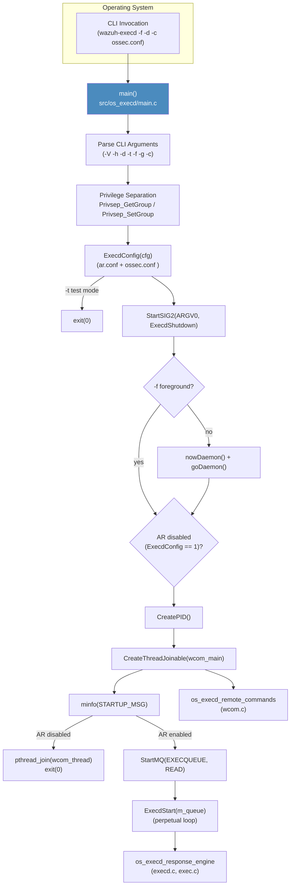
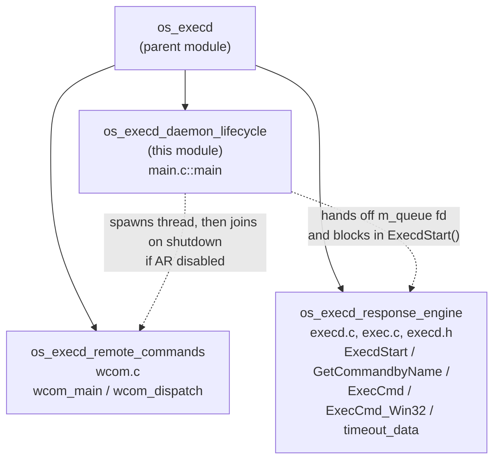
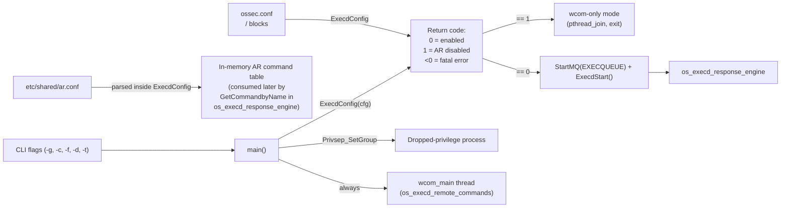

# os_execd_daemon_lifecycle — Active Response Daemon Bootstrap

## 1. Introduction & Purpose

`os_execd_daemon_lifecycle` is the **entry-point module** of `wazuh-execd`, the native Active
Response execution daemon. It contains exactly one core component — the `main()` function defined
in `src/os_execd/main.c` — and is responsible for everything that happens *before* the daemon
starts actually receiving and executing Active Response (AR) commands: command-line parsing,
privilege separation, configuration loading/validation, daemonization, PID-file management,
spawning the local control-socket thread (`wcom`), and finally handing off control to the
long-running receive loop (`ExecdStart`) implemented in the sibling
[`os_execd_response_engine`](os_execd_response_engine.md) module.

Architecturally this module is the thinnest possible "glue" layer: it owns no persistent state and
implements no AR-specific business logic itself. Instead, it orchestrates — in a fixed, linear
sequence — the shared daemon-bootstrap primitives ([`shared_lib`](shared_lib.md)) and the two other
`os_execd` sub-modules ([`os_execd_response_engine`](os_execd_response_engine.md) and
[`os_execd_remote_commands`](os_execd_remote_commands.md)), exactly mirroring the startup pattern
used by every other native Wazuh daemon (`logcollector`, `monitord`, `remoted`, `os_auth`, the
agent's `client-agent`, etc.). Understanding this module first makes it much easier to reason about
how `os_execd` as a whole is wired together.

This module is a **child** of [`os_execd`](os_execd.md), which is itself part of the umbrella
**[Agent_&_Manager_Native_Daemons_(C)](Agent_&_Manager_Native_Daemons_(C).md)** module family.

## 2. Purpose and Core Functionality

| Component | File | Responsibility |
|---|---|---|
| `main` | `src/os_execd/main.c` | Daemon entry point: CLI argument parsing, privilege separation, `ar.conf`/`ossec.conf` loading via `ExecdConfig`, test-config short-circuit, signal setup, daemonization, PID-file creation, starting the `wcom` control-socket thread, connecting to `EXECQUEUE`, and delegating to `ExecdStart()`. |
| `help_execd` (static, `noreturn`) | `src/os_execd/main.c` | Prints the CLI usage banner (`-V -h -d -t -f -g -c`) and exits; invoked on `-h` or on any unrecognized flag. |

### Responsibilities performed by `main()`, in order

1. **Process naming & working directory** — `OS_SetName(ARGV0)` sets the process title; `w_homedir(argv[0])` resolves the Wazuh installation directory, and `chdir()` moves the process into it (fatal `CHDIR_ERROR` on failure).
2. **Command-line argument parsing** (`getopt`, flags `Vtdhfg:c:`):
   - `-V` — print version/license and exit.
   - `-h` — print help (`help_execd`) and exit.
   - `-d` — increase debug verbosity (repeatable via `nowDebug()`).
   - `-f` — run in the foreground (skip daemonization).
   - `-g <group>` — privilege-separation group (default `GROUPGLOBAL`).
   - `-c <config>` — alternate `ossec.conf` path (default `OSSECCONF`).
   - `-t` — test-configuration mode.
3. **Debug level resolution** — if `-d` was not supplied, falls back to the `execd.debug` internal option via `getDefine_Int("execd", "debug", 0, 2)`, consistent with the internal-options mechanism documented in [Global_Config_Core](Global_Config_Core.md).
4. **Privilege separation** — resolves the group ID with `Privsep_GetGroup(group)` and drops group privileges with `Privsep_SetGroup(gid)`, the same shared primitive used by every other native daemon (see [`shared_lib`](shared_lib.md), `privsep_op.c`).
5. **Configuration loading** — calls `ExecdConfig(cfg)`, which parses the `<active-response>`/`<command>` blocks of `ossec.conf` (backed by the data structures in [`Active_Response_Config`](Active_Response_Config.md), `src/config/active-response.h`: `ar_command`, `active_response`) and the AR command table from `ar.conf`. The return value doubles as a **feature flag**: `1` means Active Response is administratively disabled system-wide.
6. **Test-config short circuit** — if `-t` was given, the process exits with status `0` immediately after a successful `ExecdConfig()` call, without touching signals, daemonization, or the queue — the standard `wazuh-control configtest` contract shared by all daemons.
7. **Signal handling setup** — `StartSIG2(ARGV0, ExecdShutdown)` installs the shared signal-handling routines (see [`shared_lib`](shared_lib.md), `sig_op.c`), wiring `ExecdShutdown()` (implemented in [`os_execd_response_engine`](os_execd_response_engine.md)) as the graceful-shutdown callback that flushes any pending timeout/undo Active Response commands before the process terminates.
8. **Daemonization** — unless `-f` was given, `nowDaemon()` + `goDaemon()` fork the process into the background (shared primitives from `shared_lib`'s `file_op.c`).
9. **Active-Response-disabled notice** — if `ExecdConfig()` returned `1`, an informational message (`EXEC_DISABLED`) is logged, but startup continues (the daemon still needs to serve the `wcom` control socket).
10. **PID file creation** — `CreatePID(ARGV0, getpid())` registers the process with `wazuh-control`'s process-tracking mechanism.
11. **`wcom` control-thread startup** — `CreateThreadJoinable(&wcom_thread, wcom_main, NULL)` spins up the local control-socket listener implemented in [`os_execd_remote_commands`](os_execd_remote_commands.md) (`wcom.c`), which independently serves `restart`/`reload`/`getconfig`/`unmerge`/`uncompress`/`lock_restart`/`check-manager-configuration` requests from the API, cluster, and agent-upgrade module regardless of whether AR itself is enabled.
12. **Startup log message** — `minfo(STARTUP_MSG, getpid())` announces the daemon is up.
13. **Early exit when AR is disabled** — if Active Response was disabled (`c == 1`), `main()` simply `pthread_join()`s the `wcom` thread and exits successfully: the process stays alive *only* to serve the control socket, never opening the AR execution queue.
14. **AR execution queue connection** — otherwise, `StartMQ(EXECQUEUE, READ, 0)` opens the local Unix socket that `wazuh-analysisd`/`wazuh-remoted` write AR execution requests to (fatal `QUEUE_ERROR` on failure).
15. **Main loop hand-off** — finally calls `ExecdStart(m_queue)`, transferring control to the perpetual receive/dispatch/timeout loop implemented in [`os_execd_response_engine`](os_execd_response_engine.md); this call never returns under normal operation.

### CLI Flags Handled by `main()`

| Flag | Description |
|---|---|
| `-V` | Print version and license message, then exit. |
| `-h` | Print help message (`help_execd`), then exit. |
| `-d` | Execute in debug mode; may be specified multiple times to increase verbosity. |
| `-t` | Test configuration only (parses `ar.conf`/`ossec.conf`, then exits). |
| `-f` | Run in the foreground instead of daemonizing. |
| `-g <group>` | Group to run as (default: `GROUPGLOBAL`). |
| `-c <config>` | Configuration file to use (default: `OSSECCONF`). |

## 3. Architecture Overview



## 4. Startup Sequence (Detailed)

```mermaid
sequenceDiagram
    participant OS as Operating System
    participant Main as main()
    participant Priv as Privsep (shared_lib)
    participant Cfg as ExecdConfig
    participant Sig as StartSIG2
    participant Wcom as wcom_main (os_execd_remote_commands)
    participant MQ as StartMQ
    participant Loop as ExecdStart (os_execd_response_engine)

    OS->>Main: exec wazuh-execd [flags]
    Main->>Main: OS_SetName / w_homedir / chdir
    Main->>Main: getopt parse (-V -h -d -t -f -g -c)
    Main->>Priv: Privsep_GetGroup(group)
    Priv-->>Main: gid
    Main->>Priv: Privsep_SetGroup(gid)
    Main->>Cfg: ExecdConfig(cfg)
    Cfg-->>Main: return code (0 = enabled, 1 = AR disabled, <0 = error)
    alt test_config (-t)
        Main->>OS: exit(0)
    else normal execution
        Main->>Sig: StartSIG2(ARGV0, ExecdShutdown)
        alt not foreground (-f absent)
            Main->>Main: nowDaemon() + goDaemon()
        end
        Main->>Main: CreatePID(ARGV0, getpid())
        Main->>Wcom: CreateThreadJoinable(wcom_main)
        Main->>Main: minfo(STARTUP_MSG)
        alt Active Response disabled (return code == 1)
            Main->>Wcom: pthread_join(wcom_thread)
            Main->>OS: exit(0)
        else Active Response enabled
            Main->>MQ: StartMQ(EXECQUEUE, READ, 0)
            MQ-->>Main: m_queue fd
            Main->>Loop: ExecdStart(m_queue)
            Note over Loop: Runs indefinitely,<br/>receiving AR requests,<br/>executing scripts, and<br/>managing the timeout list.
        end
    end
```

## 5. Component Interaction within `os_execd`

`os_execd_daemon_lifecycle` sits at the top of the `os_execd` hierarchy and is a sibling to the two
other functional sub-modules that share the same parent module (`os_execd`):



- **`os_execd_daemon_lifecycle`** (this module) performs one-time startup work — CLI parsing,
  privilege drop, configuration load, daemonization, PID file, thread/queue setup — and then either
  joins the `wcom` thread (AR disabled) or calls `ExecdStart()` (AR enabled).
- **[`os_execd_response_engine`](os_execd_response_engine.md)** owns the perpetual receive loop
  (`ExecdStart`), AR command resolution (`GetCommandbyName`, backed by `ExecdConfig`'s parsed
  table), process spawning (`ExecCmd`/`ExecCmd_Win32`), and the timeout/undo list
  (`timeout_data` struct from `execd.h`) that this module never touches directly but whose
  lifetime begins with the `ExecdStart(m_queue)` call made here.
- **[`os_execd_remote_commands`](os_execd_remote_commands.md)** owns the `wcom` local control
  socket (`wcom_dispatch`), started as an independent joinable thread by this module *before* the
  AR-enabled/disabled branch, so that administrative operations (`restart`, `reload`, `getconfig`,
  `unmerge`, `uncompress`, `lock_restart`, `check-manager-configuration`) remain available even
  when Active Response execution itself is turned off.

## 6. Data / Control Flow Summary



## 7. Command-Line Interface Summary

See [§2 "CLI Flags Handled by `main()`"](#cli-flags-handled-by-main) above for the authoritative
table; functionally this mirrors the CLI contract exposed by sibling daemons such as
[`logcollector_core_daemon_lifecycle`](logcollector_core_daemon_lifecycle.md) and
[`monitord_lifecycle`](monitord_lifecycle.md), with the notable addition of a group-only
(`-g`, no `-u`/`-D`) privilege-separation model — `os_execd` does not chroot or switch user, only
group.

## 8. Error Handling

`main()` uses the shared `merror_exit` / `mlerror_exit` macros (from [`shared_lib`](shared_lib.md))
to fail fast on unrecoverable conditions:

| Condition | Macro / Message | Effect |
|---|---|---|
| `chdir()` into home directory fails | `CHDIR_ERROR` | Process exits immediately. |
| `-g`/`-c` given without an argument | `merror_exit("-g needs an argument.")` / `-c` equivalent | Process exits immediately. |
| Invalid privilege-separation group | `USER_ERROR` (`Privsep_GetGroup` returns `-1`) | Process exits immediately. |
| `Privsep_SetGroup` fails | `SETGID_ERROR` | Process exits immediately. |
| `ExecdConfig(cfg)` returns a negative value | `CONFIG_ERROR` via `mlerror_exit(LOGLEVEL_ERROR, ...)` | Process exits immediately. |
| PID file cannot be created | `PID_ERROR` | Process exits immediately. |
| `CreateThreadJoinable` for `wcom_main` fails | (returns non-zero) | Process calls `exit(EXIT_FAILURE)`. |
| `StartMQ(EXECQUEUE, READ, 0)` fails | `QUEUE_ERROR` | Process exits immediately (only reached when AR is enabled). |

Unlike some other daemons, `os_execd`'s `main()` treats "Active Response administratively
disabled" (`ExecdConfig()` returning `1`) as a **non-error** condition: the daemon still starts,
logs `EXEC_DISABLED`, creates its PID file, and keeps serving the `wcom` control socket
indefinitely — it simply never opens the `EXECQUEUE` receive socket or enters `ExecdStart()`.

## 9. Relationship to Other Modules

| Related Module | Relationship |
|---|---|
| [`os_execd`](os_execd.md) | Direct parent module; this page documents one of its three sub-modules (`main.c`). |
| [`os_execd_response_engine`](os_execd_response_engine.md) | Owns `ExecdConfig`, `ExecdShutdown`, `ExecdStart`, `GetCommandbyName`, and the command-execution/timeout logic that this module configures and then delegates to via `ExecdStart(m_queue)`. |
| [`os_execd_remote_commands`](os_execd_remote_commands.md) | Owns `wcom_main`/`wcom_dispatch`, the thread entry point started unconditionally by this module via `CreateThreadJoinable`. |
| [`shared_lib`](shared_lib.md) | Supplies every generic daemon-bootstrap primitive used here: `OS_SetName`, `w_homedir`, `Privsep_GetGroup`/`Privsep_SetGroup`, `StartSIG2`, `nowDaemon`/`goDaemon`, `CreatePID`, `CreateThreadJoinable`, `StartMQ`, and the `merror_exit`/`mlerror_exit` logging macros. |
| [`Active_Response_Config`](Active_Response_Config.md) | Defines the `ar_command`/`active_response` structures (`src/config/active-response.h`) populated by `ExecdConfig()` during startup. |
| [`Global_Config_Core`](Global_Config_Core.md) | Supplies the internal-options lookup (`getDefine_Int`) used to resolve the default debug level when `-d` is not passed on the CLI. |
| [`active_response_module`](active_response_module.md) | The Python/Framework + API layer that *originates* the JSON AR execution requests this daemon eventually consumes once `ExecdStart()` is running; see that module for the producer side of the pipeline. |
| [`logcollector_core_daemon_lifecycle`](logcollector_core_daemon_lifecycle.md) / [`monitord_lifecycle`](monitord_lifecycle.md) | Sibling daemon-lifecycle modules following the same architectural pattern (parse → privsep → configure → daemonize → PID → main loop) within [`Agent_&_Manager_Native_Daemons_(C)`](Agent_&_Manager_Native_Daemons_(C).md). |
| [`addagent_native`](addagent_native.md) | Another native CLI/daemon-adjacent tool in the same parent umbrella module, sharing the same privilege-separation and `client.keys`/config conventions, though unrelated to AR execution. |
| [`Unit_Tests_-_OS_Execd`](Unit_Tests_-_OS_Execd.md) | Covers this module's behavior indirectly (`test_execd.c`, `test_win_execd.c` exercise `ExecdStart`/`WinExecdRun`, which this module's `main()` invokes) and directly for command resolution (`test_get_command_by_name.c`). |

## 10. Summary

`os_execd_daemon_lifecycle` is a small but critical piece of the Active Response subsystem: it is
the single, deterministic sequence of steps that transforms a freshly-`exec`'d `wazuh-execd`
process into either (a) a fully operational AR execution daemon listening on `EXECQUEUE` and
running the `ExecdStart()` loop, or (b) a minimal "control-socket-only" process when Active
Response has been administratively disabled. Its defining architectural traits are:

1. **Strict linear bootstrap** — no component further down the chain (`ExecdStart`, `wcom_main`)
   is invoked until CLI parsing, privilege separation, and configuration loading have all
   succeeded.
2. **Graceful feature-flagging** — Active Response being disabled is handled as a first-class,
   non-fatal branch rather than an error, keeping the `wcom` administrative channel alive
   regardless.
3. **Clean separation of concerns** — all AR-specific execution/timeout logic lives in
   [`os_execd_response_engine`](os_execd_response_engine.md), and all control-socket protocol logic
   lives in [`os_execd_remote_commands`](os_execd_remote_commands.md); this module merely wires
   them together and owns the process-level concerns (privileges, daemonization, signals, PID
   file).
