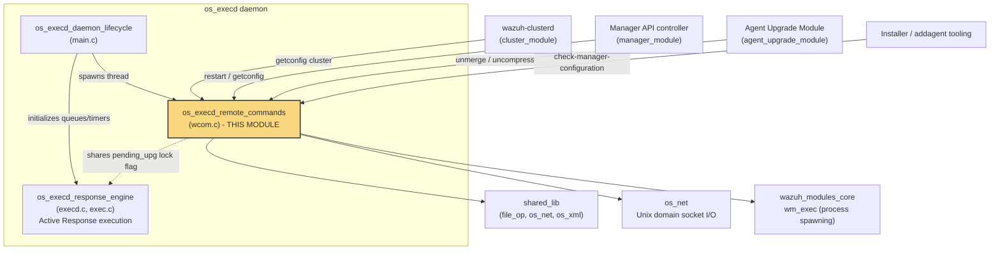
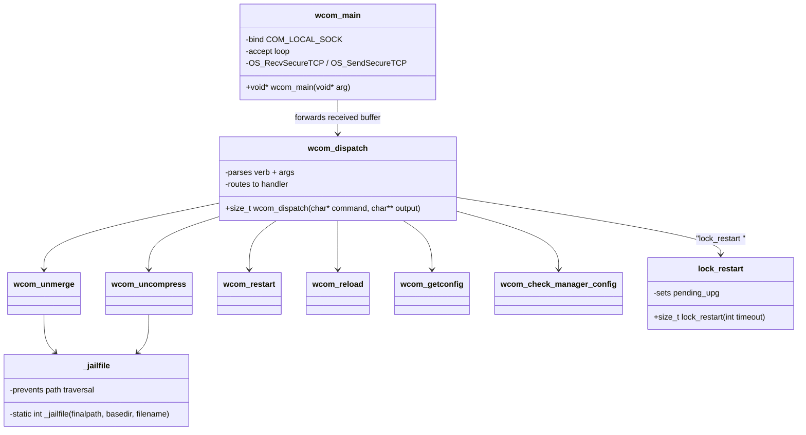
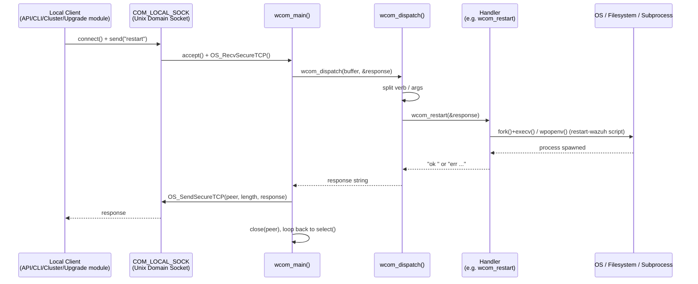
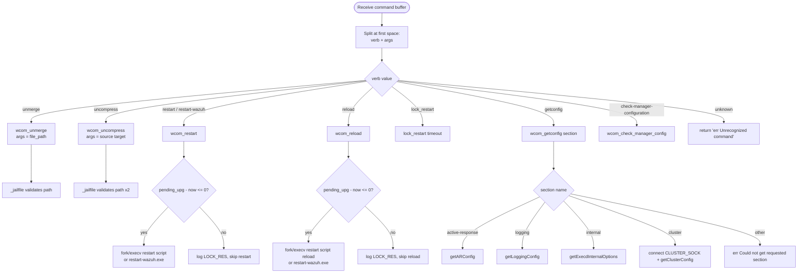
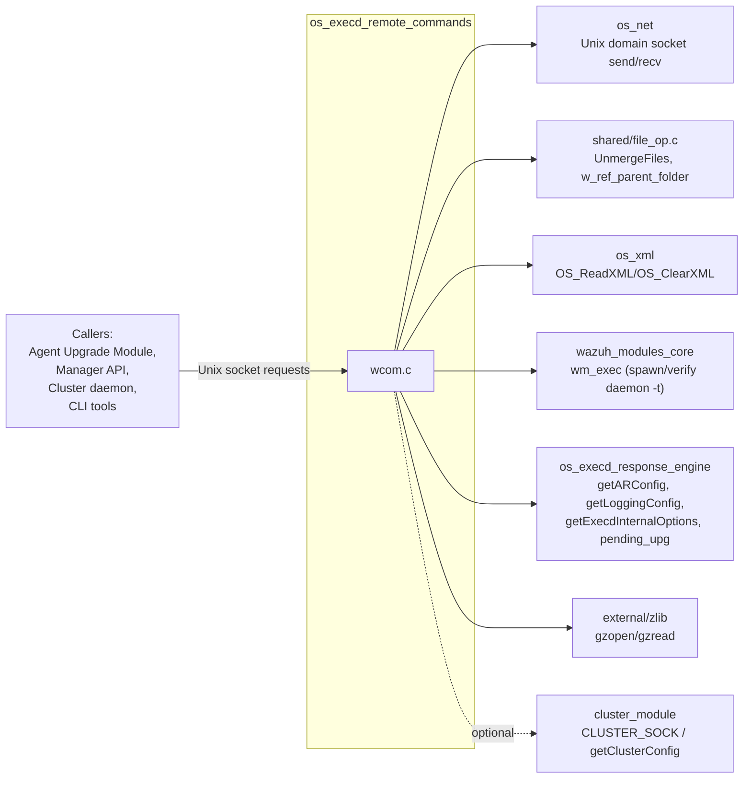
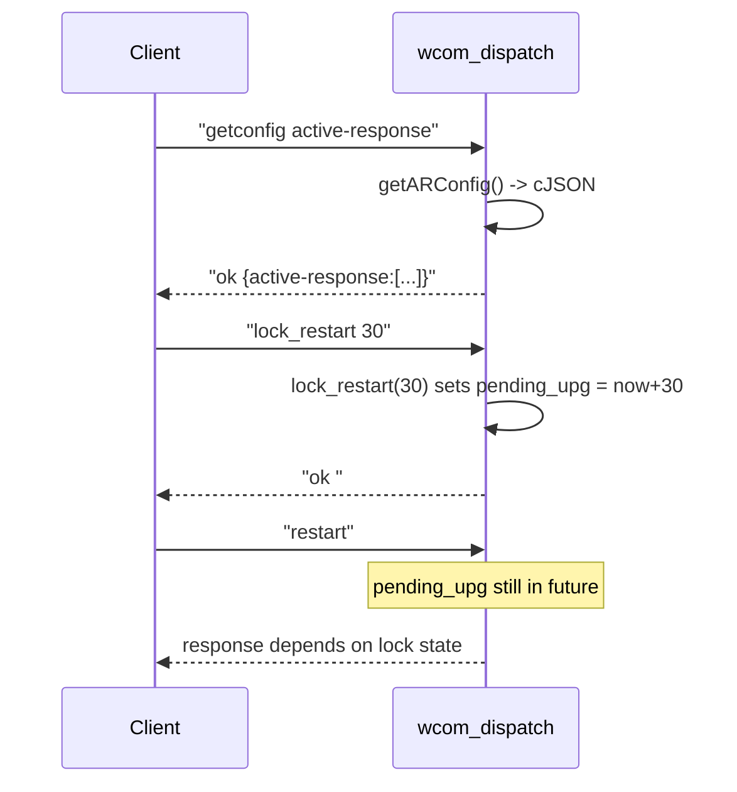
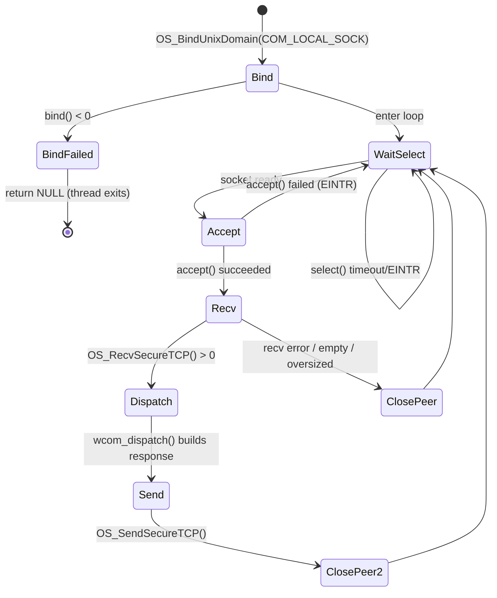

# OS Execd Remote Commands

## Introduction

The **OS Execd Remote Commands** module implements the local command-and-control (C2) interface of the `wazuh-execd` daemon. It exposes a Unix domain socket server (`wcom_main`) that accepts textual requests from trusted local processes — primarily the Wazuh Agent/Manager control tooling and the cluster/API layer — and dispatches them to a family of handler functions (`wcom_unmerge`, `wcom_uncompress`, `wcom_restart`, `wcom_reload`, `wcom_getconfig`, `wcom_check_manager_config`).

This module is the **remote-control surface** of the Active Response execution engine: it allows the rest of the system (installers, upgrade modules, the API, cluster daemon) to instruct `execd` to unpack/verify files delivered during an agent upgrade, restart or reload the Wazuh service, retrieve runtime configuration sections, or validate a manager's configuration before an actual restart. It does **not** execute Active Response scripts itself — that responsibility belongs to the sibling `os_execd_response_engine` module — but it is one of the primary triggers that leads to script execution (e.g., via the `restart-wazuh.exe`/`restart.sh` active-response scripts).

It is a child module of `os_execd` (see [os_execd_daemon_lifecycle.md](os_execd_daemon_lifecycle.md) and [os_execd_response_engine.md](os_execd_response_engine.md) for sibling documentation), and sits within the broader [Agent & Manager Native Daemons (C)](Agent_%26_Manager_Native_Daemons_(C).md) subsystem.

---

## 1. Purpose and Core Functionality

The single source file in this module, `src/os_execd/wcom.c`, provides:

| Responsibility | Function(s) |
|---|---|
| Parse and route incoming socket commands | `wcom_dispatch` |
| Unmerge a bundled file archive (used after WPK/agent upgrade transfers) | `wcom_unmerge` |
| Decompress a gzip-compressed file delivered to the incoming directory | `wcom_uncompress` |
| Trigger a full Wazuh service restart (agent or manager) | `wcom_restart` |
| Trigger a configuration reload without a full restart | `wcom_reload` |
| Retrieve a JSON snapshot of a configuration section (`active-response`, `logging`, `internal`, `cluster`) | `wcom_getconfig` |
| Dry-run `-t` (test) every Wazuh daemon binary to validate a manager configuration before applying it | `wcom_check_manager_config` |
| Serve requests over a local Unix domain socket (`COM_LOCAL_SOCK`) | `wcom_main` |
| Prevent restarts while an upgrade/lock window is active | `lock_restart` |
| Sanitize file paths supplied by the caller to prevent directory traversal | `_jailfile` (static) |

The `wcom_dispatch` function is the **single entry point** exercised by all callers (and by the unit tests in `Unit_Tests_-_OS_Execd`). It parses a space-delimited command line, matches the verb, and calls the corresponding handler, always producing a printable `ok`/`err`-prefixed string response.

---

## 2. Architecture

### 2.1 Component Placement

### 2.2 Internal Structure

---

## 3. Data Flow

### 3.1 Request/Response Sequence

### 3.2 Command Routing Logic (`wcom_dispatch`)

---

## 4. Component Interaction with Other Modules

The remote-command handlers are thin orchestrators; the real work is delegated to functionality owned by other modules/subsystems in the codebase:

| Handler | Delegates to | Related Module |
|---|---|---|
| `wcom_unmerge` | `UnmergeFiles()` | [shared_lib](Agent_%26_Manager_Native_Daemons_(C).md) (`src/shared/file_op.c`) |
| `wcom_uncompress` | `gzopen/gzread` (zlib) | External zlib bundled in `src/external` |
| `wcom_restart` / `wcom_reload` | `fork/execv`, `wpopenv/wpclose` (`wm_exec`) | [wazuh_modules_core](Wazuh_Modules_Daemon_(C).md) |
| `wcom_getconfig("active-response")` | `getARConfig()` | [os_execd_response_engine](os_execd_response_engine.md) / Active Response config (`src/config/active-response.h`, see [Active_Response_Config.md](Active_Response_Config.md)) |
| `wcom_getconfig("internal")` | `getExecdInternalOptions()` | [os_execd_response_engine](os_execd_response_engine.md) (`execd.c`) |
| `wcom_getconfig("cluster")` | `OS_ConnectUnixDomain`, `getClusterConfig()` | [cluster_module](cluster_module.md) (via `CLUSTER_SOCK`) |
| `wcom_check_manager_config` | `wm_exec()` to run `<daemon> -t` for every daemon binary | All native daemons (`wazuh-authd`, `wazuh-remoted`, `wazuh-execd`, `wazuh-analysisd`, `wazuh-logcollector`, `wazuh-syscheckd`, `wazuh-modulesd`, `wazuh-clusterd`) |
| `wcom_main` (socket I/O) | `OS_BindUnixDomain`, `OS_RecvSecureTCP`, `OS_SendSecureTCP` | [os_net](Agent_%26_Manager_Native_Daemons_(C).md) |
| `_jailfile` | `w_ref_parent_folder()` | [shared_lib](Agent_%26_Manager_Native_Daemons_(C).md) |

---

## 5. Protocol Details

The wire protocol is a simple, human-readable, space-delimited request/response format (consistent with other `*com.c` modules across the codebase, e.g. `syscom_dispatch`, `moncom_dispatch`, `authcom_dispatch`, `wdbcom_dispatch`):

### Supported Commands

| Command | Arguments | Description |
|---|---|---|
| `unmerge <file_path>` | Path to a merged file inside `INCOMING_DIR` | Splits a merged bundle back into individual files |
| `uncompress <source> <target>` | Source (gz) and target paths inside `INCOMING_DIR` | Decompresses a `.gz` file |
| `restart` / `restart-wazuh` | none | Restarts the Wazuh service (agent or manager context) |
| `reload` | none | Reloads configuration without full restart |
| `lock_restart <timeout>` | Integer seconds, or `-1` for max | Prevents restarts for a time window (used during upgrades) |
| `getconfig <section>` | `active-response` \| `logging` \| `internal` \| `cluster` | Returns a JSON configuration snapshot |
| `check-manager-configuration` | none | Runs `-t` against every daemon binary to validate config sanity |

### Response Format
All responses begin with `ok ` (success, optionally followed by payload/JSON) or `err <message>` (failure).

> **Note on the lock window:** `wcom_restart`/`wcom_reload` check `pending_upg - time(NULL)`. If positive, the restart/reload is **not** executed but the function still logs `LOCK_RES`. This mechanism is used by the [agent_upgrade_module](agent_upgrade_module.md) to prevent races between an in-flight WPK upgrade and an external restart request.

---

## 6. Security Considerations

* **Path traversal protection:** `_jailfile()` calls `w_ref_parent_folder()` to reject any path containing `..` segments before concatenating it with `INCOMING_DIR`, mitigating directory-traversal attacks via the `unmerge`/`uncompress` commands.
* **Local-only exposure:** The socket (`COM_LOCAL_SOCK`) is a Unix domain socket, not network-exposed; only local processes with filesystem access to the socket path can issue commands.
* **Command validation:** Unrecognized verbs are rejected with `err Unrecognized command` rather than silently ignored.
* **Restart lock:** The `lock_restart`/`pending_upg` mechanism avoids self-inflicted denial-of-service during multi-step upgrade sequences (WPK transfer → verify → restart).

---

## 7. Process Lifecycle (`wcom_main`)

This loop runs on a dedicated thread spawned by the `os_execd` lifecycle (`main.c`, see [os_execd_daemon_lifecycle.md](os_execd_daemon_lifecycle.md)), alongside the Active Response execution loop in [os_execd_response_engine.md](os_execd_response_engine.md).

---

## 8. Related Documentation

- [os_execd_daemon_lifecycle.md](os_execd_daemon_lifecycle.md) — `main.c`, daemon startup/shutdown that spawns the `wcom_main` thread.
- [os_execd_response_engine.md](os_execd_response_engine.md) — `execd.c`/`exec.c`, the Active Response execution engine sharing the `pending_upg` lock and exposing `getARConfig`/`getExecdInternalOptions`.
- [agent_upgrade_module.md](agent_upgrade_module.md) — Sends `unmerge`/`uncompress`/`lock_restart`/`restart` commands during agent WPK upgrades (see also `wm_agent_upgrade_com.c` which implements an analogous protocol on the agent's upgrade module socket).
- [cluster_module.md](cluster_module.md) — Consumer of `getconfig cluster`, connects to `CLUSTER_SOCK` verified by this module.
- [manager_module.md](manager_module.md) — The Manager API `put_restart`/`get_configuration` endpoints ultimately trigger requests handled here.
- [Active_Response_Config.md](Active_Response_Config.md) — Structure of the `active-response` configuration section returned by `wcom_getconfig`.
- Sibling `*com.c` protocol implementations for cross-reference: `os_auth` (`authcom_dispatch`), `logcollector` (`lccom_dispatch`), `monitord` (`moncom_dispatch`), `wazuh_db` (`wdbcom_dispatch`), `syscheckd` (`syscom_dispatch`) — all documented under [Agent_&_Manager_Native_Daemons_(C).md](Agent_%26_Manager_Native_Daemons_(C).md).
- [shared_lib](Agent_%26_Manager_Native_Daemons_(C).md) — Provides `UnmergeFiles`, `w_ref_parent_folder`, and other filesystem helpers used by `wcom_unmerge`/`_jailfile`.
- Unit tests: `Unit_Tests_-_OS_Execd` (`os_execd_test_execd`, `os_execd_test_win_execd`, `os_execd_test_get_command_by_name`) exercise the surrounding execd behavior; wcom-specific coverage relies on the shared `os_net`/`file_op` wrapper mocks under `Unit_Test_Wrappers_&_Mocks`.
