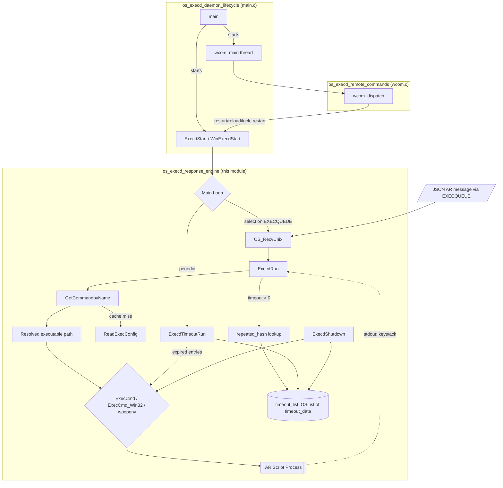
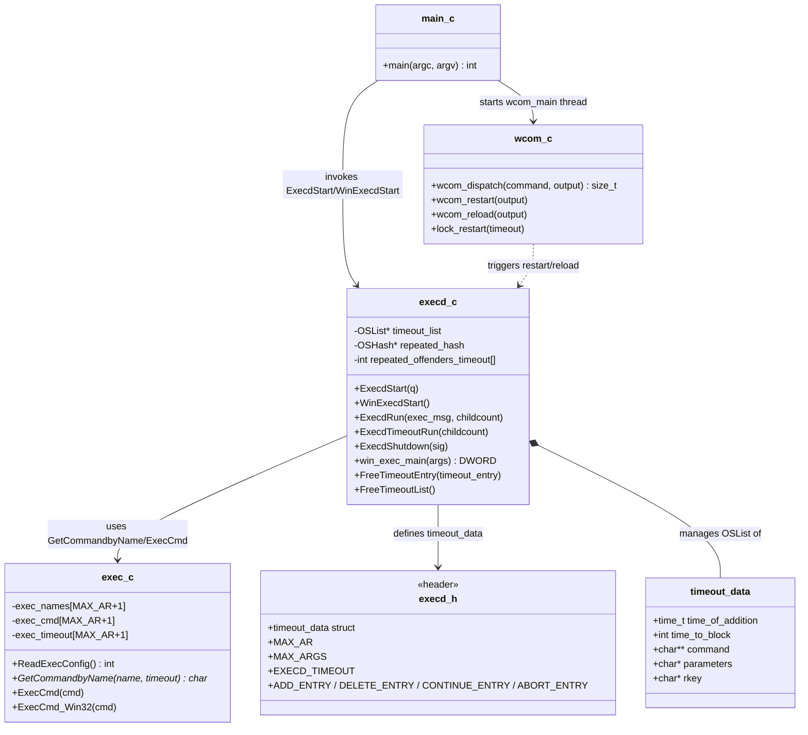
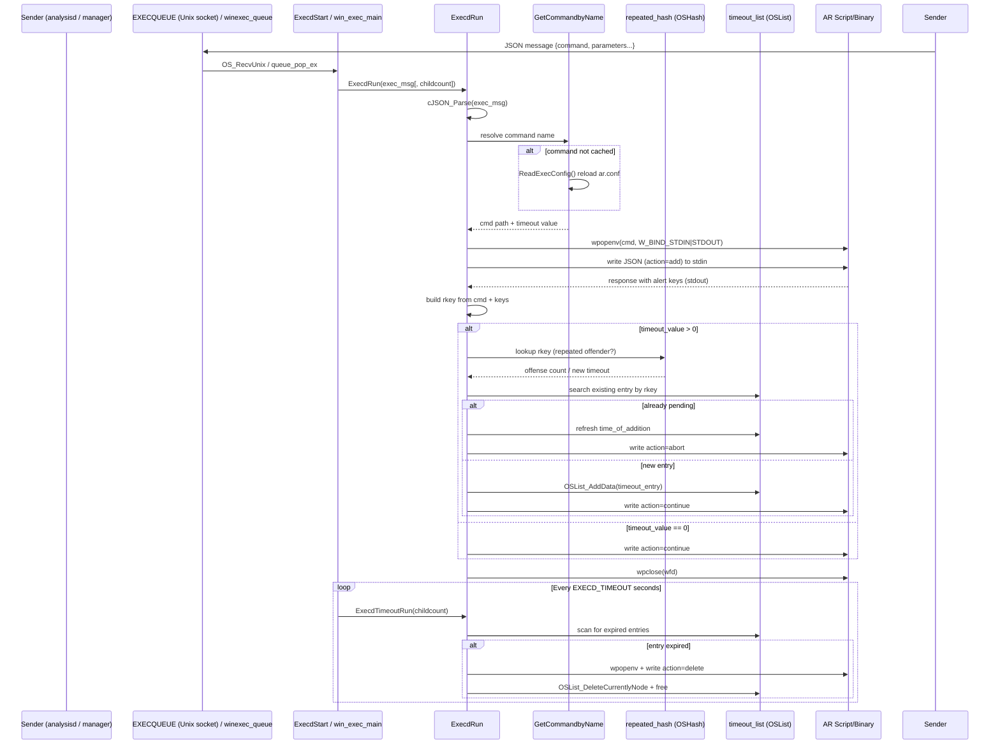
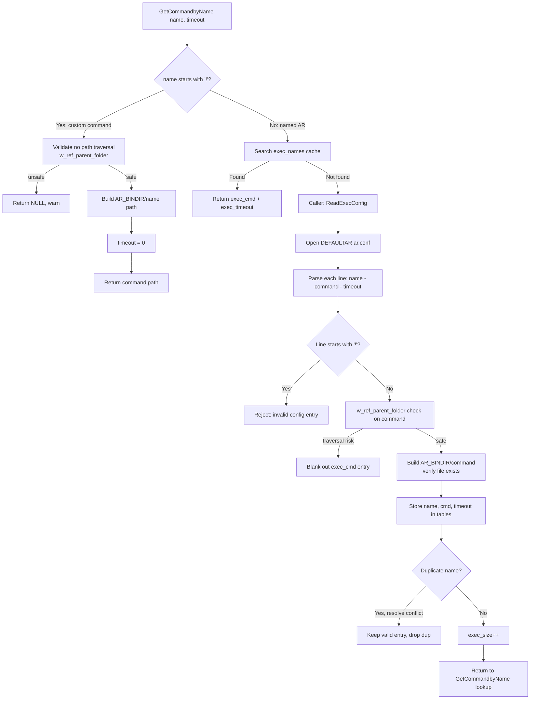
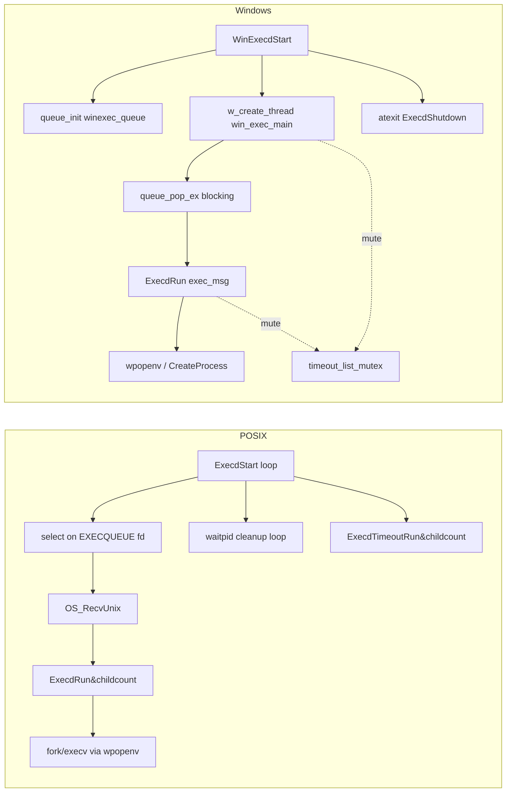
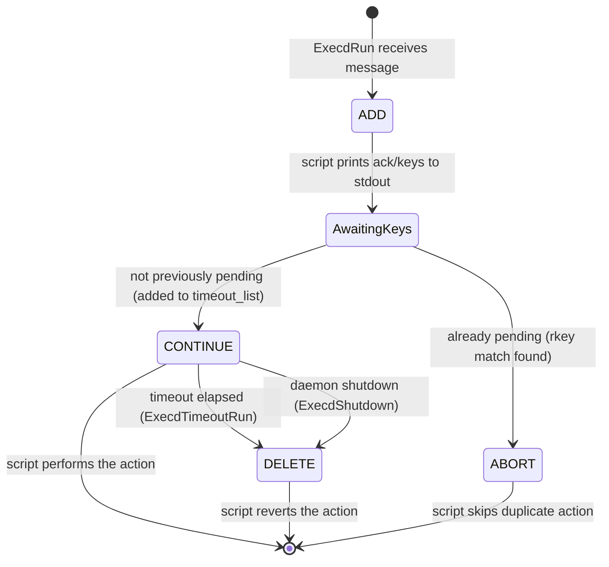

# os_execd_response_engine

## Introduction

The **os_execd_response_engine** module is the execution core of the Wazuh `wazuh-execd` daemon. It is responsible for receiving Active Response (AR) execution requests (delivered as JSON messages over an internal Unix queue or, on Windows, via an in-process queue), resolving the requested response into a real, filesystem-validated executable, launching that executable as a child process, and — critically — managing the **timeout/repeated-offender lifecycle** of every active response that is fired. When a response's configured timeout expires, this module is also responsible for invoking the same script a second time with a "delete" action so that the response can be reversed (e.g., un-blocking an IP that was previously blocked).

This module is one of three children of the `os_execd` component (see [Agent_&_Manager_Native_Daemons_(C).md](Agent_&_Manager_Native_Daemons_(C).md) for the parent daemon family), alongside:
- `os_execd_daemon_lifecycle` (`src/os_execd/main.c`) — process bootstrap, CLI parsing, privilege separation, and startup of the queue/thread infrastructure.
- `os_execd_remote_commands` (`src/os_execd/wcom.c`) — the remote control API (`wcom_dispatch`) used by managers/agents to request configuration reloads, restarts, WPK unmerge/uncompress operations, etc.

The response engine itself is implemented mainly in:
- `src/os_execd/execd.c` — the message loop, timeout list management, and repeated-offender throttling (`ExecdStart`, `ExecdRun`, `ExecdTimeoutRun`, `ExecdShutdown`, and the Windows-specific `win_exec_main` thread entry point).
- `src/os_execd/exec.c` — configuration loading of the `ar.conf` command table and process spawning (`ReadExecConfig`, `GetCommandbyName`, `ExecCmd`, `ExecCmd_Win32`).
- `src/os_execd/execd.h` — shared declarations, including the `timeout_data` structure that represents a pending/blocking active response.

## Purpose and Core Functionality

1. **Command resolution** — Maps a logical Active Response name (e.g. `firewall-drop0`) or a custom command (prefixed with `!`) to a validated, on-disk executable path under `AR_BINDIR`, guarding against directory traversal attacks.
2. **Process execution** — Spawns the resolved command as a child process (`wpopenv`/`execv` on POSIX, `CreateProcess` on Windows) and streams a JSON payload (the active-response message) to the child's stdin.
3. **Timeout list management** — When an active response is configured with a non-zero timeout, the module tracks it in an in-memory linked list (`timeout_list`, an `OSList` of `timeout_data` nodes). When the timeout elapses, the engine re-invokes the same command with a `delete` action so the response can be reverted.
4. **Repeated-offender escalation** — Uses an `OSHash` (`repeated_hash`) keyed by a response+argument signature (`rkey`) to detect repeat offenses and progressively extend the block timeout according to the `repeated_offenders_timeout[]` staircase (configured in `internal_options`).
5. **Graceful shutdown** — On daemon shutdown/signal, immediately fires the `delete` action for every response still pending in the timeout list to avoid leaving standing blocks/changes after the daemon exits.
6. **Cross-platform execution model** — POSIX builds use a blocking `select()`-based main loop (`ExecdStart`) driven by messages arriving on the `EXECQUEUE` Unix socket; Windows builds run a dedicated worker thread (`win_exec_main`) that pops messages off an internal `w_queue_t` (`winexec_queue`).

## Architecture Overview

## Component Relationships

## Data Flow: Handling an Active Response Message

## Process Flow: Command Resolution and Configuration

## Key Data Structures

### `timeout_data` (src/os_execd/execd.h)
Represents one pending, timed active response awaiting its "delete"/reversal invocation:

| Field | Type | Description |
|---|---|---|
| `time_of_addition` | `time_t` | Timestamp when the response was added/refreshed |
| `time_to_block` | `int` | Number of seconds before the response should be reverted |
| `command` | `char**` | NULL-terminated argv-style array; `command[0]` is the resolved executable path |
| `parameters` | `char*` | Serialized JSON parameters sent to the script (with `command` field rewritten to `delete`) |
| `rkey` | `char*` | Composite key: script basename + alert keys, used to detect repeated triggers of the same response against the same target |

### Module-level state (execd.c)
- `timeout_list` (`OSList*`) — doubly-linked list of `timeout_data*`, the authoritative set of "currently active" responses awaiting reversal.
- `repeated_hash` (`OSHash*`) — maps `rkey` → offense count string, used to look up escalating timeouts.
- `repeated_offenders_timeout[]` — zero-terminated array of minute values (loaded from internal options) defining the escalation staircase (e.g., 5, 10, 20, 40... minutes).
- `timeout_list_mutex` (Windows only) — protects concurrent access to `timeout_list` between the main receive loop and the `win_exec_main` worker thread.

### Configuration cache (exec.c)
- `exec_names[MAX_AR+1]`, `exec_cmd[MAX_AR+1]`, `exec_timeout[MAX_AR+1]` — parallel arrays acting as an in-memory cache of `ar.conf` (the "shared" active-response command table), loaded via `ReadExecConfig()`.

## Platform-Specific Execution Models

- **POSIX (`ExecdStart`)**: single-threaded, event-driven via `select()` on the `EXECQUEUE` Unix domain socket with a 1-second (`EXECD_TIMEOUT`) poll interval used to also drive `ExecdTimeoutRun`. Child processes are reaped via non-blocking `waitpid`.
- **Windows (`WinExecdStart` / `win_exec_main`)**: a background thread (`win_exec_main`) pulls messages from a lock-protected internal queue (`winexec_queue`, a `w_queue_t`) and calls `ExecdRun`. Because there is no native `fork/exec` model, process creation goes through `ExecCmd_Win32` (`CreateProcess`) for `restart-wazuh` style calls and `wpopenv` for the general case. `timeout_list_mutex` guards the shared `timeout_list` since the receive loop and the periodic timeout check can run in different execution contexts.

## Interaction with Configuration and Shared Infrastructure

- **Configuration source**: `ar.conf` (`DEFAULTAR`), a shared file distributed by the manager to agents containing lines of the form `name - command - timeout`. This is distinct from (but conceptually related to) the manager-side active response configuration described by `active_response`/`ar_command` structs in [Configuration_Data_Structures_(C_Headers).md](Configuration_Data_Structures_(C_Headers).md) (`src/config/active-response.h`).
- **Process spawning primitives**: relies on `wpopenv`/`wpclose` (declared in `src/headers/exec_op.h`, implemented in the shared library — see `Wazuh_Modules_Daemon_(C)` and `shared_lib` children of [Agent_&_Manager_Native_Daemons_(C).md](Agent_&_Manager_Native_Daemons_(C).md)) for portable child-process I/O redirection.
- **JSON handling**: uses the bundled `cJSON` library to parse incoming AR messages and to rewrite the `command` field between `add`, `continue`, `abort`, and `delete` phases as the state machine progresses.
- **Remote command bridge**: `os_execd_remote_commands` (`wcom.c`, `wcom_dispatch`) exposes `restart`, `reload`, and `lock_restart` operations that indirectly affect this module's daemon (e.g., triggering a full agent/manager restart), but does not directly manipulate `timeout_list`.
- **Sibling active-response scripts**: the actual reversible actions (firewall drop, account disable, etc.) that this engine launches as child processes are implemented in the native `active_response_native` module family (see [Agent_&_Manager_Native_Daemons_(C).md](Agent_&_Manager_Native_Daemons_(C).md) → `active_response_native`), e.g. `src/active-response/firewalld-drop.c`, `disable-account.c`. The API-facing "run a command manually" path is a separate module — see `active_response_module` in the API tree, whose `framework/wazuh/active_response.py::run_command` ultimately places a message onto the same style of active-response queue that this engine consumes on the agent/manager side.

## Message/Action State Machine

Each active-response invocation flows through up to four logical phases, all communicated as a `command` field inside the JSON payload sent to the child process's stdin:

- `ADD_ENTRY` ("add"): initial message sent to the script; the script is expected to perform the action and report back the alert/target keys used to build `rkey`.
- `CONTINUE_ENTRY` ("continue") / `ABORT_ENTRY` ("abort"): sent immediately after, telling the script whether to proceed (new entry) or abort (duplicate already active).
- `DELETE_ENTRY` ("delete"): sent later — either when the timeout expires (`ExecdTimeoutRun`) or the daemon is shutting down (`ExecdShutdown`) — instructing the script to revert/undo the original action.

## Testing

Unit tests for this module live under `src/unit_tests/os_execd/` (see the `Unit_Tests_-_OS_Execd` module tree), specifically:
- `os_execd_test_execd` (`test_execd.c`) — covers `ExecdStart` success/error paths, timeout handling (`test_ExecdStart_timeout_repeated`/`_not_repeated`), and malformed JSON/command handling.
- `os_execd_test_win_execd` (`test_win_execd.c`) — Windows-specific equivalents (`test_WinExecdRun_*`).
- `os_execd_test_get_command_by_name` (`test_get_command_by_name.c`) — validates command resolution including the path-traversal protection (`test_path_traversal`) and custom command handling (`test_custom_command`).

Supporting wrapper mocks are provided in `wrappers/wazuh/os_execd/exec_wrappers.c` (`__wrap_ReadExecConfig`) as part of the broader [Unit_Test_Wrappers_&_Mocks.md](Unit_Test_Wrappers_&_Mocks.md) infrastructure.

## Related Modules

| Module | Relationship |
|---|---|
| `os_execd_daemon_lifecycle` | Parent daemon entry point (`main.c`) that starts this engine's main loop and the `wcom` thread |
| `os_execd_remote_commands` | Sibling module (`wcom.c`) providing the remote control/restart API for the `wazuh-execd` daemon |
| `active_response_native` | Native scripts/binaries (firewall-drop, disable-account, etc.) invoked as child processes by this engine |
| `active_response_module` (API) | High-level API (`framework/wazuh/active_response.py`) that lets users trigger active responses, which eventually reach an execd instance |
| `Configuration_Data_Structures_(C_Headers)` → `Active_Response_Config` | Defines the manager-side `active_response`/`ar_command` structures that generate the `ar.conf` file parsed by `ReadExecConfig` |
| `shared_lib` | Provides `wpopenv`/`wpclose`, `OSList`, `OSHash`, and other shared primitives used throughout this module |
| `Unit_Tests_-_OS_Execd` | Test suite validating this module's behavior |
