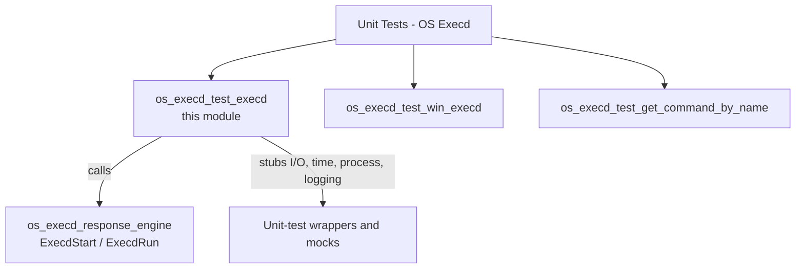
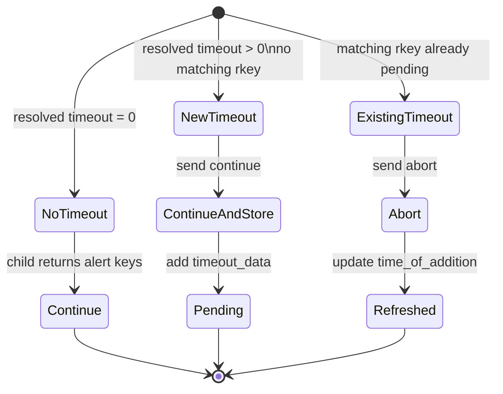
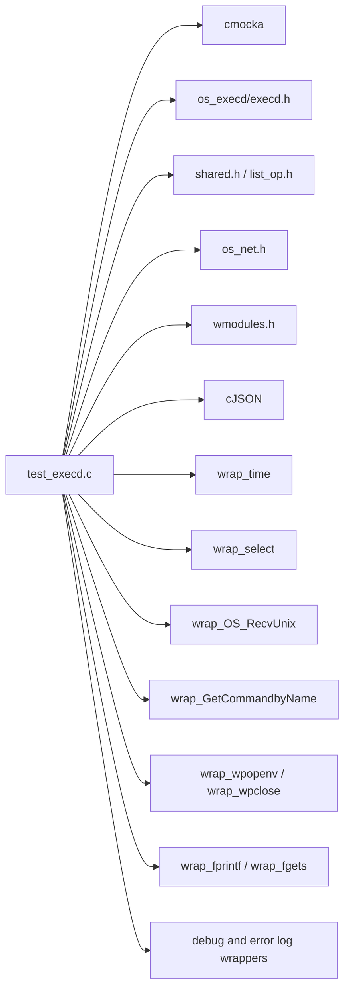
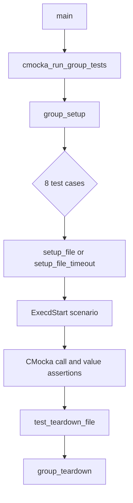

# os_execd_test_execd

## Introduction

`os_execd_test_execd` is the CMocka unit-test module for the POSIX Active Response execution loop in `src/os_execd/test_execd.c`. It validates `ExecdStart(int q)` from the [os_execd response engine](os_execd_response_engine.md) without launching real Active Response programs or reading real sockets and files.

The tests model the complete request path: an Active Response JSON message is received from the execution queue, its command is resolved, the child process is opened through `wpopenv`, an `add` request is written to the child, the child response is read, and the parent sends either `continue` or `abort`. Timed responses are also inserted into, refreshed in, and removed from the global `timeout_list`.

## Scope and placement

The module belongs to the OS Execd unit-test suite and exercises only the POSIX execution path. Windows execution is covered separately by [os_execd_test_win_execd](os_execd_test_win_execd.md), while command-name validation is covered by [os_execd_test_get_command_by_name](os_execd_test_get_command_by_name.md). The production daemon and its sibling components are described in [os_execd](os_execd.md).



## Test harness architecture

The test file uses CMocka fixtures and link-time wrapper functions. `group_setup` enables the global `test_mode`; each test-specific setup allocates a synthetic `wfd_t` whose streams are sentinel pointers; teardown releases that object and the timeout list.

```mermaid
flowchart LR
    Setup[group_setup\ntest_mode = 1] --> Fixture[Per-test fixture]
    Fixture --> WFD[wfd_t\nfile_in=(FILE*)1\nfile_out=(FILE*)2]
    Fixture --> TL[timeout_list = OSList_Create()]
    WFD --> Test[ExecdStart test]
    TL --> Test
    Test --> Mocks[CMocka expectations\nselect / time / queue / process / stdio]
    Mocks --> Production[ExecdStart(q)]
    Production --> Assertions[Expected calls, payloads, logs]
    Assertions --> Teardown[Free wfd_t\nFreeTimeoutList]
    Teardown --> Group[group_teardown\ntest_mode = 0]
```

### Shared state

The module imports and controls two production globals:

| State | Role in the tests |
|---|---|
| `test_mode` | Set to `1` for the CMocka group and restored to `0` afterward so the execution loop can terminate deterministically. |
| `timeout_list` | Global `OSList` containing pending timeout entries. It is empty for ordinary tests and pre-populated by timeout tests. |

The synthetic `wfd_t` is not a real pipe. Its `file_in` and `file_out` values are checked by wrappers around `fprintf` and `fgets`, allowing the tests to verify protocol payloads while avoiding operating-system process I/O.

## Execution flow under test

The tests drive the same high-level path as the daemon’s production response engine, but replace external boundaries with controlled return values.

```mermaid
sequenceDiagram
    participant Test as CMocka test
    participant Loop as ExecdStart(q)
    participant Queue as OS_RecvUnix mock
    participant Resolve as GetCommandbyName mock
    participant Child as wpopenv mock
    participant IO as fprintf / fgets mocks
    participant List as timeout_list

    Test->>Loop: invoke with queue = 1
    Loop->>Queue: receive up to OS_MAXSTR
    Queue-->>Loop: JSON message and length
    Loop->>Resolve: resolve command name
    Resolve-->>Loop: timeout and executable name
    Loop->>Child: launch resolved command
    Child-->>Loop: synthetic wfd_t
    Loop->>IO: write action=add payload
    IO-->>Loop: child output or NULL
    alt valid response and timeout = 0
        Loop->>IO: write action=continue
    else valid response and new timeout
        Loop->>List: add timeout entry
        Loop->>IO: write action=continue
    else valid response and repeated timeout
        Loop->>List: find existing entry / refresh timestamp
        Loop->>IO: write action=abort
    end
    Loop->>Child: wpclose
```

The expected JSON is an analysisd-originated message with `command` and `parameters.alert` fields. After resolution, the engine changes the origin module to `wazuh-execd`, adds the resolved `program`, and changes the command to an execution action (`add`, followed by `continue` or `abort`). The tests compare these serialized payloads exactly, including the trailing newline sent to the child.

## Test cases

### Successful execution

`test_ExecdStart_ok` verifies the normal no-timeout path:

1. `select` reports the execution queue as readable.
2. `OS_RecvUnix` returns a valid JSON Active Response message.
3. `GetCommandbyName` resolves `restart-wazuh0` to `restart-wazuh` with timeout `0`.
4. `wpopenv` returns the prepared `wfd_t`.
5. The engine writes an `add` request to `file_in`.
6. `fgets` returns an Active Response response containing alert keys.
7. The engine writes a `continue` request and closes the child with `wpclose`.

The test also checks the debug messages for receipt and execution, making the expected transformation of the message observable.

### Timeout lifecycle

`test_setup_file_timeout` preloads `timeout_list` with a `timeout_data` entry for `restart-wazuh10`, including an existing `rkey`, command vector, addition time, and ten-second block duration.

`test_ExecdStart_timeout_not_repeated` verifies a new timeout response. The command is executed, the response keys differ from the existing entry, and the engine sends `continue`. It then records the response in the timeout list and logs that the command was added with a ten-second timeout.

`test_ExecdStart_timeout_repeated` verifies a repeated response for the same key. The engine sends `abort` to the child and refreshes the existing entry’s addition time rather than creating a duplicate. The test expects the log message `Command already received, updating time of addition to now.`

These tests cover the timeout-list behavior owned by the [os_execd response engine](os_execd_response_engine.md); they do not independently test the timer polling routine or shutdown cleanup.



### Process and input failures

The remaining tests exercise defensive branches:

| Test | Simulated condition | Expected behavior |
|---|---|---|
| `test_ExecdStart_wpopenv_err` | `wpopenv` returns `NULL`. | Logs `(1317): Could not launch command Success (0)` and stops processing the request. |
| `test_ExecdStart_fgets_err` | The child produces no response. | Closes the process and logs that the Active Response will not be added to the timeout list because alert keys were not received. |
| `test_ExecdStart_get_command_err` | Command lookup fails, including a reload through `ReadExecConfig`. | Logs `(1311): Invalid command name 'restart-wazuh0' provided.` |
| `test_ExecdStart_get_name_err` | The received JSON is `{}` and therefore lacks a valid AR command name. | Logs `(1316): Invalid AR command: '{}'`. |
| `test_ExecdStart_json_err` | The queue returns the non-JSON string `unknown`. | Logs `(1315): Invalid JSON message: 'unknown'`. |

The error tests assert the exact error text through the logging wrappers. They therefore protect both control-flow decisions and externally visible diagnostics.

## Dependency and mock boundaries



Important wrapper groups are:

- `wrappers/wazuh/os_execd/exec_wrappers.h`: command lookup, configuration reload, and process opening.
- `wrappers/wazuh/os_net/os_net_wrappers.h`: queue receive behavior.
- `wrappers/libc/stdio_wrappers.h`: child stdin/stdout interactions.
- `wrappers/posix/select_wrappers.h`: queue readiness.
- `wrappers/wazuh/shared/debug_op_wrappers.h`: debug and error log assertions.
- `wrappers/wazuh/shared/exec_op_wrappers.h`: child close behavior.

Because all external effects are mocked, the test is a unit test of orchestration and message transformation. It does not validate executable permissions, real Unix socket behavior, `ar.conf` parsing, platform process creation, or the behavior of an actual Active Response script. Those concerns are documented and tested in the production and sibling modules linked above.

## Test registration and lifecycle

`main` registers eight CMocka tests, each with a per-test setup and teardown:



The timeout fixture is used only by `test_ExecdStart_timeout_not_repeated` and `test_ExecdStart_timeout_repeated`; all other tests use the empty timeout fixture. `test_teardown_file` always frees the synthetic descriptor and calls `FreeTimeoutList`, keeping tests isolated despite the production global list.

## Maintenance guidance

When changing `ExecdStart` or the Active Response message format, update the exact `fprintf` expectations in the success and timeout tests first. Changes to command resolution should be reflected in `test_ExecdStart_get_command_err` and the dedicated command-name tests. Changes to child output or alert-key handling should update both the successful path and `test_ExecdStart_fgets_err`.

For broader behavior, refer to:

- [os_execd_response_engine](os_execd_response_engine.md) for production execution, timeout polling, repeated-offender escalation, and shutdown semantics.
- [os_execd_daemon_lifecycle](os_execd_daemon_lifecycle.md) for daemon startup and how `ExecdStart` is invoked.
- [os_execd_test_win_execd](os_execd_test_win_execd.md) for Windows execution coverage.
- [os_execd_test_get_command_by_name](os_execd_test_get_command_by_name.md) for custom command and traversal validation.
- [os_execd](os_execd.md) for the overall daemon architecture and relationships.
