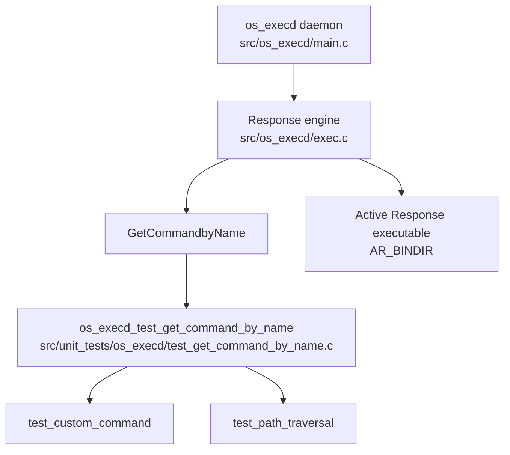
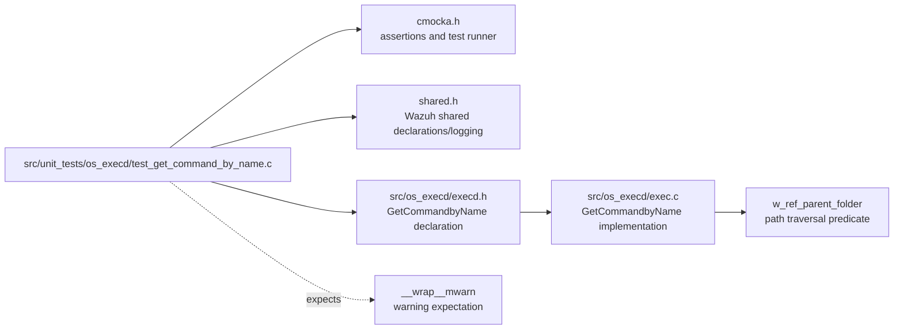
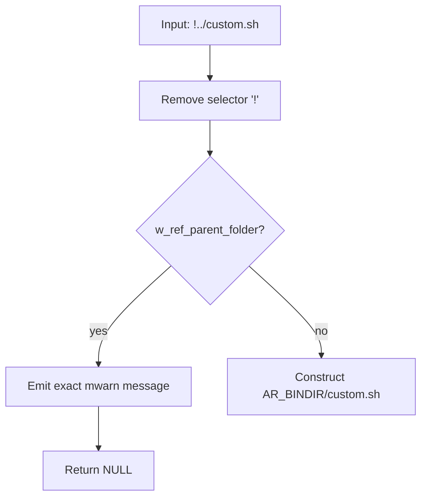
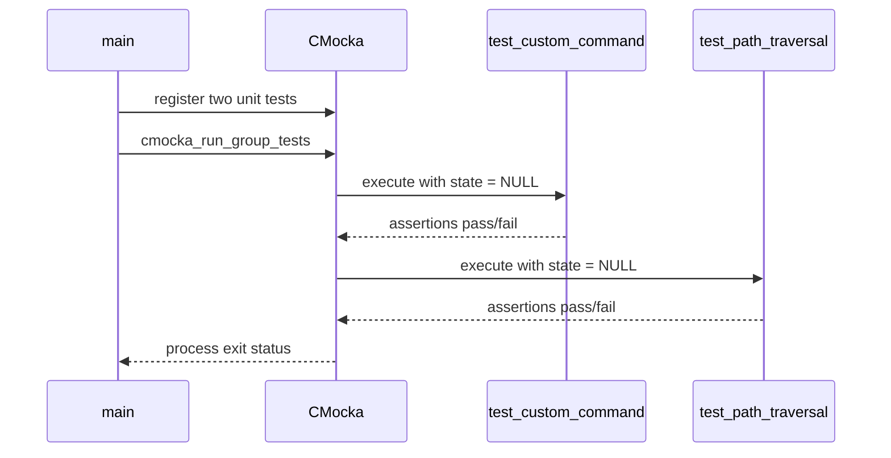

# os_execd_test_get_command_by_name

## Introduction

`os_execd_test_get_command_by_name` is a focused CMocka unit-test module for the Wazuh `os_execd` command-resolution helper `GetCommandbyName`. It verifies two security- and behavior-critical properties of custom Active Response commands: a safe `!`-prefixed name is mapped beneath `AR_BINDIR` with no timeout, while a name containing parent-directory traversal is rejected and logged.

The test does not execute a command, load `ar.conf`, or exercise timeout-list behavior. Those responsibilities are documented in [os_execd_response_engine](os_execd_response_engine.md). The test source is `src/unit_tests/os_execd/test_get_command_by_name.c`.

## Scope and role in Wazuh

The test sits below the native `os_execd` daemon and its response engine:



The production function is used by `ExecdRun` to turn an incoming command name into an executable path. This module tests only the custom-command branch, which is selected when the first character of `name` is `!`.

## Components

| Component | Responsibility |
|---|---|
| `CMUnitTest` | CMocka test registration type used by `main`. |
| `test_custom_command` | Checks safe custom-command path construction and timeout reset. |
| `test_path_traversal` | Checks rejection and warning for `..` path traversal. |
| `main` | Registers both tests and runs them as one CMocka group. |
| `GetCommandbyName` | Production function declared by `src/os_execd/execd.h` and implemented in `src/os_execd/exec.c`. |
| `__wrap__mwarn` | CMocka/linker-wrapped warning logger used to verify the security warning text. |

## Architecture and dependencies



The test includes standard C headers for variadic support, assertions, I/O, and string handling, but its functional dependencies are CMocka, Wazuh shared declarations, and the `execd` public header. The test relies on the production implementation being linked into the test binary; it does not provide a fake implementation of `GetCommandbyName`.

At runtime, `GetCommandbyName` uses the following production dependencies and state:

- `AR_BINDIR`: compile-time/runtime installation path for Active Response executables.
- `w_ref_parent_folder`: detects parent-folder references such as `..`.
- `mwarn`: warning logger, wrapped as `__wrap__mwarn` by the test harness.
- A static command buffer inside the custom-command branch. The returned pointer is valid until the next custom-command lookup in that process.

Named commands loaded from the `exec_names`, `exec_cmd`, and `exec_timeout` tables are outside this module's direct coverage; see [os_execd_response_engine](os_execd_response_engine.md#process-flow-command-resolution-and-configuration).

## Tested behavior

### Safe custom command

`test_custom_command` initializes `timeout` to `100` and calls:

```c
GetCommandbyName("!custom.sh", &timeout);
```

The expected result is:

- `timeout == 0`, because custom commands do not inherit an `ar.conf` timeout.
- The returned string equals `AR_BINDIR "/custom.sh"`.

The leading `!` is a selector and is not included in the constructed filesystem path.

```mermaid
sequenceDiagram
    participant T as test_custom_command
    participant G as GetCommandbyName
    participant B as AR_BINDIR

    T->>G: "!custom.sh", &timeout
    G->>G: detect leading '!'
    G->>G: validate "custom.sh"
    G->>B: construct AR_BINDIR/custom.sh
    G-->>T: path; timeout = 0
    T->>T: assert path and timeout
```

### Traversal rejection

`test_path_traversal` calls:

```c
GetCommandbyName("!../custom.sh", &timeout);
```

Before constructing a path, the implementation passes `name + 1` (`../custom.sh`) to `w_ref_parent_folder`. The predicate identifies the parent-directory reference, so the function:

1. Calls `mwarn` with `Active response command '../custom.sh' vulnerable to directory traversal attack. Ignoring.`
2. Returns `NULL`.
3. Does not construct or return an `AR_BINDIR` path.



This test is a regression guard against escaping the intended Active Response directory through a custom command name.

## Function and control flow

```mermaid
flowchart TD
    START[GetCommandbyName(name, timeout)] --> PREFIX{name[0] == '!'}
    PREFIX -->|no| TABLE[Search configured command table]
    TABLE --> RESULT1[Return configured command and timeout]
    PREFIX -->|yes| STRIP[Use name + 1]
    STRIP --> SAFE{Parent-folder reference?}
    SAFE -->|yes| WARN[Log warning]
    WARN --> NULL[Return NULL]
    SAFE -->|no| LENGTH{Constructed path fits buffer?}
    LENGTH -->|no| LONGWARN[Log path-too-long warning]
    LONGWARN --> NULL2[Return NULL]
    LENGTH -->|yes| BUILD[Build AR_BINDIR/name]
    BUILD --> ZERO[Set *timeout = 0]
    ZERO --> PATH[Return static command buffer]
```

The test module reaches only the highlighted custom-command path. It does not assert the path-too-long branch or the named-command-table branch.

## Test lifecycle

`main` creates a `const struct CMUnitTest tests[]` array with two entries using `cmocka_unit_test`, then invokes `cmocka_run_group_tests(tests, NULL, NULL)`. No group setup or teardown callbacks are supplied.



Both test functions explicitly discard the unused CMocka state parameter. The module is therefore deterministic and has no fixture files, environment setup, sockets, child processes, or persistent state of its own.

## Assertions and expected outcomes

| Test | Input | Expected return | Additional assertion |
|---|---|---|---|
| `test_custom_command` | `!custom.sh` | `AR_BINDIR/custom.sh` | Timeout changes from `100` to `0`. |
| `test_path_traversal` | `!../custom.sh` | `NULL` | Exact traversal warning is emitted. |

The tests use `assert_string_equal`, `assert_int_equal`, and `assert_null`. The warning expectation is installed before the traversal call with CMocka's `expect_string` for `__wrap__mwarn` and the `formatted_msg` argument.

## Build and execution context

The module is part of the `Unit_Tests_-_OS_Execd` test family. Its test binary must be linked with:

- the Wazuh `os_execd` implementation containing `GetCommandbyName`;
- Wazuh shared headers and support code, including the path-validation helper;
- CMocka;
- the project wrapper/mocking objects that expose `__wrap__mwarn`.

The exact build target and test invocation are controlled by the repository's test build system. In a complete OS Execd test run, this test complements [os_execd_test_execd](os_execd_test_execd.md), which exercises POSIX daemon execution and timeout paths, and [os_execd_test_win_execd](os_execd_test_win_execd.md), which covers Windows execution behavior.

## Coverage boundaries and maintenance notes

- A custom command is path-prefixed but is not checked for file existence by `GetCommandbyName`; execution-time handling belongs to the response engine.
- The test does not verify the path-too-long warning branch.
- The test does not verify `ReadExecConfig`, duplicate command handling, missing binaries, configured timeouts, or reload behavior.
- The traversal test should remain aligned with the exact warning contract because it validates both rejection and operator-visible diagnostics.
- If path-validation rules change, update both the positive custom-command case and negative traversal cases to cover the new accepted/rejected syntax.

## Related modules

- [os_execd_response_engine](os_execd_response_engine.md) — production command resolution, execution, timeout, and repeated-offender behavior.
- [os_execd](os_execd.md) — top-level `os_execd` architecture and component relationships.
- [os_execd_test_execd](os_execd_test_execd.md) — POSIX daemon execution and timeout tests.
- [os_execd_test_win_execd](os_execd_test_win_execd.md) — Windows execution tests.
- [Unit_Tests_-_OS_Execd](Unit_Tests_-_OS_Execd.md) — parent unit-test module.
- [Unit_Test_Wrappers_&_Mocks](Unit_Test_Wrappers_&_Mocks.md) — shared CMocka/linker wrapper infrastructure.

