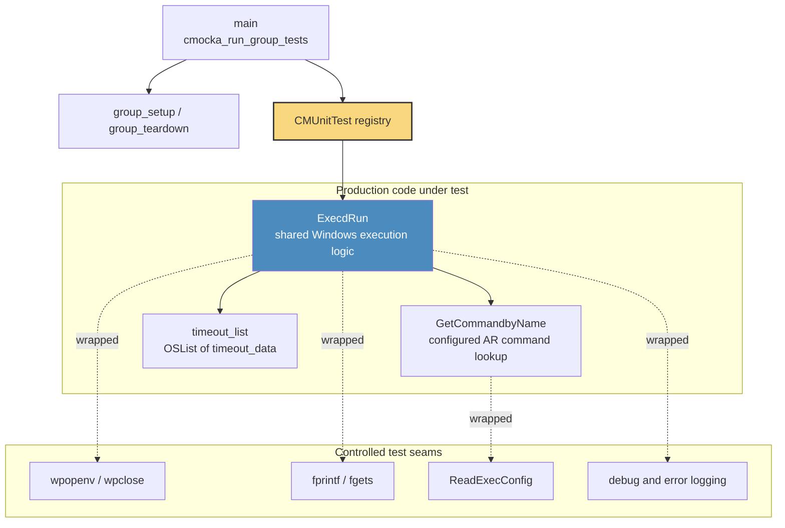
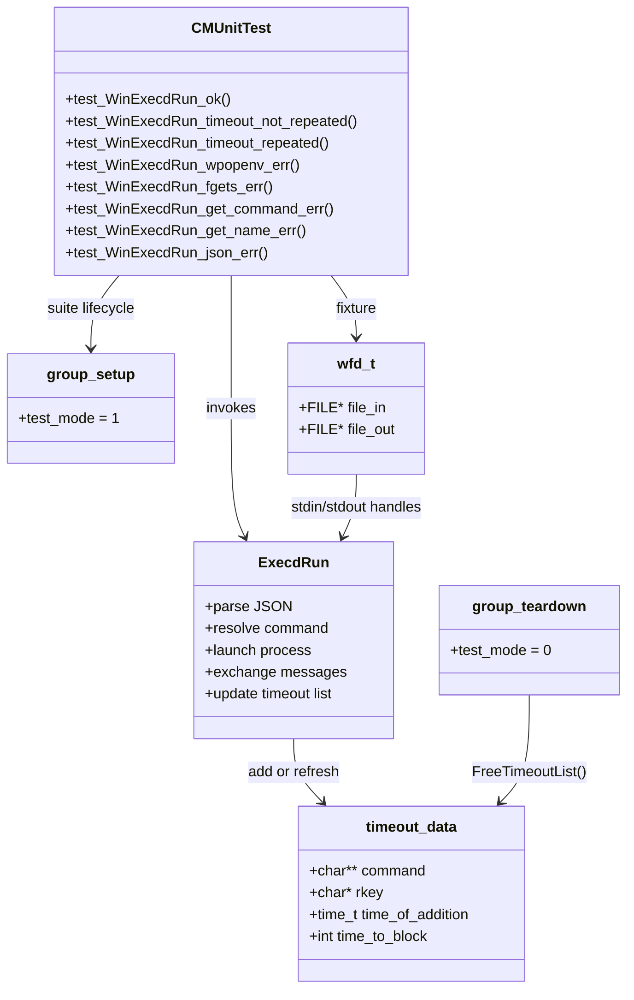
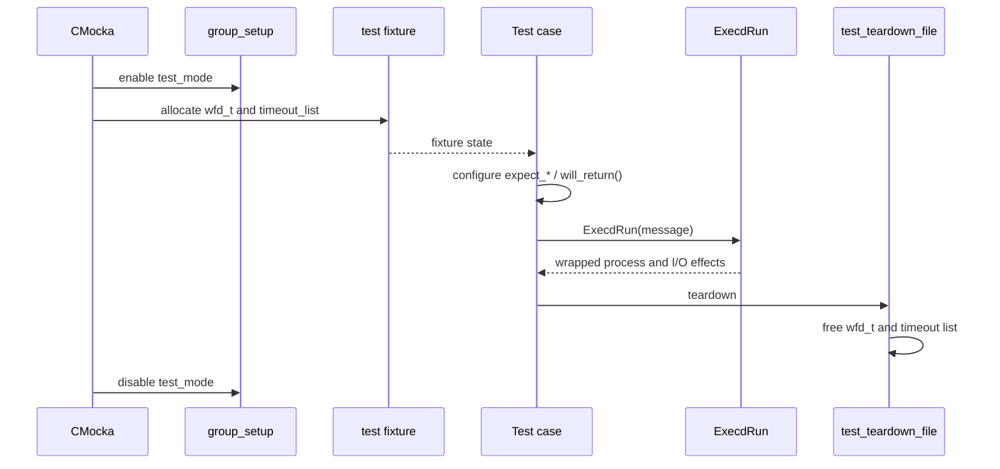
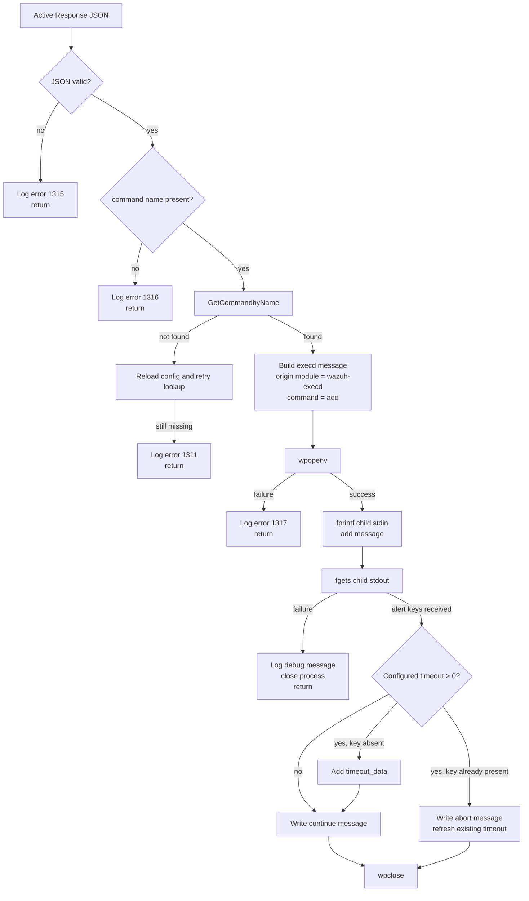
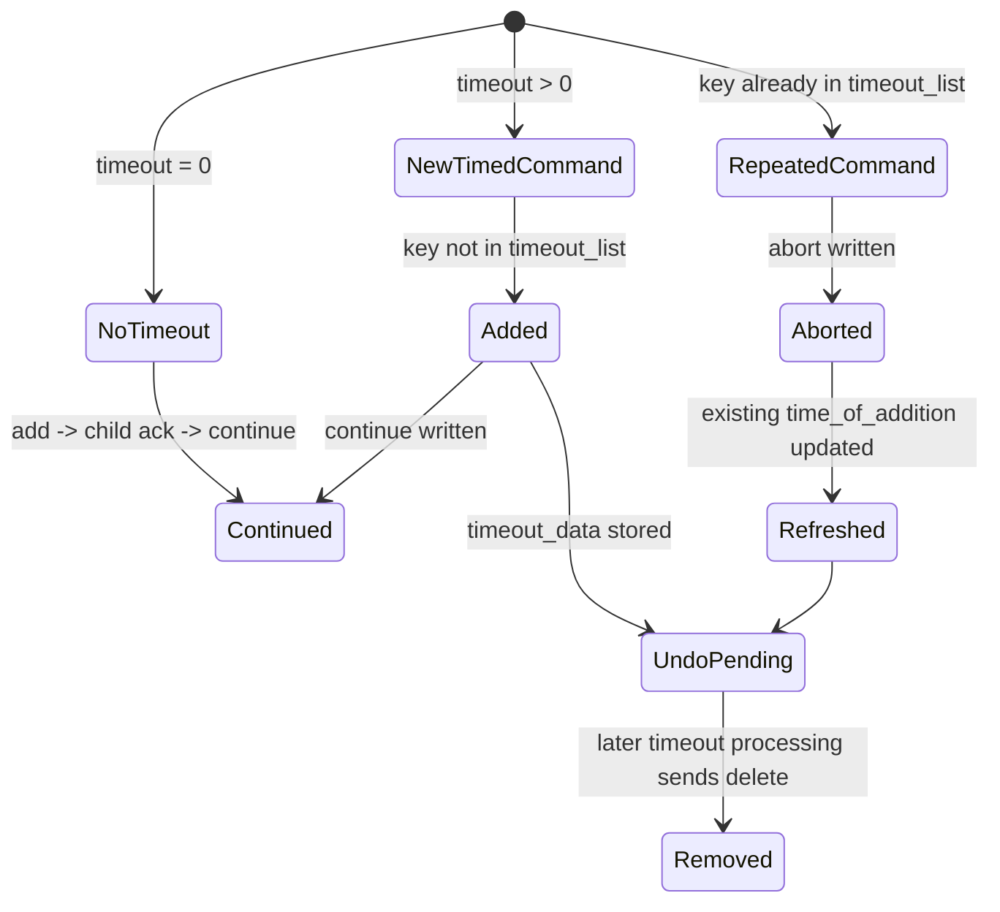
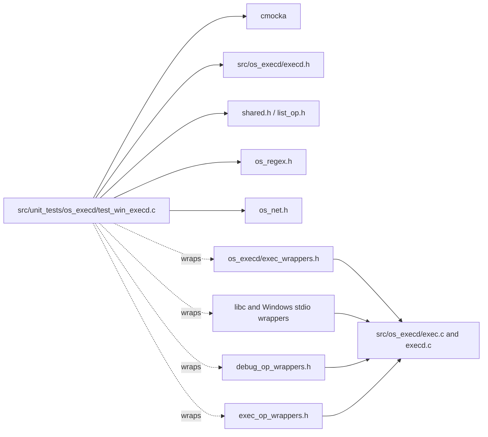
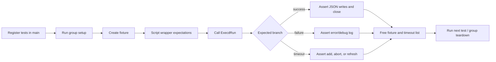

# `os_execd_test_win_execd` — Windows Active Response Execution Tests

## Introduction

`os_execd_test_win_execd` is the CMocka unit-test module for the Windows execution path of Wazuh’s Active Response execution daemon. It validates `ExecdRun()` using a synthetic `wfd_t` process channel and controlled wrappers for command lookup, Windows process creation, standard I/O, timeout handling, and logging.

The module tests execution outcomes rather than starting a real Windows process. Production responsibilities and timeout-list behavior are described in [os_execd.md](os_execd.md) and [os_execd_response_engine.md](os_execd_response_engine.md); this document focuses on the test harness and its behavioral contract.

## Scope and role

The suite verifies that an incoming Active Response JSON message is:

- parsed and mapped to a configured command;
- transformed into the Windows `wazuh-execd` message format;
- sent to the child process through its input stream;
- interpreted from the child response on its output stream;
- converted into `continue`, `abort`, or timeout-list behavior;
- rejected safely for malformed JSON, missing command names, process-launch failures, and output-read failures.

The test file is `src/unit_tests/os_execd/test_win_execd.c`. Its registered test cases are:

| Test | Behavior covered |
|---|---|
| `test_WinExecdRun_ok` | Successful command lookup, process execution, response parsing, and continuation. |
| `test_WinExecdRun_timeout_not_repeated` | A timed command is added to the timeout list when its key is new. |
| `test_WinExecdRun_timeout_repeated` | A repeated key causes an abort/update path instead of a duplicate timeout entry. |
| `test_WinExecdRun_wpopenv_err` | Windows process creation failure. |
| `test_WinExecdRun_fgets_err` | Missing or unreadable child response; no timeout entry is created. |
| `test_WinExecdRun_get_command_err` | Unknown Active Response command after configuration lookup. |
| `test_WinExecdRun_get_name_err` | Missing command name in an otherwise JSON message. |
| `test_WinExecdRun_json_err` | Invalid JSON input. |

## Architecture

The suite exercises the same execution function used by the daemon while substituting external effects. `wfd_t` supplies fake `file_in` and `file_out` streams, allowing the test to assert the exact JSON written to and read from the simulated Active Response process.

## Component relationships

## Test fixture lifecycle

`group_setup()` enables global `test_mode`, and `group_teardown()` restores it. Each test receives a fresh `wfd_t` fixture:

1. `test_setup_file()` allocates `wfd_t`, assigns sentinel handles to `file_in` and `file_out`, and creates `timeout_list`.
2. `test_setup_file_timeout()` performs the same setup and additionally inserts `restart-wazuh10` with key `restart-wazuh-10.0.0.1-root`, timestamp `123456789`, and a ten-second timeout.
3. `test_teardown_file()` frees the fixture and calls `FreeTimeoutList()`.

The sentinel streams are intentional: all actual reads and writes are intercepted by the Windows stdio wrappers, so no host file descriptor is required.

## Execution data flow

The input message represents a request from an upstream producer such as `analysisd` or `remoted`; the production pipeline is covered by [active_response_module](active_response_module.md). The test uses a representative `syscheck` alert and verifies the complete serialized message, including the rewritten origin, command, program, and alert payload.

## Behavioral contracts

### Successful execution

`test_WinExecdRun_ok` establishes the normal contract:

- `restart-wazuh0` resolves to `restart-wazuh` with timeout `0`.
- The child receives an `add` message whose origin module is `wazuh-execd` and whose `program` is `restart-wazuh`.
- The child returns an Active Response `check_keys` response.
- The parent writes a matching `continue` message and closes the process with `wpclose`.

### Timeout and repeated-offender handling

The timeout fixture models an existing entry using `timeout_data`. A new key is added to `timeout_list`; an existing key is recognized as repeated, receives an `abort` message, and has its time-of-addition refreshed. The tests also assert the diagnostic distinction between adding a new command and updating an existing command.

### Failure behavior

The error tests verify early exits and resource-safe handling:

- invalid input is rejected before command execution;
- a missing command name produces an invalid-AR-command error;
- an unresolved command triggers a configuration reread, then an invalid-command error if still absent;
- `wpopenv` failure logs the launch error and does not perform child I/O;
- `fgets` failure logs that no alert keys were received and avoids timeout registration.

## Dependencies and isolation

The suite’s observable external seams are:

| Seam | Purpose in this module |
|---|---|
| `__wrap_GetCommandbyName` | Supplies command timeout and executable name. |
| `__wrap_ReadExecConfig` | Models configuration reload after lookup failure. |
| `__wrap_wpopenv` / `__wrap_wpclose` | Models Windows process creation and closure. |
| `wrap_fprintf` / `wrap_fgets` | Captures parent-to-child messages and supplies child responses. |
| `__wrap__mdebug1` / `__wrap__merror` | Verifies success, timeout, and failure diagnostics. |
| `FreeTimeoutList` and `OSList` | Isolates timeout state between tests. |

The wrappers are shared test infrastructure; their broader inventory is documented in [Unit_Test_Wrappers_&_Mocks.md](Unit_Test_Wrappers_&_Mocks.md). The sibling POSIX execution tests are part of [Unit_Tests_-_OS_Execd.md](Unit_Tests_-_OS_Execd.md), while the production execution engine is documented in [os_execd_response_engine.md](os_execd_response_engine.md).

## Process-flow summary

## Maintenance guidance

When changing Windows Active Response execution, update this suite when any of the following changes:

- the serialized `add`, `continue`, `abort`, or `delete` message shape;
- command lookup or configuration reload behavior;
- the child-process I/O contract;
- timeout-key construction or repeated-offender semantics;
- error codes or diagnostic messages;
- the ownership or cleanup requirements for `wfd_t` and `timeout_list`.

The exact string assertions are deliberate: they protect the protocol exchanged with Active Response scripts. If the protocol changes, update the expected JSON in the tests and the corresponding execution-engine documentation together.
