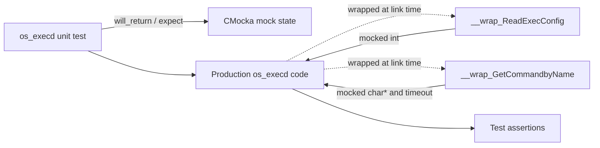
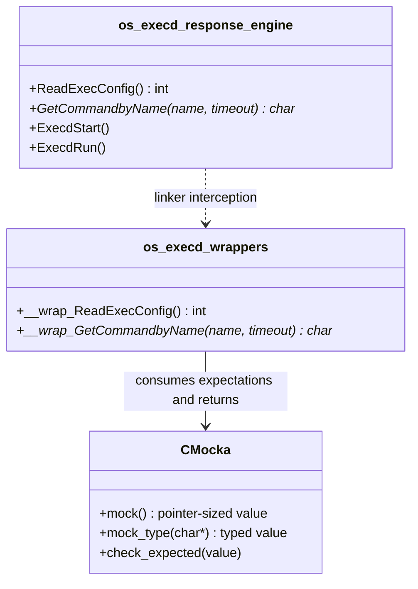
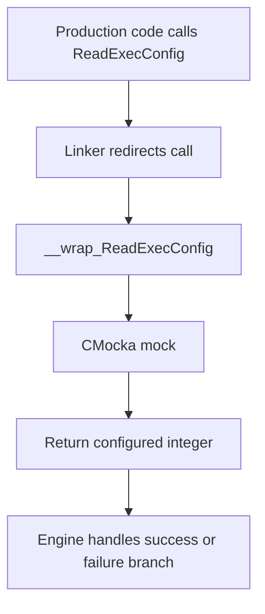
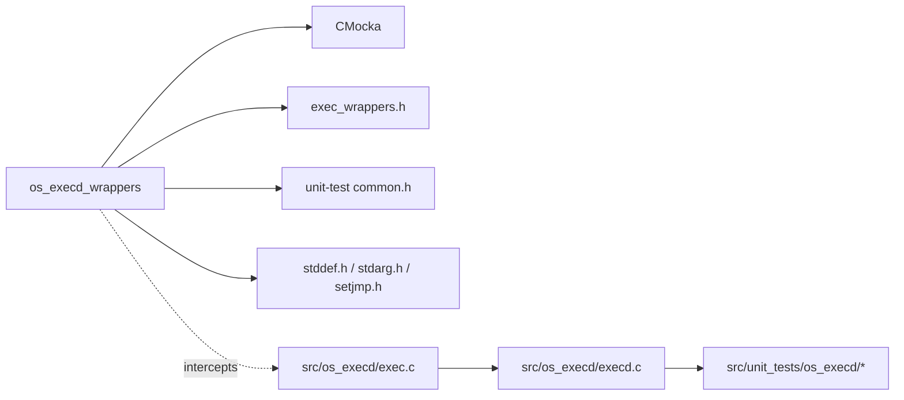

# os_execd_wrappers

## Introduction

`os_execd_wrappers` is a small CMocka-based test-double module for the native Wazuh `os_execd` response engine. It replaces configuration loading and Active Response command lookup with deterministic mock behavior, allowing unit tests to exercise execution and error paths without reading the real `ar.conf` configuration or resolving files on disk.

The wrapper is test infrastructure only; it is not loaded by the running `wazuh-execd` daemon. For the production execution engine, see [os_execd_response_engine](os_execd_response_engine.md). For the tests that consume these seams, see [Unit_Tests_-_OS_Execd](Unit_Tests_-_OS_Execd.md).

## Scope and source layout

The module is represented by:

| Source | Wrapper | Purpose |
| --- | --- | --- |
| `src/unit_tests/wrappers/wazuh/os_execd/exec_wrappers.c` | `__wrap_ReadExecConfig()` | Returns a CMocka-controlled configuration-load result. |
| `src/unit_tests/wrappers/wazuh/os_execd/exec_wrappers.c` | `__wrap_GetCommandbyName(const char *, int *)` | Validates the requested name and returns a mocked command pointer and timeout. |

The module tree identifies `__wrap_ReadExecConfig` as the core component. The same source file also defines `__wrap_GetCommandbyName`; it is included here because it is part of the compiled wrapper surface and is required by command-resolution tests.

## Architecture

The test build uses link-time wrapping: calls made by `execd.c`/`exec.c` to the production symbols are redirected to these `__wrap_*` implementations. CMocka supplies return values and expectations configured by the test.



### Component relationships



## Components

### `__wrap_ReadExecConfig`

```c
int __wrap_ReadExecConfig() {
    return mock();
}
```

This wrapper has no arguments and delegates its result to CMocka's `mock()` facility. A test can therefore model successful configuration loading, a configuration error, or any return value relevant to the caller's branch logic. No configuration file is opened and no global command table is populated by the wrapper.

### `__wrap_GetCommandbyName`

```c
char *__wrap_GetCommandbyName(const char *name, int *timeout) {
    check_expected(name);

    *timeout = mock();

    return mock_type(char *);
}
```

The wrapper models command lookup in three steps:

1. `check_expected(name)` verifies that the production code requested the command name the test intended.
2. `mock()` supplies the timeout through the caller-owned `timeout` pointer.
3. `mock_type(char *)` supplies the resolved command path, or `NULL` to simulate lookup failure.

The function assumes `timeout` is non-null. This is consistent with the production call contract and means tests should use a valid integer destination when invoking the seam.

## Data flow

```mermaid
sequenceDiagram
    participant Test as os_execd test
    participant Mock as CMocka state
    participant Engine as execd/exec code
    participant Wrap as exec_wrappers.c

    Test->>Mock: Queue expected name, timeout, command pointer
    Test->>Engine: Execute command-resolution/configuration path
    Engine->>Wrap: ReadExecConfig() or GetCommandbyName(name, &timeout)
    alt ReadExecConfig
        Wrap->>Mock: mock()
        Mock-->>Wrap: configured int
        Wrap-->>Engine: configuration result
    else GetCommandbyName
        Wrap->>Mock: check_expected(name)
        Mock-->>Wrap: expectation match/failure
        Wrap->>Mock: mock() and mock_type(char*)
        Mock-->>Wrap: timeout and command pointer
        Wrap-->>Engine: write timeout; return command pointer
    end
    Engine-->>Test: execution branch and assertions
```

## Process flows

### Configuration-load path



### Command-resolution path

```mermaid
flowchart TD
    A[Engine calls GetCommandbyName(name, &timeout)] --> B[__wrap_GetCommandbyName]
    B --> C{Does name match expected value?}
    C -->|No| D[CMocka expectation failure]
    C -->|Yes| E[Consume mocked timeout]
    E --> F[Consume mocked char* command]
    F --> G[Write timeout through pointer]
    G --> H[Return command path or NULL]
    H --> I[Engine executes success, missing-command, or error path]
```

## Dependencies and integration



- `cmocka.h` provides `mock`, `mock_type`, and `check_expected`.
- `exec_wrappers.h` declares the wrapper interface used by the test build.
- `../../common.h` supplies shared unit-test support and build conventions.
- The standard headers provide C definitions needed by CMocka and the wrapper compilation unit.
- The production dependency is behavioral rather than a normal runtime dependency: link wrapping substitutes these functions only in test binaries.

## Test coverage and maintenance

The wrappers support the tests documented in [Unit_Tests_-_OS_Execd](Unit_Tests_-_OS_Execd.md), especially command lookup and execution tests in `test_get_command_by_name.c`, `test_execd.c`, and `test_win_execd.c`. The surrounding production responsibilities remain in [os_execd_response_engine](os_execd_response_engine.md): command resolution, timeout handling, repeated-offender behavior, process creation, and platform-specific execution.

When extending this module:

- Keep wrapper signatures identical to the symbols intercepted by the linker, including the existing `GetCommandbyName` capitalization.
- Configure the expected command name before invoking the production path.
- Queue both the timeout and command pointer for `__wrap_GetCommandbyName`.
- Use a valid `int *timeout`; the wrapper deliberately dereferences it.
- Keep filesystem, process, and configuration-parser behavior in production tests or dedicated mocks rather than adding side effects here.

## References

- [os_execd](os_execd.md) — parent daemon and module map.
- [os_execd_response_engine](os_execd_response_engine.md) — production `exec.c`, `execd.c`, and `execd.h` behavior.
- [Unit_Tests_-_OS_Execd](Unit_Tests_-_OS_Execd.md) — OS execd unit-test suites.
