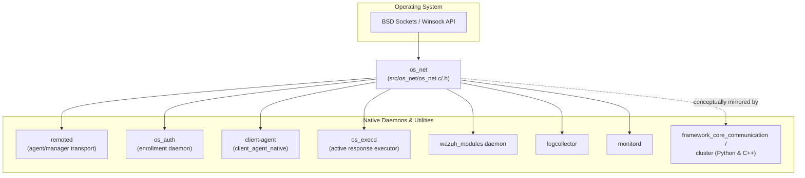
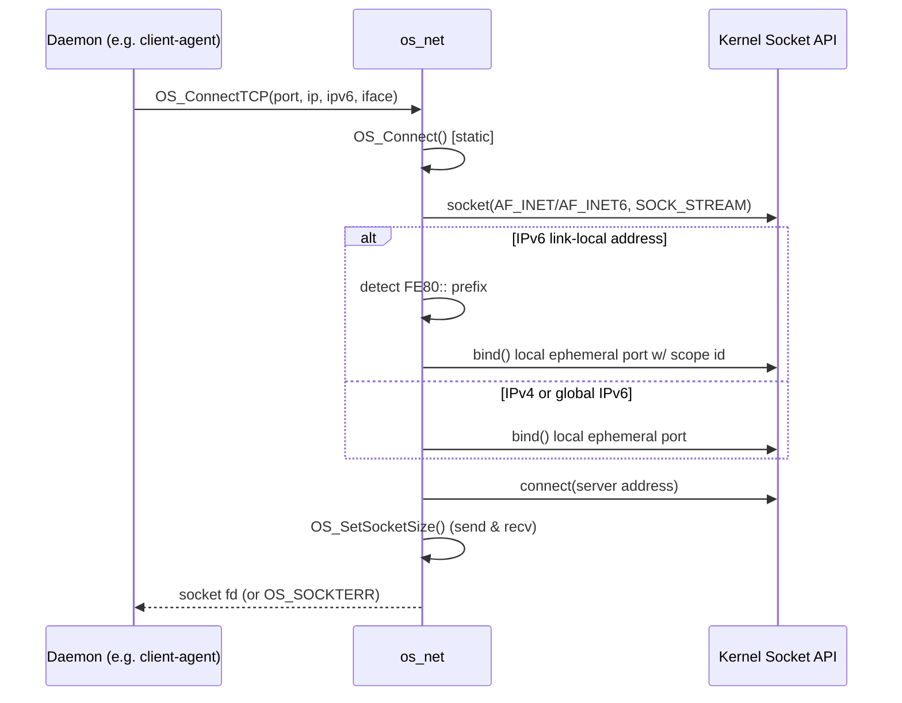
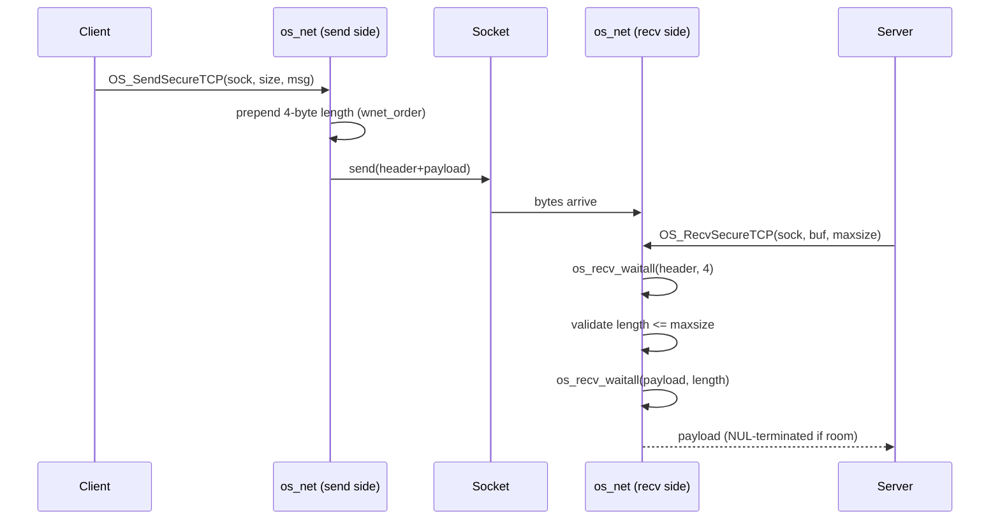

# os_net — Core Networking Library (C)

## 1. Purpose

`os_net` is a small, foundational C library that provides the low-level socket
abstraction used by virtually every native Wazuh daemon and utility
(`remoted`, `os-auth`, `client-agent`, `os_execd`, `wazuh-modulesd`,
`logcollector`, `monitord`, cluster components, etc.). It wraps the raw BSD
sockets API (and its Winsock equivalent on Windows) into a small, consistent
set of functions for:

- Creating/binding server sockets (TCP, UDP, Unix domain).
- Opening client sockets (TCP, UDP, Unix domain) with IPv4/IPv6 support,
  including IPv6 link-local addressing with explicit network-interface
  scoping.
- Sending and receiving data over these sockets, including a length-prefixed
  **"secure" message protocol** used for reliable, framed TCP communication
  between Wazuh components.
- A specialized **cluster message protocol** (`OS_SendSecureTCPCluster` /
  `OS_RecvSecureClusterTCP`) used by the Wazuh cluster subsystem.
- IPv4/IPv6 address conversion utilities (string ⇄ numeric forms).
- Socket tuning helpers: keep-alive, send/receive timeouts, and buffer sizing.
- Hostname resolution helpers used by the agent when connecting to managers
  configured by hostname rather than IP.

The module consists of exactly two files:

| File | Role |
|------|------|
| `src/os_net/os_net.h` | Public API declarations used by all consumers |
| `src/os_net/os_net.c` | Implementation of the socket/network primitives |

Because of its small, self-contained scope, `os_net` is not further split
into sub-modules; this document covers the entire library.

## 2. Position in the System

`os_net` sits at the bottom of the native C stack, directly on top of the
OS socket API and just below the daemon-specific network logic. It has no
dependency on other Wazuh modules (aside from generic shared helpers such as
logging macros and `os_random`), which makes it usable everywhere without
introducing circular dependencies.

> **Note:** The Python-side `framework/wazuh/core/wazuh_socket.py`
> (`WazuhSocketJSON`, `WazuhAsyncSocketJSON`, see `framework_core_communication`)
> and the manager/API stack implement an analogous length-prefixed framing
> protocol at the Python level; `os_net`'s `OS_SendSecureTCP` /
> `OS_RecvSecureTCP` are the C-side counterpart used by native daemons that
> talk to `wazuh-db`, `remoted`, and other native services over Unix/TCP
> sockets.

## 3. Architecture

`os_net` groups its ~30 public functions into six functional areas built on
top of two private helpers (`OS_Bindport`, `OS_Connect`).

```mermaid
graph TB
    subgraph Server_Side["Server-Side Socket Creation"]
        BINDTCP["OS_Bindporttcp()"]
        BINDUDP["OS_Bindportudp()"]
        BINDUNIX["OS_BindUnixDomain()<br/>OS_BindUnixDomainWithPerms()"]
        BINDPORT["OS_Bindport() [static]"]
        BINDTCP --> BINDPORT
        BINDUDP --> BINDPORT
    end

    subgraph Client_Side["Client-Side Socket Creation"]
        CONNTCP["OS_ConnectTCP()"]
        CONNUDP["OS_ConnectUDP()"]
        CONNUNIX["OS_ConnectUnixDomain()"]
        CONNEXT["external_socket_connect()"]
        CONNECT["OS_Connect() [static]<br/>IPv4/IPv6 + link-local scoping"]
        CONNTCP --> CONNECT
        CONNUDP --> CONNECT
        CONNEXT --> CONNUNIX
    end

    subgraph RawIO["Raw Send / Receive"]
        SEND["OS_SendTCP / OS_SendTCPbySize<br/>OS_SendUDPbySize / OS_SendUnix"]
        RECV["OS_RecvTCP / OS_RecvTCPBuffer<br/>OS_RecvUDP / OS_RecvConnUDP / OS_RecvUnix"]
        ACCEPT["OS_AcceptTCP()"]
        WAITALL["os_recv_waitall()"]
        RECV --> WAITALL
    end

    subgraph SecureProto["Secure Framed Protocol"]
        SSEND["OS_SendSecureTCP()"]
        SRECV["OS_RecvSecureTCP()"]
        SRECV --> WAITALL
    end

    subgraph ClusterProto["Cluster Framed Protocol"]
        CSEND["OS_SendSecureTCPCluster()"]
        CRECV["OS_RecvSecureClusterTCP()"]
        CRECV --> WAITALL
    end

    subgraph Utilities["Socket Tuning & Address Utilities"]
        KEEPALIVE["OS_SetKeepalive()<br/>OS_SetKeepalive_Options()"]
        TIMEOUT["OS_SetRecvTimeout()<br/>OS_SetSendTimeout()"]
        SOCKSIZE["OS_SetSocketSize()<br/>OS_getsocketsize()"]
        CLOSE["OS_CloseSocket()"]
        SELECT["wnet_select()"]
        ORDER["wnet_order() / wnet_order_big()"]
        IPCONV["get_ipv4_numeric / get_ipv6_numeric<br/>get_ipv4_string / get_ipv6_string"]
        HOST["OS_GetHost()<br/>resolve_hostname()<br/>get_ip_from_resolved_hostname()"]
    end

    BINDPORT --> IPCONV
    CONNECT --> IPCONV
    ACCEPT --> IPCONV
    HOST --> IPCONV
```

## 4. Core Functional Areas

### 4.1 Server-Side Socket Creation
- **`OS_Bindport()`** *(static helper)* — creates a TCP or UDP socket, binds
  it to a given port/IP (or `INADDR_ANY`/`in6addr_any` when no IP is given),
  enables `SO_REUSEADDR` for TCP, and calls `listen()` for TCP sockets.
- **`OS_Bindporttcp()` / `OS_Bindportudp()`** — thin, protocol-specific
  wrappers around `OS_Bindport()`, used by `remoted` and other daemons that
  expose a network listener.
- **`OS_BindUnixDomain()` / `OS_BindUnixDomainWithPerms()`** — create and
  bind a Unix domain socket (used extensively for local IPC, e.g.
  `wazuh-db`, `execd`, `logcollector`, `monitord` control sockets), setting
  file permissions/ownership and the socket's maximum message size via
  `OS_SetSocketSize()`.

### 4.2 Client-Side Socket Creation
- **`OS_Connect()`** *(static helper)* — creates a TCP/UDP client socket. It
  explicitly binds to an ephemeral local port before connecting (forcing a
  new port), and adds special handling for **IPv6 link-local addresses**
  (`FE80::/10`), where a `network_interface` (scope id) must be supplied to
  disambiguate the destination interface.
- **`OS_ConnectTCP()` / `OS_ConnectUDP()`** — public wrappers used by
  `client-agent` (`agentd`) to connect to the manager, and by many other
  network clients.
- **`OS_ConnectUnixDomain()`** — client-side Unix domain socket connector,
  used for local component-to-component communication (e.g. talking to
  `wazuh-db`).
- **`external_socket_connect()`** — convenience wrapper that opens a Unix
  domain socket and applies both send and receive timeouts in one call
  (`OS_SetSendTimeout`, `OS_SetRecvTimeout`), used where a bounded round-trip
  is required against a local service.

### 4.3 Raw Send / Receive Primitives
Basic, non-framed I/O primitives for each socket family:
- TCP: `OS_SendTCP`, `OS_SendTCPbySize`, `OS_RecvTCP`, `OS_RecvTCPBuffer`,
  `OS_AcceptTCP` (also resolves the peer address to a string via
  `get_ipv4_string`/`get_ipv6_string`).
- UDP: `OS_SendUDPbySize` (retries on `ENOBUFS` up to 5 times with
  incremental back-off), `OS_RecvUDP`, `OS_RecvConnUDP`.
- Unix domain: `OS_SendUnix`, `OS_RecvUnix`.
- **`os_recv_waitall()`** — internal helper implementing a "read exactly N
  bytes" loop over `recv()`, used by every framed-protocol reader to avoid
  partial-read bugs.

### 4.4 Secure Framed TCP Protocol
This is the most widely reused piece of `os_net` across the codebase:
- **`OS_SendSecureTCP(sock, size, msg)`** — prefixes the payload with a
  4-byte little/host-order length header (via `wnet_order`) and sends header
  + payload in a single `send()` call.
- **`OS_RecvSecureTCP(sock, ret, size)`** — reads the 4-byte length header
  with `os_recv_waitall`, validates it against the caller's buffer size, then
  reads the payload, NUL-terminating it if space remains.

This "length-prefixed message" pattern is conceptually mirrored on the
Python side by `WazuhSocketJSON` / `WazuhAsyncSocketJSON`
(see the communication documentation for the framework layer) and is the
backbone of local daemon-to-daemon IPC (e.g. `wazuh-db` request/response,
`execd` command dispatch, `logcollector`/`monitord`/`syscheck` control
sockets).

### 4.5 Cluster Framed Protocol
A second, richer framing format used specifically by the Wazuh cluster
subsystem:
- **`OS_SendSecureTCPCluster()`** — builds a message of the form
  `[counter:4][length:4][command:12][payload]` using big-endian ordering
  (`wnet_order_big`), where `command` is a fixed 12-byte, space/dash-padded
  field.
- **`OS_RecvSecureClusterTCP()`** — reads the fixed 20-byte header, extracts
  the payload length, detects the special `"err ---------"` command to
  signal an application-level error (return code `-2`), and reads the
  payload.

This protocol underlies the higher-level cluster communication primitives
found in `framework/wazuh/core/cluster/common.py`
(`Handler`, `SyncWazuhdb`, `WazuhCommon`) — see the cluster module
documentation for how these frames are consumed at the Python asyncio layer.

### 4.6 Socket Tuning & Address Utilities
- **Keep-alive:** `OS_SetKeepalive()` enables `SO_KEEPALIVE`;
  `OS_SetKeepalive_Options()` tunes idle time, probe interval, and probe
  count in a platform-portable way (Solaris, Linux/BSD, Windows variants
  handled via `#ifdef`).
- **Timeouts:** `OS_SetRecvTimeout()` / `OS_SetSendTimeout()` set
  `SO_RCVTIMEO` / `SO_SNDTIMEO`.
- **Buffer sizing:** `OS_SetSocketSize()` raises `SO_RCVBUF`/`SO_SNDBUF` to
  at least a requested size; `OS_getsocketsize()` reads the current send
  buffer size.
- **Socket lifecycle:** `OS_CloseSocket()` performs a `shutdown()` +
  `close()`/`closesocket()` pair.
- **Multiplexing:** `wnet_select()` wraps `select()` with a simple timeout.
- **Byte order:** `wnet_order()` / `wnet_order_big()` implement portable
  host↔network byte-swapping for the two framed protocols above.
- **IP address conversion:** `get_ipv4_numeric`, `get_ipv6_numeric`,
  `get_ipv4_string`, `get_ipv6_string` wrap `inet_pton`/`inet_ntop` (with a
  Windows Vista+ dynamic-loading fallback), plus IPv4-mapped-IPv6 and
  IPv6-expansion post-processing on the string path.
- **Hostname resolution:** `OS_GetHost()` performs a `getaddrinfo()`-based
  lookup with a retry loop; `resolve_hostname()` mutates a `"hostname"`
  string in place into `"hostname/x.x.x.x"`; `get_ip_from_resolved_hostname()`
  extracts the IP portion back out. These are used by the agent's manager
  configuration ("server" list) resolution logic.

## 5. Key Data / Control Flows

### 5.1 Client connecting to a manager (TCP, with optional IPv6 link-local)

### 5.2 Secure framed message exchange (used for local IPC, e.g. wazuh-db)

## 6. Usage Across the Codebase

`os_net` is a dependency-free building block consumed by many other
documented modules rather than depending on them:

- **Native daemons** (`remoted`, `os_auth`, `client_agent_native`,
  `os_execd`, `monitord`, `logcollector`, `wazuh_modules_core`,
  `syscheckd_core`, `wazuh_db`) use it for all their socket I/O — both
  external (agent↔manager, TCP/UDP) and internal (Unix domain control
  sockets).
- **`shared_lib`** (`src/shared/*`) and **`headers`** define higher-level
  structures (e.g. `sockaddr_storage`-based buffers in
  `remoted/netbuffer.c`, `remoted/state.h`) that are populated using
  `os_net` primitives.
- **Cluster subsystem** (`cluster_common_protocol`, `cluster_local_client`,
  `cluster_local_server`) relies conceptually on the same length-prefixed
  design as `OS_SendSecureTCP`/`OS_RecvSecureTCP`, implemented at the Python
  layer for the manager cluster, while native cluster helpers
  (`src/shared/cluster_utils.c`) call into `os_net`-managed sockets for
  status checks.
- **Unit tests** for this module live in `Unit_Tests_-_Networking_Regex_XML_Zlib`
  (`src/unit_tests/os_net/test_os_net.c`), covering binding, connecting,
  sending/receiving over TCP/UDP/Unix sockets, IPv4/IPv6 conversion, and the
  secure/cluster framed protocols. Corresponding wrapper mocks are provided
  in `Unit_Test_Wrappers_&_Mocks` (`os_net_wrappers.c`).

## 7. Related Modules

- **`shared_lib`** — general-purpose shared C utilities (string, file,
  hashing) that often sit alongside `os_net` in the same daemons.
- **`remoted`** — the primary consumer of `os_net`'s server/client socket
  and secure-message APIs for agent↔manager communication.
- **`os_auth`** — uses `os_net` (TCP/SSL-wrapped sockets) for the enrollment
  protocol.
- **`client_agent_native`** — the agent daemon's networking layer, built
  directly on `OS_ConnectTCP`/`OS_ConnectUDP`.
- **`wazuh_db`** — uses Unix domain sockets and the secure framed protocol
  for local database queries from other daemons.
- **`framework_core_communication`** — the Python-side analogue
  (`wazuh_socket.py`, `wdb.py`) implementing equivalent framing semantics for
  the API/framework layer.
- **`cluster_common_protocol`** — Python cluster handler implementing a
  peer protocol conceptually aligned with the C cluster framing in this
  module.
