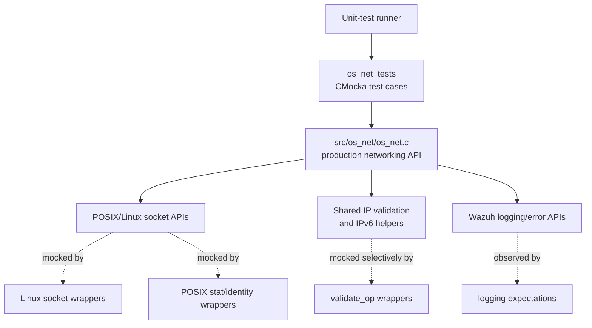
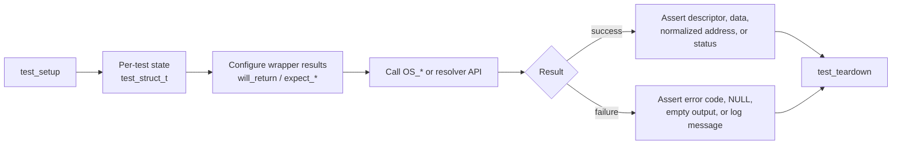
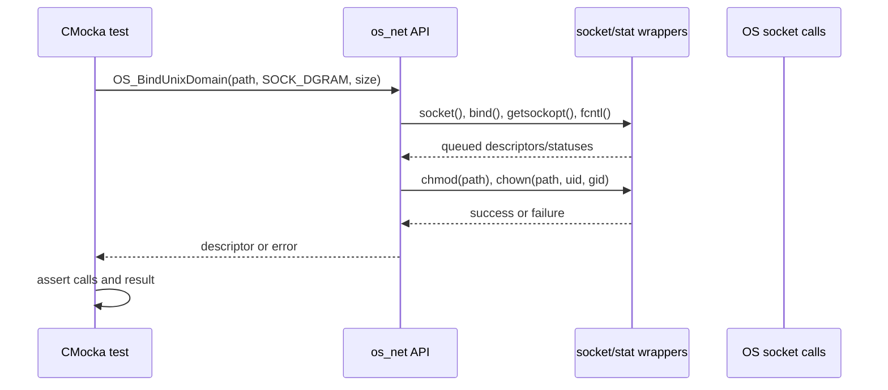

# `os_net_tests`

`os_net_tests` is the CMocka unit-test suite for Wazuh's low-level C networking implementation. It validates socket creation, connection, binding, transport I/O, Unix-domain sockets, hostname resolution, secure framing, cluster-message validation, and IPv4/IPv6 conversion without requiring live network peers.

The tests exercise the production code in [`os_net.md`](os_net.md), while replacing operating-system and shared-library boundaries with deterministic wrappers. They are part of the broader networking, regex, XML, and compression unit-test collection.

## Position in the system

The suite is located at `src/unit_tests/os_net/test_os_net.c` and targets `src/os_net/os_net.c` through `src/os_net/os_net.h`. It is a test consumer of the shared networking and validation layers; it is not a runtime networking component.



Related production and infrastructure documentation:

- [`os_net.md`](os_net.md) — implementation-level API and networking responsibilities.
- [`shared_lib_networking.md`](shared_lib_networking.md) — shared networking helpers used by Wazuh components.
- [`socket_networking.md`](socket_networking.md) — common socket abstractions and related components.
- [`test_infrastructure.md`](test_infrastructure.md) — common unit-test setup and wrapper conventions.
- [`os_regex.md`](os_regex.md) and [`os_xml.md`](os_xml.md) — related production utility documentation in the same test collection.

## Test architecture

The file uses a shared `test_struct_t` state object for tests that need allocated addresses, socket paths, buffers, or return strings. `test_setup` allocates the state and a minimal `addrinfo`/address object, sets a one-second timeout, initializes a temporary Unix socket path, and enables `test_mode`. `test_teardown` unlinks the path and frees all owned allocations.



The suite uses CMocka's return-value queue to control calls such as `socket`, `bind`, `connect`, `send`, `recv`, `getsockopt`, `getaddrinfo`, and `fcntl`. It also uses expected arguments and messages to verify that production code selects the correct address, timeout, ownership, and diagnostic behavior.

## Covered API areas

### TCP sockets

The TCP group covers:

- `OS_Bindporttcp`: IPv4, IPv6, and a `NULL` address input.
- `OS_ConnectTCP`: IPv4, IPv6, and IPv6 link-local addresses with and without an interface index.
- `OS_AcceptTCP`: successful peer acceptance and invalid descriptor handling; the accepted address is checked as `0.0.0.0` for the mocked IPv4 case.
- `OS_SendTCP`, `OS_SendTCPbySize`, and `OS_SendSecureTCP`: normal writes and send failures mapped to `OS_SOCKTERR`.
- `OS_RecvTCPBuffer`, `OS_RecvTCP`, and `OS_RecvSecureTCP`: buffer-based, allocated-string, and framed/multi-read reception, including invalid reads.

The link-local cases additionally verify the informational message `No network interface provided to use with link-local IPv6 address.` when no interface is supplied.

### UDP sockets

The UDP group verifies IPv4 and IPv6 bind/connect paths, link-local interface handling, sized sends, connected receives, allocated receives, and invalid socket behavior. The expected return conventions distinguish a zero-length receive from a failed receive and preserve `OS_SOCKTERR` for send failures.

### Unix-domain sockets

The Unix-domain tests cover datagram binding, connection, sending, and receiving. Binding also verifies the security-related side effects: the socket is made accessible through `chmod`, ownership is set through `chown`, and the configured UID/GID values are passed correctly. `OS_getsocketsize` is tested through the socket-option wrapper.



### Hostname resolution

`OS_GetHost` is tested for a `NULL` hostname, successful IPv4 resolution, and repeated resolution failure. The failure case verifies three retries with a one-second sleep between attempts. `resolve_hostname` handles already-valid IP strings without DNS, appends a resolved address to a hostname (`localhost/8.8.8.8`), and leaves an unresolved hostname with a trailing slash. `get_ip_from_resolved_hostname` extracts the suffix or returns an empty string when no suffix exists.

```mermaid
flowchart TD
    R[resolve_hostname(input)] --> V{OS_IsValidIP?}
    V -->|yes| K[Keep input unchanged]
    V -->|no| G[getaddrinfo]
    G -->|success| P[Extract numeric address]
    P --> O[Store input/address form]
    G -->|failure| Q{Retries remain?}
    Q -->|yes| Z[Sleep one second] --> G
    Q -->|no| E[Store input/ with no address]
```

### Secure TCP and cluster framing

The secure transport tests check normal secure send/receive behavior and cluster-specific framing rules. `OS_SendSecureTCPCluster` rejects a missing command, commands longer than the permitted command field, and payloads above the maximum allowed size. The tests explicitly assert the corresponding error messages and return values. Receive tests cover socket errors, disconnect/timeout (`0`), invalid headers (`-1`), and command-processing errors (`-2`).

The test source documents the effective limits used by these cases: a maximum payload of `1,000,000` bytes and a maximum command length of `12` bytes for the command-size failure scenario.

### Address conversion

The conversion tests validate both directions for IPv4 and IPv6:

- `get_ipv4_string` and `get_ipv6_string` reject undersized output buffers and return canonical textual output on success.
- `get_ipv4_numeric` and `get_ipv6_numeric` reject malformed input without corrupting the destination structure.
- IPv6 compressed notation (`fd17:625c:f037::45ea:97eb`) is compared with its expanded equivalent to ensure both produce identical numeric bytes.
- IPv6 string conversion checks integration with `OS_GetIPv4FromIPv6` and `OS_ExpandIPv6`.

## Dependency and mocking map

| Dependency boundary | Test mechanism | Purpose |
| --- | --- | --- |
| Linux socket syscalls | `src/unit_tests/wrappers/linux/socket_wrappers.*` | Deterministic descriptors, return codes, buffers, and address families |
| File ownership and metadata | `src/unit_tests/wrappers/posix/stat_wrappers.*` | Validate Unix-socket `chmod`/`chown` behavior without filesystem side effects |
| IP validation and normalization | `src/unit_tests/wrappers/wazuh/shared/validate_op_wrappers.*` | Control valid-IP checks, IPv6 expansion, and IPv4 extraction |
| Logging | shared logging wrappers | Verify link-local warnings and cluster validation errors |
| Process identity | local `__wrap_getuid` and `__wrap_getgid` | Supply deterministic socket ownership values |
| CMocka runtime | `cmocka.h`, `cmocka_run_group_tests` | Setup/teardown, expectations, assertions, and test execution |

The wrappers isolate the suite from network availability, DNS state, privileges, kernel socket behavior, and timing. Consequently, successful tests establish API control-flow and error-contract behavior rather than proving end-to-end connectivity.

## Test execution model

`main` builds a `CMUnitTest` array and runs it with `cmocka_run_group_tests`. Most tests use `cmocka_unit_test_setup_teardown`, while pure conversion or null-input tests can run without the shared fixture. Wrapper return values must be queued in the same order as production calls; this is important for multi-stage operations such as connect, secure receive, DNS retries, and Unix-domain binding.

A typical test follows this pattern:

1. Obtain the fixture state from `state`.
2. Queue mocked system-call results with `will_return` or `will_return_always`.
3. Set argument and logging expectations with `expect_*` where behavior matters.
4. Invoke the public networking function.
5. Assert the result, output buffer/string, or error log.
6. Let CMocka run teardown to release state and remove the temporary path.

## Behavioral guarantees and boundaries

The suite provides regression coverage for protocol-independent socket utilities used by Wazuh agents, daemons, cluster services, and local IPC. It particularly protects cross-platform address handling, bounded message transmission, retry semantics, and defensive validation of malformed inputs.

It does not replace integration tests for real TCP/UDP peers, TLS cryptographic negotiation, cluster compatibility across versions, DNS infrastructure, or platform-specific kernel behavior. Those concerns belong to higher-level component tests and system/integration environments.

## Source inventory

| File | Role |
| --- | --- |
| `src/unit_tests/os_net/test_os_net.c` | CMocka test cases, fixture, test registration, and local identity mocks |
| `src/os_net/os_net.h` | Public declarations under test |
| `src/os_net/os_net.c` | Production implementation under test |
| `src/unit_tests/wrappers/linux/socket_wrappers.c` | Mocked Linux socket operations |
| `src/unit_tests/wrappers/posix/stat_wrappers.c` | Mocked filesystem and ownership operations |
| `src/unit_tests/wrappers/wazuh/shared/validate_op_wrappers.c` | Mocked shared IP-validation operations |
