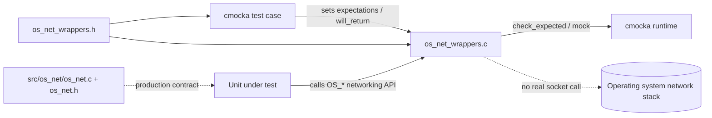
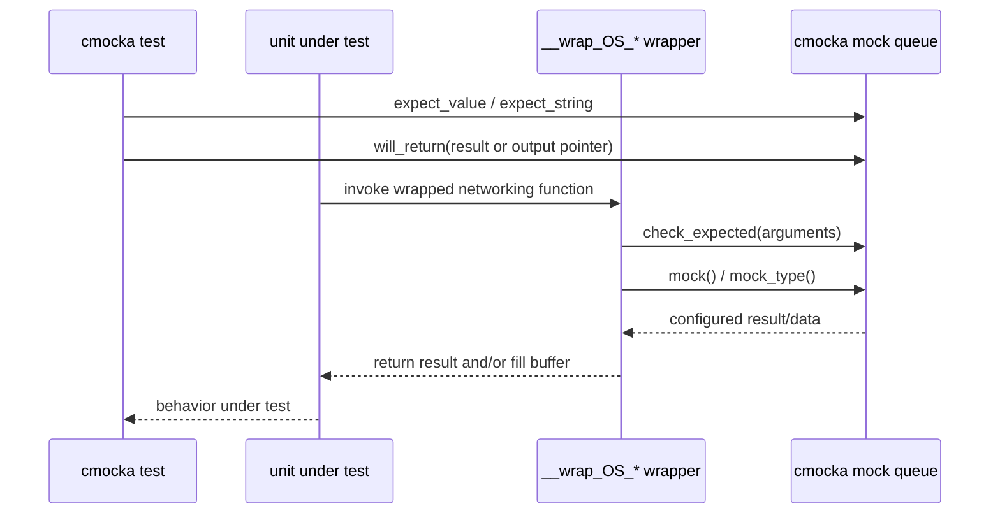
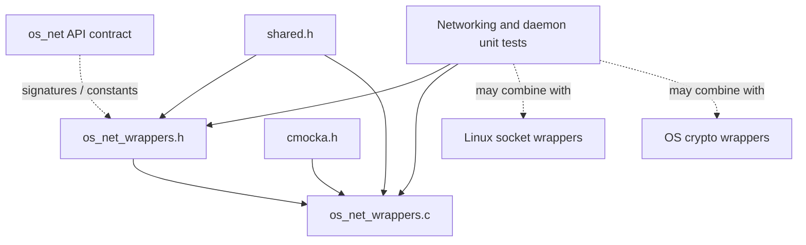
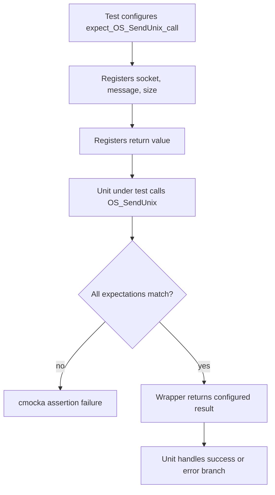
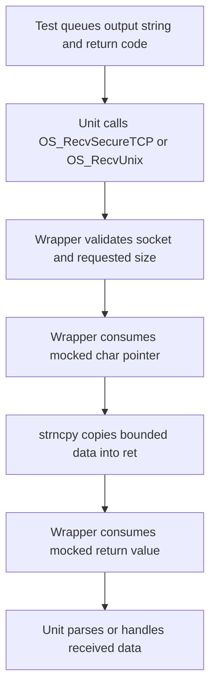
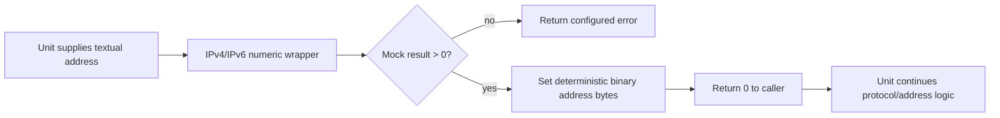

# `os_net_wrappers`

`os_net_wrappers` is the unit-test adapter for Wazuh's low-level networking API. It replaces socket, address-conversion, timeout, and secure-transport functions with cmocka-compatible wrappers. Tests can therefore assert arguments, inject return codes, and provide deterministic receive/address data without opening real sockets or depending on the host network.

The module is test infrastructure, not a production networking implementation. Production behavior belongs to `src/os_net/os_net.c` and `src/os_net/os_net.h`; this module only intercepts those calls when a test executable links the corresponding `--wrap` symbols. See [os_net.md](os_net.md) for the production networking layer and [test infrastructure documentation](Unit_Tests_-_Networking_Regex_XML_Zlib.md) for the broader test suite.

## Scope and position in the system

The wrapper sits between code under test and the operating-system networking primitives. It is used by networking unit tests and by tests of higher-level daemons that depend on shared networking helpers, such as remoted, authentication, cluster, and agent communication.



The wrapper is commonly linked with a test target rather than imported as a runtime library. The `__wrap_` naming convention is intended for linker wrapping: a call to `OS_ConnectTCP`, for example, is redirected to `__wrap_OS_ConnectTCP` in the test binary.

## Files and public test seam

| File | Responsibility |
| --- | --- |
| `src/unit_tests/wrappers/wazuh/os_net/os_net_wrappers.c` | Implements mocked functions and the `expect_OS_SendUnix_call` expectation helper. |
| `src/unit_tests/wrappers/wazuh/os_net/os_net_wrappers.h` | Declares wrapper entry points and supplies platform-compatible networking types/includes. |
| `src/os_net/os_net.c` / `src/os_net/os_net.h` | Production implementation and API contract; referenced rather than duplicated here. |
| `src/unit_tests/os_net/test_os_net.c` | Direct networking tests that exercise the production layer using external libc/socket mocks and test setup. |
| `src/unit_tests/wrappers/linux/socket_wrappers.c` | Lower-level Linux syscall wrappers used when tests need to mock `socket`, `connect`, `send`, `recv`, and related calls. |

The header includes `shared.h`, `stdint.h`, `string.h`, and `sys/types.h`. On Windows it defines `u_int16_t` as `uint16_t`, allowing the same wrapper declarations to compile across supported platforms. `struct in_addr` and `struct in6_addr` are used as the IPv4/IPv6 conversion boundary.

## Wrapper groups

### Unix-domain socket lifecycle

These wrappers model creation, connection, transmission, reception, and closure of local IPC sockets:

- `__wrap_OS_BindUnixDomain(path, type, max_msg_size)`
- `__wrap_OS_BindUnixDomainWithPerms(path, type, max_msg_size, uid, gid, perm)`
- `__wrap_OS_ConnectUnixDomain(path, type, max_msg_size)`
- `__wrap_OS_SendUnix(socket, msg, size)`
- `__wrap_OS_RecvUnix(socket, sizet, ret)`
- `__wrap_OS_CloseSocket(sock)`

The bind/connect wrappers validate all scalar and string arguments and return a cmocka-configured value. The send wrapper does the same. The receive wrapper additionally copies a mocked string into the caller's buffer with `strncpy`, making the test observable as if data had arrived from the Unix socket.

`expect_OS_SendUnix_call` is a convenience function that configures the expected socket, message, size, and return value in one call:

```c
expect_OS_SendUnix_call(socket_fd, "request", request_size, OS_SUCCESS);
```

It uses `expect_string` for the message and `expect_value` for numeric arguments.

### TCP, UDP, and secure transport

- `__wrap_OS_ConnectTCP(port, ip, ipv6)` checks every connection parameter and returns `mock_type(int)`.
- `__wrap_OS_ConnectUDP(port, ip, ipv6)` returns `mock()`; its parameters are intentionally unused by this implementation.
- `__wrap_OS_SendUDPbySize(sock, size, msg)` validates the datagram arguments.
- `__wrap_OS_SendSecureTCP(sock, size, msg)` validates a secure TCP payload.
- `__wrap_OS_RecvSecureTCP(sock, ret, size)` validates socket and size, then copies mocked data into `ret`.
- `__wrap_OS_SendSecureTCPCluster(sock, command, payload, length)` validates command, payload, and byte length.
- `__wrap_OS_RecvSecureClusterTCP(sock, ret, length)` validates socket and length, then copies mocked data into `ret`.

Secure wrappers do not perform cryptography. They isolate callers from the transport boundary; encryption, framing, and protocol semantics remain the responsibility of the production networking and crypto layers.

### Timeouts and readiness

- `__wrap_OS_SetRecvTimeout(socket, seconds, useconds)`
- `__wrap_OS_SetSendTimeout(socket, seconds)`
- `__wrap_wnet_select(sock, timeout)`

These wrappers return values supplied by the test. They allow tests to cover timeout, readiness, retry, and failure branches without waiting on real descriptors.

### Host and address conversion

- `__wrap_OS_GetHost(host, attempts)` checks the host string and returns a mocked pointer.
- `__wrap_get_ipv4_numeric(address, addr)` and `__wrap_get_ipv6_numeric(address, addr6)` model textual-to-binary conversion.
- `__wrap_get_ipv4_string(addr, address, address_size)` and `__wrap_get_ipv6_string(addr6, address, address_size)` model binary-to-text conversion.
- `__wrap_wnet_order(value)` provides a mocked byte-order result.
- `__wrap_external_socket_connect(socket_path, response_timeout)` models an external/local socket connection helper.

For numeric conversion, a positive mocked result is normalized to success (`0`) and the destination address is populated with deterministic mock bytes. IPv4 uses one mocked value for `s_addr`; IPv6 fills all 16 address bytes with one mocked value. String conversion either checks the expected destination buffer on `OS_INVALID` or copies a mocked string into it, then always validates `address_size`.

## Common mocking protocol

Most wrappers follow the same three-stage pattern:

1. `check_expected(...)` verifies arguments registered by the test.
2. `mock()` or `mock_type(int)` obtains the configured result.
3. Receive/conversion wrappers optionally write mocked output into caller-owned storage.



For receive functions, the mock queue normally supplies an output `char *` before the return code is consumed. The wrapper copies at most the requested size. Tests should provide appropriately sized buffers and account for the wrapper's bounded copy semantics.

## Dependency relationships



The wrapper directly depends on cmocka and shared Wazuh declarations. It does not depend on the production implementation at runtime; the production API supplies the signatures and constants that the test seam must mirror. A test may compose this module with lower-level socket wrappers when it is testing behavior below the `OS_*` abstraction, or with crypto wrappers when it is testing secure message handling.

## Representative process flows

### Mocking a send operation



### Mocking a receive operation



### Mocking address conversion



## Testing guidance and maintenance notes

- Register every argument that the wrapper checks. Missing cmocka expectations cause the test to fail before the production branch is evaluated.
- Queue mock values in the order consumed by the wrapper. Receive wrappers consume output data before their return value; numeric conversion wrappers consume the result and then destination bytes.
- Use `expect_string` for NUL-terminated message/path data and `expect_value` for descriptors, sizes, ports, flags, and pointers where exact identity is intended.
- Keep declarations synchronized with the production API. Signature drift can cause linker failures or, worse, incorrect test behavior.
- Treat buffer-writing behavior as part of the test contract: the wrappers use `strncpy` and do not explicitly append a terminator.
- Do not infer production socket behavior from a wrapper's simplified return path. The wrappers intentionally omit OS calls, retries, TLS, framing, and resource ownership.

The surrounding tests cover IPv4/IPv6, TCP/UDP, Unix sockets, secure transport, timeout handling, hostname resolution, and conversion failures. For those behavioral tests, consult [Unit_Tests_-_Networking_Regex_XML_Zlib.md](Unit_Tests_-_Networking_Regex_XML_Zlib.md) and the production networking documentation rather than duplicating implementation details here.

## API inventory

| Area | Wrapped entry points |
| --- | --- |
| Unix sockets | `__wrap_OS_BindUnixDomain`, `__wrap_OS_BindUnixDomainWithPerms`, `__wrap_OS_ConnectUnixDomain`, `__wrap_OS_SendUnix`, `__wrap_OS_RecvUnix`, `__wrap_OS_CloseSocket` |
| Internet transport | `__wrap_OS_ConnectTCP`, `__wrap_OS_ConnectUDP`, `__wrap_OS_SendUDPbySize`, `__wrap_OS_SendSecureTCP`, `__wrap_OS_RecvSecureTCP` |
| Cluster transport | `__wrap_OS_SendSecureTCPCluster`, `__wrap_OS_RecvSecureClusterTCP` |
| Timing/readiness | `__wrap_OS_SetRecvTimeout`, `__wrap_OS_SetSendTimeout`, `__wrap_wnet_select` |
| Host/address utilities | `__wrap_OS_GetHost`, `__wrap_get_ipv4_numeric`, `__wrap_get_ipv6_numeric`, `__wrap_get_ipv4_string`, `__wrap_get_ipv6_string`, `__wrap_wnet_order`, `__wrap_external_socket_connect` |
| Test helper | `expect_OS_SendUnix_call` |

