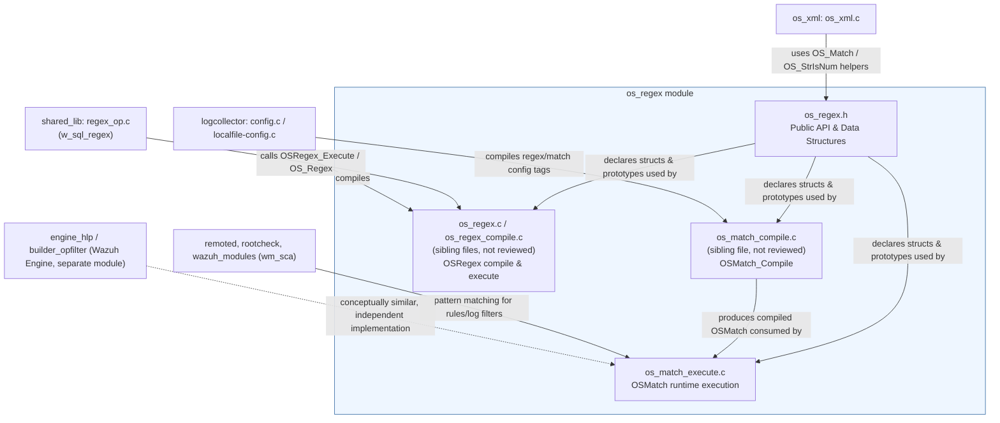
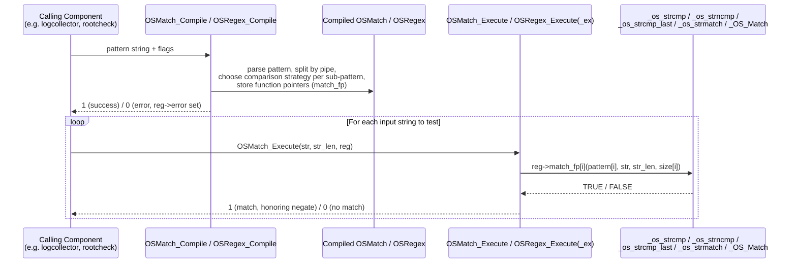
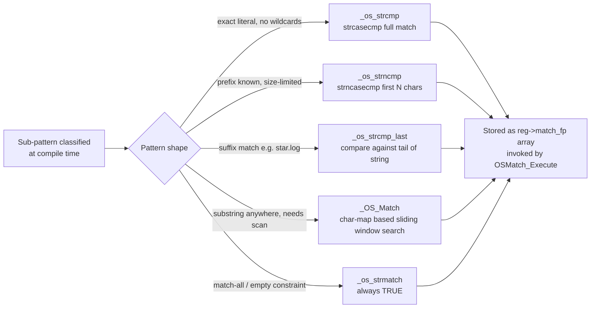

# OS_Regex Module

## 1. Purpose and Overview

`os_regex` is a lightweight, self-contained **pattern-matching engine** written in C that is part of the Wazuh agent/manager native codebase (`src/os_regex/`). It provides two complementary matching abstractions that are used pervasively throughout the rest of the C codebase (log collection, remote communication, rootcheck, syscheck, SCA, active response scripts, etc.) wherever a string needs to be tested against a pattern without pulling in a full-featured regular-expression library such as PCRE2:

- **`OSMatch`** – a fast, non-backtracking "string contains/starts-with/ends-with/exact" matcher that supports OR-combined literal sub-patterns (using the `|` separator) and simple wildcard-free string comparisons. It is optimized for the common case of matching literal substrings and is the workhorse for most simple filtering rules in Wazuh configuration (`<match>` tags, log format checks, etc.).
- **`OSRegex`** – a small, purpose-built regular-expression engine (declared in `os_regex.h`, implemented in sibling files of the same directory such as `os_regex.c` and `os_regex_compile.c`, which are not part of the reviewed core components but are exposed through the same public header) that supports a constrained regex syntax with capture groups, used where sub-string extraction is required (`<regex>` tags with `sregex` groups).

Both engines share the same design philosophy: **pre-compile once, execute many times**. A pattern is compiled into an internal representation (`OSMatch`/`OSRegex` struct) and then executed repeatedly against arbitrary input strings via `OSMatch_Execute` / `OSRegex_Execute` (or their thread-safe `_ex` variants), which makes them efficient for use in hot paths like log collection and remote message parsing.

This documentation focuses on the two core components that were provided for review:

| File | Responsibility |
|---|---|
| `src/os_regex/os_regex.h` | Public API and data structures (`OSMatch`, `OSRegex`, `regex_matching`, `regex_dynamic_size`) shared by the whole module. |
| `src/os_regex/os_match_execute.c` | Runtime execution engine for `OSMatch` patterns (`OSMatch_Execute`) and the low-level string-comparison strategies it dispatches to. |

## 2. Architecture Overview

### 2.1 Component Relationship

### 2.2 Data Flow: Compile → Execute

### 2.3 Why Multiple Comparison Strategies?

`os_match_execute.c` does not implement a single generic matcher; instead it implements several **specialized strategies** that `OSMatch_Compile` (not part of the reviewed code, but referenced via the `match_fp` function-pointer array in `OSMatch`) selects at compile time based on the shape of each sub-pattern (does it start with a wildcard? end with one? is it a plain literal?). This avoids paying the cost of a general substring search when a cheaper exact/prefix/suffix comparison suffices.

## 3. Core Components

### 3.1 `os_regex.h` — Public API & Data Structures

This header defines the contract used by every consumer of the module and by the (sibling, non-reviewed) compilation source files:

- **`OSMatch`** (`_OSMatch`): holds the negate flag, the raw original pattern string, an array of split sub-patterns (`patterns`), their sizes (`size`), and an array of function pointers (`match_fp`) — one per sub-pattern — each pointing to one of the comparison strategies implemented in `os_match_execute.c`.
- **`OSRegex`** (`_OSRegex`): holds the raw pattern, per-sub-pattern flags, compiled sub-patterns, capture-group closures (`prts_closure`), and thread-safety primitives (`mutex`, `mutex_initialised`) plus dynamic scratch buffers (`d_sub_strings`, `d_prts_str`, `d_size`) used when captures are requested.
- **`regex_matching`** / **`regex_dynamic_size`**: helper structures that let callers supply *external* buffers for captured sub-strings so that a single compiled `OSRegex` can be executed safely from multiple threads concurrently via `OSRegex_Execute_ex` (as opposed to `OSRegex_Execute`, which uses internal, non-thread-safe buffers embedded in the `OSRegex` struct itself).
- **Compile-time flags**: `OS_RETURN_SUBSTRING` (enable capture-group extraction) and `OS_CASE_SENSITIVE` (disable the default case-insensitive comparison).
- **Error codes**: `OS_REGEX_REG_NULL`, `OS_REGEX_PATTERN_NULL`, `OS_REGEX_MAXSIZE`, `OS_REGEX_OUTOFMEMORY`, `OS_REGEX_STR_NULL`, `OS_REGEX_BADREGEX`, `OS_REGEX_BADPARENTHESIS`, `OS_REGEX_NO_MATCH` — surfaced through `reg->error` after a failed compile/execute call.
- **Convenience API** declared here but implemented elsewhere in the module: `OS_Regex` (one-shot compile+execute wrapper), `OS_Match2`/`OS_WordMatch` (macro-aliased as `OS_Match`), `OS_StrBreak` (pattern-based string splitter), `OS_StrHowClosedMatch`, `OS_StrStartsWith`, `OS_StrIsNum`, and the `hostname_map`/`isValidChar` character classification table.

### 3.2 `os_match_execute.c` — OSMatch Runtime Execution

This file implements the **execution phase** for `OSMatch` patterns (the compile phase lives in a sibling, non-reviewed file `os_match_compile.c`). Its key pieces:

- **`OSMatch_Execute(str, str_len, reg)`** — the public entry point. It defensively checks for a `NULL` `reg` or `str` (setting `reg->error = OS_REGEX_STR_NULL` in the latter case), then iterates over every compiled sub-pattern (`reg->patterns[i]`), invoking the strategy function stored in `reg->match_fp[i]`. As soon as one sub-pattern matches, it returns according to `reg->negate` (i.e., a match is success unless the pattern was declared negated, in which case a match means failure). If no sub-pattern matches, it returns `reg->negate` directly, correctly implementing "match none of these" negated semantics.
- **`_OS_Match(pattern, str, str_len, size)`** — implements substring search using a **precomputed character map** (`charmap`, declared in an internal header) for case-insensitive comparison. It slides a window across `str`, and for every position where the first character matches, it walks forward comparing the rest of the pattern; on mismatch it resets and continues the outer scan (`goto nnext`). This is the fallback strategy for wildcard-anywhere patterns.
- **`_os_strncmp(pattern, str, str_len, size)`** — thin wrapper over `strncasecmp` for prefix comparisons of a fixed length.
- **`_os_strcmp(pattern, str, str_len, size)`** — thin wrapper over `strcasecmp` for whole-string exact comparisons.
- **`_os_strcmp_last(pattern, str, str_len, size)`** — compares the pattern against the **tail** of the string (`str + (str_len - size)`), used for suffix matching (e.g., matching a file extension); it first guards against `size` being larger than `str_len`.
- **`_os_strmatch(...)`** — a no-op strategy that always returns `TRUE`, used for patterns that impose no actual constraint (e.g., an empty wildcard segment).

All five comparison functions share an identical signature `int (*)(const char *pattern, const char *str, size_t str_len, size_t size)`, which is exactly the `match_fp` function-pointer type declared in `OSMatch` — this uniform signature is what allows `OSMatch_Compile` to mix-and-match strategies per sub-pattern transparently, and what allows `OSMatch_Execute` to invoke any of them generically in its loop.

## 4. Usage in the Broader Wazuh System

`os_regex` has no external dependencies beyond the C standard library, which is why it is embedded as a low-level shared utility. It is consumed by many other native-C modules in the system, notably:

- **[Agent_&_Manager_Native_Daemons_(C)](Agent_%26_Manager_Native_Daemons_%28C%29.md)** — the parent module tree of `os_regex`; sibling components such as `shared_lib` (`regex_op.c`, which builds SQL-oriented regex helpers like `w_sql_regex`) and `os_xml` rely on the `OS_Match`/`OS_Regex` family for lightweight text filtering, and `logcollector` compiles user-supplied `<regex>`/`<match>` configuration tags into `OSMatch`/`OSRegex` structures for log filtering and multiline detection.
- **Configuration parsing** (`Configuration_Data_Structures_(C_Headers)`) — structures such as `logreader_config` and rootcheck/SCA configuration hold compiled `OSMatch`/`OSRegex` objects produced by this module to implement `<ignore>`, `<restrict>`, and content-matching rules.
- **`headers/expression.h`** (in the parent native-daemon module) wraps `OSMatch`/`OSRegex` (together with PCRE2) behind a unified `w_expression_t` abstraction used by rule/decoder-style consumers (e.g., `wm_sca`) that need to pick, at runtime, between several regex back-ends.
- Test coverage lives in **[Unit_Tests_-_Networking_Regex_XML_Zlib](Unit_Tests_-_Networking_Regex_XML_Zlib.md)** (`os_regex_test_os_regex`, `os_regex_test_os_regex_execute`, `os_regex_test_os_regex_match`), which exercises both the compile and execute code paths described above, including the character-map-driven `_OS_Match` sliding-window search and the negation/case-sensitivity semantics of `OSMatch_Execute`.
- Mocking support for higher-level unit tests of consuming modules is provided by **[Unit_Test_Wrappers_&_Mocks](Unit_Test_Wrappers_%26_Mocks.md)** via `os_regex_wrappers.c` (`__wrap_OSMatch_Compile`, `__wrap_OSMatch_Execute`, `__wrap_OSRegex_Compile`, `__wrap_OSRegex_FreePattern`, `__wrap_OS_StrIsNum`), which lets other modules' unit tests stub out pattern matching without depending on the real engine.

Note that the **Wazuh Engine** (C++, see `engine_hlp` and `builder_opfilter` inside [Wazuh_Engine_Core_(C++)](Wazuh_Engine_Core_%28C%2B%2B%29.md)) implements an entirely separate, independent regex/parsing stack for the new decoder pipeline; it does not depend on `os_regex`, but conceptually fulfills a similar "compiled pattern matching" role for that subsystem.

## 5. Key Design Notes for Maintainers

- **Thread-safety model**: `OSRegex` embeds a `pthread_mutex_t` and internal scratch buffers so a single compiled pattern *can* be executed via the plain `OSRegex_Execute` from one thread at a time, or safely from multiple threads concurrently only if every call site consistently uses the `_ex` variant (`OSRegex_Execute_ex`) with caller-supplied `regex_matching` buffers. Mixing `_ex` and non-`_ex` calls against the same compiled `OSRegex` is explicitly documented as unsafe in `os_regex.h`. `OSMatch`/`OSMatch_Execute` has no such duality — it is stateless per call and thus inherently safe to invoke concurrently on the same compiled `OSMatch`.
- **Case sensitivity default**: all `os_match_execute.c` strategies use the `*case*` family of libc functions (`strcasecmp`, `strncasecmp`) or the case-folding `charmap`, meaning matches are **case-insensitive by default**; case-sensitive matching is opt-in via the `OS_CASE_SENSITIVE` compile flag.
- **Negation semantics**: `OSMatch_Execute`'s return value is derived from `reg->negate`, so negated patterns (`!pattern`) invert the usual "found → true" logic at the single execute call, rather than requiring every caller to invert the result themselves.
- **Extensibility of strategies**: because every strategy shares a common function pointer signature, adding a new comparison strategy (e.g., a case-sensitive variant) only requires implementing a new function of that signature and wiring it into the compile-time strategy-selection logic — no change is needed in `OSMatch_Execute` itself.
