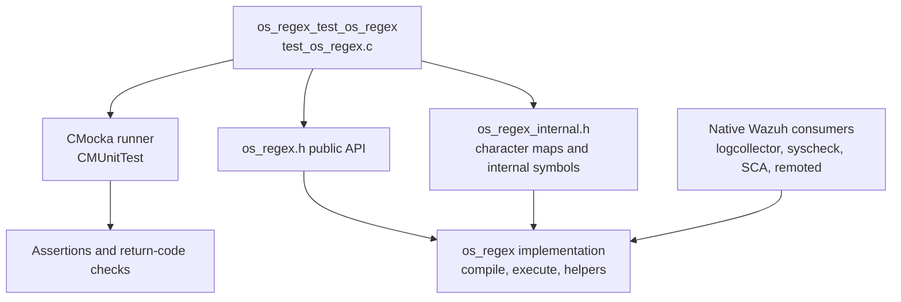
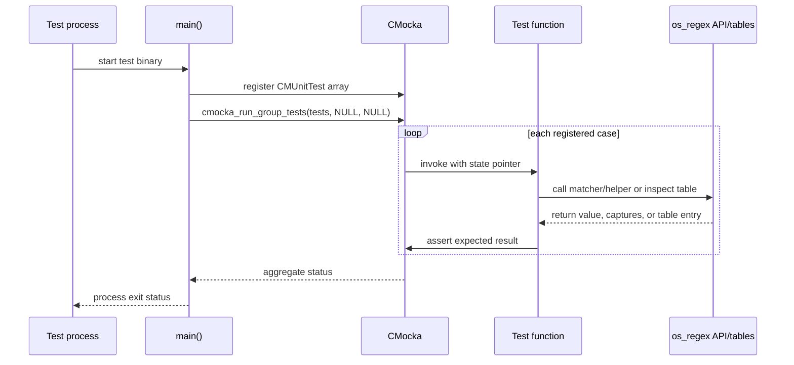
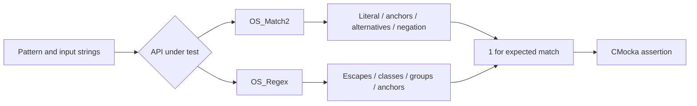
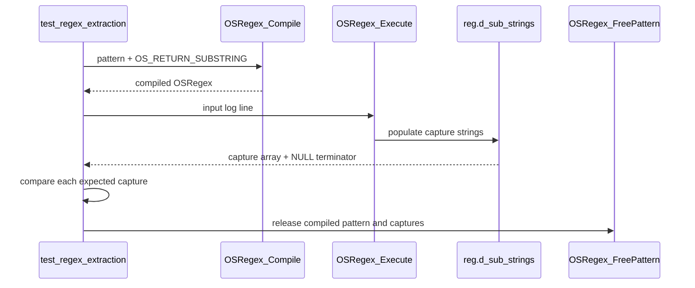
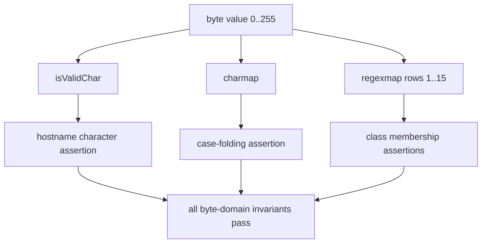
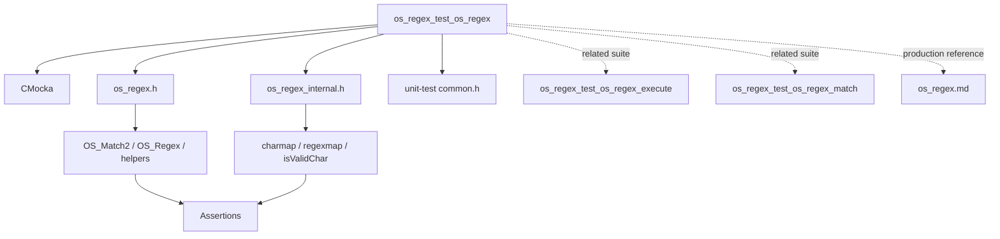

# `os_regex_test_os_regex`

`os_regex_test_os_regex` is the CMocka unit-test suite for the public and helper-level behavior of Wazuh’s native `os_regex` implementation. It validates literal matching, regular-expression matching, word and numeric helpers, prefix and delimiter utilities, capture extraction, and the character tables used by the matcher.

The production architecture, compilation strategy, execution internals, error codes, and system-wide consumers are documented in [`os_regex.md`](os_regex.md). This page describes how this test module verifies that contract.

## Scope and system position

The test source is `src/unit_tests/os_regex/test_os_regex.c`. It is the broad behavioral suite beneath the native networking/regex/XML/zlib unit-test area. The related execution and internal matcher suites should be consulted for lower-level coverage when changing the implementation:

- [`os_regex_test_os_regex_execute.md`](os_regex_test_os_regex_execute.md) — execution-oriented cases and parameter handling.
- [`os_regex_test_os_regex_match.md`](os_regex_test_os_regex_match.md) — internal `_OS_Match` iteration behavior.
- [`Unit_Test_Wrappers_&_Mocks.md`](Unit_Test_Wrappers_%26_Mocks.md) — reusable regex stubs used by higher-level tests, where available.

## Components

| Component | Responsibility |
|---|---|
| `main()` | Registers 33 CMocka tests and invokes `cmocka_run_group_tests`. No group setup or teardown callback is supplied. |
| `CMUnitTest` | CMocka descriptor type used to construct the test table. |
| Success/failure match tests | Verify `OS_Match2` literal matching, anchoring, alternatives, negation, and default case-insensitivity. |
| Success/failure regex tests | Verify `OS_Regex` syntax, anchors, alternatives, escapes, character classes, punctuation, and malformed patterns. |
| Word-match tests | Verify `OS_WordMatch` substring/alternative behavior and negative cases. |
| Numeric tests | Verify that `OS_StrIsNum` accepts unsigned decimal strings and rejects signs, letters, and null input. |
| Closed-match tests | Verify `OS_StrHowClosedMatch`’s common-prefix result and null safety. |
| Prefix tests | Verify `OS_StrStartsWith` and its empty-string behavior. |
| Split tests | Verify `OS_StrBreak` limits, empty fields, absent delimiters, and null input. |
| Extraction test | Compiles `OSRegex` with `OS_RETURN_SUBSTRING`, executes it, and checks captured substrings in `reg.d_sub_strings`. |
| Table tests | Validate `isValidChar`, `charmap`, and `regexmap` entries for every byte value from 0 through 255. |

The source includes the public header, the internal header, CMocka, standard C headers, and the common wrapper header. The common wrapper is included for consistency with the unit-test environment; this file does not configure wrapper expectations or mock external calls.

## Test registration and execution

Each test explicitly ignores its `state` parameter. There is no fixture lifecycle in this module: test data is local, compiled regex objects are freed within the extraction test, and dynamically allocated split results are freed after inspection.

## Behavioral coverage

### Literal matching: `OS_Match2`

`test_success_match` and `test_fail_match` establish the lightweight matcher’s observable semantics. The cases cover substring matching, exact/prefix/suffix constraints, alternatives separated by `|`, default case-insensitive matching, negation using a leading `!`, empty-string matching, and rejection of patterns longer than `OS_PATTERN_MAXSIZE`.

The failure table deliberately includes null pattern/input combinations and incomplete or overlong inputs. The test asserts only that the result is not `1`, preserving the API’s broader failure-result contract while ensuring no false positive is reported.

### Regular expressions: `OS_Regex`

`test_success_regex` and `test_fail_regex` cover the richer regex dialect. Successful cases include `\\s`, `\\S`, `\\w`, `\\W`, `\\d`, `\\D`, `\\p`, escaped punctuation, grouping, alternatives, and anchored expressions. The examples resemble real log lines, including kernel, SSH, Snort, and FTP messages.

Failure cases cover unmatched parentheses, invalid grouping, escaped literal mismatches, malformed alternatives, overlong patterns, and expressions that should not match the supplied text. Patterns are written as C string literals, so regex backslashes are themselves escaped in source.

### String helpers

| Function | Verified behavior |
|---|---|
| `OS_WordMatch` | Finds a word/pattern in text, supports alternatives and a leading anchor, and rejects empty or absent matches. |
| `OS_StrIsNum` | Accepts `"1"` and `"0123"`; rejects alphabetic text, exponent notation, negative numbers, positive signs, and `NULL`. |
| `OS_StrHowClosedMatch` | Returns the number of matching leading characters for the tested pairs; null inputs return `0`. |
| `OS_StrStartsWith` | Returns true when the first argument begins with the second, including equal strings and an empty prefix. |
| `OS_StrBreak` | Splits on a delimiter up to a requested number of breaks, preserves empty segments, returns the original string when no split is requested, and returns `NULL` for null input or zero breaks in the tested contract. |

`OS_StrBreak` returns heap-allocated strings for successful splits. The test checks the null terminator in the result array and releases every returned element and the array itself.

### Capture extraction

`test_regex_extraction` validates the compile/execute path rather than only a boolean match:

1. Compile each expression with `OSRegex_Compile(..., OS_RETURN_SUBSTRING)`.
2. Assert successful compilation.
3. Execute against a representative log string.
4. Read `reg.d_sub_strings`.
5. Compare each capture with the expected substring and verify the array terminator.
6. Call `OSRegex_FreePattern`.

The cases extract whitespace-preserving text, IP addresses including an IPv4-mapped IPv6 form, SSH usernames and source addresses, and FTP-style user/host fields. This makes the test sensitive to both group boundaries and exact capture content.

## Character tables and classification invariants

The final group of tests inspects internal tables directly. Every test loops over the complete unsigned-byte domain, including `0` and `255`, which is important because the tables are indexed by `unsigned char`.

`test_hostname_map` checks that `isValidChar` accepts digits, upper- and lowercase letters, parentheses, hyphen, period, at-sign, slash, and underscore, and rejects all other byte values. `test_case_insensitive_char_map` checks that uppercase ASCII maps to lowercase while every other byte maps to itself.

The `regexmap` tests validate the dialect’s character classes:

| Row | Class checked |
|---:|---|
| `regexmap[1]` | digits |
| `regexmap[2]` | word characters: letters, digits, `-`, `@`, `_` |
| `regexmap[3]` | space |
| `regexmap[4]` | punctuation set used by the dialect |
| `regexmap[5]` / `[6]` | left / right parenthesis |
| `regexmap[7]` | backslash |
| `regexmap[8]` | non-digit |
| `regexmap[9]` | non-word |
| `regexmap[10]` | non-space, where only the literal space is excluded |
| `regexmap[11]` | all byte values |
| `regexmap[12]` | tab |
| `regexmap[13]` | dollar sign |
| `regexmap[14]` | alternation bar |
| `regexmap[15]` | less-than sign |

These tests are particularly useful when changing initialization code, signedness, locale handling, escape parsing, or the meaning of a regex character class. A one-byte table regression can otherwise appear only as an unrelated failure in log parsing or configuration tests.

## Dependencies and boundaries

The suite does not exercise sockets, files, databases, threads, or external regex libraries. It is a direct contract test for the native implementation. Higher-level modules that consume these functions—such as logcollector, syscheck, SCA, and remoted—are documented separately and should not be duplicated here; see [`os_regex.md`](os_regex.md) for the dependency map.

## Maintenance guidance

Update this suite when changing pattern limits, case-folding, anchoring, negation, alternatives, supported escapes/classes, capture allocation or ordering, `OS_StrBreak` ownership, hostname validation, or any `charmap`/`regexmap` row.

When adding a case, place it in the matching behavioral section and register it in `main()`. Prefer table-driven additions for matcher semantics. For internal execution edge cases, add coverage to the dedicated execution/matcher suites instead of expanding this broad contract suite. Keep expected captures and byte classifications explicit: they document the intended dialect as well as testing it.

## Summary

`os_regex_test_os_regex` is the broad, direct unit-test contract for Wazuh’s native regex helpers. It combines realistic log-pattern examples with exhaustive byte-table checks, covering both user-visible matching behavior and the low-level classification data that supports it. The implementation architecture and consumers remain centralized in [`os_regex.md`](os_regex.md), while sibling suites handle specialized execution paths.
