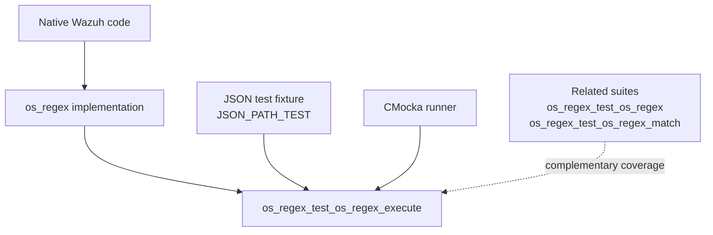
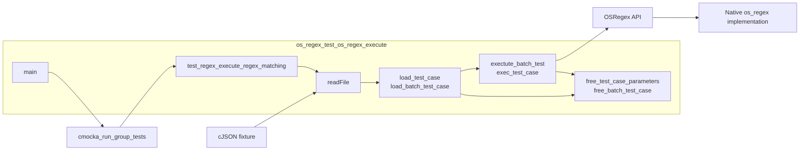
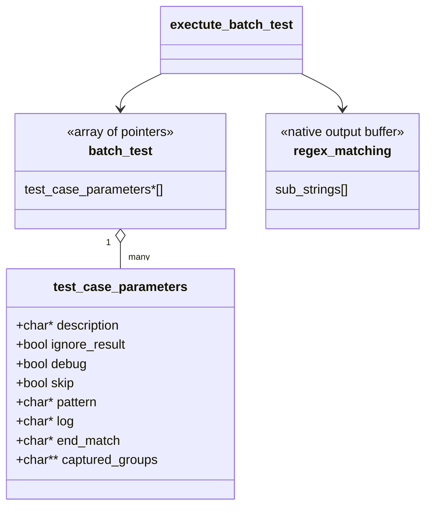
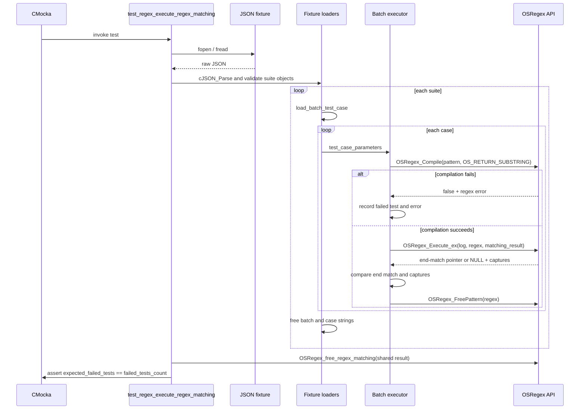
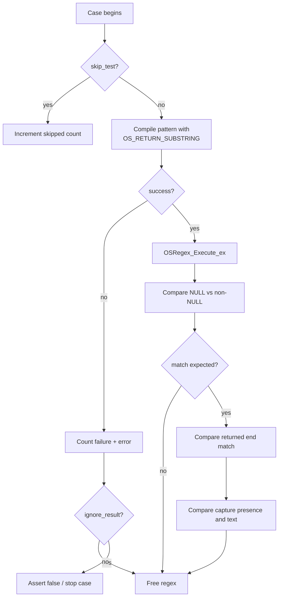
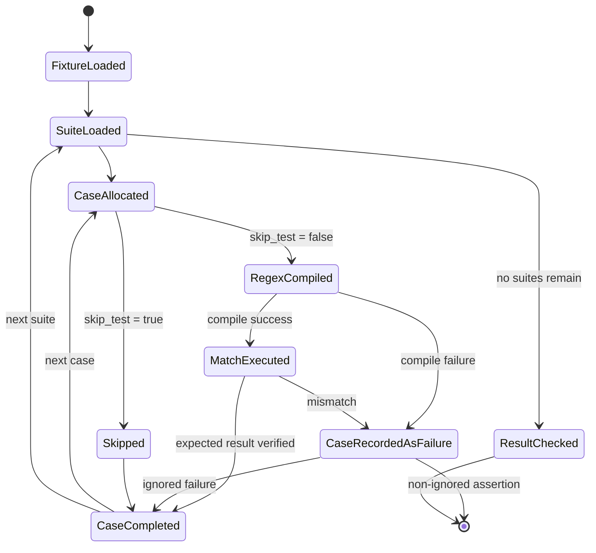
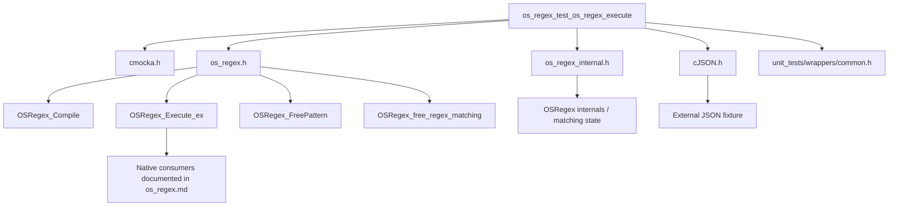

# `os_regex_test_os_regex_execute`

`os_regex_test_os_regex_execute` is a CMocka-driven, data-driven unit-test module for the execution path of Wazuh’s native `OSRegex` engine. It loads suites and cases from a JSON fixture, compiles each pattern with substring extraction enabled, executes it against a log string, and verifies match presence, the returned end-match remainder, and every captured group.

The regex engine’s public API, compiled representations, matching semantics, and production consumers are documented in [`os_regex.md`](os_regex.md). The broader native behavior suite is documented in [`os_regex_test_os_regex.md`](os_regex_test_os_regex.md); this page focuses on execution-result validation and its test-data lifecycle.

## Scope and system position

The implementation under test is `src/os_regex/os_regex.h`, specifically the `OSRegex_Compile`, `OSRegex_Execute_ex`, `OSRegex_FreePattern`, and `OSRegex_free_regex_matching` contract. The test harness is located at `src/unit_tests/os_regex/test_os_regex_execute.c` and runs as the `os_regex_test_os_regex_execute` child of the networking/regex/XML/zlib unit-test collection.

The test is not an API endpoint or runtime service. It is a deterministic verification boundary between JSON-defined expected behavior and the native regex execution implementation.

## Architecture

The module has four logical layers:

| Layer | Components | Responsibility |
|---|---|---|
| Test runner | `main`, `CMUnitTest`, `test_regex_execute_regex_matching` | Registers one CMocka test and returns the aggregated process status. |
| Fixture loader | `readFile`, `load_test_case`, `load_batch_test_case` | Reads the fixture, parses JSON, validates required fields, and creates heap-owned test structures. |
| Execution adapter | `exec_test_case`, `exectute_batch_test` | Converts one JSON case into compile/execute/assert operations and reuses a `regex_matching` object within each batch. |
| Native regex API | `OSRegex_Compile`, `OSRegex_Execute_ex`, `OSRegex_FreePattern`, `OSRegex_free_regex_matching` | Performs pattern compilation, matching, capture extraction, and cleanup. |

## Test-case data model

Each JSON case is represented by `test_case_parameters`:

| Field | Required | Meaning |
|---|---:|---|
| `description` | No | Human-readable label printed for diagnostics. |
| `ignore_result` | No | Allows known failures to be recorded without failing the CMocka assertion. |
| `debug` | No | Forces the full case configuration and mismatch details to be printed. |
| `skip_test` | No | Excludes the case from execution while counting it as skipped. |
| `pattern` | Yes | Native OSRegex pattern passed to `OSRegex_Compile`. |
| `log` | Yes | Input string passed to `OSRegex_Execute_ex`. |
| `end_match` | Yes | String remainder expected from the execution call; JSON `null` means no match is expected. |
| `captured_groups` | Yes | JSON array of expected capture strings. An empty array represents no expected captures. |

At the outer level, the fixture is an array of suite objects. Every suite must contain a string `description` and an array `batch_test`.

`load_test_case` uses case-sensitive cJSON property lookup and assertions as schema validation. `pattern`, `log`, `end_match`, and `captured_groups` must exist; `end_match` may be JSON `null`, while the other mandatory values must have the documented JSON types.

## End-to-end process flow

## Execution and assertions

`exec_test_case` implements the module’s central contract:

1. A skipped case increments `skipped_unit_test_count` and performs no compilation.
2. An executed case increments `executed_unit_test_count`.
3. The pattern is compiled with `OS_RETURN_SUBSTRING`, ensuring capture groups are available.
4. Compilation failure increments both failure and error counters. The case is fatal unless `ignore_result` is enabled.
5. The returned match pointer is compared with the null/non-null expectation expressed by `end_match`.
6. When a match is expected, the returned end-match string is compared byte-for-byte with `strcmp`.
7. Captures are compared positionally against `matching_result->sub_strings` until the expected array terminator is reached. A mismatch in presence or content is an error.
8. The compiled pattern is freed on every normal return path.

The `ignore_result` flag changes assertion behavior, not accounting: ignored failures still increment `failed_tests_count` and `tests_errors_count`. This allows the suite to document known engine defects while still requiring the manually maintained expected-failure total to agree with observed failures.

## Batch and result lifecycle

Each suite batch shares one zero-initialized `regex_matching` structure. This reflects the intended execution API: the output storage is reused across cases, while the compiled `OSRegex` object is case-local. After all cases in a batch, `OSRegex_free_regex_matching` releases the accumulated matching buffers.

The global `result` structure records:

- `executed_tests_suite_count`
- `executed_unit_test_count`
- `skipped_unit_test_count`
- `failed_tests_count`
- `tests_errors_count`
- `expected_failed_tests`

The current source sets `expected_failed_tests` to `211`. The final assertion requires this value to equal the number of observed failed cases. Maintainers must update the expected value when known failures are added or fixed; otherwise a behavior change can be hidden by the `ignore_result` mechanism.

## Dependencies and boundaries

The module directly depends on CMocka, cJSON, the native regex headers, and standard C allocation/file/string facilities. It does not access Wazuh databases, sockets, daemons, or the C++ Wazuh Engine. The common wrapper header is included for the unit-test build environment but no wrapper expectation is configured in this source.

For the broader implementation and consumer graph, use [`os_regex.md`](os_regex.md). For the neighboring direct API and internal matcher tests, use [`os_regex_test_os_regex.md`](os_regex_test_os_regex.md) and the module-tree entries for `os_regex_test_os_regex_match`.

## Maintenance considerations

Changes to the following areas should be reflected here or in the fixture consumed through `JSON_PATH_TEST`:

- `OS_RETURN_SUBSTRING` capture allocation and ordering;
- null versus non-null match signaling;
- the meaning of the returned end-match pointer;
- capture-group termination and reuse of `regex_matching`;
- compile error reporting through `OSRegex.error`;
- known-failure accounting and the `expected_failed_tests` baseline;
- JSON property names, required fields, and fixture shape.

When adding a case, prefer the JSON fixture so the test remains data-driven. Use `debug` for diagnostics and `ignore_result` only for a deliberately tracked known failure. If a change concerns the low-level `_OS_Match` algorithm rather than capture-aware execution, add or update the sibling matcher suite and link back to [`os_regex.md`](os_regex.md) instead of duplicating implementation documentation here.

## Summary

`os_regex_test_os_regex_execute` verifies the complete native regex execution contract from fixture loading through compilation, matching, capture comparison, resource cleanup, and aggregate failure accounting. Its most important invariant is that a successful match must produce both the expected terminal match string and exactly the expected ordered capture groups.
