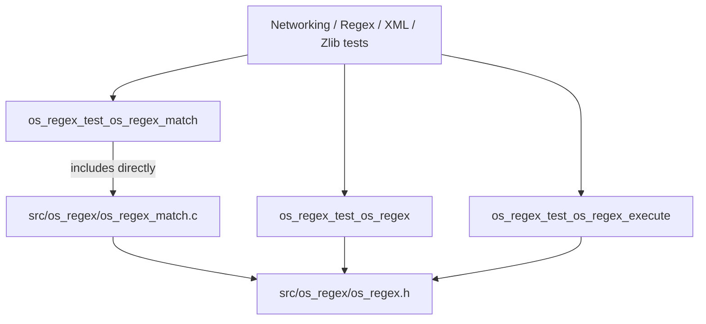
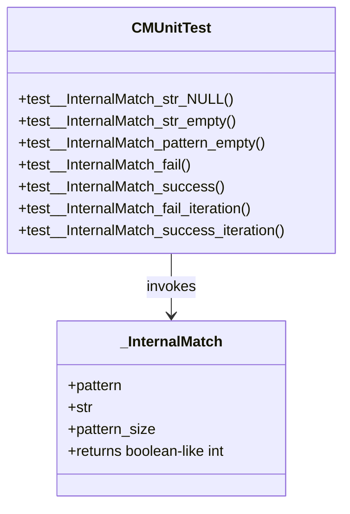
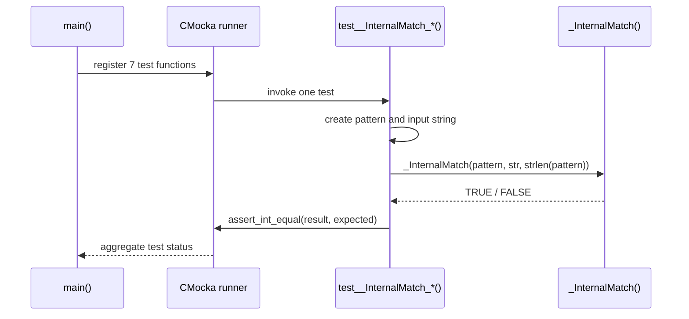
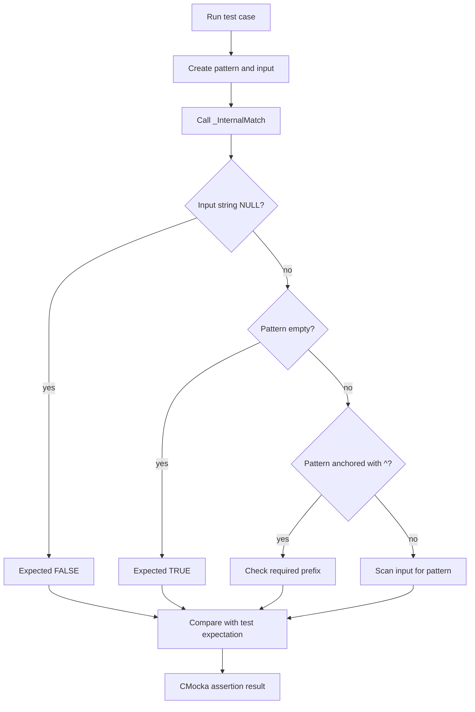
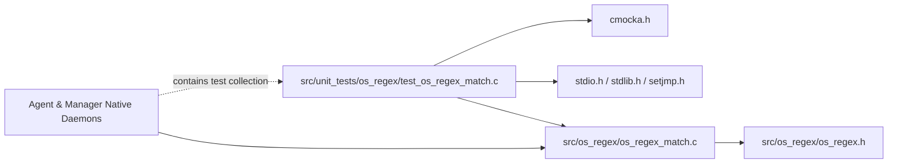

# `os_regex_test_os_regex_match`

`os_regex_test_os_regex_match` is a small CMocka unit-test executable for the internal `_InternalMatch` routine in Wazuh's native `os_regex` implementation. The test file includes `src/os_regex/os_regex_match.c` directly, invokes `_InternalMatch` with representative strings and patterns, and verifies boolean matching behavior for null, empty, anchored, and embedded-string cases.

The test is part of the broader native regex test collection. See [`os_regex.md`](os_regex.md) for the public `OSMatch`/`OSRegex` architecture and [`os_regex_test_os_regex.md`](os_regex_test_os_regex.md) for the neighboring API and behavior tests.

## Scope and system position

The module does not provide production functionality or a runtime service. Its executable boundary is:

```text
CMUnitTest definitions
        |
        v
cmocka_run_group_tests()
        |
        v
_InternalMatch(pattern, string, pattern_size)
        |
        v
boolean assertion: TRUE or FALSE
```

The test is registered under the `Unit_Tests_-_Networking_Regex_XML_Zlib` collection as `os_regex_test_os_regex_match`. It complements:

- [`os_regex_test_os_regex.md`](os_regex_test_os_regex.md), which covers the public matching and helper API.
- [`os_regex_test_os_regex_execute.md`](os_regex_test_os_regex_execute.md), which covers compiled `OSRegex` execution and capture extraction.
- The `Unit_Tests_-_Networking_Regex_XML_Zlib` entry in the supplied module tree, which identifies the parent test collection.
- [`os_regex.md`](os_regex.md), which documents the production regex implementation and its consumers.



## Test architecture

The source has three logical layers:

| Layer | Components | Responsibility |
|---|---|---|
| Test runner | `main`, `CMUnitTest` | Registers seven tests and returns the CMocka aggregate status. |
| Test cases | `test__InternalMatch_*` functions | Build input strings/patterns, call `_InternalMatch`, and assert the expected boolean result. |
| System under test | Included `os_regex_match.c` | Supplies the internal matching routine being validated. |



## Execution flow

`main` creates a static array of `CMUnitTest` entries using `cmocka_unit_test`, then passes it to `cmocka_run_group_tests`. CMocka invokes each test independently; each test uses stack-local input and performs one assertion.



## Test cases

### Null input

`test__InternalMatch_str_NULL` passes `str = NULL` and pattern `"pattern"`. The expected result is `FALSE`. This establishes the defensive behavior for a missing input string.

### Empty input string

`test__InternalMatch_str_empty` passes an empty input string and pattern `"pattern"`. The expected result is `FALSE`, confirming that a non-empty pattern cannot match an empty input.

### Empty pattern

`test__InternalMatch_pattern_empty` passes pattern `""` against `"string"`. The expected result is `TRUE`. This records the implementation's empty-pattern convention, which is distinct from an empty input string.

### Anchored mismatch and match

The tests `test__InternalMatch_fail` and `test__InternalMatch_success` use the `^` prefix:

| Pattern | Input | Expected | Meaning |
|---|---|---:|---|
| `^pattern` | `string` | `FALSE` | Required beginning text is absent. |
| `^string` | `string` | `TRUE` | Required beginning text is present. |

These cases verify that the internal matcher recognizes the beginning-of-string anchor for the tested syntax.

### Iterative embedded matching

The tests `test__InternalMatch_fail_iteration` and `test__InternalMatch_success_iteration` use the unanchored pattern `"string"`:

| Pattern | Input | Expected | Meaning |
|---|---|---:|---|
| `string` | `this is a str` | `FALSE` | The complete pattern is not present. |
| `string` | `this is a string` | `TRUE` | The pattern is found after scanning past the beginning. |

Together these cases exercise the matcher’s iteration/search behavior rather than only its first-character position.



## Input and output contract

The tests make the effective contract visible even though `_InternalMatch` is an internal, non-public function:

```c
int _InternalMatch(const char *pattern,
                   const char *str,
                   size_t pattern_size);
```

The test passes `strlen(pattern)` as `pattern_size` for every case. The return value is treated as a boolean-like integer and compared with `assert_int_equal` against the Wazuh `TRUE` or `FALSE` constants.

The test does not inspect captures, offsets, error codes, allocated memory, or matcher state. Those concerns belong to the public API and execution suites linked above.

## Component relationships and dependencies



The direct inclusion of `os_regex_match.c` is intentional for this unit-test target: it exposes the internal routine to the test translation unit without requiring `_InternalMatch` to be part of the production public header. Consequently, this test should be treated as coupled to the implementation file’s private symbols and signature.

## Process and maintenance guidance

When changing `_InternalMatch`, preserve or deliberately update the behavior encoded by these categories:

1. Null input must not cause a crash; the current expected result is `FALSE`.
2. Empty input does not satisfy the non-empty `"pattern"` case.
3. An empty pattern currently returns `TRUE` for a non-empty input.
4. `^` constrains the match to the beginning of the input.
5. An unanchored pattern can match after the first character when the complete pattern occurs.

If semantics change, update the relevant assertion and the sibling public tests where the behavior is externally observable. If the function is moved, renamed, or its signature changes, update the direct source inclusion and call sites in this test. Compile and link failures are expected if the private implementation is no longer available under the included path.

## Coverage boundaries

This module deliberately has a narrow scope:

- It validates seven deterministic examples for `_InternalMatch`.
- It does not validate `OSMatch_Compile` or `OSMatch_Execute` behavior as a compiled object.
- It does not validate `OSRegex` capture extraction or thread-safe execution.
- It does not exercise production callers such as logcollector, syscheck, rootcheck, or SCA.

For those broader relationships, use the cross-references rather than duplicating their implementation details here.
