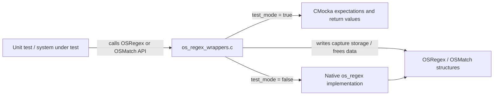
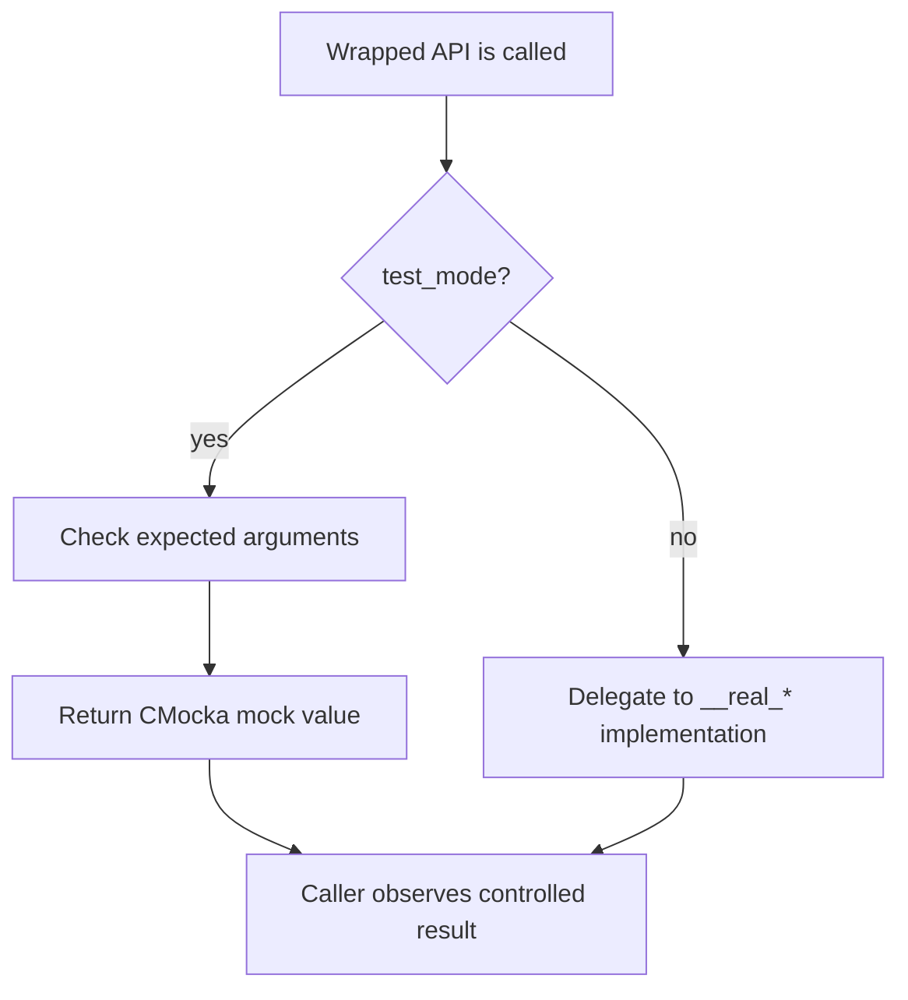
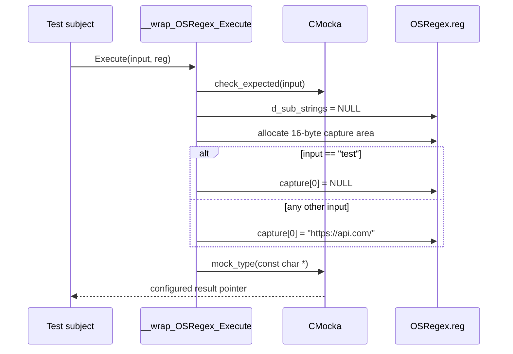
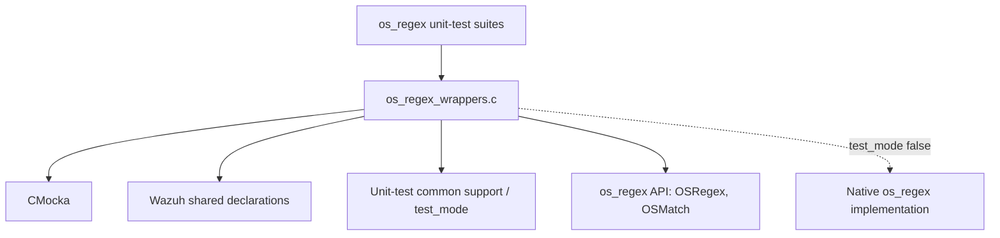
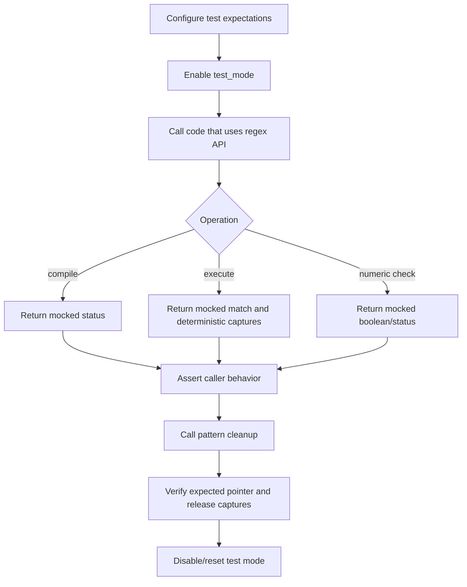

# `os_regex_wrappers`

`os_regex_wrappers` is the CMocka/linker-wrapper seam used by Wazuh unit tests to control calls into the native `os_regex` library. It lets tests replace compilation, execution, numeric-string validation, and pattern cleanup with deterministic mock behavior while preserving calls to the real implementation when test mode is disabled.

The module is located at `src/unit_tests/wrappers/wazuh/os_regex/os_regex_wrappers.c`. It is test infrastructure rather than production regex functionality. The underlying matching and regex semantics are documented in [`os_regex.md`](os_regex.md); the relevant test suites are [`os_regex_test_os_regex.md`](os_regex_test_os_regex.md), [`os_regex_test_os_regex_execute.md`](os_regex_test_os_regex_execute.md), and [`os_regex_test_os_regex_match.md`](os_regex_test_os_regex_match.md).

## Scope and responsibilities

The wrapper file provides mockable entry points for these native APIs:

| Wrapper | Native concern | Test-mode behavior |
|---|---|---|
| `__wrap_OSRegex_Compile` | Compile an `OSRegex` pattern | Optionally validates the expected pattern and returns `mock()` |
| `__wrap_OSRegex_Execute` | Execute an `OSRegex` against a string | Validates the expected string, creates deterministic capture storage, and returns `mock_type(const char *)` |
| `__wrap_OSRegex_Execute_ex` | Execute an `OSRegex` while filling `regex_matching` | Validates the expected string and returns `mock_type(const char *)` |
| `__wrap_OSRegex_FreePattern` | Release compiled regex data | Checks the expected regex pointer and frees `d_sub_strings` |
| `__wrap_OS_StrIsNum` | Determine whether a string is numeric | Returns `mock()` after checking the expected string |
| `__wrap_OSMatch_Compile` | Compile an `OSMatch` pattern | Optionally validates the expected pattern and returns `mock()` |
| `__wrap_OSMatch_Execute` | Execute an `OSMatch` with an explicit length | Validates the expected string and returns `mock()` |

`d_sub_strings` is a file-level `char **` symbol initialized to `NULL`. The execution wrapper writes capture-like data into the `OSRegex` object itself, so the global is not used by the shown implementations and should not be treated as the ownership source.

## Position in the test architecture

The wrappers sit between unit-test subjects and the native C regex implementation. CMocka supplies `mock()`, `mock_type()`, and `check_expected()`. The linker resolves calls to `__wrap_*` during wrapper-enabled test builds and uses the corresponding `__real_*` symbol when the wrapper delegates.

The module belongs to the broader unit-test wrapper layer and shares conventions with the other subsystem wrappers under `src/unit_tests/wrappers/wazuh`. It uses shared test support from `src/unit_tests/wrappers/common.c` plus Wazuh shared declarations. It does not call the API, framework, cluster, or engine layers directly.

## Wrapper control flow

Most wrappers use the same two-path design:

`OSRegex_Compile`, `OSMatch_Compile`, `OSMatch_Execute`, `OSRegex_Execute`, and `OSRegex_Execute_ex` only call `check_expected` when the relevant pointer argument is non-null. This allows tests to model null inputs without requiring an expectation for a null value. `OS_StrIsNum` always calls `check_expected(str)`, including for a null argument.

## Detailed behavior

### Compilation wrappers

`__wrap_OSRegex_Compile` and `__wrap_OSMatch_Compile` accept a pattern, destination structure, and flags. In test mode they:

1. Check the pattern if it is non-null.
2. Return the integer configured with CMocka’s `mock()` mechanism.

This allows callers to exercise both successful and failed compilation paths without compiling a real pattern. The destination structure and flags are not independently checked by these wrappers.

When `test_mode` is false, `__wrap_OSRegex_Compile` delegates to `__real_OSRegex_Compile`. The `OSMatch` wrapper is intended to delegate to the real `OSMatch` compiler; in the supplied source its fallback calls `__real_OSRegex_Compile` instead. That implementation detail is important when diagnosing non-test-mode behavior and should be reviewed before changing the wrapper or linker configuration.

### Execution wrappers

`__wrap_OSMatch_Execute` checks the input string when non-null and returns the integer provided by `mock()`. The explicit `str_len` and match object are not expectation-checked.

`__wrap_OSRegex_Execute` checks the input string when non-null, then resets `reg->d_sub_strings` to `NULL`, allocates space for 16 `char` elements through `os_calloc`, and installs deterministic capture-like content:

The string literal branch provides a no-capture case. All other strings model one extracted value, `https://api.com/`. The wrapper therefore tests consumers of capture data without depending on the regex engine’s actual extraction algorithm. The allocation is later reclaimed by `__wrap_OSRegex_FreePattern` when the test follows the expected lifecycle.

`__wrap_OSRegex_Execute_ex` checks the input string and returns a configured pointer, but does not initialize or modify the supplied `regex_matching` structure. Tests that need populated extended match metadata must provide it separately or use a more specialized test double.

### Cleanup wrapper

`__wrap_OSRegex_FreePattern` always checks that the supplied `OSRegex *` matches the expected pointer. If `reg->d_sub_strings` is non-null, it:

1. Frees the pointed-to array contents with `w_FreeArray`.
2. Frees the array allocation with `os_free`.
3. Sets `reg->d_sub_strings` back to `NULL`.

The wrapper does not delegate to a real free function. It is therefore the owner of the capture storage created by `__wrap_OSRegex_Execute` in wrapper mode.

### Numeric-string wrapper

`__wrap_OS_StrIsNum` obtains an integer result from `mock()`, checks the expected input string, and returns that result. This isolates callers from the native numeric parser and supports tests for both numeric and non-numeric branches.

## Dependency and interaction view

The source includes standard headers for size and variadic/test support, CMocka, Wazuh `shared.h`, and the unit-test `common.h`. The external `__real_*` declarations describe symbols supplied by the linker or native implementation. The wrapper’s practical dependencies are therefore:

- CMocka’s expectation and mock-value API.
- The shared `test_mode` state and Wazuh allocation helpers.
- `OSRegex`, `OSMatch`, and `regex_matching` definitions.
- The native `os_regex` functions used on the non-test path.

## Typical test process

A well-formed test should configure expectations for non-null patterns and strings, configure return values with CMocka, and ensure that every regex object receiving deterministic capture storage reaches `__wrap_OSRegex_FreePattern`. Tests should also cover null inputs because the wrappers intentionally treat null expectation checking differently across APIs.

## Failure and maintenance considerations

- Mock return values are not validated by the wrapper itself; the test must configure the correct `mock()` or `mock_type()` value.
- Compile flags, destination objects, match lengths, and `regex_matching` contents are not checked or synthesized by the current wrappers.
- `__wrap_OSRegex_Execute` assumes `reg` is valid before dereferencing it. A null `reg` is not a supported wrapper input.
- The fixed 16-byte allocation is a test fixture, not a representation of arbitrary capture capacity.
- Cleanup assumes `reg` is valid and that the capture pointer was allocated using the compatible Wazuh allocation conventions.
- The apparent `OSMatch` compile fallback to `__real_OSRegex_Compile` should be treated as a potential defect or deliberate compatibility quirk and verified against the linker map and intended native API.

## Related documentation

- [`os_regex.md`](os_regex.md) — native regex and match implementation context.
- [`os_regex_test_os_regex.md`](os_regex_test_os_regex.md) — core regex behavior tests.
- [`os_regex_test_os_regex_execute.md`](os_regex_test_os_regex_execute.md) — regex execution tests.
- [`os_regex_test_os_regex_match.md`](os_regex_test_os_regex_match.md) — internal match behavior tests.
