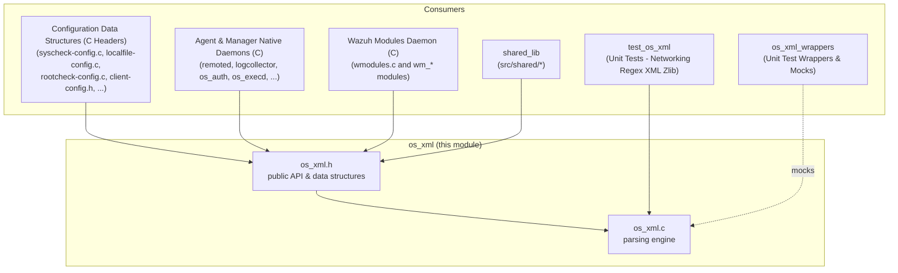

# os_xml — Wazuh XML Parsing Library

## 1. Overview

`os_xml` is a small, self-contained C library that implements a lightweight, dependency-free **XML parser** used throughout the Wazuh codebase (agent, manager, and shared daemons) to read configuration files (`ossec.conf` and all the module-specific configuration blocks), parse XML-formatted responses, and process any other ad-hoc XML content (e.g. Windows Event Channel data, Audit XML segments).

It purposefully implements only the small, pragmatic subset of XML needed by Wazuh's own configuration format — it is **not** a general-purpose, spec-compliant XML parser. It supports:

- Elements and nested elements (arbitrary depth, bounded by an internal recursion guard).
- Attributes (`key="value"` or `key='value'`).
- Comments (`<!-- ... -->`), including the classic and W3C comment-closing styles.
- Simple variable substitution tokens (`$variable`), resolved via `OS_ApplyVariables`.
- Both file-based (`FILE *`) and in-memory string-based parsing through a single unified internal reader interface.

Because virtually every Wazuh daemon and the majority of configuration-related C code depends on this library to load `ossec.conf`, `os_xml` is one of the most heavily depended-upon low-level components in the whole codebase.

## 2. Position in the System

`os_xml` lives in `src/os_xml/` and is part of the **Agent & Manager Native Daemons (C)** area, as a sibling of other foundational C libraries such as `os_regex` and `shared` (`src/shared/*`). It has no dependency on any other Wazuh module — its only dependencies are the C standard library and Wazuh's generic `file_op` helper (for `wfopen`).



Related documentation:
- Configuration parsing that builds on top of `os_xml` output is documented across the **Configuration Data Structures (C Headers)** family of docs (e.g. `Localfile_Config_core.md`, `Syscheck_Config.md`, `Rootcheck_Config.md`, `Client_Config.md`).
- The sibling pattern-matching library used alongside `os_xml` for validating/filtering configuration values is `os_regex` — many config readers call `OS_ReadXML`/`OS_ReadXMLString` first and then use regex helpers to validate individual field contents.
- Unit coverage lives in `test_os_xml.md` (module `Unit_Tests_-_Networking_Regex_XML_Zlib`) and the corresponding mocks in `os_xml_wrappers.md` (module `Unit_Test_Wrappers_&_Mocks`).

## 3. Core Files and Components

| File | Responsibility |
|---|---|
| `src/os_xml/os_xml.c` | Implements the recursive-descent scanning engine: character-level readers (`_xml_fgetc`, `_xml_sgetc`), the element/attribute/comment scanners, and the public parsing entry points (`OS_ReadXML`, `OS_ReadXMLString`, `ParseXML`, `OS_ClearXML`, etc.) |
| `src/os_xml/os_xml.h` | Declares the public data structures (`OS_XML`, `xml_node`) and the full public API surface used by all consumers |

### 3.1 Data Structures

**`OS_XML`** (`_OS_XML`) — the parser context / parsed-document container. It is a set of *parallel arrays* indexed by an internal cursor (`cur`), rather than a tree of node objects. Each index `i` represents one parsed item (either an element or an attribute):

- `el[i]` — element/attribute name.
- `ct[i]` — content/value string.
- `tp[i]` — `XML_TYPE` (`XML_ATTR`, `XML_ELEM`, or `XML_VARIABLE_BEGIN` for `$`-prefixed variables).
- `rl[i]` — index of the parent item (the "relation").
- `ck[i]` — whether the item was properly closed.
- `ln[i]` — source line number (for error reporting).
- `err` / `err_line` — last error message and line, surfaced to callers on parse failure.
- `fp` / `string` — the underlying input source (file pointer XOR in-memory string).
- `stash` / `stash_i` — a tiny 2-byte "ungetc" stash used by the scanner to push back look-ahead characters.

**`xml_node`** (`_xml_node`) — a friendlier, tree-like view of a single element returned by higher-level accessor functions (`OS_GetElementsbyNode`, etc.), exposing `element`, `content`, and parallel `attributes`/`values` arrays. `w_get_attr_val_by_name()` is a small convenience helper to look up an attribute's value by name on a `xml_node`.

### 3.2 Parsing Engine (`os_xml.c`)

- **`_xml_fgetc` / `_xml_sgetc`** — the two low-level character readers, selected transparently through the `xml_getc_fun` macro depending on whether the source is a `FILE*` or an in-memory string. Both track line numbers and consult the small look-ahead `stash` before reading fresh input.
- **`_ReadElem`** (recursive) — the heart of the parser: reads an opening tag, delegates to `_getattributes` for the attribute list, recurses into child elements, and validates matching closing tags. A hard recursion-depth guard (1024 levels) prevents stack exhaustion on malformed/malicious input.
- **`_getattributes`** — scans `name="value"` / `name='value'` pairs, rejecting duplicate attributes on the same element and malformed quoting.
- **`_oscomment`** — recognizes and skips XML comments in both the legacy and W3C (`-->`) closing forms.
- **`_writememory` / `_writecontent`** — append a newly parsed element or attribute (and its content) into the `OS_XML` parallel arrays, growing them via `realloc`.
- **`ParseXML`** — orchestrates a full parse: resets parser state, invokes `_ReadElem` from the root, verifies every opened element was closed, and releases the file handle / string buffer.
- **Public entry points**: `OS_ReadXML` / `OS_ReadXML_Ex` (from a file) and `OS_ReadXMLString` / `OS_ReadXMLString_Ex` (from an in-memory string) — the `_Ex` variants expose a `flag_truncate` option controlling whether over-sized tag content is truncated or treated as a parse error.
- **`OS_ClearXML`** — frees all parallel arrays and resets the `OS_XML` structure for reuse/destruction.

### 3.3 Higher-Level Accessors (declared in `os_xml.h`, implemented elsewhere in the library)

While the two files documented here contain the scanning engine and struct definitions, `os_xml.h` also declares the query API that callers use once a document has been parsed:

- `OS_RootElementExist`, `OS_ElementExist` — existence checks.
- `OS_GetElements`, `OS_GetElementsbyNode` — enumerate child elements.
- `OS_GetAttributes`, `OS_GetAttributeContent` — enumerate/read attributes.
- `OS_GetOneContentforElement`, `OS_GetElementContent`, `OS_GetContents` — read element text content (single or multiple matches).
- `OS_ApplyVariables` — resolves `$variable` tokens recorded during parsing.
- `OS_WriteXML` — writes a modified copy of a parsed XML file back to disk (used by APIs/scripts that need to edit `ossec.conf` programmatically, e.g. `update_ossec_conf` in the manager module of the API/Framework).
- `OS_ClearNode` — frees an `xml_node**` tree returned by the accessor functions.

## 4. Parsing Flow

```mermaid
sequenceDiagram
    participant Caller as Config Reader<br/>(e.g. Read_Syscheck_Config)
    participant API as os_xml Public API
    participant Engine as _ReadElem / _getattributes
    participant Reader as _xml_fgetc / _xml_sgetc

    Caller->>API: OS_ReadXML(file, &xml) / OS_ReadXMLString(str, &xml)
    API->>API: memset(&xml, 0, ...); open file or copy string
    API->>Engine: ParseXML() -> _ReadElem(parent=0, ...)
    loop for each character
        Engine->>Reader: xml_getc_fun(fp, xml)
        Reader-->>Engine: next char (from stash, file, or string)
        Engine->>Engine: classify: element open/close, attribute, comment, content
        Engine->>Engine: _writememory()/_writecontent() append parsed item
    end
    Engine-->>API: 0 (success) / -1 (error, xml.err set) / LEOF
    API-->>Caller: OS_XML populated (el/ct/tp/rl/ck arrays)
    Caller->>API: OS_GetElements / OS_GetElementContent / OS_GetAttributeContent ...
    API-->>Caller: char** / xml_node** results
    Caller->>API: OS_ClearXML(&xml)
```

Typical usage pattern seen across the codebase (e.g. in `Syscheck_Config`, `Localfile_Config`, `Rootcheck_Config`, `Client_Config`, and daemon `main()` startup routines):

1. Call `OS_ReadXML("/var/ossec/etc/ossec.conf", &xml)` (or the `_Ex`/string variants).
2. On success, walk the document using `OS_RootElementExist` / `OS_GetElements` / `OS_GetElementContent` / `OS_GetAttributeContent` to populate a module-specific config struct (e.g. `syscheck_config`, `logreader_config`, `agent_flags_t`).
3. Optionally call `OS_ApplyVariables` if the document declares `<var name="...">` style substitutions.
4. Call `OS_ClearXML(&xml)` to release all parser memory once the config structure has been fully extracted.

## 5. Error Handling

Parse errors are not returned as rich structured objects; instead:
- The function returns `-1` (or `-2` for "file not found").
- `OS_XML.err` (a fixed `XML_ERR_LENGTH`-byte buffer) contains a human-readable message (e.g. `"XMLERR: Element '%s' not closed."`, `"XMLERR: String overflow."`, `"XMLERR: Attribute '%s' already defined."`).
- `OS_XML.err_line` records the offending line number.

Callers typically log `_lxml.err` (via `merror`/`minfo` style logging) and abort loading the corresponding configuration section.

## 6. Consumers and Cross-References

`os_xml` has no outward dependencies, but it is a foundational dependency for a very large portion of the C codebase:

- **Configuration parsing** — nearly every file under `src/config/` (see module **Configuration Data Structures (C Headers)** and its children such as `Syscheck_Config`, `Localfile_Config_core`, `Rootcheck_Config`, `Client_Config`, `Remote_Config`, `Global_Config_Core`, `Wmodules_Config`) uses `OS_ReadXML`/`OS_GetElements`/`OS_GetElementContent` to translate `ossec.conf` XML blocks into their respective C structs.
- **Native daemons** (module **Agent & Manager Native Daemons (C)**) — daemons such as `remoted`, `logcollector`, `monitord`, `os_auth`, `os_execd`, and the shared library (`shared_lib`) call into `os_xml` both at startup (to read global/agent configuration) and, in some cases, at runtime (e.g. `read_win_event_channel.c` uses XML-like parsing for Windows Event data).
- **Wazuh modules daemon** (**Wazuh Modules Daemon (C)**) — each `wm_*.c` module (`wm_aws`, `wm_azure`, `wm_oscap`, `wm_sca`, etc.) reads its own configuration block from the same parsed `OS_XML` tree produced by the top-level `ReadConfig`/`wmodules.c` flow.
- **Testing** — `test_os_xml.md` (module `Unit_Tests_-_Networking_Regex_XML_Zlib`) provides exhaustive coverage of comments, attributes, nested/unclosed elements, overflow handling, and the `OS_WriteXML` writer path. The `os_xml_wrappers.md` module (under `Unit_Test_Wrappers_&_Mocks`) exposes `__wrap_OS_ReadXML`, `__wrap_OS_ReadXMLString`, `__wrap_OS_ClearXML`, and `__wrap_OS_ClearNode` so that dependent unit tests can mock XML parsing without touching real files.

## 7. Design Notes

- **Parallel-array model instead of a tree**: Rather than allocating a node object per element, `os_xml` keeps flat, index-aligned arrays (`el`, `ct`, `tp`, `rl`, `ck`, `ln`). This keeps the implementation allocation-light and fast for the relatively small configuration documents Wazuh needs to parse, at the cost of a less ergonomic API compared to a typical DOM-style library. The `rl[i]` "relation" array is what encodes the parent/child tree structure.
- **Unified file/string reading**: The `xml_getc_fun` macro dispatches to `_xml_fgetc` or `_xml_sgetc` depending on whether `_lxml->fp` is set, allowing the exact same recursive-descent engine (`_ReadElem`, `_getattributes`, `_oscomment`) to parse both files and in-memory strings without duplicated logic.
- **Bounded recursion**: `_ReadElem` enforces a maximum nesting depth (1024) to guard against stack overflow from malformed or adversarial XML input (e.g. a config file with thousands of nested tags).
- **Truncate-vs-fail overflow policy**: The `_Ex` API variants (`OS_ReadXML_Ex`, `OS_ReadXMLString_Ex`, `ParseXML`) expose a `flag_truncate` switch so callers can choose whether oversized tag content should be silently truncated to `XML_MAXSIZE` or treated as a hard parse error — this matters for consumers parsing potentially large third-party XML payloads (e.g. Windows Event Channel XML) versus strict `ossec.conf` parsing.
