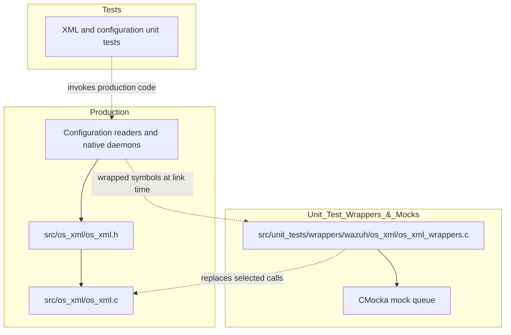
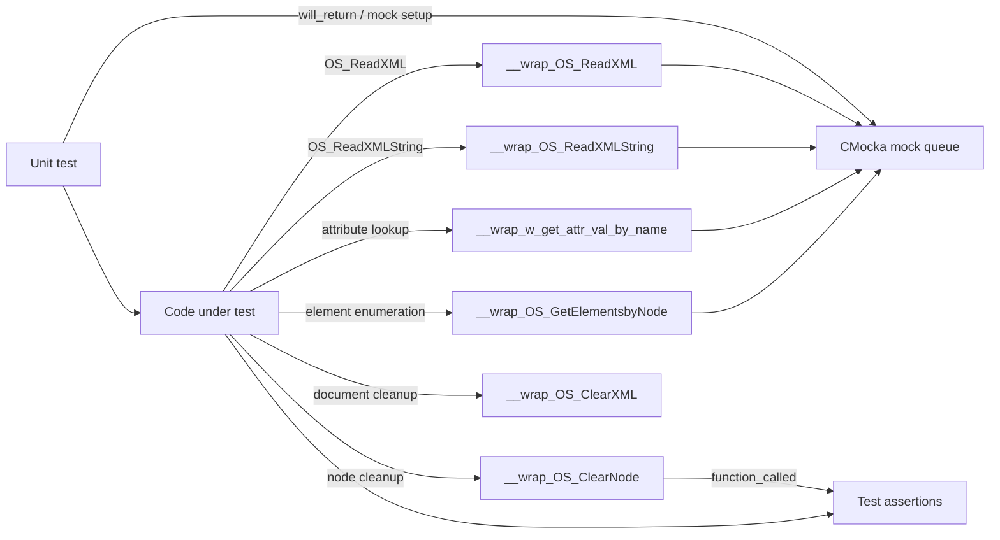
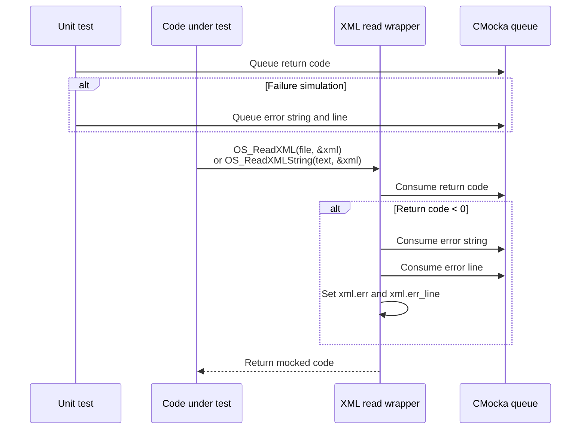
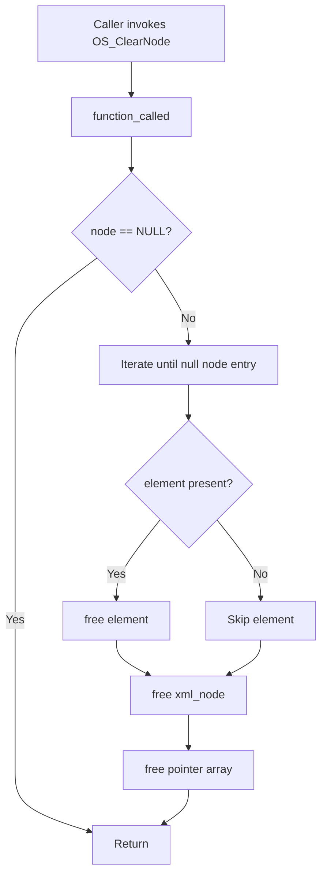
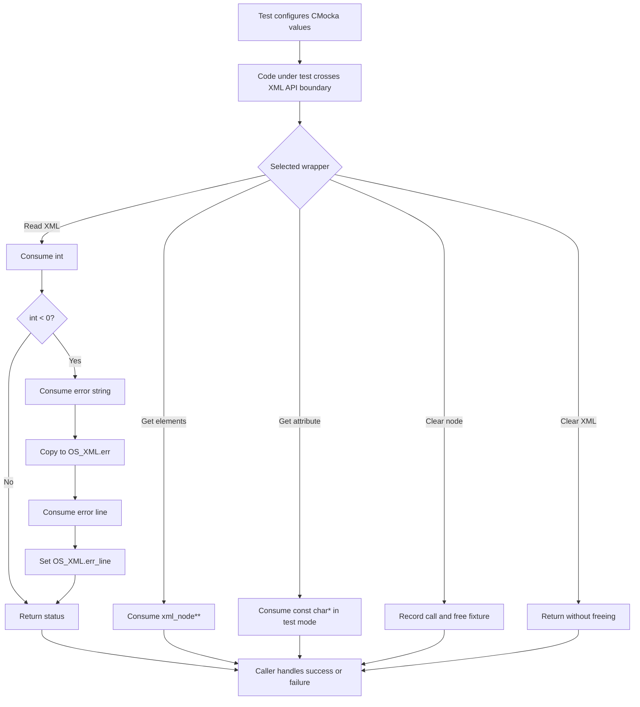
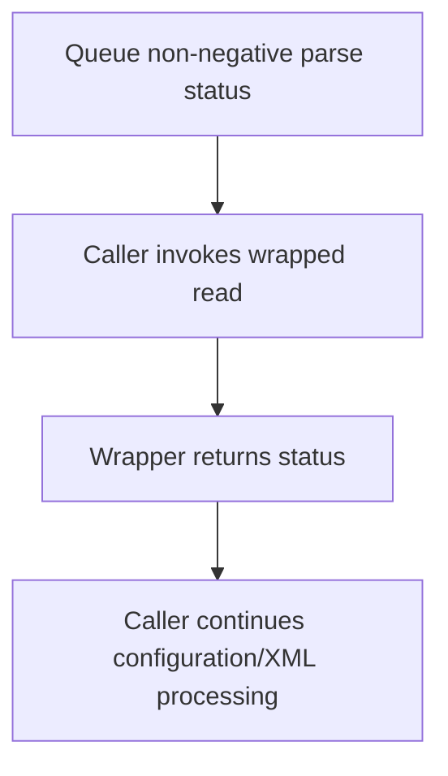
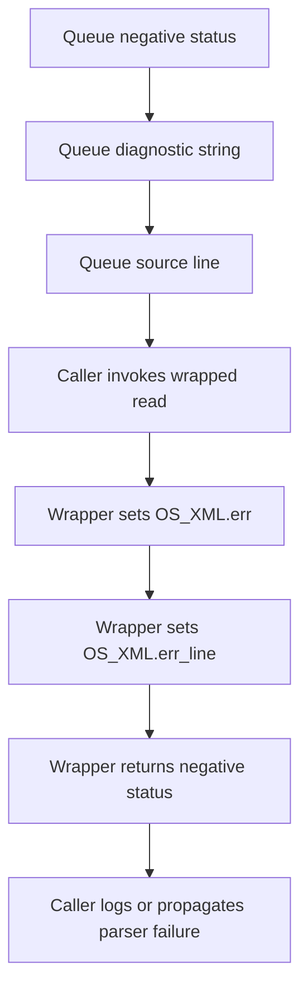
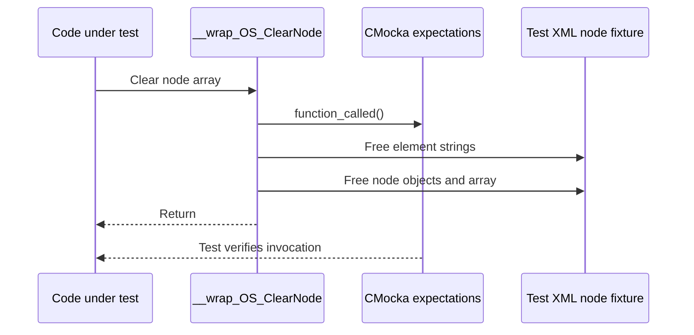
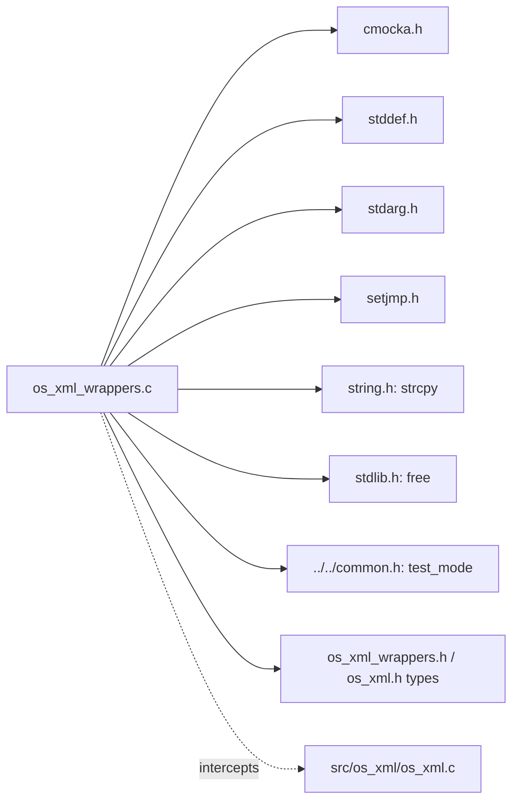

# os_xml_wrappers — XML Test Wrappers

## Introduction

`os_xml_wrappers` is unit-test infrastructure for Wazuh's XML parser consumers. It replaces selected functions from `src/os_xml/` with CMocka-controlled test doubles, allowing tests to simulate successful parsing, parse failures, XML cleanup, attribute lookup, and element enumeration without reading real files or constructing a complete parser state.

The module is used only in test builds. The production parser, its data structures, and its normal parsing behavior are documented in [os_xml.md](os_xml.md). XML parser behavior itself is covered by the XML unit-test module documented in [test_os_xml.md](test_os_xml.md).

## Purpose and scope

The wrapper file is located at `src/unit_tests/wrappers/wazuh/os_xml/os_xml_wrappers.c`. It provides four primary wrappers and two supporting seams:

| Wrapper | Test-controlled behavior |
| --- | --- |
| `__wrap_OS_ReadXML` | Returns a mocked parse result and, on failure, populates `OS_XML.err` and `OS_XML.err_line`. |
| `__wrap_OS_ReadXMLString` | Same behavior as `__wrap_OS_ReadXML`, for in-memory XML input. |
| `__wrap_OS_ClearXML` | No-op replacement for parser-context cleanup. |
| `__wrap_OS_ClearNode` | Frees a mocked `xml_node**` array and records that cleanup occurred. |
| `__wrap_w_get_attr_val_by_name` | Returns a mocked attribute value in test mode, otherwise delegates to the real helper. |
| `__wrap_OS_GetElementsbyNode` | Returns a mocked `xml_node**` result. |

The source also includes the CMocka and shared unit-test support headers needed by the wrappers. The linker selects these functions when a test target uses `--wrap`-style symbol interception.

## Position in the test system



The wrappers sit below code under test and above the parser boundary. They do not implement XML parsing and should not be treated as an alternate parser implementation.

## Architecture and component relationships



### Shared test-mode switch

`__wrap_w_get_attr_val_by_name` checks the shared `test_mode` flag:

- When `test_mode` is nonzero, it consumes a mocked `const char *` using `mock_type(const char *)`.
- Otherwise, it calls `__real_w_get_attr_val_by_name`, preserving the production helper's behavior.

This makes the attribute helper usable both as a fully isolated seam and as a transparent wrapper when a test needs the real XML node lookup.

### Mocked result model

`__wrap_OS_GetElementsbyNode` ignores its XML and node arguments and returns the next mocked `xml_node **`. This is useful for testing callers that process returned child nodes independently of the parser's traversal and allocation logic.

`__wrap_OS_ReadXML` and `__wrap_OS_ReadXMLString` similarly ignore their input source. Their observable behavior is determined by the mocked integer result and, for negative results, mocked error text and line number.

## Component details

### `__wrap_OS_ReadXML`

Signature:

```c
int __wrap_OS_ReadXML(const char *file, OS_XML *_lxml);
```

The wrapper consumes an integer from CMocka. It returns that value directly. If the value is negative, it additionally:

1. Consumes a mocked `char *` error message.
2. Copies the message into `_lxml->err` with `strcpy`.
3. Consumes a mocked integer and stores it in `_lxml->err_line`.

This models the production parser's error contract: a failure return plus diagnostic text and source line information. The caller must provide a valid initialized `OS_XML *`, and the test-provided error string must fit in the destination error buffer.

### `__wrap_OS_ReadXMLString`

`__wrap_OS_ReadXMLString` has the same implementation and mock protocol as `__wrap_OS_ReadXML`; only the production API being intercepted differs. It is intended for code paths that parse XML held in memory rather than loaded from a file.



### `__wrap_OS_ClearNode`

The wrapper records a CMocka `function_called()` event, then performs real memory cleanup when the input is non-null. It treats the argument as a null-terminated array of `xml_node *`:

```text
xml_node **node
  ├─ node[0] ... node[n-1]
  │    └─ free node[i]->element when present
  │       free node[i]
  └─ free node
```

The implementation does not free fields other than `element`; therefore test fixtures must match the ownership assumptions of the wrapper. Tests can assert that cleanup was attempted with `expect_function_call(__wrap_OS_ClearNode)` or equivalent CMocka expectations.



### `__wrap_OS_ClearXML`

This wrapper is an intentional no-op:

```c
void __wrap_OS_ClearXML(OS_XML *_lxml) { return; }
```

It prevents tests that exercise configuration or parser callers from releasing state that the test did not create through the production parser. Tests that need to verify actual `OS_XML` memory management belong with the real parser tests, not this seam.

### `__wrap_w_get_attr_val_by_name`

This wrapper provides conditional behavior rather than always mocking. In test mode it returns the next mocked string; outside test mode it calls the linker-provided real symbol, `__real_w_get_attr_val_by_name`. The pattern lets a test mock only the attribute lookup while retaining the production implementation for other cases.

### `__wrap_OS_GetElementsbyNode`

The wrapper returns `mock_type(xml_node **)`. It does not inspect `_lxml` or `node`, and therefore isolates downstream code from parser tree construction. A test that consumes the returned array remains responsible for arranging a compatible fixture and, where appropriate, invoking `__wrap_OS_ClearNode` to release it.

## Data flow and mock protocol



Typical setup for a simulated parse failure is conceptually:

```c
will_return(__wrap_OS_ReadXML, -1);
will_return(__wrap_OS_ReadXML, "invalid XML");
will_return(__wrap_OS_ReadXML, 12);
```

The exact CMocka registration form depends on the test target, but the queue order is significant: return code first, followed by error text and line number only when the return code is negative.

## Process flows

### Simulating a successful parse



### Simulating a parse error



### Testing cleanup



## Dependencies



The wrapper is coupled to the layout and ownership rules of `OS_XML` and `xml_node`, but it does not call the production parser for the mocked operations. Changes to those structures should be reviewed against this cleanup code and all tests that construct `xml_node**` fixtures.

## Integration and maintenance notes

- Keep mock queue ordering synchronized with the branch behavior in the wrappers. Error metadata is consumed only when the mocked read result is negative.
- Treat `strcpy` in the read wrappers as a test-fixture contract: error messages must fit in `OS_XML.err`.
- `__wrap_OS_ClearNode` frees only `element` and each node object. If `xml_node` gains owned fields, update the wrapper and its tests together.
- `__wrap_OS_ClearXML` intentionally does not exercise production cleanup. Use [os_xml.md](os_xml.md) and [test_os_xml.md](test_os_xml.md) when changing parser allocation or cleanup behavior.
- The `__real_w_get_attr_val_by_name` reference must remain compatible with the linker's real-symbol naming convention.
- Avoid duplicating configuration-parser behavior here; consumers such as native daemons and configuration structures should link to their module documentation from [os_xml.md](os_xml.md).

## Related modules

- [os_xml.md](os_xml.md) — production XML parser, data structures, parsing flow, and consumers.
- [test_os_xml.md](test_os_xml.md) — direct unit tests for XML parsing, accessors, errors, and writing.
- [Unit_Test_Wrappers_&_Mocks.md](Unit_Test_Wrappers_&_Mocks.md) — broader wrapper and mock infrastructure, when available.
