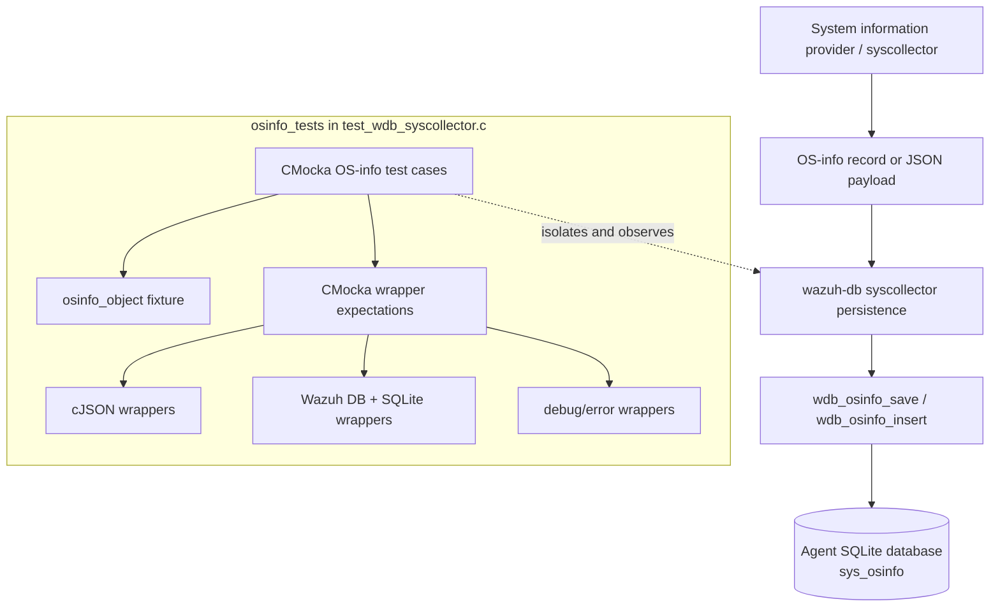
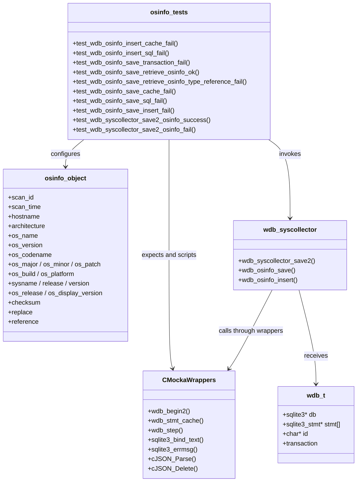
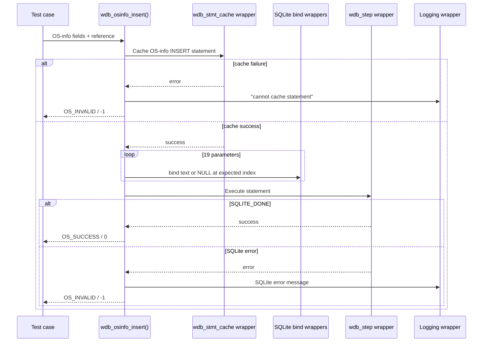
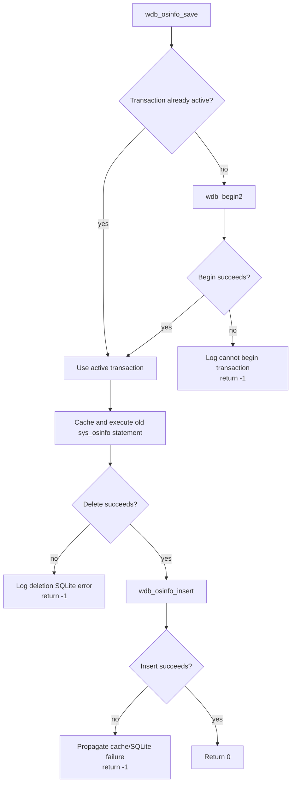
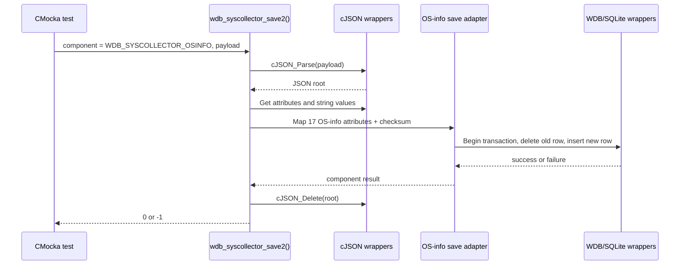

# `osinfo_tests`

## Introduction

`osinfo_tests` documents the operating-system-information tests embedded in
`src/unit_tests/wazuh_db/test_wdb_syscollector.c`. The tests exercise the Wazuh DB
syscollector persistence path for the `sys_osinfo` record: direct insertion,
transactional save/replace, JSON-based `wdb_syscollector_save2()` dispatch, SQLite
statement caching, ordered parameter binding, and error propagation.

This is a child slice of the broader [`test_wdb_syscollector` suite](test_wdb_syscollector.md).
Fixture allocation, CMocka wrapper conventions, and binding-policy helpers are
described in [`test_wdb_syscollector_test_infrastructure`](test_wdb_syscollector_test_infrastructure.md).
The production persistence layer is documented in
[`wazuh_db_fim_syscollector`](wazuh_db_fim_syscollector.md), while the shared
transaction and prepared-statement engine is covered by [`wazuh_db_engine`](wazuh_db_engine.md).

## Purpose and scope

The module verifies that OS inventory data can be written to the agent database
through both supported entry points:

| Entry point | Role | Main behavior verified |
|---|---|---|
| `wdb_osinfo_insert()` | Low-level insert primitive | Caches the OS-info statement, binds all fields in order, executes SQLite, and reports errors. |
| `wdb_osinfo_save()` | Transaction-aware save/replace operation | Begins a transaction when required, removes the previous OS-info row, inserts the new record, and propagates failures. |
| `wdb_syscollector_save2()` | JSON syscollector dispatcher | Parses JSON, validates the component selector, extracts OS-info attributes, invokes the save path, and frees the JSON tree. |

The source file also contains tests for packages, networking, hardware,
processes, users, groups, ports, and hotfixes. Those are sibling modules in the
parent suite and are intentionally not repeated here.

## Position in the system

OS information is produced by the system-information/syscollector layer and
eventually stored by `wazuh-db` in the per-agent SQLite database. This test module
isolates the persistence functions from the real database by replacing cJSON,
SQLite, Wazuh DB transaction/cache helpers, and logging calls with CMocka wrappers.

## Architecture and component relationships

The test file uses two fixture styles, shared with the parent suite:

- `test_setup`/`test_teardown` allocate a minimal zeroed `wdb_t` for focused
  failure-path tests.
- `setup_wdb`/`teardown_wdb` allocate `test_struct_t`, a synthetic database ID,
  statement sentinel, output buffer, and transaction state for fixture-driven
  tests.

The extended fixture does not open a real SQLite connection. It provides enough
shape for the production functions while wrapper return queues determine every
database result.

## OS-info data model used by the tests

The `osinfo_object` fixture mirrors the argument order of
`wdb_osinfo_insert()` and `wdb_osinfo_save()`:

| Position/group | Fields | Meaning |
|---|---|---|
| Identity | `scan_id`, `scan_time`, `hostname`, `architecture` | Inventory scan and host identity. |
| Distribution | `os_name`, `os_version`, `os_codename`, `os_major`, `os_minor`, `os_patch`, `os_build` | Human-readable and versioned OS attributes. |
| Platform | `os_platform`, `sysname`, `release`, `version`, `os_release`, `os_display_version` | Kernel/platform and display-version metadata. |
| Integrity | `checksum`, `reference` | Inventory checksum and the OS-info reference used by the persistence layer. |
| Update mode | `replace` | Controls replacement semantics in the save/insert path. |

The representative fixture models Windows 11 data, but the tests validate binding
and control-flow behavior rather than platform-specific detection.

## Direct insert flow

`wdb_osinfo_insert()` is tested as a prepared-statement operation. The helper
`configure_wdb_osinfo_insert()` establishes the expected sequence:

The tests assert every parameter position. Positions 1–18 contain the scan,
identity, platform, and checksum values; position 19 contains the reference
digest. A statement-cache failure returns `OS_INVALID` before any bind occurs.
An execution failure obtains the message from `sqlite3_errmsg()` and expects an
`SQLite: ...` error log.

## Transactional save/replace flow

`wdb_osinfo_save()` coordinates deletion/retrieval of existing OS information
and insertion of the new record. The test names expose the intended stages:

Covered save outcomes are:

- transaction begin failure;
- failure to cache the delete statement, including the statement identifier in
  the diagnostic;
- SQLite failure while deleting old `sys_osinfo` information;
- failure to cache the insert statement;
- successful delete followed by successful insert;
- successful handling when the reference value is accepted through the generic
  binding expectation.

The test fixture explicitly sets `transaction = 0` for begin-failure and normal
save cases. Other parent-suite tests demonstrate active-transaction behavior;
the transaction abstraction itself is documented in [`wazuh_db_engine`](wazuh_db_engine.md).

## JSON dispatcher flow

`wdb_syscollector_save2()` is the JSON-facing entry point. The OS-info cases
verify both the dispatcher and the component-specific save path.

The OS-info dispatcher success test scripts 17 attribute lookups followed by
the expected string values, a successful transaction, delete, insert, and final
`cJSON_Delete()`. The failure test makes transaction begin fail after attribute
extraction and expects `-1` plus cleanup.

The shared dispatcher tests additionally establish the surrounding contract:
JSON parse failure produces “no payload”, missing attributes produces “no
attributes”, and an unsupported component produces “Invalid component.” These
generic cases are documented in [`test_wdb_syscollector`](test_wdb_syscollector.md)
and are not duplicated here.

## Failure and result matrix

| Operation | Injected failure | Expected result | Observable behavior |
|---|---|---:|---|
| `wdb_osinfo_insert` | Statement cache | `-1` | Debug log identifies `wdb_osinfo_insert`. |
| `wdb_osinfo_insert` | `wdb_step`/SQLite error | `-1` | Error log contains SQLite message. |
| `wdb_osinfo_save` | Begin transaction | `-1` | Debug log identifies `wdb_osinfo_save`. |
| `wdb_osinfo_save` | Cache delete statement | `-1` | Debug log includes delete statement identifier. |
| `wdb_osinfo_save` | Delete SQL error | `-1` | Error log identifies `sys_osinfo`. |
| `wdb_osinfo_save` | Insert statement cache | `-1` | Insert-layer debug message is propagated. |
| `wdb_osinfo_save` | Delete + insert success | `0` | Both statements execute with ordered bindings. |
| `wdb_syscollector_save2` | OS-info persistence failure | `-1` | JSON tree is deleted before return. |
| `wdb_syscollector_save2` | OS-info persistence success | `0` | All expected attributes are mapped and cleaned up. |

SQLite constraint handling is tested extensively for sibling syscollector
components. For OS-info, the supplied cases focus on statement execution and
the save/replace sequence; duplicate semantics belong to the shared persistence
implementation described in [`wazuh_db_fim_syscollector`](wazuh_db_fim_syscollector.md).

## Test registration and maintenance notes

The `main()` function registers the OS-info cases in two groups:

1. legacy/direct tests using `test_setup` and `test_teardown`, including the
   save2 dispatch tests;
2. fixture-driven insert tests using `setup_wdb` and `teardown_wdb`.

When adding an OS-info field or changing its SQL statement, update all of the
following together:

- the `osinfo_object` fixture and its argument calls;
- `configure_wdb_osinfo_insert()` and the expected parameter index;
- JSON attribute/string-return scripts in the save2 tests;
- success and failure assertions for cache, bind, step, and cleanup behavior;
- the corresponding production schema/statement documentation.

The most important invariant is ordered binding: a test can pass while values
look plausible but still miss a column if the expected index or binding type is
not updated. The wrapper expectations are therefore part of the module's
contract, not incidental mock setup.

## Related documentation

- [`test_wdb_syscollector`](test_wdb_syscollector.md) — parent suite and all other syscollector domains.
- [`test_wdb_syscollector_test_infrastructure`](test_wdb_syscollector_test_infrastructure.md) — fixtures, wrapper helpers, and binding policy.
- [`wazuh_db_fim_syscollector`](wazuh_db_fim_syscollector.md) — production syscollector persistence and generic DBsync behavior.
- [`wazuh_db_engine`](wazuh_db_engine.md) — `wdb_t`, transactions, statement caching, and SQLite execution primitives.
- [`wazuh_db_command_parser`](wazuh_db_command_parser.md) — command dispatch context for Wazuh DB operations.
