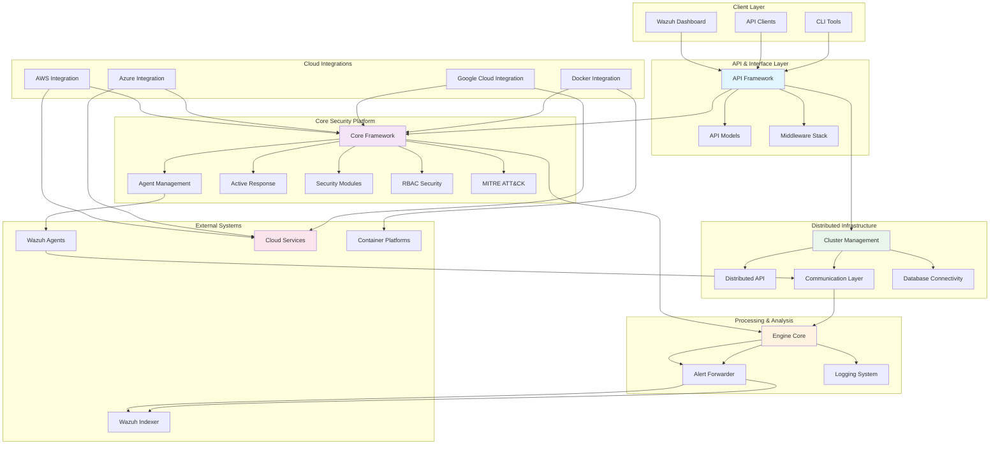

# Wazuh Security Platform Repository Overview

## Purpose

The `wazuh--wazuh` repository is the core implementation of the Wazuh security platform, an open-source security monitoring solution that provides comprehensive threat detection, incident response, and compliance capabilities. This repository contains the complete framework for building a distributed security information and event management (SIEM) system with advanced features including:

- **Real-time Security Monitoring**: Continuous monitoring of security events across diverse infrastructure
- **Threat Detection and Response**: Advanced rule-based and behavioral analysis for threat identification
- **Compliance Management**: Built-in compliance frameworks and reporting capabilities
- **Cloud Security**: Native integration with major cloud providers (AWS, Azure, Google Cloud)
- **Distributed Architecture**: Scalable master-worker cluster deployment model
- **API-First Design**: Comprehensive RESTful API for all platform operations

## End-to-End Architecture

The Wazuh platform follows a layered, microservices-oriented architecture that enables horizontal scaling and modular functionality:

### Architecture Flow Description

1. **Client Layer**: Web dashboard, API clients, and CLI tools provide user interfaces
2. **API & Interface Layer**: RESTful API framework with comprehensive models and security middleware
3. **Core Security Platform**: Central security logic including agent management, active response, and security modules
4. **Distributed Infrastructure**: Cluster management and distributed API capabilities for horizontal scaling
5. **Processing & Analysis**: Event processing engine with alert forwarding and comprehensive logging
6. **Cloud Integrations**: Native integrations with major cloud providers and container platforms
7. **External Systems**: Integration points for agents, indexers, and external services

## Core Modules Documentation

### API and Interface Layer
- **[API Framework](API%20Framework.md)** - Core HTTP API layer with security middleware, authentication, and request processing
- **[API Models](API%20Models.md)** - Comprehensive data models for API request/response validation and serialization

### Core Security Framework
- **[Core Framework](Core%20Framework.md)** - Foundational infrastructure providing utilities, validation, database abstraction, and result handling
- **[Agent Management](Agent%20Management.md)** - Complete agent lifecycle management including registration, monitoring, and communication
- **[Active Response](Active%20Response.md)** - Automated threat response system for executing commands on agents
- **[Security Modules](Security%20Modules.md)** - Specialized security monitoring including rootcheck, SCA, syscheck, and syscollector
- **[MITRE ATT&CK Integration](MITRE%20ATT&CK%20Integration.md)** - Comprehensive MITRE ATT&CK framework integration for threat intelligence
- **[RBAC Security](RBAC%20Security.md)** - Role-based access control system with authentication and authorization

### Distributed Infrastructure
- **[Cluster Management](Cluster%20Management.md)** - Master-worker cluster architecture with data synchronization and high availability
- **[Distributed API](Distributed%20API.md)** - Request distribution and load balancing across cluster nodes
- **[Database Connectivity](Database%20Connectivity.md)** - Unified database access layer with connection pooling and query optimization
- **[Communication Layer](Communication%20Layer.md)** - Inter-process communication infrastructure with socket and queue-based messaging

### Processing and Analysis
- **[Engine Core](Engine%20Core.md)** - Event processing engine client infrastructure with Unix Domain Socket communication
- **[Alert Forwarder](Alert%20Forwarder.md)** - Real-time alert forwarding to indexing systems with secure transmission
- **[Engine Testing Suite](Engine%20Testing%20Suite.md)** - Comprehensive testing framework for engine validation and debugging
- **[Logging System](Logging%20System.md)** - Enterprise-grade logging infrastructure with intelligent rotation and compression

### Cloud and Container Integrations
- **[AWS Integration](AWS%20Integration.md)** - Complete AWS services integration including S3, CloudWatch, Inspector, and SQS
- **[Azure Integration](Azure%20Integration.md)** - Microsoft Azure cloud services integration with Graph API, Log Analytics, and Storage
- **[Google Cloud Integration](Google%20Cloud%20Integration.md)** - Google Cloud Platform integration with GCS buckets and Pub/Sub
- **[Docker Integration](Docker%20Integration.md)** - Real-time Docker container monitoring and event collection

### Key Integration Patterns

The repository demonstrates several important architectural patterns:

1. **Modular Design**: Each module has clear boundaries and well-defined interfaces
2. **Dependency Injection**: Modules depend on abstractions rather than concrete implementations
3. **Event-Driven Architecture**: Asynchronous processing with queue-based communication
4. **Database Abstraction**: Unified data access layer supporting multiple database backends
5. **Security-First Design**: Comprehensive security controls integrated throughout the platform
6. **Cloud-Native Support**: Native integration with major cloud providers and container platforms
7. **Horizontal Scalability**: Distributed architecture supporting multi-node deployments

This architecture enables Wazuh to serve as a comprehensive security platform capable of monitoring diverse infrastructure while maintaining high performance, security, and scalability.