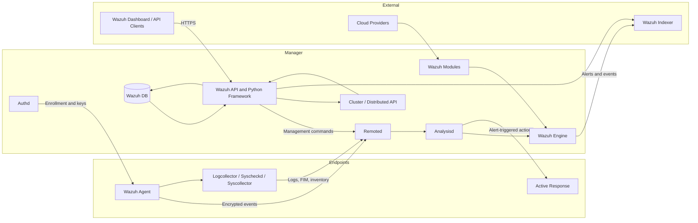
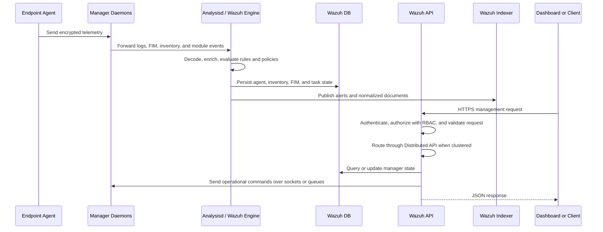

# Wazuh Repository Overview

## Purpose

Wazuh is an open-source security monitoring platform composed of endpoint agents, manager daemons, a Python management API, C/C++ event-processing services, inventory and vulnerability modules, clustering, persistence, cloud integrations, and administrative tools.

The repository contains:

- Endpoint telemetry collection and secure agent-manager communication.
- Log analysis, rule and decoder processing, alert generation, and active response.
- File Integrity Monitoring, rootcheck, SCA, system inventory, and vulnerability detection.
- Wazuh DB persistence, indexing, clustering, RBAC, and REST API management.
- Cloud integrations for AWS, Azure, Google Cloud, Docker, and alert forwarding.
- Native and Python command-line tools, migration utilities, unit tests, wrappers, and mocks.

## End-to-End Architecture

```mermaid
flowchart LR
    subgraph Endpoints
        AGENT[Wazuh Agent]
        COLLECT[Logcollector / Syscheckd / Syscollector]
        AR[Active Response]
    end

    subgraph Manager
        REMOTED[Remoted]
        AUTHD[Authd]
        ANALYSISD[Analysisd]
        ENGINE[Wazuh Engine]
        MODULES[Wazuh Modules]
        WDB[(Wazuh DB)]
        API[Wazuh API and Python Framework]
        CLUSTER[Cluster / Distributed API]
    end

    subgraph External
        CLOUD[Cloud Providers]
        INDEXER[Wazuh Indexer]
        DASH[Wazuh Dashboard / API Clients]
    end

    AGENT -->|Encrypted events| REMOTED
    AGENT --> COLLECT
    COLLECT -->|Logs, FIM, inventory| REMOTED
    AUTHD -->|Enrollment and keys| AGENT

    REMOTED --> ANALYSISD
    ANALYSISD --> ENGINE
    MODULES --> ENGINE
    ENGINE -->|Alerts and events| INDEXER
    ANALYSISD -->|Alert-triggered actions| AR
    API -->|Management commands| REMOTED
    API --> WDB
    API --> CLUSTER
    CLUSTER --> API

    WDB --> API
    CLOUD --> MODULES
    DASH -->|HTTPS| API
    API --> INDEXER
```

### Typical Event and Management Flow

```mermaid
sequenceDiagram
    participant E as Endpoint Agent
    participant M as Manager Daemons
    participant P as Analysisd / Wazuh Engine
    participant DB as Wazuh DB
    participant API as Wazuh API
    participant I as Wazuh Indexer
    participant C as Dashboard or Client

    E->>M: Send encrypted telemetry
    M->>P: Forward logs, FIM, inventory, and module events
    P->>P: Decode, enrich, evaluate rules and policies
    P->>DB: Persist agent, inventory, FIM, and task state
    P->>I: Publish alerts and normalized documents

    C->>API: HTTPS management request
    API->>API: Authenticate, authorize with RBAC, and validate request
    API->>API: Route through Distributed API when clustered
    API->>DB: Query or update manager state
    API->>M: Send operational commands over sockets or queues
    API-->>C: JSON response
```

## Repository Structure

| Area | Main location | Role |
|---|---|---|
| Python API and management framework | `api/`, `framework/` | REST API, business logic, RBAC, queries, sockets, cluster routing, and management operations |
| Cluster subsystem | `framework/wazuh/core/cluster` | Master/worker synchronization, Distributed API, HAProxy integration, and cluster administration |
| Native daemons | `src/` | Agent, manager, enrollment, logging, remoted, active response, rootcheck, and shared C infrastructure |
| Configuration structures | `src/config` | XML configuration parsing and typed C configuration models |
| System information provider | `src/data_provider` | Cross-platform hardware, OS, package, process, network, user, group, and port inventory |
| Wazuh Engine | `src/engine` | C++ event decoding, policy execution, routing, enrichment, schemas, and indexing |
| Shared C++ modules | `src/shared_modules` | DBSync, content management, routing, rsync, keystore, indexer connectivity, and reusable utilities |
| Syscheck/FIM | `src/syscheckd` | Scheduled and real-time file and registry integrity monitoring |
| Wazuh DB | `src/wazuh_db` | Agent, task, inventory, FIM, rootcheck, and metadata persistence |
| Wazuh modules | `src/wazuh_modules` | Cloud, compliance, inventory, system-management, and agent-upgrade modules |
| Inventory and vulnerability processing | `src/wazuh_modules/inventory_harvester`, `src/wazuh_modules/vulnerability_scanner` | Inventory normalization, CVE matching, vulnerability state, and alert generation |
| Engine CLI tools | `src/engine/tools` | Engine catalog, policy, schema, router, testing, integration, and maintenance commands |
| Cloud integrations | `wodles/`, `src/alert_forwarder` | AWS, Azure, Google Cloud, Docker, and indexer alert ingestion |
| Utilities and migrations | `src/util`, `tools/` | Agent control, validation, regex tools, upgrade packages, Wazuh DB access, and migrations |
| Tests | `src/unit_tests` | Unit tests, platform wrappers, mocks, and test infrastructure |

## Core Module Documentation

- [API & Management Framework](</home/anhnh/CodeWiki-journal/results/generation/wazuh/API_&_Management_Framework_(Python).md>)
- [Cluster Module](</home/anhnh/CodeWiki-journal/results/generation/wazuh/cluster_module.md>)
- [Configuration Data Structures](</home/anhnh/CodeWiki-journal/results/generation/wazuh/Configuration_Data_Structures_(C_Headers).md>)
- [System Information Data Provider](</home/anhnh/CodeWiki-journal/results/generation/wazuh/System_Information_Data_Provider_(C++).md>)
- [Wazuh Engine Core](</home/anhnh/CodeWiki-journal/results/generation/wazuh/Wazuh_Engine_Core_(C++).md>)
- [Engine Administration CLI Tools](</home/anhnh/CodeWiki-journal/results/generation/wazuh/Engine_Administration_CLI_Tools_(Python).md>)
- [Agent and Manager Native Daemons](</home/anhnh/CodeWiki-journal/results/generation/wazuh/Agent_&_Manager_Native_Daemons_(C).md>)
- [Shared Modules Infrastructure](</home/anhnh/CodeWiki-journal/results/generation/wazuh/Shared_Modules_Infrastructure_(C++).md>)
- [Syscheck / FIM Daemon](</home/anhnh/CodeWiki-journal/results/generation/wazuh/Syscheck___FIM_Daemon_(C_C++).md>)
- [Wazuh DB](</home/anhnh/CodeWiki-journal/results/generation/wazuh/wazuh_db.md>)
- [Wazuh Modules Daemon](</home/anhnh/CodeWiki-journal/results/generation/wazuh/Wazuh_Modules_Daemon_(C).md>)
- [Advanced Security Modules](</home/anhnh/CodeWiki-journal/results/generation/wazuh/Advanced_Security_Modules_(C++_Inventory_&_Vulnerability).md>)
- [Windows Agent](</home/anhnh/CodeWiki-journal/results/generation/wazuh/win32_agent.md>)
- [CLI Utilities and Migration Tools](</home/anhnh/CodeWiki-journal/results/generation/wazuh/CLI_Utilities_&_Migration_Tools.md>)
- [Cloud Integration Services](</home/anhnh/CodeWiki-journal/results/generation/wazuh/Wodles_-_Cloud_Integration_Services_(Python).md>)

### Test and Support Documentation

The repository also includes generated documentation for configuration, logcollector, monitord, OS authentication and cryptography, execd, remoted, shared-library, Syscheck, Wazuh DB, Wazuh modules, Windows utilities, and unit-test wrappers under:

`/home/anhnh/CodeWiki-journal/results/generation/wazuh/`