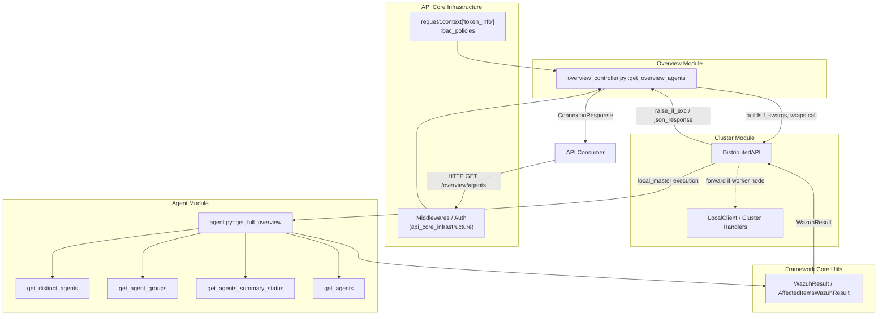
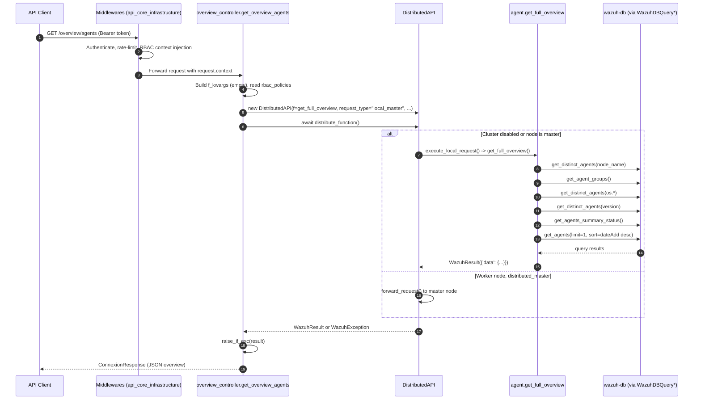
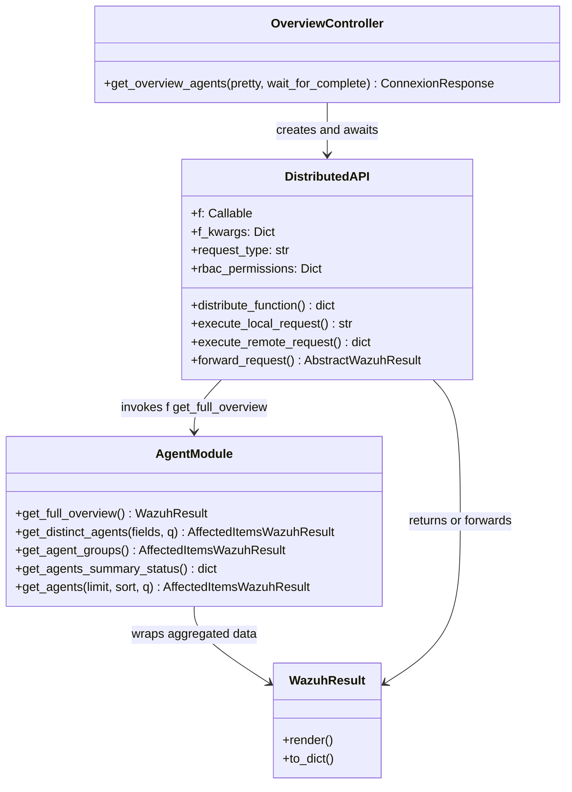

# Overview Module

## Introduction

The **Overview Module** is a small, highly-focused module in the Wazuh API that exposes a single endpoint used to retrieve a **consolidated, high-level summary of all agents** registered in a Wazuh deployment. Rather than requiring API consumers to make several separate calls (e.g. to list distinct nodes, agent groups, operating systems, agent versions, connection status counters, and the most recently added agent), this module aggregates all of that information into one response.

Despite its small footprint (a single controller function), the module plays an important architectural role: it demonstrates the standard request-processing pipeline used across the entire Wazuh API — from HTTP routing, through RBAC-aware distributed execution, down to core framework data aggregation — and therefore serves as a good reference implementation for understanding how any "read" endpoint in the API works end-to-end.

---

## Purpose and Core Functionality

The module provides one operation:

| Endpoint (typical) | Controller Function | Purpose |
|---|---|---|
| `GET /overview/agents` | `get_overview_agents` | Returns a full summary of agents: distinct nodes, groups, OS platforms, agent versions, connection-status counts, and the last registered agent. |

### Responsibilities

1. **HTTP Layer (Controller)** — `api/api/controllers/overview_controller.py::get_overview_agents`
   - Receives the incoming HTTP request (already authenticated/authorized upstream).
   - Builds the keyword arguments for the underlying framework function (in this case, there are none besides the implicit RBAC context).
   - Wraps the call in a `DistributedAPI` object so the request can be transparently executed locally, forwarded to the master, or executed remotely depending on cluster topology.
   - Converts the resulting `WazuhResult` into an HTTP-friendly `ConnexionResponse`.

2. **Distributed Execution Layer** — `DistributedAPI` (from the [Cluster Module](cluster_module.md))
   - Decides *where* the actual business logic should run (locally, on the master, or forwarded to a worker) based on cluster state and the declared `request_type` (`local_master` in this case).
   - Applies RBAC permissions obtained from the request context.
   - Wraps execution in a subprocess/thread pool with timeout handling and centralized error translation into Wazuh exceptions.

3. **Business Logic Layer** — `framework/wazuh/agent.py::get_full_overview` (part of the [Agent Module](agent_module.md))
   - Aggregates several independent queries against the agents' data store (via `WazuhDBQuery`-based helpers) into a single dictionary:
     - `nodes`: distinct cluster node names running agents.
     - `groups`: all agent groups.
     - `agent_os`: distinct combinations of OS name/platform/version.
     - `agent_status`: summary counts of agent connection statuses (active, disconnected, etc.).
     - `agent_version`: distinct agent versions in use.
     - `last_registered_agent`: the most recently added agent (if any).
   - Wraps the combined dictionary in a `WazuhResult` (from [`framework_core_utils`](framework_core_utils.md)) so it can flow uniformly through the rest of the pipeline (serialization, pretty-printing, cluster merging, etc.).

---

## Architecture

The overview module itself contains no state and no persistent components — it is a thin orchestration layer. Its main job is to *glue together* three other subsystems:

### Component Relationships

- **`overview_controller.py`** is the *only* file belonging exclusively to this module. It has no local models, no local business logic — everything is delegated.
- It depends directly on:
  - `wazuh.agent.get_full_overview` — the aggregation function (see [Agent Module](agent_module.md)).
  - `wazuh.core.cluster.dapi.dapi.DistributedAPI` — the distributed execution wrapper (see [Cluster Module](cluster_module.md)).
  - `api.util.raise_if_exc` / `remove_nones_to_dict` and `api.controllers.util.json_response` — shared API utilities (see [API Core Infrastructure](api_core_infrastructure.md)).
- Transitively, `get_full_overview` depends on the Agent Module's core query classes (`WazuhDBQueryGroup`, `WazuhDBQueryDistinctAgents`, `Agent`, etc.) and on the shared communication layer (`framework_core_communication`) to talk to `wazuh-db`.

---

## Data Flow

The following sequence diagram illustrates a full request lifecycle for `GET /overview/agents`:

---

## Process Flow: `get_full_overview` Aggregation

```mermaid
flowchart LR
    Start(["get_full_overview called"]) --> Q1["Query: distinct node_name (id != 000)"]
    Q1 --> Q2["Query: all agent groups"]
    Q2 --> Q3["Query: distinct os.name/platform/version"]
    Q3 --> Q4["Query: distinct agent version"]
    Q4 --> Q5["Query: agents summary status"]
    Q5 --> Q6["Query: last registered agent limit1 sort dateAdd desc"]
    Q6 --> Combine["Combine into single dict: nodes, groups, agent_os, agent_status, agent_version, last_registered_agent"]
    Combine --> Wrap["Wrap in WazuhResult"]
    Wrap --> End(["Return to DistributedAPI"])
```

---

## Dependencies on Other Modules

| Module | Relationship |
|---|---|
| [Agent Module](agent_module.md) | Provides `get_full_overview` and the underlying query helpers (`get_distinct_agents`, `get_agent_groups`, `get_agents_summary_status`, `get_agents`) that produce the actual overview data. |
| [Cluster Module](cluster_module.md) | Provides `DistributedAPI`, which decides how/where to execute the request in single-node or clustered (master/worker) deployments, and handles RBAC-aware distributed dispatching. |
| [API Core Infrastructure](api_core_infrastructure.md) | Provides authentication, middleware (rate limiting, blocked-IP checks, access logging), request-context population (`token_info.rbac_policies`), and shared response helpers (`json_response`, `raise_if_exc`, `remove_nones_to_dict`). |
| [Framework Core Utils](framework_core_utils.md) | Supplies the `WazuhResult` result-wrapper type used to standardize the response shape across the whole API. |
| [Security & RBAC Module](security_rbac_module.md) | Supplies the RBAC permission model (`rbac_policies`) that is threaded through `DistributedAPI` to authorize the aggregated query. |
| [Framework Core Communication](framework_core_communication.md) | Underlying socket/DB communication (`WazuhDBConnection`, etc.) used transitively by the Agent Module queries to reach `wazuh-db`. |

---

## Component Interaction Diagram

---

## Key Design Notes

- **Statelessness**: The overview module does not maintain any state of its own. Every invocation performs fresh queries against the agents database via the Agent Module.
- **Cluster transparency**: Because the controller uses `request_type='local_master'`, the overview is always computed on (or forwarded to) the master node, ensuring a globally consistent view of all agents regardless of which node in the cluster received the original HTTP request.
- **Error handling**: Any exception raised during aggregation (e.g. database connectivity issues) is captured by `DistributedAPI.distribute_function()` and converted into a `WazuhException`, which `raise_if_exc` (from the API Core Infrastructure) turns into a proper HTTP error response.
- **Extensibility**: If new "overview" style summaries are needed (e.g., for rules, decoders, or tasks), the same pattern — a thin controller delegating to a framework aggregation function via `DistributedAPI` — can be reused, as seen in other single-purpose modules like [Stats Module](stats_module.md) or [Manager Module](manager_module.md).

---

## Related Documentation

- [Agent Module](agent_module.md) — source of the aggregated agent data.
- [Cluster Module](cluster_module.md) — distributed request execution (`DistributedAPI`).
- [API Core Infrastructure](api_core_infrastructure.md) — authentication, middleware, and shared API utilities.
- [Security & RBAC Module](security_rbac_module.md) — permission model used to authorize the request.
- [Framework Core Utils](framework_core_utils.md) — `WazuhResult` and other shared result types.
- [Framework Core Communication](framework_core_communication.md) — low-level communication with `wazuh-db`.
