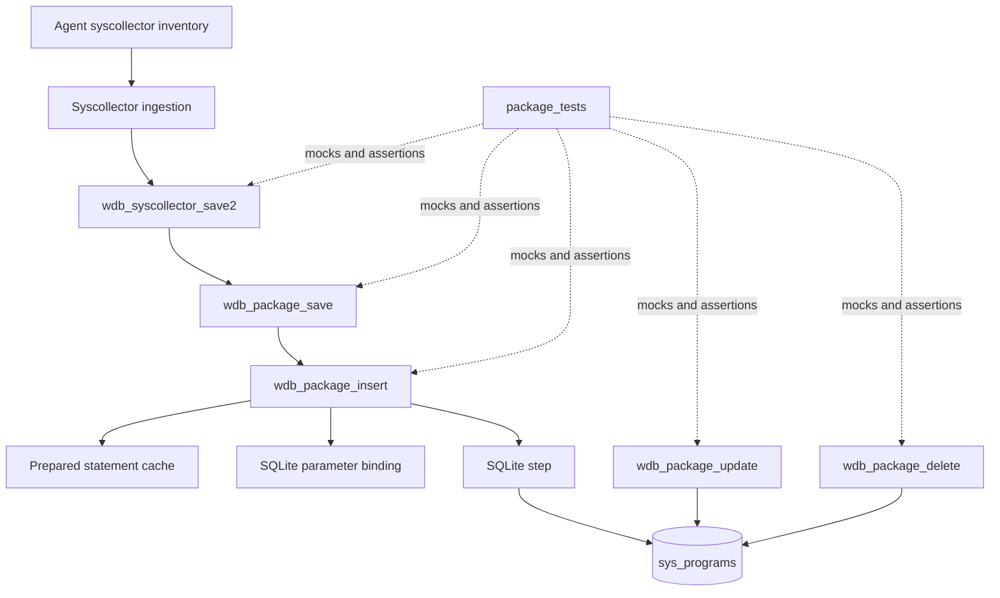
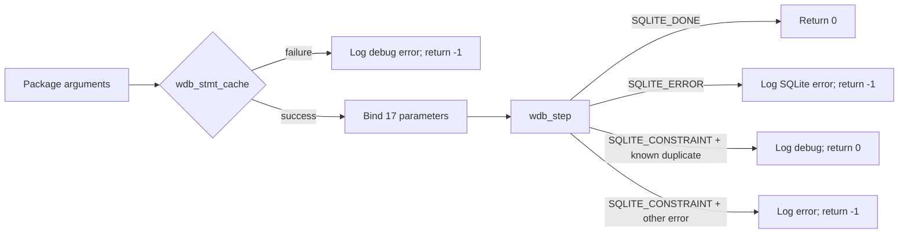
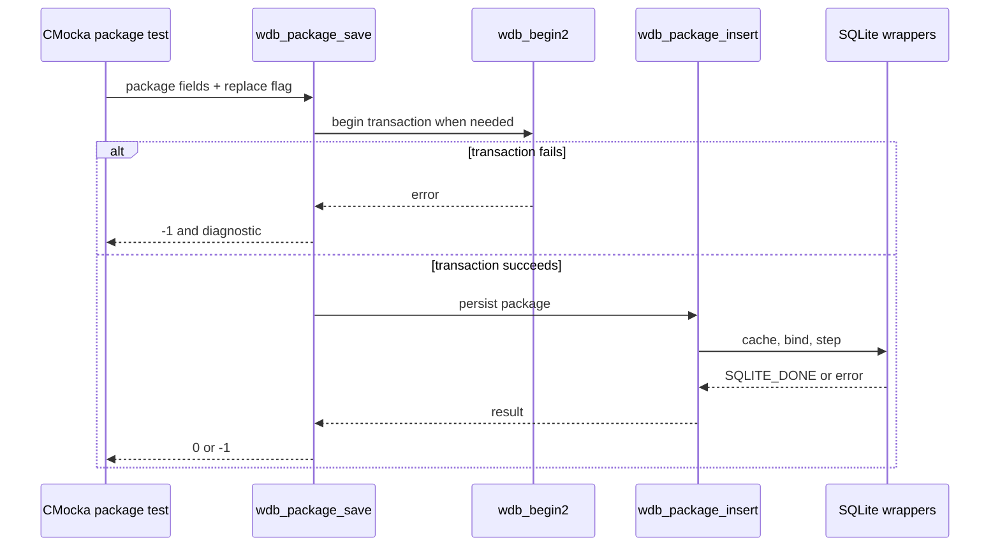
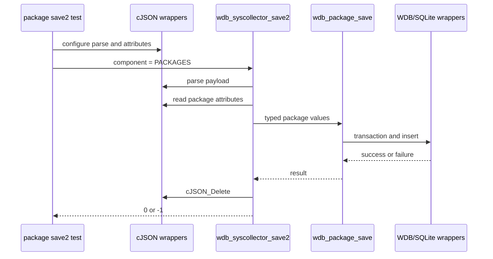
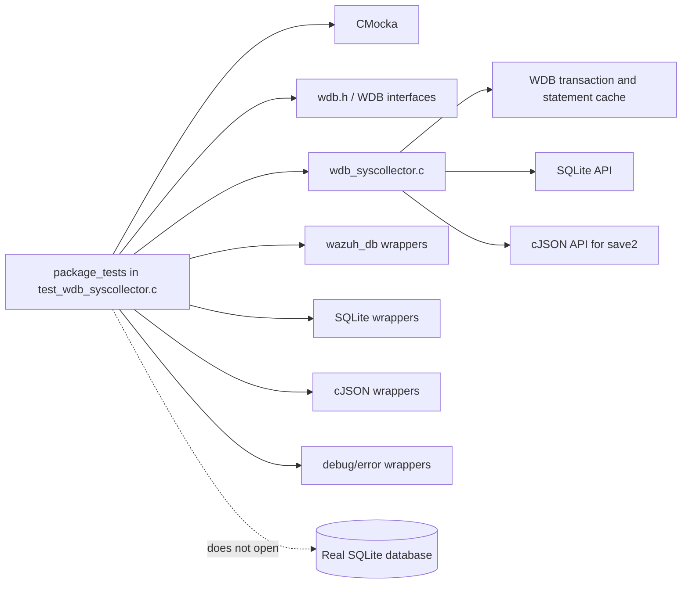

# `package_tests`

## Introduction

`package_tests` is the package-inventory slice of the Wazuh DB syscollector unit-test suite. It validates the SQLite persistence behavior for installed software records, including direct inserts, transactional saves, package refresh/update processing, deletion, duplicate handling, nullable fields, and failure propagation.

The tests are implemented in [`src/unit_tests/wazuh_db/test_wdb_syscollector.c`](src/unit_tests/wazuh_db/test_wdb_syscollector.c). They exercise production functions from `wdb_syscollector.c` through CMocka wrappers; no real database is required. General fixture ownership and wrapper conventions are documented in [`test_wdb_syscollector_test_infrastructure.md`](test_wdb_syscollector_test_infrastructure.md), while the complete parent suite is described in [`test_wdb_syscollector.md`](test_wdb_syscollector.md).

## Scope and role

The module verifies the manager-side storage path for records persisted in the `sys_programs` table. A package record is associated with a `scan_id` and may include package-manager metadata, a size, checksums, and an `item_id` used by replacement/integrity logic.

It sits below the syscollector ingestion layer and above the generic Wazuh DB/SQLite facilities:



For database daemon lifecycle, pooling, and storage ownership, see [`wazuh_db.md`](wazuh_db.md) and [`wazuh_db_engine.md`](wazuh_db_engine.md). For the production FIM/syscollector persistence design, see [`wazuh_db_fim_syscollector.md`](wazuh_db_fim_syscollector.md).

## Components under test

| Function | Responsibility tested | Main outcomes |
|---|---|---|
| `wdb_package_insert()` | Bind one package record and execute the insert/replace statement | `0` on `SQLITE_DONE`; `-1` on cache or SQL failure; duplicate constraints may be accepted when recognized as idempotent |
| `wdb_package_save()` | Start a transaction when needed, then delegate to the insert operation | Propagates transaction and insert failures; succeeds after a complete insert |
| `wdb_package_update()` | Read existing package identity fields and update rows requiring refreshed package metadata | Covers initial query, row iteration, update statement caching, update execution, and error propagation |
| `wdb_package_delete()` | Delete all package rows associated with a scan | Covers transaction start, statement caching, binding `scan_id`, SQL execution, and success |
| `wdb_syscollector_save2()` | Parse JSON and dispatch package payloads to package persistence | Covers malformed payloads, missing attributes, invalid component selection, package save failure, and success |

The package argument order is intentionally asserted because the production API uses a wide C signature rather than a package structure:

```text
scan_id, scan_time, format, name, priority, section, size,
vendor, install_time, version, architecture, multiarch, source,
description, location, checksum, item_id, replace
```

## Package insert behavior

`wdb_package_insert()` first obtains the package prepared statement through `wdb_stmt_cache()`. It then binds 17 values in order:



The binding expectations verify that:

- textual metadata is passed to `sqlite3_bind_text`;
- `size` uses a 64-bit integer binding when non-negative, including zero;
- a negative size is normalized to SQLite `NULL` by the production code;
- `architecture == NULL` is accepted as a nullable package field and triggers removal of the previous row by `item_id` before the replacement insert;
- `checksum` and `item_id` are bound as the final two parameters;
- SQLite execution errors use the database error text in the expected log message.

The corresponding cases include `test_wdb_package_insert_cache_fail`, `test_wdb_package_insert_success`, `test_wdb_package_insert_step_error`, `test_wdb_package_insert_architecture_null`, `test_wdb_package_insert_size_negative_value`, `test_wdb_package_insert_constraint_success`, and `test_wdb_package_insert_constraint_fail`, along with the earlier direct-wrapper variants in the same source file.

## Transactional save behavior

`wdb_package_save()` is the higher-level operation used when a package arrives as part of an inventory scan. It begins a transaction if the `wdb_t` context is not already in one, then invokes `wdb_package_insert()`.



The save tests distinguish transaction ownership from insertion: `test_wdb_package_save_transaction_fail` injects a failed `wdb_begin2()`, `test_wdb_package_save_insert_fail` injects a statement-cache failure, and `test_wdb_package_save_success` verifies the complete transaction-to-insert path. The `replace` flag is passed through to the production function and is not interpreted by the test fixture itself.

## Package refresh and deletion

`wdb_package_update()` models the refresh path used to reconcile package rows. The test first returns a row from the query for the selected `scan_id`, exposing the existing `cpe`, `msu_name`, `format`, `name`, `vendor`, `version`, and `arch` values. The implementation then caches an update statement, binds those values plus the scan identifier, and executes the update.

```mermaid
flowchart TD
    U[wdb_package_update(scan_id)] --> QCache[Cache select statement]
    QCache --> QBind[Bind scan_id]
    QBind --> Query[wdb_step]
    Query -->|SQLITE_ROW| Read[Read seven package identity columns]
    Read --> UCache[Cache update statement]
    UCache --> UBind[Bind cpe, msu_name, scan_id, format, name, vendor, version, arch]
    UBind --> Update[wdb_step]
    Update -->|SQLITE_DONE| Next{More rows?}
    Next -->|yes| Read
    Next -->|no| Done[Return 0]
    QCache -->|failure| Fail[Log and return -1]
    UCache -->|failure| Fail
    Update -->|error| Fail
```

The update cases cover failure to begin a transaction, failure to cache either the read or update statement, failure during update execution, and the successful row/update loop. `wdb_package_delete()` separately verifies deletion of all package rows for a scan, including transaction, cache, bind, SQL error, and success paths.

## JSON dispatch coverage

The package-specific `save2` cases configure the cJSON wrappers to simulate a parsed payload, attribute extraction, and package field values. The dispatcher must select `WDB_SYSCOLLECTOR_PACKAGES`, call the package save path, and always release the parsed JSON object.



`test_wdb_syscollector_save2_package_fail` verifies propagation of a package transaction/persistence failure. `test_wdb_syscollector_save2_package_success` verifies successful dispatch, insertion, and cleanup. Parser-level failures and other inventory components belong to the parent [`test_wdb_syscollector.md`](test_wdb_syscollector.md) document.

## Dependencies and mocking boundary



The tests use `will_return()` to supply wrapper results and `expect_*()` to assert call order, parameter positions, values, and diagnostics. `setup_wdb()` creates a synthetic `wdb_t` with a database slot and statement sentinel; it does not create a live SQLite connection. The shared fixture and binding helpers are documented in [`test_wdb_syscollector_test_infrastructure.md`](test_wdb_syscollector_test_infrastructure.md).

## Test matrix

| Area | Success coverage | Failure/edge coverage |
|---|---|---|
| Insert | Complete 17-field bind and `SQLITE_DONE` | Statement-cache failure, SQL error, duplicate constraint accepted/rejected, null architecture, negative size |
| Save | Transaction plus insert | Begin-transaction failure and delegated insert failure |
| Update | Query row, bind update fields, execute update loop | Read cache failure, update cache failure, update SQL failure, begin failure |
| Delete | Bind `scan_id` and delete successfully | Begin failure, cache failure, SQL failure |
| JSON save2 | Parse, dispatch package component, persist, delete JSON | Package persistence failure; shared dispatcher tests cover malformed and invalid input |

## Running and maintaining the tests

The cases are registered in the `main()` function of `test_wdb_syscollector.c` using `cmocka_unit_test` or `cmocka_unit_test_setup_teardown`. Run them through the repository’s unit-test build for the Wazuh DB test target. When changing package SQL, parameter order, nullable-field rules, duplicate handling, or log messages, update the corresponding wrapper expectations and this matrix together.

These tests validate the C persistence contract only. End-to-end socket/API behavior and database lifecycle belong to [`wazuh_db_command_parser.md`](wazuh_db_command_parser.md), [`wazuh_db_engine.md`](wazuh_db_engine.md), and the broader syscollector persistence documentation.
