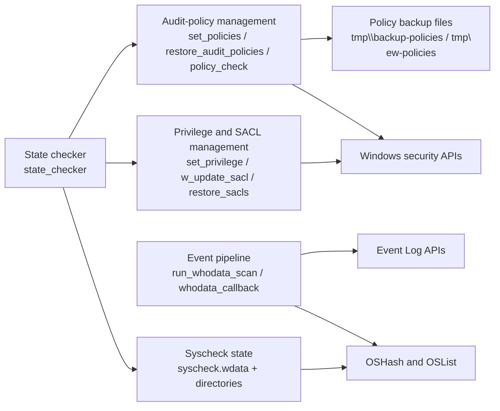
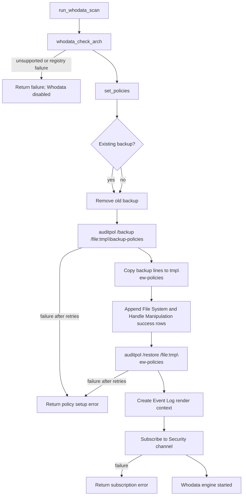
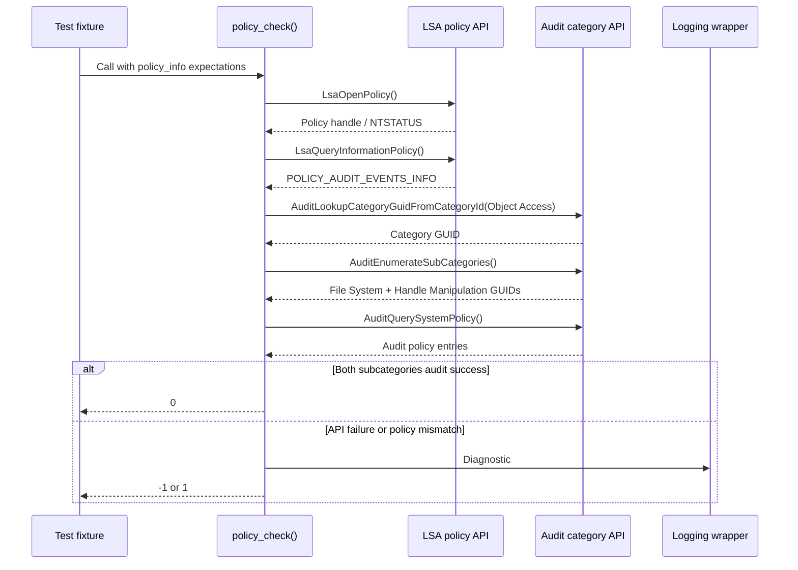
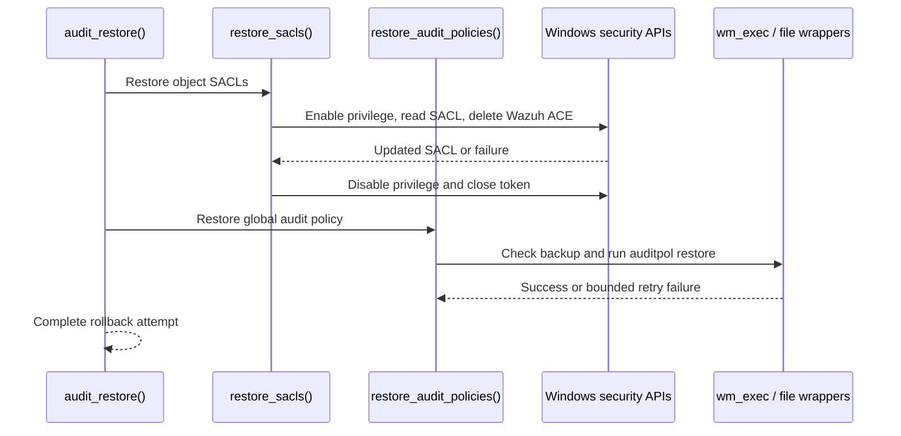
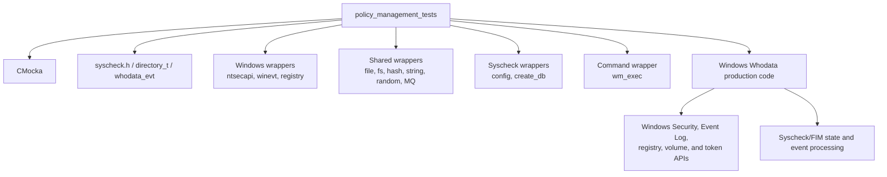

# `policy_management_tests`

## Introduction

`policy_management_tests` documents the Windows policy-management slice of the CMocka suite in `src/unit_tests/syscheckd/whodata/test_win_whodata.c`. The tests validate the operating-system boundaries required by Syscheck/FIM Whodata mode: Windows audit-policy discovery and configuration, SACL validation and mutation, privilege elevation, Security event-channel subscription, event parsing, handle tracking, and state-checker recovery.

The module is test code, not a policy engine. It drives production Whodata functions through wrapped Windows APIs and asserts return values, state transitions, log messages, hash-table operations, and cleanup. The broader Windows Whodata implementation is described in [syscheckd_whodata](syscheckd_whodata.md); FIM event consumption is covered by [fim_realtime_whodata_tests](fim_realtime_whodata_tests.md).

## Scope and source mapping

| Item | Description |
| --- | --- |
| Test source | `src/unit_tests/syscheckd/whodata/test_win_whodata.c` |
| Current module | `policy_management_tests` |
| Production boundary | Windows Whodata implementation included by the test build |
| Framework | CMocka with linker/API wrappers |
| Platform | Windows agent / Windows Whodata build |
| Primary state | Global `syscheck`, `syscheck.wdata`, audit-policy flags, and event subscription context |
| Main fixtures | `policy_info`, configured `directory_t`, `whodata_evt`, and Whodata hash tables |

The source translation unit also registers sibling groups for callback and state-checker behavior. This document concentrates on the policy and policy-adjacent contracts represented by the current module: `set_policies`, `restore_audit_policies`, `policy_check`, `set_privilege`, `w_update_sacl`, `restore_sacls`, `audit_restore`, `check_object_sacl`, `run_whodata_scan`, and their directly exercised helpers.

## Architecture

```mermaid
flowchart TD
    R[ CMocka runner\nmain() ] --> G[ Test groups and fixtures ]
    G --> P[ Policy-management test cases ]
    P --> SUT[ Windows Whodata production functions ]

    SUT --> AUDIT[ Windows audit APIs\nLsa* / Audit* / auditpol ]
    SUT --> SEC[ Security descriptor APIs\nGet/SetNamedSecurityInfo\nACL / ACE / SID ]
    SUT --> EVT[ Windows Event Log APIs\nEvtRender / EvtSubscribe ]
    SUT --> REG[ Registry and volume APIs ]
    SUT --> FIM[ Syscheck/FIM state\nOSList / OSHash / directory_t ]

    AUDIT --> W[ CMocka wrappers ]
    SEC --> W
    EVT --> W
    REG --> W
    FIM --> W
    W --> A[ Scripted returns, call expectations,\nerror codes, and output parameters ]
    P --> X[ Assertions on result, logs,\nstate, and resource cleanup ]
```

The test harness keeps the production control flow intact while replacing environmental boundaries. No live Windows Security log, registry, token, ACL, volume enumeration, or `auditpol.exe` invocation is required.

### Component relationships



`policy_check()` verifies that the system policy contains successful auditing for the Object Access category's File System and Handle Manipulation subcategories. `set_policies()` temporarily rewrites a backup generated by `auditpol` to enable those subcategories, and `restore_audit_policies()` restores the original backup. SACL functions provide per-object auditing and are used by the state checker when directories are added or re-added.

## Policy-management data model

The fixture type `policy_info` models the Windows structures returned by the policy APIs:

| Field | Meaning in the fixture |
| --- | --- |
| `category_guid` | Object Access category GUID (`{6997984A-797A-11D9-BED3-505054503030}`) |
| `subcategory_guid1` | File System GUID (`{0CCE921D-69AE-11D9-BED3-505054503030}`) |
| `subcategory_guid2` | Handle Manipulation GUID (`{0CCE9223-69AE-11D9-BED3-505054503030}`) |
| `audit_event_info` | `LsaQueryInformationPolicy` result and auditing mode metadata |
| `paudit_policy` | Two `AUDIT_POLICY_INFORMATION` entries, normally requiring success auditing |

The SACL tests model an Everyone SID and an audit ACE with inherited success flags and the access mask needed for FIM operations: write, append, write-DAC, write-attributes, and delete. The exact Windows constants are asserted in the source tests rather than inferred from log output.

## Audit-policy lifecycle



The tests establish a six-attempt retry contract: the initial attempt plus five retries. They distinguish command execution failure, timeout, and non-zero command status, and verify the final diagnostic after all attempts fail. File-open, file-remove, and file-close failures are also isolated.

`restore_audit_policies()` requires `tmp\\backup-policies`; if the backup is absent it returns failure without executing `auditpol`. When present, it invokes `auditpol /restore /file:"tmp\\backup-policies"` and applies the same bounded retry behavior.

## Policy verification flow



The suite covers every failure boundary: opening and querying LSA policy, resolving the category GUID, enumerating subcategories, and querying system policy. A policy mismatch is distinct from an API failure: `test_policy_check_not_match` returns `1`, while API failures return `-1`.

## SACL and privilege flow

```mermaid
flowchart TD
    C[check_object_sacl / set_winsacl / w_update_sacl] --> T[Open process token]
    T -->|failure| X[Log; return failure]
    T --> V[set_privilege(SeSecurityPrivilege, enable)]
    V -->|failure| X
    V --> G[GetNamedSecurityInfo for SACL]
    G -->|failure| X
    G --> I[is_valid_sacl]
    I -->|valid| KEEP[Keep existing SACL]
    I -->|missing/invalid| N[Allocate and initialize new ACL]
    N --> O[Copy existing ACEs]
    O --> E[Build Everyone audit ACE]
    E --> S[SetNamedSecurityInfo]
    KEEP --> D[Disable SeSecurityPrivilege]
    S --> D
    D --> H[Close token handle and free buffers]
    H --> OUT[Return success or error]
```

`set_privilege()` is independently tested for lookup failure, `AdjustTokenPrivileges` failure, elevation, and reduction. Successful paths assert the expected debug message for adding or removing `SeSecurityPrivilege`.

`set_winsacl()` preserves existing ACEs and adds the required audit ACE when the current SACL is insufficient. `w_update_sacl()` follows the same construction pattern for a target object. Tests cover SID creation, ACL sizing, allocation, `InitializeAcl`, `GetAce`, `AddAce`, SID copying, `SetNamedSecurityInfo`, and cleanup failures. `check_object_sacl()` maps a valid SACL to success, an invalid SACL to a repair-needed result, and security-information/token failures to an error result.

## Restoration and rollback



`restore_sacls()` only targets directories marked for restoration and removes the injected ACE before writing the original security information back. The tests cover missing security information, failed ACE deletion, failed security-info write, and success. `audit_restore()` composes object-SACL restoration with global audit-policy restoration.

## Event-channel and callback contract

Although the policy tests focus on configuration, the same policy state controls the Windows Security event pipeline.

```mermaid
flowchart LR
    S[run_whodata_scan] --> Q[set_subscription_query]
    Q --> C[EvtCreateRenderContext]
    C --> U[EvtSubscribe(Security channel)]
    U --> E[Security event]
    E --> R[whodata_event_render]
    R --> P[whodata_event_parse]
    P --> I[Event ID / handle ID / access mask]
    I --> H[syscheck.wdata.fd hash]
    H --> FIM[fim_whodata_event or directory scan state]
```

The query selects object-access events relevant to files and the event IDs exercised by the suite: 4656 (handle requested), 4663 (object access), 4658 (handle closed), and 4719 (audit-policy change). Rendering is tested as a two-call `EvtRender` operation: first obtain the required buffer size, then render nine properties. The parser accepts the Windows variant forms used by 32-bit and 64-bit agents and rejects null or incompatible types.

For detailed callback behavior, including handle deduplication, directory scan states, and FIM event delivery, see [fim_realtime_whodata_tests](fim_realtime_whodata_tests.md).

## Test groups and coverage

| Group | Representative cases | Contract covered |
| --- | --- | --- |
| `set_privilege` | lookup, adjust, enable, disable | Token privilege lifecycle and diagnostics |
| `set_policies` | backup, rewrite, restore, file errors, retries | Global audit-policy setup |
| `restore_audit_policies` | missing backup, command failure, success | Policy rollback |
| `policy_check` | match, mismatch, each Windows API failure | Policy inspection and result classification |
| `set_winsacl` / `w_update_sacl` | invalid SACL, allocation, ACE, SID, write failures | Per-object audit ACL construction |
| `check_object_sacl` | retrieval error, invalid SACL, valid SACL | SACL health evaluation |
| `restore_sacls` / `audit_restore` | deletion/write failures and success | Reversal of temporary monitoring changes |
| `run_whodata_scan` | architecture, policy setup, event subscription | Startup gating and failure handling |
| Path and volume helpers | architecture, wide-char conversion, device mapping | Windows path normalization used by Whodata |
| Event rendering/parsing | buffer, types, IDs, masks, timestamps | Security event decoding boundary |

The test runner uses separate CMocka groups for callback and state-checker cases. Shared setup loads `../test_syscheck.conf`, initializes `syscheck`, creates configured directories, and prepares deterministic policy structures. Teardown frees hash tables, lists, strings, policy arrays, event data, and the global Syscheck configuration. Wrapper expectations also verify lock acquisition/release around shared state.

## Dependencies



Important seams include `LsaOpenPolicy`, `LsaQueryInformationPolicy`, `AuditLookupCategoryGuidFromCategoryId`, `AuditEnumerateSubCategories`, `AuditQuerySystemPolicy`, `GetNamedSecurityInfo`, `SetNamedSecurityInfo`, `EvtRender`, `EvtSubscribe`, `EvtCreateRenderContext`, `wm_exec`, `wfopen`, `fgets`, `fprintf`, `OSHash_*`, and lock wrappers.

## Maintenance guidance

When changing Windows Whodata policy behavior:

1. Update the policy fixture if category/subcategory GUIDs, audit flags, or returned Windows structures change.
2. Preserve the distinction between API failure, policy mismatch, and successful recovery in return-value assertions.
3. Update retry expectations whenever `auditpol` command count, timeout, or retry limits change.
4. Keep privilege enable/disable assertions balanced; temporary `SeSecurityPrivilege` elevation must be reduced on every path.
5. Update SACL tests for both existing-ACL preservation and newly constructed ACL paths.
6. Compile the Windows-agent and Windows-Whodata variants because callback and state-checker registration is conditional.
7. Keep production architecture details in [syscheckd_whodata](syscheckd_whodata.md) and shared FIM behavior in [syscheckd_core](syscheckd_core.md), rather than duplicating them here.

## Related documentation

- [syscheckd_whodata](syscheckd_whodata.md) — Windows/Linux Whodata architecture and production responsibilities.
- [fim_realtime_whodata_tests](fim_realtime_whodata_tests.md) — FIM handling after a Whodata event reaches the scan engine.
- [test_run_check](test_run_check.md) — Syscheck runtime and Whodata startup/control-flow tests.
- [test_syscheck](test_syscheck.md) — Syscheck initialization and Windows Whodata activation tests.
- [syscheckd_core](syscheckd_core.md) — Core FIM lifecycle and scan orchestration.
