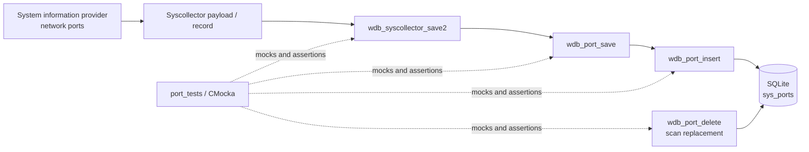
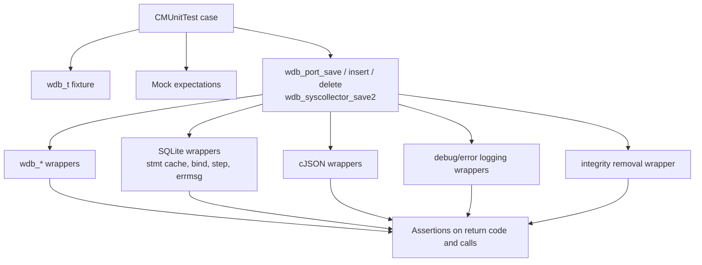
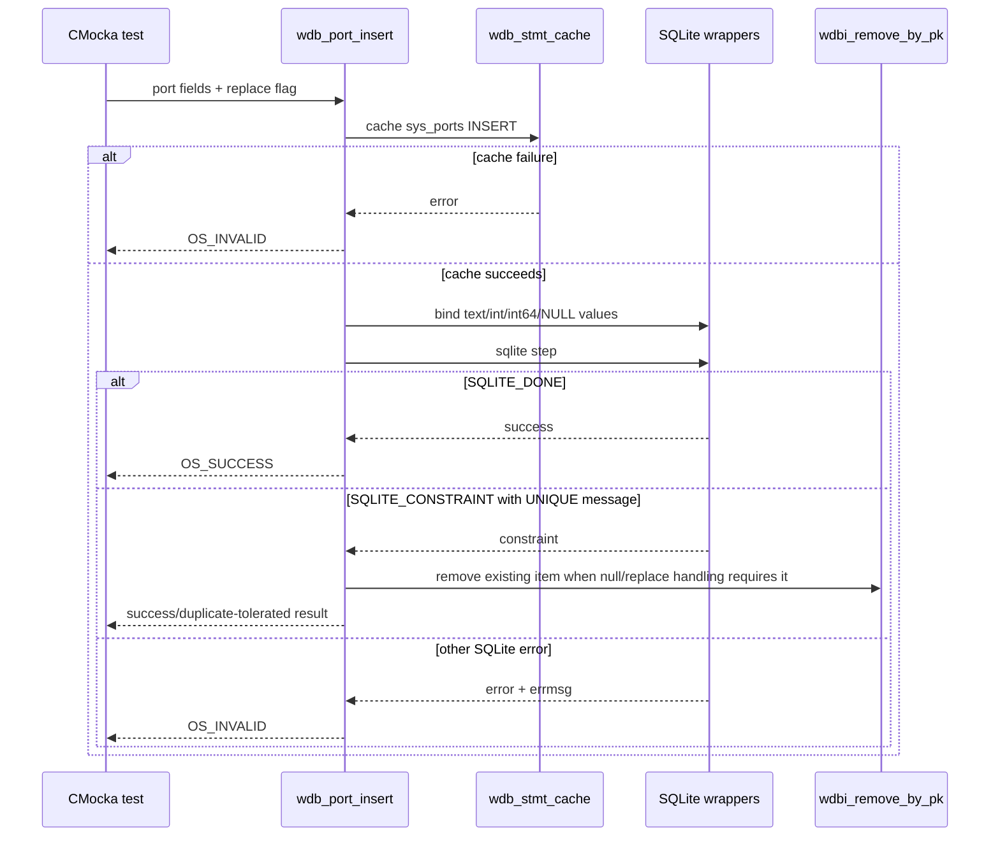
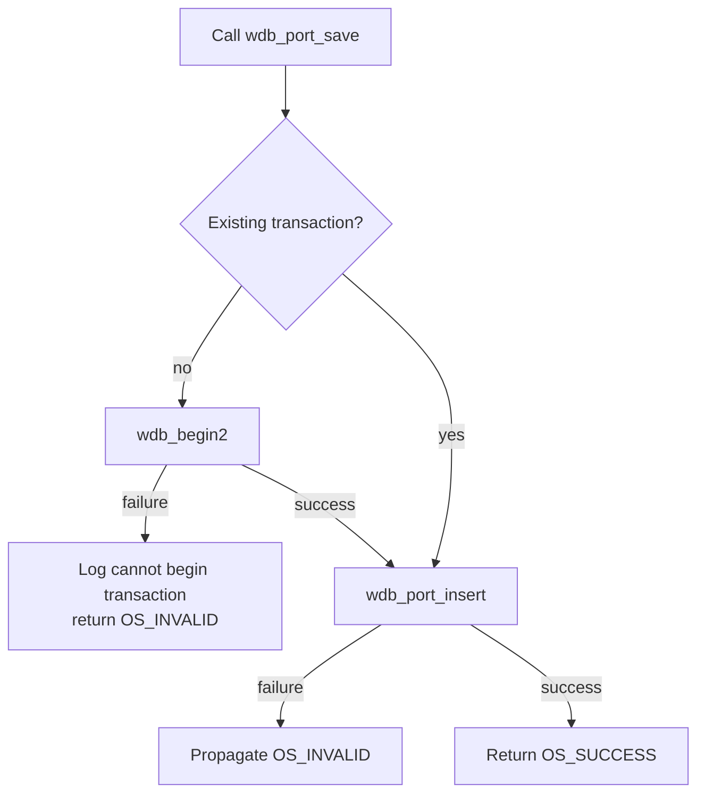
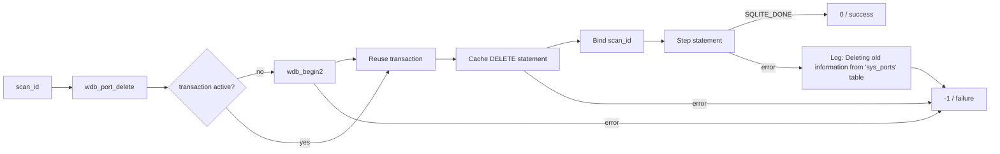

# `port_tests`

`port_tests` documents the CMocka coverage for Wazuh DB persistence of system-collector network-port records. The tests exercise the public `wdb_*` persistence functions with mocked SQLite, JSON, transaction, logging, and integrity helpers. They verify both the normal path and the database-layer failure behavior used by the Wazuh DB service.

The test source is `src/unit_tests/wazuh_db/test_wdb_syscollector.c`; in the supplied module tree, this module is the `port_tests` child under `Unit_Tests_-_Wazuh_DB` → `test_wdb_syscollector`. Related system-collector persistence tests are documented in [`test_wdb_syscollector.md`](test_wdb_syscollector.md), while the database engine context is in [`wazuh_db_engine.md`](wazuh_db_engine.md).

## Scope and responsibilities

The port-focused tests cover these operations:

| Operation | Function under test | Expected responsibility |
|---|---|---|
| Save one port record | `wdb_port_save` | Start a transaction when required, delegate to insertion, and return the delegated result. |
| Insert one port record | `wdb_port_insert` | Cache the prepared statement, bind the port fields, execute SQLite, and normalize selected duplicate/null cases. |
| Remove one scan snapshot | `wdb_port_delete` | Start a transaction when required and delete rows from `sys_ports` by `scan_id`. |
| JSON-driven save | `wdb_syscollector_save2(..., WDB_SYSCOLLECTOR_PORTS, ...)` | Parse the payload, select the port component, extract attributes, and route them to port persistence. |

The supplied source also contains tests for other syscollector entities—network interfaces, routes, addresses, OS information, packages, hotfixes, hardware, processes, users, and groups. Those are adjacent coverage in the same compilation unit; this document treats them as shared test infrastructure and cross-component context rather than as part of the port contract.

## Position in the system

Port records are collected by the system-information providers and persisted by the Wazuh DB layer. The port tests sit below the collector/API boundary and validate the storage contract at the SQLite statement-binding boundary.



The provider-side collection behavior is described by [`data_provider_ports.md`](data_provider_ports.md). Database lifecycle and storage abstractions are described by [`wazuh_db_engine.md`](wazuh_db_engine.md); this module verifies their port-specific callers without opening a real database.

## Test architecture

The test suite uses two setup styles:

1. `test_setup`/`test_teardown` allocate a minimal `wdb_t` and are used by the legacy/direct tests.
2. `setup_wdb`/`teardown_wdb` allocate a richer fixture with agent ID `000`, a database pointer, statement slot, transaction state, and output buffer. These fixtures support the newer table-driven port object tests.

The production calls are linked against wrappers. CMocka controls wrapper return values with `will_return`, validates arguments with `expect_*`, and checks diagnostic messages through wrapped logging functions.



### Dependencies

- `wdb.h`: `wdb_t`, syscollector component identifiers, network address constants, and persistence declarations.
- SQLite wrapper layer: prepared-statement caching, typed parameter binding, stepping, error retrieval, and `SQLITE_*` result codes.
- cJSON wrapper layer: payload parsing, attribute lookup, string extraction, and object deletion.
- Wazuh DB wrappers: transaction start, statement cache, and removal of an existing record by component/primary key.
- CMocka: test registration, fixtures, return-value injection, call expectations, and assertions.

## Port record contract

The port fixture models the fields passed to `wdb_port_insert`:

| Position | Field | Type/handling in tests |
|---:|---|---|
| 1 | `scan_id` | Text; required snapshot identifier. |
| 2 | `scan_time` | Text. |
| 3 | `protocol` | Text; nullable input is tested. |
| 4 | `local_ip` | Text; nullable input is tested. |
| 5 | `local_port` | Integer; zero is valid, negative sentinel becomes SQL `NULL`. |
| 6 | `remote_ip` | Text; may be `NULL` for listening/local-only sockets. |
| 7 | `remote_port` | Integer; zero is valid. |
| 8 | `tx_queue` | Integer; zero is valid. |
| 9 | `rx_queue` | Integer; zero is valid. |
| 10 | `inode` | 64-bit integer; zero is valid, negative sentinel becomes SQL `NULL`. |
| 11 | `state` | Text; blank values are allowed by the fixture. |
| 12 | `pid` | Integer; zero is valid. |
| 13 | `process` | Text, such as `svchost.exe`. |
| 14 | `checksum` | Text record fingerprint. |
| 15 | `item_id` | Text stable item key used for replacement/removal. |

The representative fixture is a UDP/IPv6 port with local address `::`, local port `54958`, no remote address, PID `1744`, and process `svchost.exe`. It sets `replace = true`, allowing the implementation to treat the item as a replacement-safe inventory record.

## Insert behavior

`wdb_port_insert` is tested as a prepared-statement operation:



The tests explicitly verify:

- statement-cache failure returns `OS_INVALID` and logs `at wdb_port_insert(): cannot cache statement`;
- successful insertion binds all 15 parameters and returns `OS_SUCCESS`;
- negative sentinel values are bound as SQL `NULL` rather than as invalid integers;
- nullable `protocol` and `local_ip` values can still complete successfully;
- a `SQLITE_ERROR` result logs the SQLite message and returns `OS_INVALID`;
- a `SQLITE_CONSTRAINT` result is accepted only for the expected unique-constraint message; an unrelated constraint message remains an error;
- null-value cases expect `wdbi_remove_by_pk(WDB_SYSCOLLECTOR_PORTS, item_id)` before the replacement insert path completes.

The legacy tests use the same contract with simpler literal values and additionally verify direct `sqlite3_bind_*` positions. The newer helper `configure_wdb_port_insert` centralizes those expectations and is the preferred pattern for extending coverage.

## Save behavior

`wdb_port_save` provides the transaction-aware wrapper around insertion.



The tests cover transaction-start failure, insertion/statement-cache failure, and the successful path. They initialize `transaction` to `0` for the begin path and to `1` to prove that an existing transaction is reused.

## Delete behavior

`wdb_port_delete` removes all port inventory associated with a scan identifier from `sys_ports`.



The delete tests distinguish three failure points:

- transaction initialization;
- statement caching;
- SQLite execution, including the expected message `Deleting old information from 'sys_ports' table: ERROR`.

The success test verifies that `scan_id` is bound at parameter 1 and that `SQLITE_DONE` produces a zero return value.

## JSON dispatch behavior

`wdb_syscollector_save2` is tested as the component dispatcher for port payloads. The port-specific route is one branch of a broader dispatcher also covered for processes, packages, hotfixes, network protocol/address/interface data, hardware, and OS information.

```mermaid
flowchart TD
    A[JSON payload] --> B[cJSON_Parse]
    B -- null --> X[Log no payload\nreturn -1]
    B -- object --> C[cJSON_GetObjectItem(attributes)]
    C -- null --> Y[Delete JSON object\nlog no attributes\nreturn -1]
    C -- present --> D{component}
    D -- WDB_SYSCOLLECTOR_PORTS --> E[Extract port fields]
    E --> F[wdb_port_save / insert]
    F --> G[Delete JSON object]
    G --> H[Return port result]
    D -- invalid --> I[Delete JSON object\nlog Invalid component\nreturn -1]
```

For `WDB_SYSCOLLECTOR_PORTS`, the tests provide mocked values for `scan_time`, `protocol`, `local_ip`, `remote_ip`, `state`, `process`, `checksum`, and `item_id`, plus integer attributes for ports, queues, inode, and PID. They verify both a transaction-start failure and a fully successful insert, and always expect `cJSON_Delete` after a parsed payload has been accepted.

## Failure and result conventions

The suite establishes the following observable contract:

| Condition | Result | Observable behavior |
|---|---:|---|
| Transaction cannot begin | `OS_INVALID` / `-1` | Debug message identifies the failing port function. |
| Statement cannot be cached | `OS_INVALID` / `-1` | Debug message identifies the statement operation. |
| Parameter binding fails or SQLite returns a general error | `OS_INVALID` / `-1` | Error message includes `sqlite3_errmsg`. |
| Expected unique constraint | `OS_SUCCESS` / `0` | Duplicate is debug-logged and treated as an idempotent outcome. |
| Unexpected constraint | `OS_INVALID` / `-1` | Constraint message is logged as an error. |
| Valid insertion/deletion | `OS_SUCCESS` / `0` | SQLite returns `SQLITE_DONE`. |
| Invalid/missing JSON payload | `-1` | JSON object is cleaned up when allocated and a diagnostic is emitted. |

The source uses both `OS_SUCCESS`/`OS_INVALID` and literal `0`/`-1`; they represent the same success/failure convention in the tested APIs.

## Fixtures and extension guidance

When adding a port test:

1. Prefer `setup_wdb`/`teardown_wdb` for tests that inspect binding, replacement, or integrity-removal behavior.
2. Use `configure_wdb_port_insert` to define the expected parameter types and SQLite result.
3. Modify one input dimension at a time—null text, negative numeric sentinel, zero, duplicate constraint, or general SQLite error.
4. Assert both return value and diagnostic/integrity calls where the behavior is externally meaningful.
5. Preserve cleanup expectations: parsed JSON must be deleted, and fixture allocations must be released by teardown.

The broader Wazuh DB test conventions and neighboring syscollector entities are documented in [`test_wdb_syscollector.md`](test_wdb_syscollector.md) and [`test_wdb.md`](test_wdb.md). The implementation-level database abstractions are intentionally referenced through [`wazuh_db_engine.md`](wazuh_db_engine.md) rather than duplicated here.

## Test inventory

The port-specific named tests include:

- `test_wdb_port_save_transaction_fail`
- `test_wdb_port_save_insert_fail`
- `test_wdb_port_save_success`
- `test_wdb_port_insert_cache_fail`
- `test_wdb_port_insert_sql_fail`
- `test_wdb_port_insert_stmt_cache_fail`
- `test_wdb_port_insert_success`
- `test_wdb_port_insert_null_values_success`
- `test_wdb_syscollector_save2_port_fail`
- `test_wdb_syscollector_save2_port_success`
- helper coverage in `configure_wdb_port_insert`

Together these cases validate the port path from JSON dispatch through transaction management and typed SQLite persistence, including idempotent replacement and malformed-value handling.
