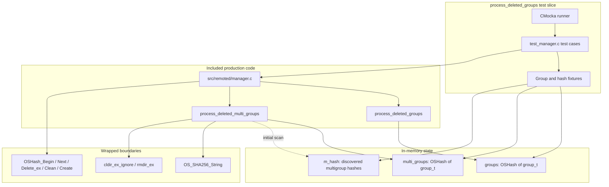
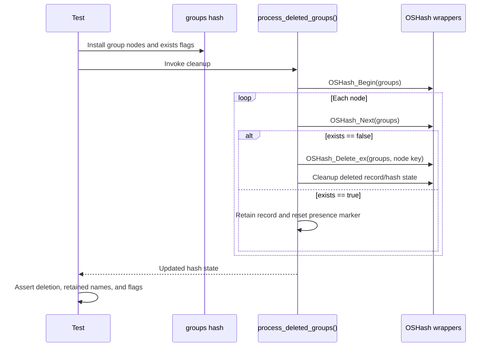
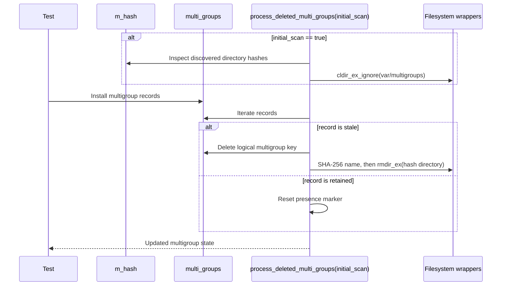
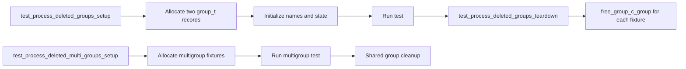

# `process_deleted_groups` Tests

## Introduction

This module documents the CMocka tests for the deleted-group maintenance paths in Wazuh `remoted`. The tests exercise `process_deleted_groups()` and `process_deleted_multi_groups()` from `src/remoted/manager.c`, including hash traversal, stale-record removal, multigroup directory cleanup, initial-scan handling, and fixture cleanup.

These tests are a focused slice of the broader [remoted group management](remoted_group_management.md) subsystem. They do not build merged configuration files or process agent control messages; those responsibilities are covered by the wider [test manager remoted test infrastructure](test_manager_remoted_test_infrastructure.md).

## Purpose and system position

During the periodic shared-configuration refresh, `remoted` reconstructs the set of groups currently present on disk and the multigroups currently reported by Wazuh DB. Records that were present during a previous refresh but are not present in the current scan must be retired. The functions under test perform that retirement before the next refresh is committed.


For daemon architecture, lifecycle, database integration, and shared-file generation, see [remoted](remoted.md), [remoted group management](remoted_group_management.md), and [wazuh_db](wazuh_db.md).

## Architecture

The test translation unit includes the production implementation directly. This makes static functions and global hashes observable, while CMocka wrappers isolate filesystem and hash operations.



### Components

| Component | Responsibility in this test slice |
| --- | --- |
| `test_manager.c` | Registers the tests and programs CMocka expectations. |
| `manager.c` | Supplies the production deletion and retention logic. |
| `groups` | Hash of single-group `group_t` records. |
| `multi_groups` | Hash of comma-separated multigroup records. |
| `m_hash` | Hash representing discovered multigroup directories during an initial scan. |
| `group_t.exists` | Per-refresh presence marker. A false value identifies a stale record when cleanup runs. |
| `OSHash_*` wrappers | Make iteration, deletion, cleanup, and allocation deterministic. |
| `OS_SHA256_String` and `rmdir_ex` wrappers | Verify the multigroup name-to-directory cleanup path without deleting real data. |

The `group_t` objects used by the tests contain at least a name, `exists`, `has_changed`, and file-time/checksum state. Their complete ownership and use are described in [remoted group management](remoted_group_management.md).

## Data flow

```mermaid
flowchart TD
    A[Previous hash contents] --> B[OSHash_Begin]
    B --> C{Next node?}
    C -- no --> Z[Finish cleanup]
    C -- yes --> D[Read group_t.exists]
    D -- false --> E[Delete by node key]
    E --> F[Clean deleted record resources]
    D -- true --> G[Retain record]
    F --> H[Advance OSHash_Next]
    G --> H
    H --> C

    M[Deleted multigroup name] --> N[OS_SHA256_String]
    N --> O[Hash-derived directory name]
    O --> P[rmdir_ex(var/multigroups/<hash-prefix>)]
```

The tests show an important refresh-cycle convention: records that survive the pass are expected to remain available but have `exists == false` afterward. This resets the presence marker so the next discovery pass can mark observed records again. A record already marked absent is removed from the hash and its associated resources are cleaned.

For multigroups, the logical key is the comma-separated group list, while the on-disk directory is derived from its SHA-256 value. The deletion test verifies the expected short directory path (`var/multigroups/6e3a1077` for the programmed digest) is passed to `rmdir_ex`.

## Process flows

### Single groups



`test_process_deleted_groups_delete` verifies that `test_default` is deleted while iteration continues to `test_test_default`. `test_process_deleted_groups_no_changes` verifies the no-deletion branch when both entries are initially present.

### Multigroups



The `initial_scan` flag adds cleanup of directory state discovered before the in-memory multigroup map is rebuilt. The initial-scan test specifically verifies this pre-processing while still retaining the currently supplied multigroup records.

## Test cases and coverage

| Test | Scenario | Expected behavior |
| --- | --- | --- |
| `test_process_deleted_groups_delete` | One group has `exists == false`; another is present. | Delete the stale key, clean its resources, continue iteration, and reset the retained record’s presence marker. |
| `test_process_deleted_groups_no_changes` | Both single-group records are present. | No `OSHash_Delete_ex` call; records remain in the hash and are reset for the next scan. |
| `test_process_deleted_multi_groups_delete` | One multigroup is stale and `initial_scan == false`. | Delete the stale logical key and remove its hash-derived directory. |
| `test_process_deleted_multi_groups_no_changes` | Both multigroup records are present and `initial_scan == false`. | Do not delete records or directories; reset presence markers. |
| `test_process_deleted_multi_groups_no_changes_initial_scan` | Both records are present and `initial_scan == true`. | Clean the discovered multigroup-directory index, then process current records without deletion. |

The test registration also attaches setup and teardown functions. These are not production behavior tests; they establish ownership and prevent group objects, names, and hashes from leaking across cases.

## Fixtures and isolation



The deletion tests use mocked `OSHashNode` values so the iterator sequence is explicit. The tests free those mock nodes after the function returns. Hashes and nested `f_time` state are supplied by the broader group fixtures when required; the suite’s general ownership rules are documented in [test manager remoted test infrastructure](test_manager_remoted_test_infrastructure.md).

## Behavioral contract captured by the tests

The tests collectively specify these invariants:

- Cleanup iterates the complete hash, including the node after a deleted entry.
- A stale entry is deleted by its hash key, not by a reconstructed group name.
- Retained entries are not physically removed during this pass.
- Presence flags are cycle markers and are reset after processing.
- Multigroup cleanup distinguishes the logical comma-separated key from the hash-derived filesystem directory.
- Initial-scan cleanup may inspect the discovered directory hash map before normal multigroup retirement.
- All hash and filesystem effects are observable through wrapper expectations, so accidental extra deletion or cleanup calls fail the test.

## Scope and related documentation

This page intentionally does not duplicate the implementation details of group discovery, merged-file generation, checksum comparison, or agent delivery. Follow these references for those concerns:

- [remoted group management](remoted_group_management.md) — production group, multigroup, and shared-file workflows.
- [test manager remoted test infrastructure](test_manager_remoted_test_infrastructure.md) — complete fixture, wrapper, and test-suite conventions.
- [remoted](remoted.md) — daemon architecture and lifecycle integration.
- [shared library](shared_lib.md) — `OSHash`, filesystem, and crypto utility abstractions.
- [wazuh_db](wazuh_db.md) — source of distinct agent multigroup combinations.

