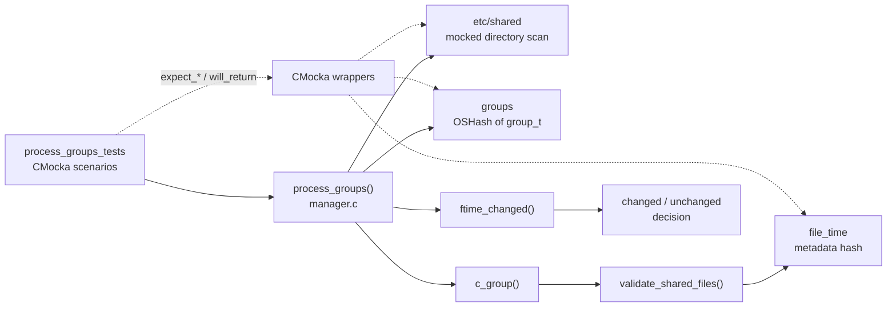
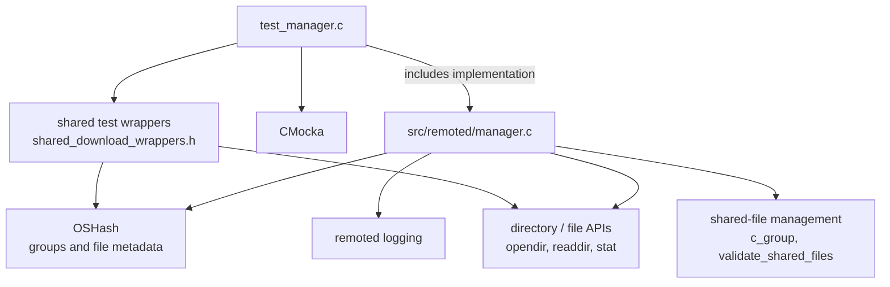
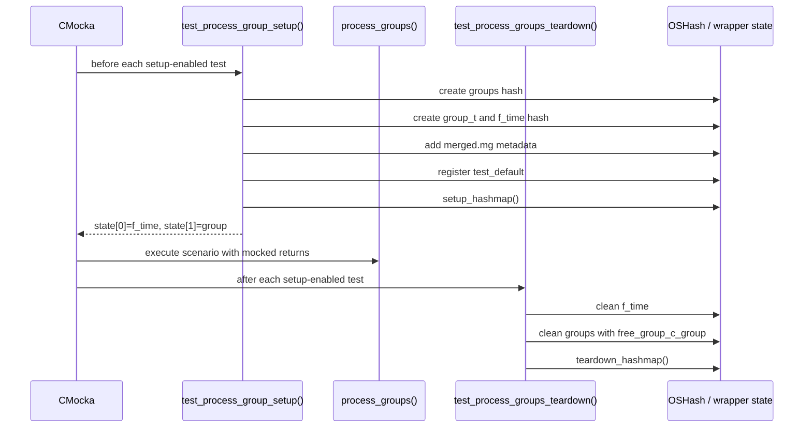

# `process_groups_tests`

`process_groups_tests` is the CMocka scenario group that verifies the directory-scan portion of the remoted manager. It exercises `process_groups()` from `src/remoted/manager.c` through the tests in `src/unit_tests/remoted/test_manager.c`. The scenarios cover discovery of shared agent groups under `etc/shared`, filtering of directory entries, creation of missing group records, and detection of changed versus unchanged group file state.

The tests use mocked filesystem and hash-table operations, so they validate control flow and error handling without requiring a real `etc/shared` tree. General remoted architecture is documented in [`remoted.md`](remoted.md); shared test fixtures and wrapper conventions are described in [`test_manager_remoted_test_infrastructure.md`](test_manager_remoted_test_infrastructure.md).

## Scope and source mapping

| Area | Source or symbol | Responsibility in this test group |
| --- | --- | --- |
| Test entry point | `test_manager.c` | Registers the scenarios with CMocka. |
| Subject under test | `process_groups()` | Scans `etc/shared` and updates the in-memory group registry. |
| Group construction | `c_group()` | Builds a group’s merged representation and file metadata. |
| File validation | `validate_shared_files()` | Walks group files and records validity/metadata. |
| Change comparison | `ftime_changed()` | Compares old and newly collected `file_time` hash contents. |
| Fixture setup | `test_process_group_setup()` | Creates a representative `group_t` and its `f_time` hash. |
| Fixture cleanup | `test_process_groups_teardown()` | Frees the fixture hashes, group records, and wrapper state. |

The process-group scenarios are a focused subset of the larger manager test file. They do not document or retest multi-group processing, shared-file copying, or agent control-message persistence; those concerns belong to adjacent remoted test groups and the modules linked above.

## Architecture



At a high level, `process_groups()` treats each first-level directory below `etc/shared` as a group name. It looks up the group in the global `groups` hash, constructs current file state, and compares that state with the group’s previous `f_time` hash. A new group is registered; an existing group is marked as changed when the file-state hashes differ; unchanged state is discarded or retained according to the production implementation.

The behavior above is inferred from the mocked calls and expected log messages in the supplied tests. The implementation details of group merging and shared-file validation remain owned by [`remoted_group_management.md`](remoted_group_management.md).

## Components and dependencies



The tests intentionally replace the operating-system and helper boundaries with wrappers. This makes each branch deterministic: a `will_return()` value controls whether a directory opens, whether an entry is returned, whether a hash lookup succeeds, and whether a file-state comparison reports a change.

### State model

| State | Meaning | How the tests observe it |
| --- | --- | --- |
| `groups` | Global `OSHash` keyed by group name. | `OSHash_Get_ex()` and `OSHash_Add_ex()` expectations. |
| `group_t` | A discovered group, including its name, merged checksum, change flags, and file-time hash. | Fixture values and the `Group '<name>' has changed.` log expectation. |
| `group_t.f_time` | Previous file metadata keyed by file name. | `OSHash_Get_Elem_ex()`, iteration, and lookup expectations in `ftime_changed()`. |
| Temporary file-time hash | Current scan result produced by `c_group()`. | Mock `OSHash_Create()`, comparison, and cleanup expectations. |
| `mock_hashmap` / wrapper state | Test-only state used by shared-file helpers. | `setup_hashmap()` and `teardown_hashmap()` in the fixture lifecycle. |

## Fixture lifecycle



`test_process_group_setup()` temporarily disables test mode while allocating the real hash structures, then enables it for the scenario. This prevents the test-mode wrappers from interfering with fixture creation. `test_process_groups_teardown()` reverses the process and separately cleans `f_time`, because the group destructor does not own that nested hash.

Tests that only exercise top-level error or filtering paths do not need the full group fixture and call `process_groups()` directly.

## Process flow under test

```mermaid
flowchart TD
    A([Start process_groups]) --> B{Open etc/shared?}
    B -- No --> B1[Log opening failure] --> Z([Return safely])
    B -- Yes --> C{Read next entry}
    C -- NULL --> Z2[Finish scan] --> Z
    C --> D{Entry is . or ..?}
    D -- Yes --> C
    D -- No --> E[Build group path]
    E --> F{Read group directory?}
    F -- No --> F1[Log missing/unreadable group directory] --> C
    F -- Yes --> G{Group exists in groups hash?}
    G -- No --> H[Create and register group record]
    G -- Yes --> I[Reuse existing group record]
    H --> J[Construct current state with c_group]
    I --> J
    J --> K{ftime_changed(old, current)?}
    K -- Yes --> L[Log group changed and refresh state]
    K -- No --> N[Keep unchanged state]
    L --> C
    N --> C
```

This diagram represents the contract exercised by the tests, not a replacement for the implementation. In particular, the tests show that missing directories and empty reads are handled as recoverable conditions, while group changes are reported through a debug log.

## Test scenarios

| Test | Setup | Expected behavior |
| --- | --- | --- |
| `test_process_groups_open_directory_fail` | `opendir()` for `etc/shared` returns null; `strerror()` returns “No such file or directory”. | Logs `Opening directory: 'etc/shared': No such file or directory` and exits without processing entries. |
| `test_process_groups_readdir_fail` | Parent directory opens, but `readdir()` immediately returns null. | Treats the scan as empty and returns safely. |
| `test_process_groups_skip` | First entry is `.`. | Ignores the current-directory marker and terminates after the next null read. |
| `test_process_groups_skip_2` | First entry is `..`. | Ignores the parent-directory marker and terminates after the next null read. |
| `test_process_groups_subdir_null` | Entry `test` is found, but `wreaddir("etc/shared/test")` returns null. | Logs `Could not open directory 'etc/shared/test'` and continues safely. |
| `test_process_groups_find_group_null` | Entry `test` is not present in `groups`; its directory exposes `file_1`. | Adds the new group key, invokes group construction, and tolerates a later merged-file open failure. |
| `test_process_groups_find_group_changed` | Existing `test_default` produces a current file-time hash with a different element count. | `ftime_changed()` reports true, a new group construction path is exercised, and the test expects `Group 'test_default' has changed.` |
| `test_process_groups_find_group_not_changed` | Existing `test_default` produces a file-time hash matching the stored hash size and entries. | `ftime_changed()` reports false; no changed-group log or regeneration path is expected. |

### Missing group registration

`test_process_groups_find_group_null` verifies the discovery path. The top-level directory name is `test`, `OSHash_Get_ex(groups, "test")` returns null, and the subsequent `OSHash_Add_ex()` call is expected. The test then supplies the minimum downstream behavior needed to enter `c_group()`: a parser lookup, an in-memory stream, a generated group header, and a failed merged-file open. The failure is intentionally part of the scenario; the assertion target is that discovery and error handling proceed without a crash.

### Changed group

`test_process_groups_find_group_changed` seeds `test_default` with two prior file-time entries and returns a current hash with one element. This forces the size-mismatch branch of `ftime_changed()`. The test expects the temporary hash to be cleaned, group construction to be repeated, and the change to be logged. It therefore covers both comparison and the observable refresh path.

### Unchanged group

`test_process_groups_find_group_not_changed` returns matching hash cardinality and provides the iteration/lookup sequence needed to compare the stored entries. The absence of a “has changed” expectation is significant: it verifies that a stable group does not enter the regeneration path merely because it was scanned.

## Error handling and invariants

- Failure to open `etc/shared` is logged and treated as a no-op scan.
- A null directory read is not treated as a valid group entry.
- `.` and `..` are never passed into group processing.
- An unreadable group subdirectory is logged and does not abort the whole scan.
- A missing group is inserted into the global registry before its group content is constructed.
- Current file metadata is compared with the stored metadata through `ftime_changed()` rather than by assuming that the directory name alone identifies a change.
- Temporary hashes and nested fixture state must be cleaned after each setup-enabled test; otherwise later CMocka tests can observe stale global state.
- The tests verify log messages as part of the failure contract, so changes to wording or log level can require corresponding test updates.

## Relationship to neighboring tests and modules

Use the following documents for details outside this scenario group:

- [`remoted.md`](remoted.md) — remoted daemon responsibilities and subsystem boundaries.
- [`remoted_group_management.md`](remoted_group_management.md) — production group, merged-file, and shared-directory behavior.
- [`test_manager_remoted_test_infrastructure.md`](test_manager_remoted_test_infrastructure.md) — CMocka wrappers, global setup, and mock ownership.
- [`remoted_request_protocol.md`](remoted_request_protocol.md) — request/control paths tested elsewhere in `test_manager.c`.

## Maintenance guidance

When extending `process_groups()`:

1. Add one scenario per new branch at the same abstraction boundary: mock the directory/hash operation and assert the externally visible state or log.
2. Use `test_process_group_setup()` only when the branch needs a real `group_t` and nested `f_time` hash; keep simple scan failures fixture-free.
3. If ownership of `group_t.f_time` changes, update both setup/teardown and the destructor expectations to avoid double-free or leaks.
4. Preserve the distinction between a missing directory, an empty directory, and an unreadable file; the existing tests treat these as different operational outcomes.

