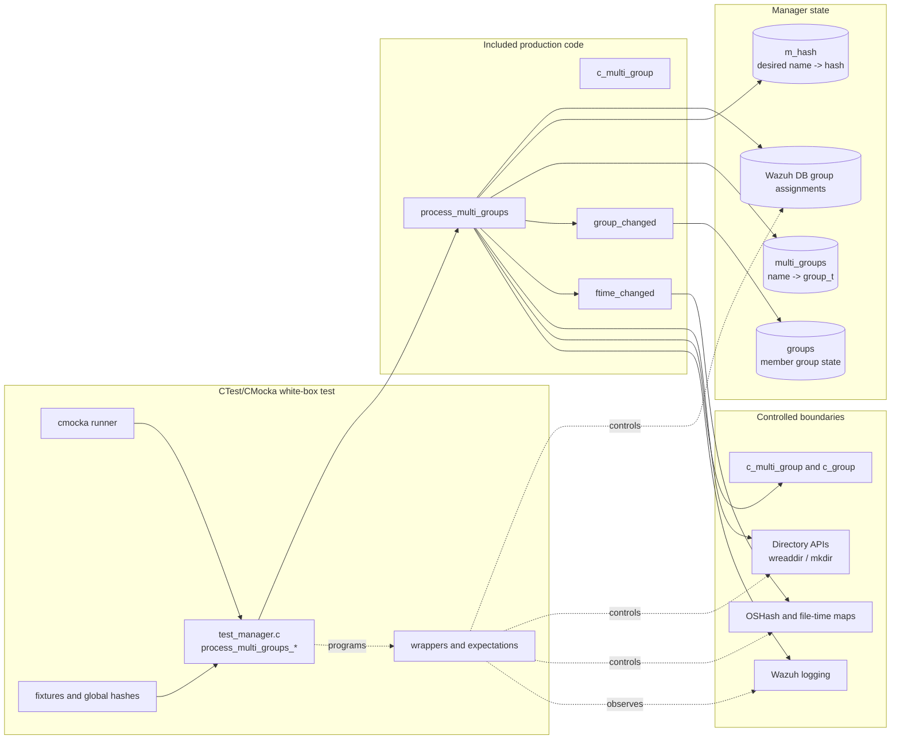
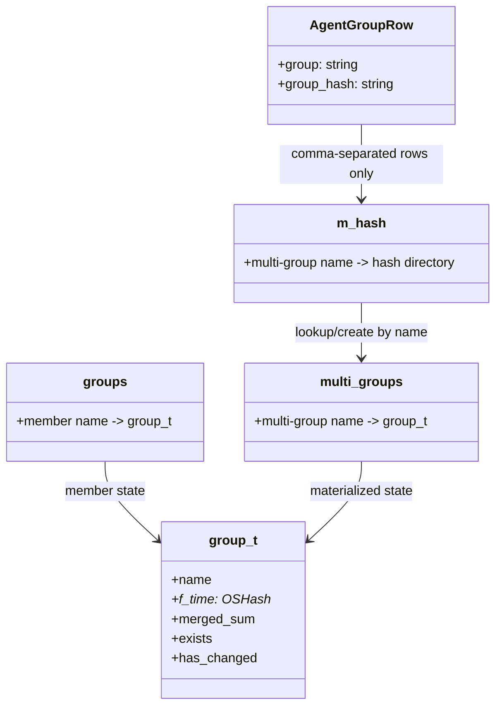
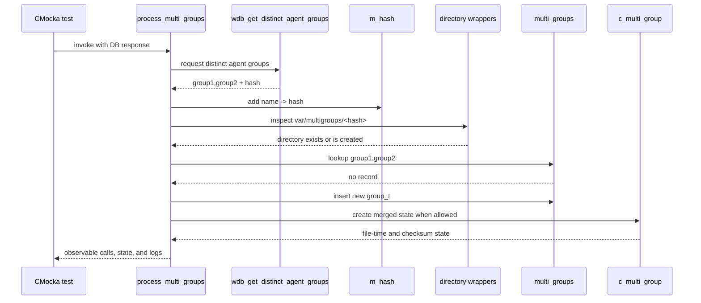
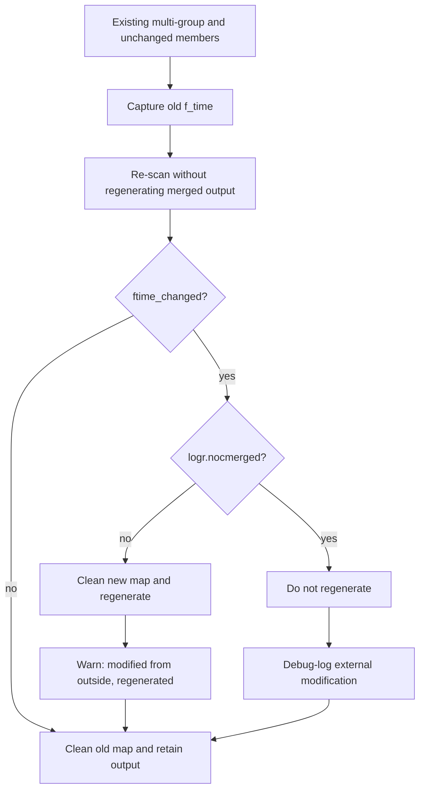
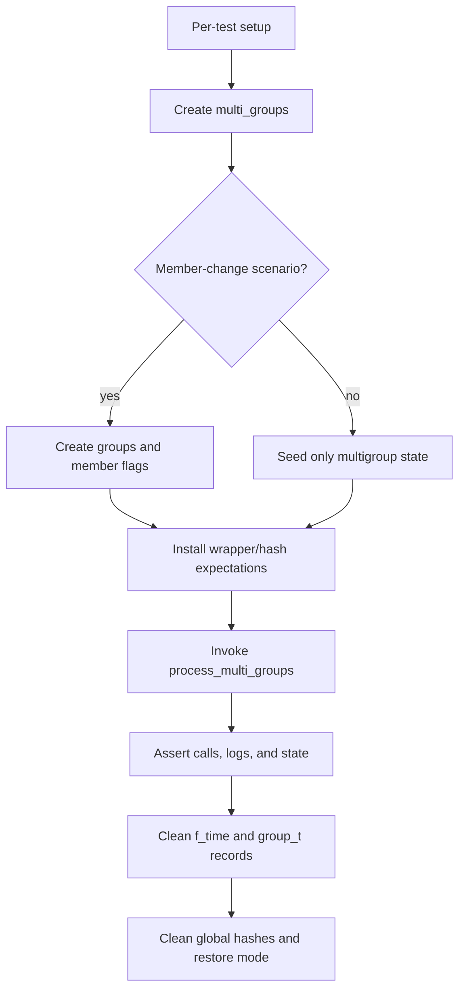

# `process_multi_groups_tests`

## Introduction

`process_multi_groups_tests` documents the CMocka coverage for `process_multi_groups()`, the Remoted manager routine that discovers agent multi-groups and reconciles their generated shared-configuration state.

The tests are white-box tests: `src/unit_tests/remoted/test_manager.c` directly includes `src/remoted/manager.c`, so the suite can invoke static functions and inspect global hash tables, filesystem decisions, and diagnostic messages without starting the Remoted daemon.

This page focuses on the orchestration performed by `process_multi_groups()`. The mechanics of copying and merging files are documented in [`c_multi_group_tests`](c_multi_group_tests.md) and [`copy_directory_tests`](copy_directory_tests.md); the member-group predicate is documented in [`group_changed_tests`](group_changed_tests.md); shared fixtures and wrappers are documented in [`test_manager_remoted_test_infrastructure`](test_manager_remoted_test_infrastructure.md).

## Scope and responsibility

`process_multi_groups()` performs one reconciliation pass:

1. Reads distinct agent-group assignments from Wazuh DB.
2. Keeps only comma-separated assignments, which represent multi-groups.
3. Builds `m_hash`, the desired multi-group name-to-directory-hash index.
4. Ensures each hash-derived directory exists under `var/multigroups`.
5. Creates new `group_t` records in `multi_groups`.
6. Refreshes existing records when a constituent group changed or disappeared.
7. Detects modifications made directly to generated files and optionally regenerates them.

It does not itself remove stale records from `multi_groups`; that is handled by `process_deleted_multi_groups()` during the surrounding `c_files()` cycle. The complete production cycle is described in [`c_files_tests`](c_files_tests.md) and [`remoted_group_management`](remoted_group_management.md).

## Position in the Remoted manager

```mermaid
flowchart TB
    CFILES[c_files(initial_scan)] --> LOCK[files_mutex]
    LOCK --> PG[process_groups]
    PG --> PMG[process_multi_groups]
    PMG --> PDEL[process_deleted_multi_groups]
    PDEL --> UNLOCK[unlock and finish]

    PG -. maintains .-> GROUPS[(groups)]
    PMG -. maintains .-> MGROUPS[(multi_groups)]
    PMG -. rebuilds .-> MHASH[(m_hash)]
```

The test module targets the `PMG` node. It relies on `process_groups()` only through pre-seeded `groups` fixtures; it does not duplicate ordinary-group scanning coverage from [`process_groups_tests`](process_groups_tests.md).

## Architecture and dependencies



### Direct dependencies

| Component | Role in this module |
| --- | --- |
| `src/unit_tests/remoted/test_manager.c` | Registers the `test_process_multi_groups_*` cases and supplies fixtures. |
| `src/remoted/manager.c` | Defines `process_multi_groups()` and the helpers it calls. It is included directly into the test translation unit. |
| `wdb_get_distinct_agent_groups()` | Supplies cJSON records containing `group` and `group_hash`. |
| `m_hash` | Temporary desired-state index rebuilt from the database response. |
| `multi_groups` | Persistent in-memory index of materialized multi-group records. |
| `groups` | Current state of ordinary groups used by `group_changed()`. |
| `c_multi_group()` | Creates or refreshes the hash-derived working directory and optionally regenerates merged output. See [`c_multi_group_tests`](c_multi_group_tests.md). |
| `OSHash_*`, `wreaddir()`, `mkdir()`, `strerror()` | Hash-table, directory-discovery, and directory-creation boundaries controlled by wrappers. |
| Wazuh logging wrappers | Verify error, warning, and debug behavior for failed discovery and regeneration decisions. |

## State model



The database response is chunked in the test inputs. The implementation iterates both the outer chunks and their inner rows, so empty chunks are valid input and should not change behavior. A row such as `group1` is ignored; a row such as `group1,group2` is retained as a multi-group.

## Main data flow

```mermaid
flowchart TD
    A[wdb_get_distinct_agent_groups] --> B{Response present?}
    B -- no --> Z[No desired entries added]
    B -- yes --> C[Iterate chunks and rows]
    C --> D{group contains comma\nand hash is present?}
    D -- no --> E[Free copied hash and skip row]
    D -- yes --> F[OSHash_Add_ex m_hash]
    F --> G{Inserted successfully?}
    G -- no --> H[Free hash and log debug failure]
    G -- yes --> I[Desired multigroup indexed]
    I --> J[Iterate m_hash]
    J --> K[Build var/multigroups/<hash>]
    K --> L{Directory exists?}
    L -- missing --> M[mkdir 0770]
    L -- inaccessible --> N[Log error and continue]
    L -- exists --> O[Lookup multi_groups by name]
    M --> O
    O --> P{Record exists?}
    P -- no --> Q[Create group_t and call c_multi_group]
    P -- yes --> R{group_changed(name)?}
    R -- yes --> S[Refresh member-derived state]
    R -- no --> T[Run c_multi_group without merge]
    T --> U{ftime_changed?}
    U -- no --> V[Keep current generated state]
    U -- yes, nocmerged off --> W[Regenerate and warn]
    U -- yes, nocmerged on --> X[Keep state and debug-log external change]
```

## Process flows

### New multi-group



### Member-group change

When an existing multi-group is found, `group_changed()` evaluates every comma-separated member against `groups`. A missing member, a member with `exists == false`, or a member with `has_changed == true` causes a refresh. The predicate’s isolated behavior is documented in [`group_changed_tests`](group_changed_tests.md).

```mermaid
flowchart LR
    A[Existing multi-group] --> B[group_changed(name)]
    B --> C{Any member missing,
    non-existent, or changed?}
    C -- yes --> D[Clean old f_time]
    D --> E[c_multi_group(create_merged = !nocmerged)]
    E --> F[Log Multigroup has changed]
    C -- no --> G[c_multi_group(create_merged = false)]
    G --> H[Compare old and new f_time]
```

### External modification

If no member group changed, the routine first calls `c_multi_group()` with `create_merged == false` to inspect the current materialized files. `ftime_changed()` compares the old and new file-time maps. Its comparison rules are covered in [`ftime_changed_tests`](ftime_changed_tests.md).



## Test inventory

| Test | Scenario | Expected behavior |
| --- | --- | --- |
| `test_process_multi_groups_no_groups` | Wazuh DB returns `NULL`. | No desired rows are added; the existing `m_hash` iteration is empty. |
| `test_process_multi_groups_single_group` | DB returns an ordinary group without a comma. | The row is ignored because it is not a multi-group. |
| `test_process_multi_groups_OSHash_Add_fail` | Multi-group insertion into `m_hash` fails. | Copied hash is freed and the insertion failure is debug-logged. |
| `test_process_multi_groups_OSHash_Add_fail_multi_chunk_empty_first` | First DB chunk is empty; second contains a multi-group whose insertion fails. | Empty chunks are tolerated; later rows are still processed. |
| `test_process_multi_groups_OSHash_Add_fail_multi_chunk_empty_second` | First chunk contains a row; second chunk is empty. | The first row is processed and no empty-chunk error occurs. |
| `test_process_multi_groups_OSHash_Add_fail_multi_chunk` | Two non-empty chunks contain rows whose insertions fail. | Each row is attempted independently and each failure is logged. |
| `test_process_multi_groups_open_fail` | Hash-derived directory cannot be read because of `EACCES`. | The routine logs the path, strerror text, and errno, then continues safely. |
| `test_process_multi_groups_find_multi_group_null` | Desired multi-group is absent from `multi_groups`. | A new record is inserted and the materialization path is entered. |
| `test_process_multi_groups_group_changed` | Existing member group is marked changed. | Old file-time state is cleaned, the multi-group is regenerated, and the change is logged. |
| `test_process_multi_groups_changed_outside` | Member groups are unchanged but generated files differ. | The routine regenerates the multi-group and emits the outside-modification warning. |
| `test_process_multi_groups_changed_outside_nocmerged` | Generated files differ while `logr.nocmerged` is enabled. | Regeneration is suppressed and only a debug message is emitted. |

## Fixture lifecycle and isolation

The registered cases use two related fixture families:

- `test_process_multi_groups_setup` creates `multi_groups`, seeds an existing `groupA,groupB` record and its file-time map, initializes the wrapper hash state, and enables test mode.
- `test_process_multi_groups_groups_setup` additionally creates `groups` entries for `group1` and `group2`, allowing the member-change and external-modification cases to drive `group_changed()`.
- The corresponding teardowns clean `multi_groups`, `groups`, file-time maps, and wrapper state. They restore the mode flags so global state cannot leak into later tests.

The fixtures are necessary because `manager.c` owns process-wide hashes. A test that omits the matching teardown can accidentally turn a “new multi-group” case into an “existing multi-group” case, or leave stale file-time entries for `ftime_changed()`.



## Error-handling contract

The tests establish these observable behaviors:

- Missing or malformed DB rows do not dereference absent JSON values; non-multi-group rows are discarded.
- Hash insertion failure is isolated to the affected row and does not prevent later rows from being considered.
- An inaccessible hash-derived directory is reported with its path and system error; the pass does not fabricate a valid record from that failure.
- New records are allocated only after the desired directory has been checked or created.
- Existing records always receive a fresh file-time comparison when member groups are unchanged.
- Member changes take precedence over external file-time comparison and trigger a full refresh path.
- `logr.nocmerged` changes only the regeneration decision; it does not suppress detection or state comparison.

## Relationship to adjacent modules

Use the following pages for details intentionally not repeated here:

- [`c_multi_group_tests`](c_multi_group_tests.md): source-directory copying, recursive subdirectories, filtering, and delegation to `c_group()`.
- [`copy_directory_tests`](copy_directory_tests.md): recursive copy behavior and path/error handling.
- [`group_changed_tests`](group_changed_tests.md): comma-separated member lookup semantics.
- [`ftime_changed_tests`](ftime_changed_tests.md): file-time-map comparison semantics.
- [`process_groups_tests`](process_groups_tests.md): ordinary group discovery, which supplies the `groups` state consumed here.
- [`c_files_tests`](c_files_tests.md): full lock/process/delete orchestration.
- [`remoted_group_management`](remoted_group_management.md): production architecture and on-disk group/multigroup model.
- [`test_manager_remoted_test_infrastructure`](test_manager_remoted_test_infrastructure.md): common CMocka wrappers, global state, and cleanup conventions.

## Maintenance guidance

Update this document and the corresponding tests when changing:

- the Wazuh DB JSON shape or chunking behavior;
- the definition of a multi-group or its hash value;
- the lifecycle of `m_hash` and `multi_groups`;
- directory creation, permissions, or error handling;
- the precedence between member changes and externally modified generated files;
- the meaning of `logr.nocmerged`; or
- diagnostic messages asserted by the CMocka expectations.

Because the test includes `manager.c` directly, internal signature changes and renamed static helpers can break compilation even when the externally visible Remoted behavior remains compatible.
