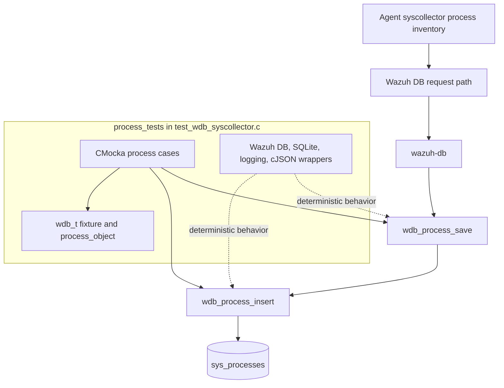
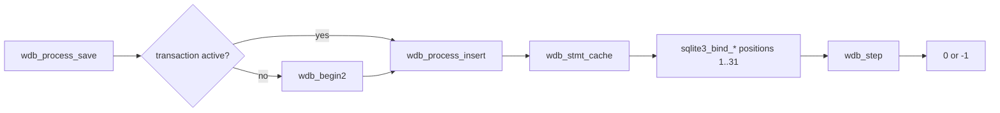
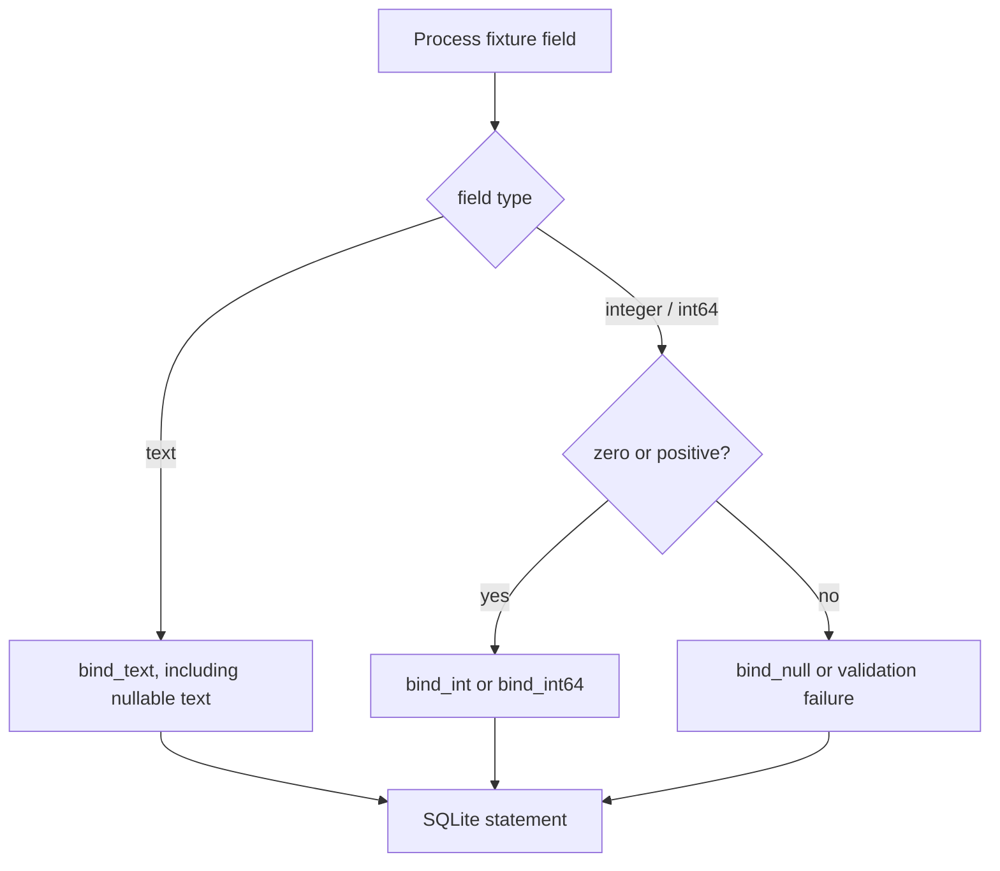
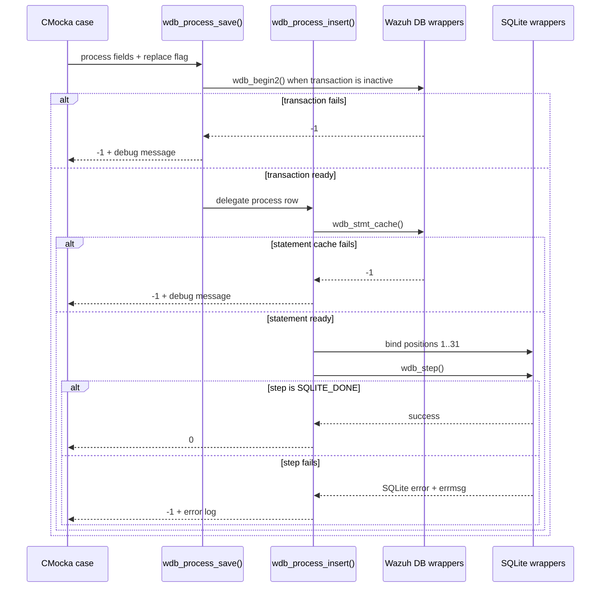
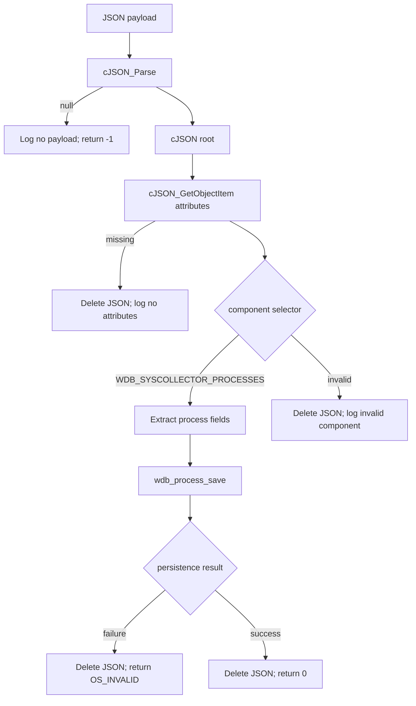
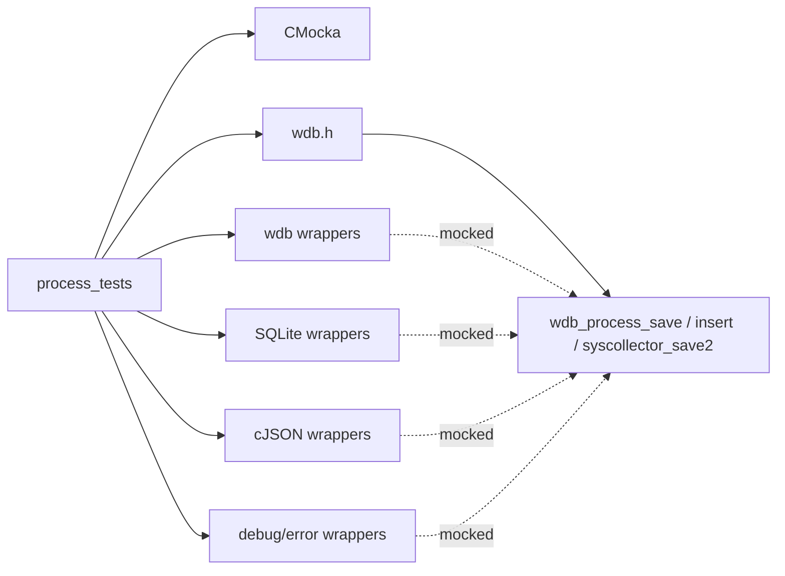

# `process_tests`

## Introduction

`process_tests` documents the process-inventory tests embedded in
`src/unit_tests/wazuh_db/test_wdb_syscollector.c`. The tests validate the Wazuh
DB process persistence API: transaction orchestration, prepared-statement
caching, SQLite parameter binding, execution errors, null normalization, and
JSON-based syscollector ingestion.

This is a focused child view of the complete suite. Shared fixtures, wrapper
contracts, binding policies, and test registration are documented in
[`test_wdb_syscollector_test_infrastructure.md`](test_wdb_syscollector_test_infrastructure.md).
The full inventory-suite context is available in
[`test_wdb_syscollector.md`](test_wdb_syscollector.md).

## Position in the system

Process data is collected by syscollector and persisted by `wazuh-db` in the
agent's SQLite database. These tests execute the process persistence functions
with CMocka-controlled seams; they do not open a real database.

For database connection, transaction, and statement-cache responsibilities, see
[`wazuh_db_engine.md`](wazuh_db_engine.md). The production syscollector
integration is covered by [`wazuh_db_fim_syscollector.md`](wazuh_db_fim_syscollector.md).

## Tested API layers

The process tests cover three related entry points:

| API | Role | Main assertions |
|---|---|---|
| `wdb_process_save()` | Save-level orchestration | Begins a transaction when required, delegates to insert, propagates failures |
| `wdb_process_insert()` | Direct row persistence | Caches a statement, binds 31 process fields in order, executes SQLite, handles invalid values |
| `wdb_syscollector_save2(..., WDB_SYSCOLLECTOR_PROCESSES, ...)` | JSON dispatch | Parses payload attributes, maps them to process fields, cleans up JSON, returns component status |

`wdb_process_save()` is intentionally thin: transaction failure and delegated
insert failure are tested separately from the direct SQL behavior. The insert
function owns statement caching, typed binding, execution, and SQLite error
logging.

## Process data model and binding contract

The `process_object` fixture represents the production argument shape:

| Position | Field | Binding policy |
|---:|---|---|
| 1 | `scan_id` | text |
| 2 | `scan_time` | text |
| 3 | `pid` | integer; zero allowed |
| 4–5 | `name`, `state` | text; nullable |
| 6–8 | `ppid`, `utime`, `stime` | integer; zero allowed |
| 9–17 | `cmd`, `argvs`, user/group fields | text; nullable |
| 18–23 | `priority`, `nice`, `size`, `vm_size`, `resident`, `share` | integer; zero allowed |
| 24 | `start_time` | 64-bit integer; zero allowed |
| 25–30 | `pgrp`, `session`, `nlwp`, `tgid`, `tty`, `processor` | integer; zero allowed |
| 31 | `checksum` | text |

The fixture uses realistic nullable process values, including a null `state`,
argument vector, and user/group fields. The helper
`configure_wdb_process_insert()` converts each field into strict wrapper
expectations. Invalid numeric values are expected to become SQLite `NULL` when
the production binding policy permits it; an invalid process PID is rejected
by the direct test.

The shared binding-helper implementation and its nullability rules are
documented in [`test_wdb_syscollector_test_infrastructure.md`](test_wdb_syscollector_test_infrastructure.md).

## Test scenarios

### `wdb_process_save()`

- `test_wdb_process_save_transaction_fail` makes `wdb_begin2()` return `-1`,
  expects `at wdb_process_save(): cannot begin transaction`, and asserts `-1`.
- `test_wdb_process_save_insert_fail` marks the transaction as active, makes
  statement caching fail inside `wdb_process_insert()`, expects the insert
  diagnostic, and asserts `-1`.
- `test_wdb_process_save_success` verifies transaction startup, all process
  bindings, `SQLITE_DONE`, and a return value of `0`.

### `wdb_process_insert()`

- `test_wdb_process_insert_stmt_cache_fail` verifies an unavailable prepared
  statement produces `-1` and the cache diagnostic.
- `test_wdb_process_insert_sql_fail` verifies all 31 bindings are attempted,
  a non-successful SQLite step is reported as `SQLite: ERROR`, and the result
  is `-1`.
- `test_wdb_process_insert_success` verifies the complete binding sequence and
  `SQLITE_DONE` result.
- `test_wdb_process_insert_null_values_fail` supplies an invalid PID and
  confirms that invalid required process identity data is rejected with `-1`.

### JSON `wdb_syscollector_save2()` process path

The process dispatcher tests exercise the common JSON boundary as well as the
process-specific adapter:

- `test_wdb_syscollector_save2_parser_json_fail` covers a missing parsed payload.
- `test_wdb_syscollector_save2_get_attributes_fail` covers missing attributes.
- `test_wdb_syscollector_save2_fail` covers an invalid component selector.
- `test_wdb_syscollector_save2_processes_fail` forces transaction startup to
  fail while saving process attributes.
- `test_wdb_syscollector_save2_processes_fail_2` supplies invalid or missing
  process attributes and expects `OS_INVALID`.
- `test_wdb_syscollector_save2_processes_success` supplies representative
  integer and 64-bit values, verifies all process bindings, and expects `0`.

Every successfully parsed JSON case expects `cJSON_Delete()` after dispatch,
including component and persistence failures. The parse-failure case has no JSON
object to release. This makes ownership cleanup part of the observable contract.

## Process save and insert flow

## JSON process dispatch flow

The process JSON helpers deliberately provide both absent attributes and a
large `valuedouble` value (`5294967296`) so the test suite can detect incorrect
type truncation or an incorrect choice of SQLite integer binding.

## Dependencies and test seams

The wrappers are deterministic test seams. `will_return()` controls transaction,
cache, JSON, SQLite, and error outcomes; `expect_value()` and `expect_string()`
verify binding positions, values, and diagnostics. Fixture ownership and wrapper
implementation details are intentionally centralized in
[`test_wdb_syscollector_test_infrastructure.md`](test_wdb_syscollector_test_infrastructure.md).

## Result and maintenance contract

- `0` / `OS_SUCCESS` means the process operation completed.
- `-1` / `OS_INVALID` means transaction setup, statement caching, validation, or
  SQLite execution failed.
- Expected diagnostic strings are tested behavior and should change only when
  the production error contract intentionally changes.
- Binding positions are strict. Any process schema or function-signature change
  must be synchronized with `wdb_process_insert()`, `wdb.h`, wrapper behavior,
  and these tests.
- Changes to nullable process fields must update both the typed fixture and the
  JSON attribute expectations.
- Keep `cJSON_Delete()` assertions on all JSON paths to prevent ownership
  regressions.

## Related documentation

- [`test_wdb_syscollector.md`](test_wdb_syscollector.md) — complete syscollector
  persistence test suite and high-level architecture.
- [`test_wdb_syscollector_test_infrastructure.md`](test_wdb_syscollector_test_infrastructure.md)
  — fixtures, binding helpers, wrappers, and registration.
- [`wazuh_db_engine.md`](wazuh_db_engine.md) — Wazuh DB transaction and SQLite
  execution infrastructure.
- [`wazuh_db_fim_syscollector.md`](wazuh_db_fim_syscollector.md) — production
  syscollector persistence integration.
