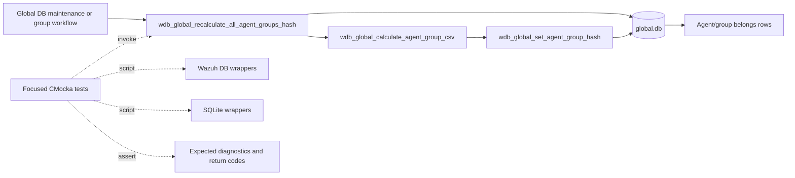
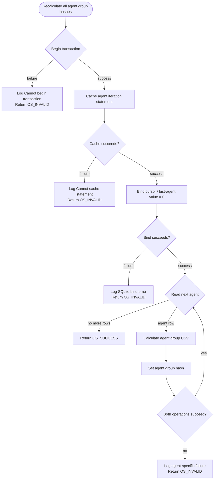
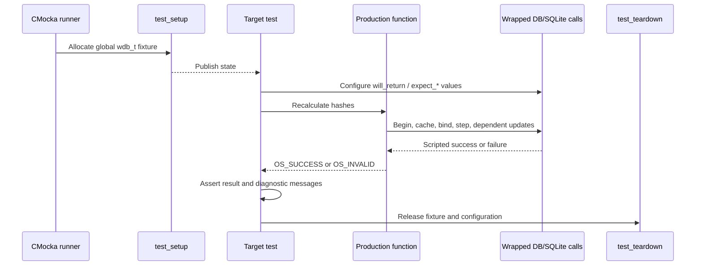
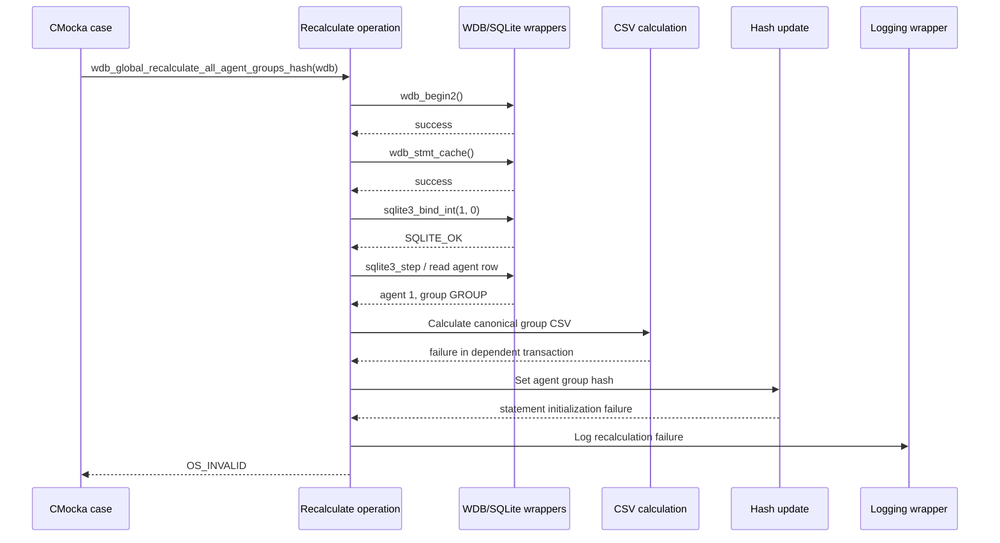

# `recalculate_all_agent_groups_hash_tests`

## Introduction

`recalculate_all_agent_groups_hash_tests` documents the focused CMocka coverage for `wdb_global_recalculate_all_agent_groups_hash()`, the Wazuh DB maintenance operation that walks agents with group assignments, rebuilds each agent's group CSV, calculates the corresponding group hash, and persists the result in the global database.

The tests are defined in [`src/unit_tests/wazuh_db/test_wdb_global.c`](../../src/unit_tests/wazuh_db/test_wdb_global.c). They verify the operation's transaction setup, prepared-statement caching, agent-ID binding, per-agent recalculation, error propagation, and diagnostic logging. The reusable fixture and wrapper conventions are documented in [`test_wdb_global_test_infrastructure.md`](test_wdb_global_test_infrastructure.md); broader global-database behavior is covered by [`test_wdb_global.md`](test_wdb_global.md).

## Position in the system

The operation belongs to the global SQLite database layer used by `wazuh-db`. It is a maintenance/reconciliation path rather than a socket-facing query by itself. Other group-management operations can change the `belongs` relationships or group context, after which this operation restores the derived per-agent hash values.

## Responsibilities and data model

For each agent selected by the production query, the operation uses:

- the agent ID returned by SQLite;
- the agent's group column/name context;
- `wdb_global_calculate_agent_group_csv()` to derive the canonical comma-separated group string;
- `wdb_global_set_agent_group_hash()` to hash and persist that string.

The operation returns `OS_SUCCESS` only when the complete traversal and all per-agent updates succeed. A transaction, statement-cache, bind, or recalculation/update failure returns `OS_INVALID`. The tests use the global database identifier through the common `wdb_t` fixture, but do not open a real SQLite database.

The exact SQL and schema remain owned by the production global DB implementation. See [`wazuh_db_engine.md`](wazuh_db_engine.md) and [`test_wdb_global.md`](test_wdb_global.md) for the wider database layer and schema-oriented test context.

## Test architecture

The target tests use the fixture implemented in the same C source file. `test_setup()` allocates a minimal `wdb_t`, assigns the ID `"global"`, creates synthetic SQLite-handle storage, initializes Wazuh DB configuration, and publishes the fixture through CMocka state. `test_teardown()` releases those allocations and frees the configuration.

The wrappers isolate the test from SQLite and production state:

| Boundary | Behavior controlled by the target tests |
|---|---|
| `__wrap_wdb_begin2` | Transaction-start success or failure. |
| `__wrap_wdb_stmt_cache` | Agent iteration statement cache success or failure. |
| `__wrap_sqlite3_bind_int` | Binding of the initial cursor value `0`; deterministic SQLite failure. |
| `__wrap_wdb_step` | A returned agent row or end-of-result indication. |
| `__wrap_sqlite3_column_int` | Agent ID returned from the row. |
| `__wrap_sqlite3_column_text` | Group value returned for the agent. |
| `wdb_global_calculate_agent_group_csv` seams | Recalculation failure or no-group behavior. |
| `wdb_global_set_agent_group_hash` seams | Hash-update failure or successful persistence. |
| Logging wrappers | Exact transaction, cache, SQLite, and agent-specific diagnostics. |

The complete wrapper inventory is maintained by [`test_wdb_global_test_infrastructure.md`](test_wdb_global_test_infrastructure.md), while group assignment and hash-writing behavior are covered in the parent [`test_wdb_global.md`](test_wdb_global.md).

## Core test scenarios

### Transaction failure

`test_wdb_global_recalculate_all_agent_groups_hash_transaction_fail` makes `wdb_begin2()` return `-1`. The function must log `Cannot begin transaction`, stop before statement caching, and return `OS_INVALID`.

### Statement-cache failure

`test_wdb_global_recalculate_all_agent_groups_hash_cache_fail` allows the transaction to start but makes `wdb_stmt_cache()` fail. The expected behavior is the `Cannot cache statement` diagnostic and `OS_INVALID`; no bind or row processing should occur.

### Per-agent recalculation failure

`test_wdb_global_recalculate_all_agent_groups_hash_recalculate_error` supplies one agent row (`id = 1`, group `GROUP`). The initial query succeeds, but the dependent CSV calculation cannot begin its transaction. The test then scripts the hash-update statement initialization to fail. The function must report the agent-specific failure (`Couldn't recalculate hash group for agent: '001'`) and return `OS_INVALID`.

The source file also contains adjacent bind, hash, CSV, group-context, assignment, and synchronization tests. Those are related behavior, but are not part of this focused module's three named core components.

## Component interaction

The diagram reflects the failure-path test's scripted interactions. In the successful production path, the CSV result is hashed and persisted, then iteration continues until no rows remain.

## Failure contract and maintenance guidance

The test module establishes these observable contracts:

- setup failures short-circuit before later database calls;
- SQLite bind failures are reported with the database error text;
- dependent per-agent failures are not silently ignored;
- a failure in one agent's derived group state makes the overall operation fail;
- diagnostics identify the affected zero-padded agent ID.

When changing the production operation, update this focused coverage if transaction ownership, cursor binding, row shape, dependent helper ordering, or return-code semantics change. Keep fixture and wrapper changes centralized in [`test_wdb_global_test_infrastructure.md`](test_wdb_global_test_infrastructure.md), and link to the broader group/hash tests rather than copying their scenarios here.

## Source references

- Implementation and tests: [`src/unit_tests/wazuh_db/test_wdb_global.c`](../../src/unit_tests/wazuh_db/test_wdb_global.c)
- Parent global DB test module: [`test_wdb_global.md`](test_wdb_global.md)
- Shared fixture and wrapper infrastructure: [`test_wdb_global_test_infrastructure.md`](test_wdb_global_test_infrastructure.md)
- Related group lookup coverage: [`test_wdb_global_find_group_tests.md`](test_wdb_global_find_group_tests.md)
- Wazuh DB engine overview: [`wazuh_db_engine.md`](wazuh_db_engine.md)
