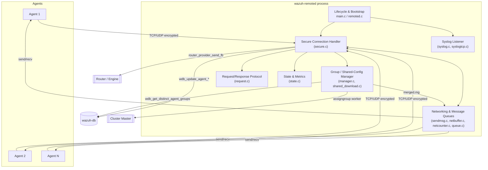
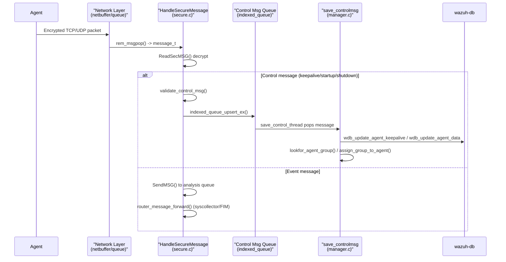

# Remoted (`wazuh-remoted`)

## 1. Purpose

`remoted` is the Wazuh manager daemon responsible for **all network communication with agents**. It is the single entry point through which agents send events, keepalives and control information, and through which the manager pushes shared configuration, active-response commands and on-demand requests back to the agents.

Its main responsibilities are:

* Accepting and maintaining **TCP** and **UDP** secure connections from agents (and plain syslog senders).
* **Encrypting/decrypting** all traffic using the agent key store (`client.keys` / `keystore`).
* Parsing **control messages** (`startup`, `shutdown`, keepalive) and persisting agent state to `wazuh-db`.
* Generating and distributing **shared configuration files** (`merged.mg`) for agent groups and multigroups, including YAML-driven external file downloads (`files.yml`).
* Providing a **request/response** protocol so the manager (or cluster) can query agents synchronously.
* Forwarding high-value telemetry (syscollector deltas, FIM/rsync data) to the internal **router** for the engine/indexer pipeline.
* Exposing internal **statistics** (global and per-agent) through a local socket and a legacy `.state` file.
* Listening for plain **syslog** messages (UDP/TCP) from third-party devices.

`remoted` is a native C daemon and part of the "Agent & Manager Native Daemons (C)" domain. It cooperates closely with several other components documented elsewhere in this wiki:

* [`wazuh_db`](wazuh_db.md) — agent connection status, keepalive and group persistence (`wdb_global_helpers`).
* [`shared_lib`](shared_lib.md) — common OS abstractions: hash tables, queues, sockets, file utilities, crypto helpers.
* [`os_auth`](os_auth.md) — agent enrollment and key issuance (`client.keys` consumed by remoted).
* [`os_net`](os_net.md) — low level socket primitives used by the TCP/UDP handlers.
* [`headers`](headers.md) — shared struct/type declarations (`keystore`, `sec.h`, `bqueue_op.h`, etc.).
* [`router`](router.md) (shared_modules) — the pub/sub component used to forward syscollector/FIM deltas to the engine.
* [`cluster_dapi`](cluster_dapi.md) / [`cluster_local_client`](cluster_local_client.md) — used when `remoted` runs on a worker node and must ask the master to assign an agent group.

## 2. High-Level Architecture

## 3. Message Processing Flow

## 4. Sub-modules

The `remoted` codebase is organized into the following functional sub-modules. Each is documented in its own file:

| Sub-module | Description | Documentation |
|---|---|---|
| **Lifecycle & Bootstrap** | Process entry point, CLI parsing, privilege drop, socket binding and protocol (TCP/UDP) selection, forking per configured connection. | [remoted_lifecycle.md](remoted_lifecycle.md) |
| **Secure Connection Handling** | The core event loop (`HandleSecure`), decryption/authentication of agent packets, control-message validation, key-request feature, router forwarding. | [remoted_secure_connection.md](remoted_secure_connection.md) |
| **Group & Shared Configuration Management** | Building `merged.mg` per group/multigroup, detecting changes, YAML-based external file distribution (`files.yml`), assigning agents to groups. | [remoted_group_management.md](remoted_group_management.md) |
| **Networking & Message Queuing** | Low-level TCP network buffer (`netbuffer`), per-socket byte counters (`netcounter`), the internal dispatch queue (`queue.c`) and the encrypted `send_msg` primitive. | [remoted_networking.md](remoted_networking.md) |
| **Request/Response Protocol** | Synchronous request dispatcher used to query agents on demand (`req_sender`/`req_dispatch`), with ACK/response timeout and retry handling. | [remoted_request_protocol.md](remoted_request_protocol.md) |
| **State & Metrics** | Global and per-agent statistics counters, `.state` file writer and JSON state generator exposed through the `remoted` control socket. | [remoted_state_metrics.md](remoted_state_metrics.md) |
| **Syslog Listener** | Plain-text syslog ingestion over UDP and TCP, forwarding to the analysis queue. | [remoted_syslog_listener.md](remoted_syslog_listener.md) |

## 5. Key Cross-Cutting Concepts

* **Encryption**: All secure traffic is encrypted/decrypted through `CreateSecMSG`/`ReadSecMSG` from the shared crypto library (see [`shared_lib`](shared_lib.md) → `os_crypto`), using per-agent keys loaded from the `keystore` (`sec.h`, [`headers`](headers.md)).
* **Agent identification**: `OS_IsAllowedID` / `OS_IsAllowedDynamicID` / `OS_IsAllowedIP` resolve the sending agent from the encrypted envelope prefix or source IP, guarded by a global read/write lock (`key_lock_read`/`key_lock_write`).
* **TCP vs UDP**: The daemon can serve both protocols simultaneously (`REMOTED_NET_PROTOCOL_TCP|UDP`). TCP connections use non-blocking buffered send/receive (`netbuffer.c`) driven by an epoll-like `wnotify` event loop; UDP is connectionless and uses the shared `rem_msgpush` queue.
* **Cluster awareness**: On a worker node, group assignment requests are forwarded to the master via `assign_group_to_agent_worker` (DAPI `sendsync`), see [`cluster_dapi`](cluster_dapi.md).
* **Router integration**: Syscollector deltas, FIM deltas and rsync payloads are forwarded to dedicated router providers (`deltas-syscollector`, `deltas-syscheck`, `rsync`) for consumption by the [Wazuh Engine](engine_main.md).

## 6. Related Modules

* [`wazuh_db`](wazuh_db.md) — persistence layer for agent state, groups and keepalive/connection status.
* [`shared_lib`](shared_lib.md) — generic C utilities (`OSHash`, `bqueue_op`, `queue_op`, `indexed_queue_op`, crypto wrappers) used pervasively across `remoted`.
* [`os_auth`](os_auth.md) — issues and manages the keys consumed by `remoted`'s keystore.
* [`os_net`](os_net.md) — socket creation/binding primitives (`OS_Bindporttcp`, `OS_Bindportudp`, `OS_SendSecureTCP`, etc.).
* [`headers`](headers.md) — shared struct definitions (`keyentry`, `keystore`, `bqueue_t`, `w_indexed_queue_t`).
* [`wazuh_modules_core`](wazuh_modules_core.md) — the `wm_database` and other wodules that also interact with agent group data.
* [`cluster_dapi`](cluster_dapi.md) / [`cluster_local_client`](cluster_local_client.md) — used for group-assignment requests on worker nodes.
