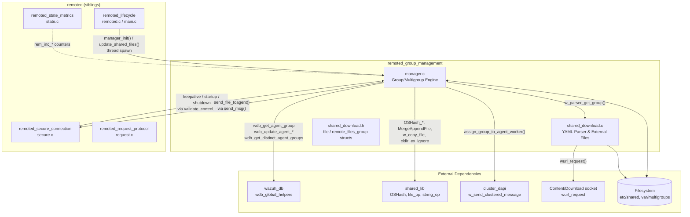
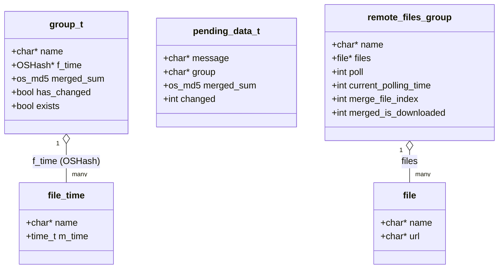
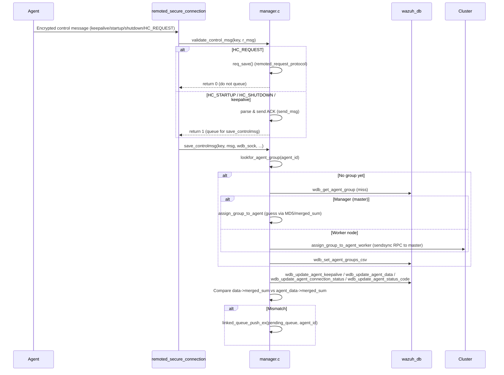
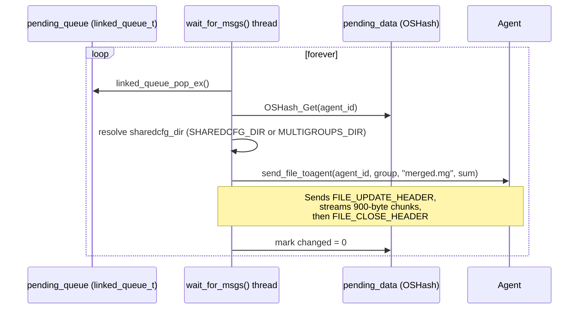
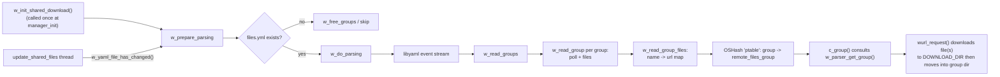

# Remoted Group Management

## Introduction

**Remoted Group Management** is the subsystem inside the Wazuh `remoted` daemon that is responsible for keeping agent **group configuration** (`shared` files, `agent.conf`, CDB lists, etc.) synchronized between the Wazuh manager's filesystem and the agents connected to it. It also owns the logic that decides **which group an agent belongs to**, builds the merged `merged.mg` file that is pushed to agents, and supports **externally downloaded shared files** described through a YAML manifest (`files.yml`).

This module is one of seven functional partitions of the native `remoted` daemon (see the [Agent & Manager Native Daemons (C)](Agent_%26_Manager_Native_Daemons_(C).md) module tree). Its sibling partitions handle other daemon responsibilities:

| Sibling module | Responsibility |
|---|---|
| [remoted_lifecycle](remoted_lifecycle.md) | Daemon startup, main loop, global state (`remoted.h`) |
| [remoted_secure_connection](remoted_secure_connection.md) | TLS/UDP secure channel handling, key requests |
| [remoted_networking](remoted_networking.md) | Low level socket/network buffer management |
| [remoted_request_protocol](remoted_request_protocol.md) | Synchronous request/response protocol (`req_*`) |
| [remoted_state_metrics](remoted_state_metrics.md) | Runtime statistics (`rem_state.json`) |
| [remoted_syslog_listener](remoted_syslog_listener.md) | Syslog/TCP forwarding listener |

Group Management sits at the intersection of **agent connection handling** (it consumes control messages coming from `remoted_secure_connection`) and the **global agent database** (it calls into [wazuh_db](wazuh_db.md) helpers to read/write the agent's assigned group and connection status).

## Purpose & Responsibilities

1. **Group & multigroup discovery** – Periodically scans `SHAREDCFG_DIR` (`etc/shared`) to detect group folders, and scans the global database for the distinct multigroup combinations (`group1,group2,...`) actually used by connected agents.
2. **Merged file generation** – For every group/multigroup it produces a single `merged.mg` file that packages all shared configuration files (plus `ar.conf`), so an agent only needs to download one file.
3. **Control-message processing** – Parses the *keepalive*, *startup* (`HC_STARTUP`), *shutdown* (`HC_SHUTDOWN`) and *health-check request* (`HC_REQUEST`) control messages sent by agents, updates the agent's state in the global DB, and detects configuration drift (`merged_sum` mismatch) that must trigger a re-push of `merged.mg`.
4. **Group assignment** – When an agent doesn't yet have an assigned group, guesses the right group by matching the MD5 the agent reports against known merged sums, or falls back to `default`. On a worker node, this decision is delegated to the master through the cluster's `sendsync` RPC.
5. **Shared-file distribution** – Runs a dedicated worker thread (`wait_for_msgs`) that pops agents with "changed" data from a queue and streams the corresponding `merged.mg` to them chunk-by-chunk over the agent's already-established secure channel.
6. **External shared-file downloads** – Parses a `files.yml` YAML manifest (via `libyaml`) describing additional files that should be fetched from external URLs and merged into a group's `merged.mg`, including a configurable poll interval per group.

## Architecture Overview



### File Responsibilities

| File | Role |
|---|---|
| `src/remoted/manager.c` | Core engine: group/multigroup scanning (`c_files`, `process_groups`, `process_multi_groups`), merged file creation (`c_group`, `c_multi_group`, `validate_shared_files`), control-message handling (`validate_control_msg`, `save_controlmsg`), group assignment (`assign_group_to_agent[_worker]`, `lookfor_agent_group`), file distribution (`wait_for_msgs`, `send_file_toagent`), and lifecycle entry points (`manager_init`, `manager_free`, `update_shared_files`). |
| `src/remoted/shared_download.c` | YAML-driven configuration for **externally hosted** shared files (`files.yml`). Loads/reloads the manifest, exposes `w_parser_get_group()` used by `c_group()` to know whether a group has downloadable content and its poll interval. |
| `src/remoted/shared_download.h` | Plain data structures `file` (name/url pair) and `remote_files_group` (group name, file list, poll interval, merge index) shared between the two `.c` files. |

## Core Data Structures



- **`group_t`** (internal to `manager.c`): one instance per group (in `groups` hash) or multigroup (in `multi_groups` hash). Tracks the merged MD5 sum and per-file modification times so unnecessary merges can be skipped.
- **`file_time`**: value stored in a `group_t`'s `f_time` `OSHash`, used by `ftime_changed()` to detect whether any file inside the group directory changed since the last scan.
- **`pending_data_t`** (declared in `remoted.h`, used here): per-agent record kept in the global `pending_data` hash; holds the last raw keepalive message, the resolved group, and the `merged_sum` that should be pushed if it differs from what the agent already has.
- **`remote_files_group` / `file`** (`shared_download.h`): the parsed representation of one YAML `groups:` entry, including the list of `name -> url` external files and the polling interval used to decide when to re-download them.

## Key Workflows

### 1. Periodic Group/Multigroup Scan & Merge

```mermaid
flowchart TD
    START([update_shared_files thread<br/>every 'shared_reload' seconds]) --> CHECKYAML{files.yml changed?}
    CHECKYAML -- yes --> RELOAD[w_yaml_file_update_structs<br/>+ w_yaml_create_groups]
    CHECKYAML -- no --> CFILES
    RELOAD --> CFILES[c_files(false)]
    CFILES --> PG[process_groups]
    CFILES --> PMG[process_multi_groups]
    CFILES --> PDG[process_deleted_groups]
    CFILES --> PDMG[process_deleted_multi_groups]

    PG --> SCANDIR[Scan SHAREDCFG_DIR subfolders]
    SCANDIR --> NEWOROLD{Group known?}
    NEWOROLD -- new --> CGROUP1[c_group create_merged=true]
    NEWOROLD -- existing --> CGROUP2[c_group create_merged=false<br/>compare f_time]
    CGROUP2 --> CHANGED{ftime_changed?}
    CHANGED -- yes --> REMERGE[c_group create_merged=true]
    CHANGED -- no --> SKIP[Keep cached merged_sum]

    PMG --> QUERYWDB["wdb_get_distinct_agent_groups()"]
    QUERYWDB --> MULTIHASH[Build m_hash: multigroup -> sha256 dir]
    MULTIHASH --> CMULTI[c_multi_group]
    CMULTI --> COPY[copy_directory per member group]
    CMULTI --> CGROUPMULTI["c_group(hash_dir, is_multigroup=true)"]
```

- `c_group()` optionally consults `w_parser_get_group()` (from `shared_download.c`) to download any externally hosted files for that group (respecting `remote_files_group.poll`) before merging.
- `validate_shared_files()` recursively walks the group directory, skips previously-detected invalid/binary files (tracked in the `invalid_files` hash), and appends valid files into the merged buffer via `MergeAppendFile()`.
- Multigroups are named by concatenating group names with a comma and are stored on disk under a SHA-256-hashed directory name (`MULTIGROUPS_DIR/<hash>`), managed with `copy_directory()` + `cldir_ex_ignore()`.

### 2. Agent Control Message Processing



Key behaviors:
- **Version gating**: on `HC_STARTUP`, if the agent reports a version lower than what `allow_higher_versions` requires, `send_wrong_version_response()` sends an `HC_ERROR` control response and marks the agent's `status_code` in the DB instead of completing the handshake.
- **ACKs**: every non-shutdown control message is answered synchronously inside `validate_control_msg()` before any database I/O, minimizing latency on the network thread.
- **Group resolution caching**: `lookfor_agent_group()` first asks the DB (`wdb_get_agent_group`); only agents without a group parse the raw agent-info payload to find the merged file's MD5 and attempt a guess.

### 3. Shared File Distribution



`send_file_toagent()` looks up the agent's negotiated network protocol (`w_get_agent_net_protocol_from_keystore`) to throttle transmission when UDP is used (sleeping periodically to avoid flooding).

### 4. External File Download Manifest (`files.yml`)



- If a group defines a `merged.mg` entry among its `files:`, remoted treats that as **the whole merged file already produced externally** (`merge_file_index`) and simply downloads + validates it (`TestUnmergeFiles`) instead of re-merging locally.
- Otherwise, every listed file is downloaded individually into the group folder before the normal merge pipeline (`validate_shared_files`) picks it up.

## Concurrency Model

| Mutex | Protects |
|---|---|
| `files_mutex` | `groups`, `multi_groups`, `m_hash`, `invalid_files` hash tables during scan/merge (`c_files`) and during group lookups from `save_controlmsg`. |
| `lastmsg_mutex` | `pending_data` hash and `pending_queue` while comparing/queuing changed agents. |
| `rem_yaml_mutex` (in `shared_download.c`) | `ptable` (`remote_files_group` hash) and the parsed manifest during reload. |

Two background threads are spawned from [remoted_lifecycle](remoted_lifecycle.md):
- **`update_shared_files`** — periodic re-scan (`shared_reload` internal option, default 1–18000s) and YAML reload check.
- **`wait_for_msgs`** — dedicated dispatcher that drains `pending_queue` and streams `merged.mg` to agents whose configuration changed.

## Integration Points

- **Inbound**: `remoted_secure_connection` (`secure.c`) calls `validate_control_msg()` synchronously on the network thread and hands off to `save_controlmsg()` on a worker thread for DB-bound work. See [remoted_secure_connection](remoted_secure_connection.md).
- **Outbound to DB**: All persistent agent/group state (`connection_status`, `sync_status`, `group`, `merged_sum`, labels) is read/written through helpers in [wazuh_db](wazuh_db.md) (`wdb_global_helpers.c`), which in turn talk to `wazuh-db` over its Unix socket (`framework_core_communication`).
- **Cluster RPC**: On worker nodes, group-assignment decisions are forwarded to the master via `w_send_clustered_message("sendsync", ...)`, part of the distributed API implemented in the `cluster_module` documentation family (e.g. `cluster_dapi.md`).
- **Metrics**: Every send/receive/ack path increments counters exposed by [remoted_state_metrics](remoted_state_metrics.md) (`rem_inc_send_shared`, `rem_inc_recv_ctrl_keepalive`, etc.).
- **Shared utilities**: Heavy use of the generic shared_lib primitives documented under [Agent & Manager Native Daemons (C)](Agent_%26_Manager_Native_Daemons_(C).md) — `OSHash`, `MergeAppendFile`, `w_copy_file`, `cldir_ex_ignore`, `linked_queue_*`, and cryptographic helpers (`OS_MD5_File`, `OS_SHA256_String`).

## Error Handling & Resilience

- **Invalid/binary shared files**: tracked per-path in the `invalid_files` hash with their last-seen modification time; only re-checked (`checkBinaryFile`) after the mtime changes, preventing repeated expensive scans of known-bad files.
- **Corrupted external downloads**: `c_group()` validates downloaded `merged.mg` files with `TestUnmergeFiles()` before installing them; on failure the temp file is deleted and the group keeps its previous merged file.
- **Path length guards**: `validate_shared_files()` and `copy_directory()` bound-check constructed paths against `MAX_SHARED_PATH`, logging a warning once and then downgrading to debug-level logging (`reported_path_size_exceeded`) to avoid log flooding.
- **Group directory races**: multigroup processing tolerates concurrent deletion of member group folders (`ENOENT`/`ENOTDIR` are treated as "removed", not fatal errors) during `process_deleted_groups()` / `process_deleted_multi_groups()`.

## Summary

The Group Management module is the configuration-distribution backbone of `remoted`: it turns a set of loosely-organized shared configuration directories (plus an optional external-download manifest) into deterministic, MD5-tracked `merged.mg` bundles, keeps the agent-to-group mapping consistent through the global database, and reliably pushes updates to agents only when their configuration actually drifts — all while cooperating with the connection-handling, clustering, and metrics subsystems documented separately in this repository.
