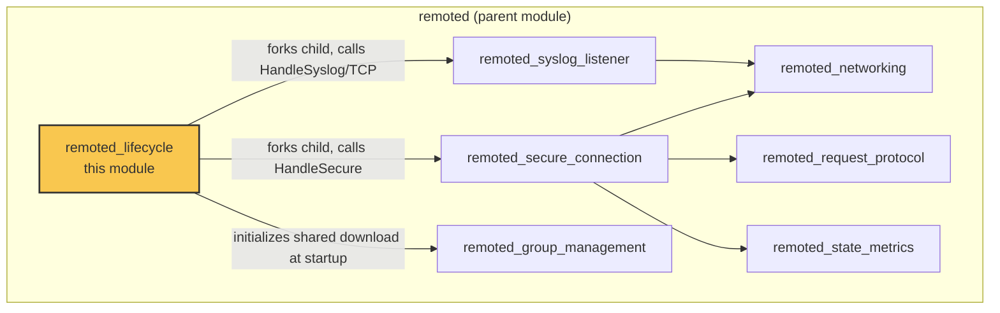
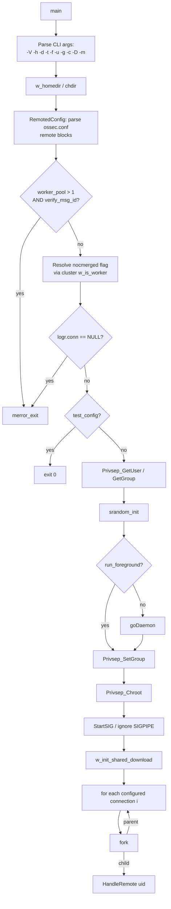
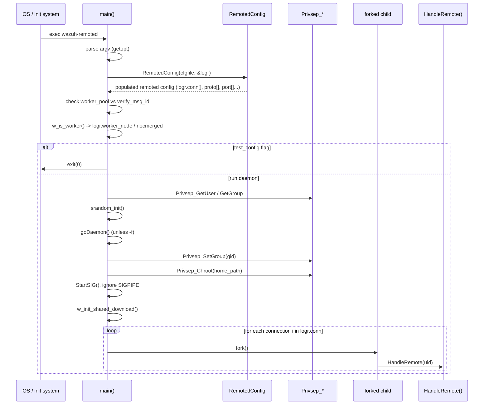
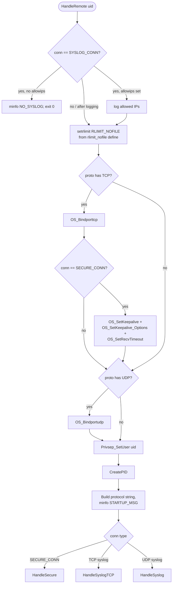
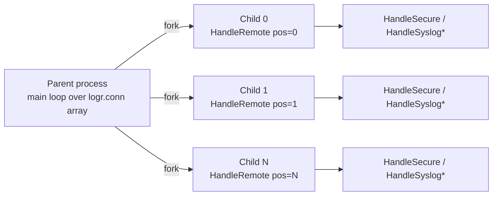
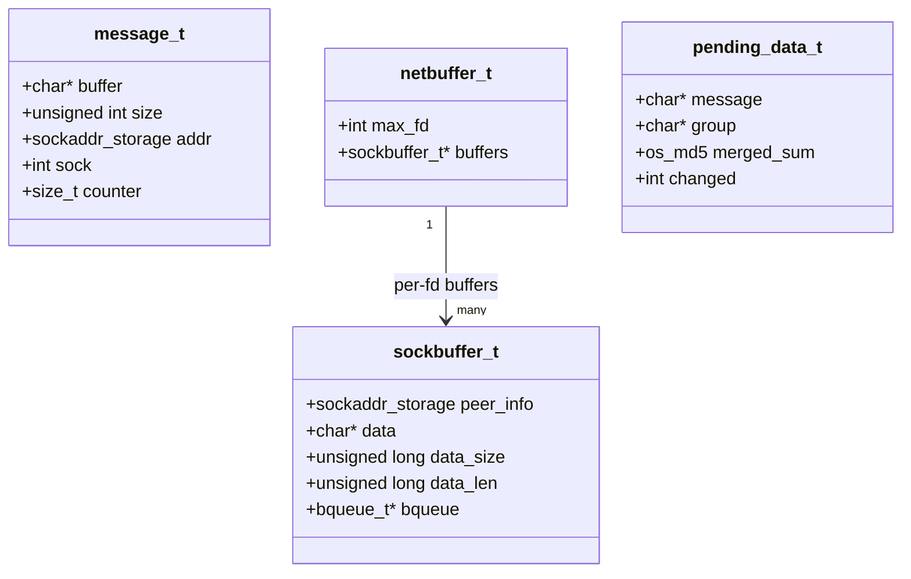
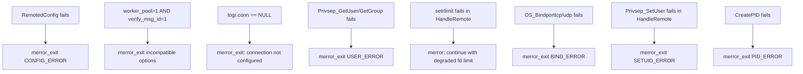

# Remoted Lifecycle Module

## Introduction

The **remoted_lifecycle** module is the entry point and process-orchestration core of `wazuh-remoted`, the Wazuh manager daemon responsible for receiving events and control messages from agents. This module is responsible for:

- Parsing command-line arguments and daemon configuration.
- Validating and applying the `<remote>` configuration blocks (secure, syslog, syslog-TCP connections).
- Performing privilege separation (`chroot`, `setuid`/`setgid`).
- Applying OS-level resource limits (open file descriptors).
- Forking one child process per configured connection ("listener") and dispatching each child to the appropriate protocol handler (secure agent traffic, syslog UDP, or syslog TCP).
- Defining the core data structures (`message_t`, `netbuffer_t`, `sockbuffer_t`, `pending_data_t`) shared across the entire `remoted` daemon.

It does **not** implement the actual secure-protocol parsing, group synchronization, or network I/O — those responsibilities belong to sibling submodules of the parent `remoted` module (see [Related Modules](#related-modules)). Instead, `remoted_lifecycle` acts as the **bootstrap and process-supervision layer** that wires everything together and hands off control to the protocol-specific handlers.

## Module Position in the System

`remoted_lifecycle` is one of six children of the `remoted` component, which itself belongs to the broader **Agent & Manager Native Daemons (C)** subsystem. The diagram below shows where this module sits relative to its siblings.

Related documentation:
- [remoted_secure_connection.md](remoted_secure_connection.md) — secure agent protocol handling (`HandleSecure`)
- [remoted_group_management.md](remoted_group_management.md) — shared configuration / group file distribution
- [remoted_networking.md](remoted_networking.md) — buffered network I/O primitives (`netbuffer_t`, `sockbuffer_t`)
- [remoted_request_protocol.md](remoted_request_protocol.md) — synchronous request/response subsystem
- [remoted_state_metrics.md](remoted_state_metrics.md) — telemetry/statistics collection
- [remoted_syslog_listener.md](remoted_syslog_listener.md) — syslog UDP/TCP listeners
- [Configuration_Data_Structures_(C_Headers).md](Configuration_Data_Structures_(C_Headers).md) — `remoted` / `global-config` structures consumed at startup (`_remoted`, `remoted`)
- [wazuh_db.md](wazuh_db.md) — Wazuh DB, contacted indirectly via group management during startup
- [Shared_Modules_Infrastructure_(C++).md](Shared_Modules_Infrastructure_(C++).md) — shared utilities used by the daemon (queues, RocksDB, etc. — used by other remoted children)

## Core Components

| Component | File | Description |
|---|---|---|
| `main()` | `src/remoted/main.c` | Process entry point: CLI parsing, daemonization, privilege drop, forking per-connection children. |
| `HandleRemote()` (labeled `rlimit`) | `src/remoted/remoted.c` | Per-child initialization: resource limits, socket binding, keepalive/timeout setup, and dispatch to the correct protocol handler. |
| `message_t` | `src/remoted/remoted.h` | Represents a single inbound datagram/message pulled from the network before being queued for processing. |
| `netbuffer_t` / `sockbuffer_t` | `src/remoted/remoted.h` | Per-socket TCP buffering structures used by the networking layer to accumulate partial reads/writes. |
| `pending_data_t` | `src/remoted/remoted.h` | Tracks in-flight/pending shared-configuration synchronization state per agent group. |
| Global state (`keys`, `logr`, `node_name`, `nofile`, `tcp_keepidle/intvl/cnt`) | `src/remoted/remoted.c` / `remoted.h` | Process-wide state shared by all `remoted` submodules. |

## Architecture Overview

## Startup Sequence Diagram

## HandleRemote: Per-Connection Initialization

Each forked child executes `HandleRemote()`, which is responsible for preparing a single listener (one `<remote>` block) before entering an infinite loop inside the relevant protocol handler.

`HandleSecure()`, `HandleSyslogTCP()`, and `HandleSyslog()` are implemented in the sibling submodules [`remoted_secure_connection`](remoted_secure_connection.md) and [`remoted_syslog_listener`](remoted_syslog_listener.md) respectively; `remoted_lifecycle` only performs the socket setup and hands off execution (these functions never return — `__attribute__((noreturn))`).

## Process Model

`remoted` uses a **multi-process, one-fork-per-listener** model rather than a single multiplexed process. This isolates failures in one listener (e.g., a crash while parsing a malformed secure packet) from affecting other configured connections (e.g., a syslog listener).

Each child inherits:
- The parsed `remoted` configuration (`logr`) and its own `logr.position` index into the `conn[]`, `proto[]`, `port[]`, `lip[]`, `ipv6[]` parallel arrays.
- The already loaded agent key store (`keystore keys`), used later by the secure-connection handler.
- Privilege-separation state (the child still performs its own `Privsep_SetUser` call using the resolved `uid` at the point of socket binding, after binding privileged ports).

## Core Data Structures

The header `remoted.h` centralizes the data types shared by essentially every other `remoted` submodule, making `remoted_lifecycle` the structural backbone of the daemon even though most business logic lives elsewhere.

- **`message_t`** — used by the message queue (`rem_msgpush` / `rem_msgpop`, implemented in [`remoted_networking`](remoted_networking.md)) to pass raw datagrams from the network-receiving thread to worker threads for decryption/processing.
- **`sockbuffer_t`** / **`netbuffer_t`** — TCP-specific buffering abstraction used by [`remoted_networking`](remoted_networking.md) (`nb_open`, `nb_recv`, `nb_send`, `nb_queue`) to handle partial reads and writes over persistent TCP connections with agents.
- **`pending_data_t`** — tracks agent-group synchronization state, consumed by [`remoted_group_management`](remoted_group_management.md).

## Configuration Dependencies

`remoted_lifecycle` depends on configuration parsed from `ossec.conf` via `RemotedConfig()` (declared here, implemented as part of the broader remote-config parsing pipeline) and on internal options resolved through `getDefine_Int`. Relevant structures are documented in the [Configuration_Data_Structures_(C_Headers)](Configuration_Data_Structures_(C_Headers).md) module (`remote-config.h`: `_remoted`, `remoted`).

Key configuration-driven decisions made during startup:
- `worker_pool` vs. `verify_msg_id` — mutually constrained; the daemon refuses to start if message-ID verification is requested alongside a worker pool greater than 1 (message ordering cannot be guaranteed).
- `merge_shared` / `-m` flag — determines `logr.nocmerged`, controlling whether `merged.mg` shared-configuration files are generated (see [`remoted_group_management`](remoted_group_management.md)).
- Cluster role (`w_is_worker()`, from the [cluster module](cluster_master.md) family) — forces `nocmerged = 1` on worker nodes, since merged-file generation is a master-only responsibility.
- `rlimit_nofile`, `recv_timeout`, `tcp_keepidle`, `tcp_keepintvl`, `tcp_keepcnt` — internal options read in `HandleRemote()` to tune socket behavior for secure TCP connections.

## Global State Exposed by This Module

These globals, defined in `remoted.c`/`remoted.h`, are consumed across nearly all other `remoted` submodules:

| Global | Purpose |
|---|---|
| `keystore keys` | In-memory agent key store, populated at startup and used by the secure-connection and key-request logic. |
| `remoted logr` | The fully parsed `remoted` configuration (connections, protocols, ports, worker/nocmerged flags). |
| `char* node_name` | Cluster node name, used in logging and cluster-aware behaviors. |
| `rlim_t nofile` | Resolved file-descriptor limit applied via `setrlimit`. |
| `tcp_keepidle/intvl/cnt` | TCP keepalive tuning parameters applied to secure TCP sockets. |

## Command-Line Interface

`main()` exposes the following flags (see `help_remoted`):

| Flag | Description |
|---|---|
| `-V` | Print version/license and exit. |
| `-h` | Print help and exit. |
| `-d` | Increase debug verbosity (repeatable). |
| `-t` | Test configuration only, then exit. |
| `-f` | Run in foreground (no daemonization). |
| `-u <user>` | User to drop privileges to (default `USER`). |
| `-g <group>` | Group to drop privileges to (default `GROUPGLOBAL`). |
| `-c <config>` | Alternate configuration file path. |
| `-D <dir>` | Alternate chroot/home directory. |
| `-m` | Disable creation of the merged shared-configuration file. |

## Error Handling & Safety Checks

All fatal startup errors call `merror_exit`, which logs and terminates the process — appropriate since these are unrecoverable configuration or OS-resource failures that must be surfaced to the operator before agents can be served.

## Interaction With Other Daemons

At startup, `remoted_lifecycle` calls `w_init_shared_download()` (implemented in [`remoted_group_management`](remoted_group_management.md)) which prepares the shared-file distribution subsystem used to serve group configuration (`agent.conf`, CDB lists, etc.) to agents once the secure listener is active. It also queries cluster role via `w_is_worker()`, tying this module to the [cluster subsystem](cluster_master.md) for master/worker-aware behavior (only the master rebuilds merged shared files).

For testing infrastructure that exercises this module's behaviors (fork dispatch, config validation, resource limits), see [Unit_Tests_-_Remoted](Unit_Tests_-_Remoted.md) — particularly `test_manager_remoted` and related suites which validate the manager/group logic invoked indirectly from this lifecycle path.

## Related Modules

- [remoted_secure_connection](remoted_secure_connection.md)
- [remoted_group_management](remoted_group_management.md)
- [remoted_networking](remoted_networking.md)
- [remoted_request_protocol](remoted_request_protocol.md)
- [remoted_state_metrics](remoted_state_metrics.md)
- [remoted_syslog_listener](remoted_syslog_listener.md)
- [Configuration_Data_Structures_(C_Headers)](Configuration_Data_Structures_(C_Headers).md)
- [shared_lib](shared_lib.md) (privilege separation, signal handling, resource utilities used by `main()`/`HandleRemote()`)
- [cluster_master](cluster_master.md) / [cluster_worker](cluster_worker.md) (node-role queries via `w_is_worker()`)
