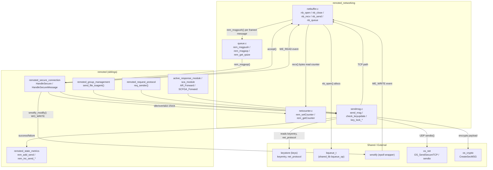
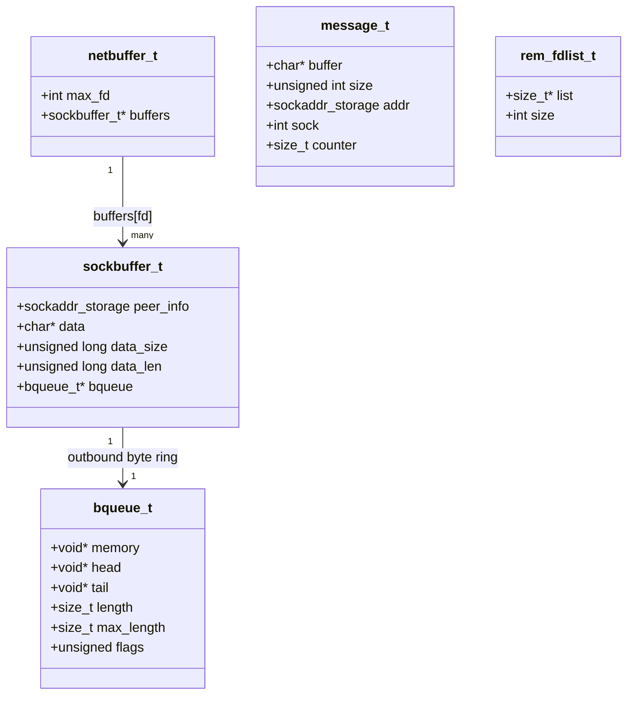
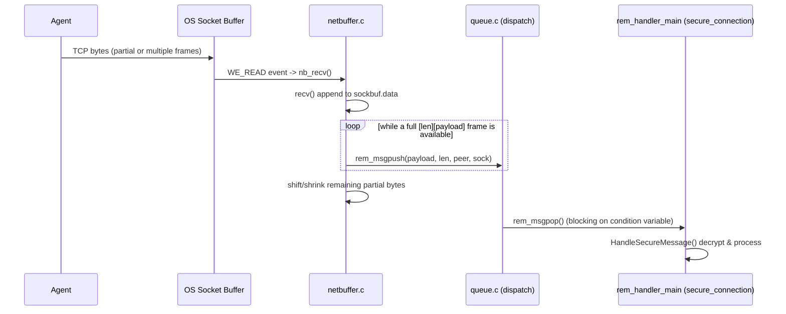
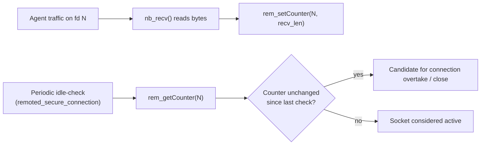
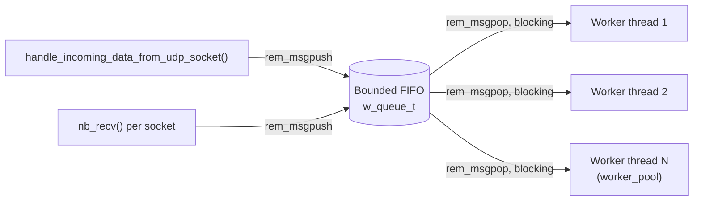
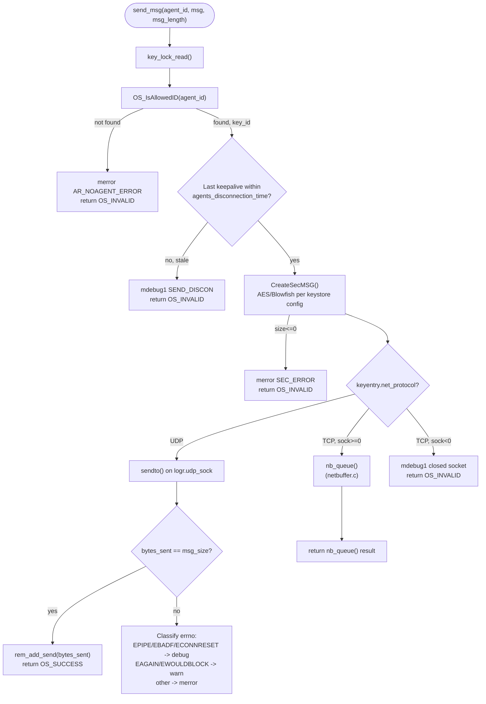
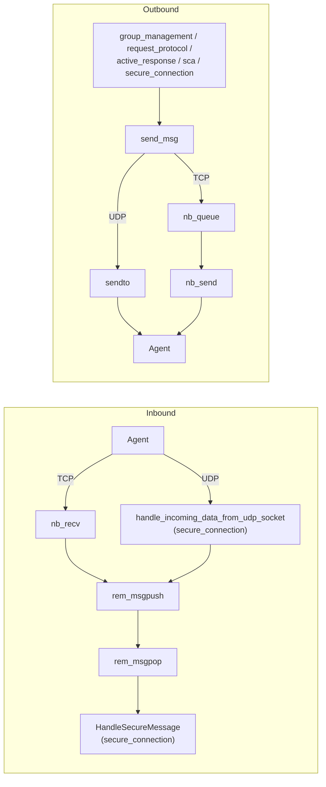

# Remoted Networking Module

## Introduction

The **Remoted Networking** module implements the low-level, protocol-agnostic transport primitives used by the Wazuh `remoted` daemon to move bytes between the manager and its agents. It sits directly below the higher-level [`remoted_secure_connection`](remoted_secure_connection.md) module and provides four tightly-scoped services:

1. **Buffered, non-blocking TCP I/O** per agent socket (`netbuffer.c`) — accumulates partial reads into complete length-prefixed messages and drains an outbound byte queue asynchronously.
2. **Per-socket byte counters** (`netcounter.c`) — a lightweight, dynamically-growing counter table indexed by file descriptor, used to detect data received on a socket since the last check (idle-connection / overtake detection).
3. **The cross-thread dispatch queue** (`queue.c`) — a bounded FIFO (`rem_msgpush`/`rem_msgpop`) that decouples the network-facing threads (which only read raw bytes) from the worker-pool threads that decrypt and process messages (`HandleSecureMessage`, in `remoted_secure_connection`).
4. **The encrypted outbound send primitive** (`sendmsg.c`) — `send_msg()`, the single function through which every other `remoted` submodule (group management, active response, request/response protocol, SCA) delivers an encrypted payload to a specific agent, transparently choosing UDP `sendto()` or the buffered TCP path (`nb_queue`) depending on the agent's negotiated protocol. It also owns the global agent-key read/write lock and the keystore hot-reload check (`check_keyupdate`).

This module contains **no cryptography, no control-message semantics, and no group/business logic** — those concerns belong to sibling modules. Its sole responsibility is to make byte transport reliable, non-blocking, and safely shared across the daemon's multi-threaded worker pool.

It is one of seven functional partitions of the native `remoted` daemon, documented under [Agent & Manager Native Daemons (C)](Agent_%26_Manager_Native_Daemons_(C).md). See the parent [`remoted`](remoted.md) document for the full daemon overview and the sibling-module table.

| Sibling module | Relationship to this module |
|---|---|
| [remoted_lifecycle](remoted_lifecycle.md) | Declares the shared types (`message_t`, `netbuffer_t`, `sockbuffer_t`) consumed here; forks/initializes the process before this module's functions are ever called. |
| [remoted_secure_connection](remoted_secure_connection.md) | The **primary consumer**: drives the `wnotify` event loop, calls `nb_recv`/`nb_send`/`nb_queue` for TCP sockets, `rem_msgpush`/`rem_msgpop` for the dispatch queue, and `send_msg` to reply to agents. |
| [remoted_group_management](remoted_group_management.md) | Calls `send_msg()` (via `send_file_toagent()`) to stream `merged.mg` shared-configuration chunks to agents. |
| [remoted_request_protocol](remoted_request_protocol.md) | Calls `send_msg()` to deliver synchronous request payloads to agents. |
| [remoted_state_metrics](remoted_state_metrics.md) | Consumes counters incremented indirectly by this module's callers (`rem_add_send`, `rem_inc_send_discarded`) to publish daemon statistics. |

---

## Responsibilities

| Responsibility | Implemented in | Description |
|---|---|---|
| TCP receive buffering & message framing | `netbuffer.c` (`nb_recv`) | Reads available bytes non-blockingly, extends a per-socket buffer, and extracts as many complete 4-byte length-prefixed messages as are available, pushing each into the dispatch queue. |
| TCP transmit buffering | `netbuffer.c` (`nb_queue`, `nb_send`) | Appends an outbound encrypted message (with length header) to a per-socket `bqueue_t` byte ring-buffer; a separate call drains it asynchronously via non-blocking `send()`. |
| Per-socket lifecycle | `netbuffer.c` (`nb_open`, `nb_close`) | Allocates/releases the `sockbuffer_t` (including its `bqueue_t`) when a TCP connection is accepted or torn down. |
| Byte-received counters | `netcounter.c` (`rem_setCounter`, `rem_getCounter`) | Tracks the last known byte count per socket fd, used by the secure-connection layer to detect socket inactivity (idle/duplicate-connection handling). |
| Cross-thread message dispatch | `queue.c` (`rem_msgpush`, `rem_msgpop`) | Bounded producer/consumer FIFO connecting the network-reading path (single/few threads) to the `rem_handler_main` worker pool that decrypts and processes messages. |
| Encrypted agent delivery | `sendmsg.c` (`send_msg`) | Resolves the agent's key, encrypts the payload (`CreateSecMSG`), and transmits over UDP (`sendto`) or the buffered TCP layer (`nb_queue`), depending on `keyentries[...]->net_protocol`. |
| Key-store consistency | `sendmsg.c` (`check_keyupdate`, `key_lock_*`) | Detects `client.keys`/keystore file changes and triggers an in-memory reload guarded by a read/write lock shared with the whole daemon. |

---

## Architecture Overview



---

## Core Data Structures



| Structure | Declared in | Purpose |
|---|---|---|
| `netbuffer_t` / `sockbuffer_t` | `remoted.h` (owned conceptually by [remoted_lifecycle](remoted_lifecycle.md)) | Per-fd state: raw receive accumulation buffer (`data`/`data_len`/`data_size`) plus the outbound `bqueue_t` used for asynchronous, non-blocking sends. Indexed directly by socket fd (`buffers[sock]`), growing `max_fd` on demand. |
| `message_t` | `remoted.h` | A single fully-received message handed from the network path to a worker thread via the dispatch queue; carries the sender's `sockaddr_storage`, the originating socket, a monotonically increasing `counter`, and the raw (still encrypted) payload. |
| `bqueue_t` | `shared_lib` (`headers/bqueue_op.h`) | Generic byte ring-buffer with push/peek/drop semantics and configurable shrink behavior (`BQUEUE_SHRINK`); reused unmodified from the shared library — see [headers](headers.md). |
| `rem_fdlist_t` | `netcounter.c` (private) | Dynamically-growing array of `size_t` byte counters, one slot per possible fd, expanded in blocks of `SIZE_BLOCK` (256) as new fds appear. |

---

## Component Deep-Dive

### 1. `netbuffer.c` — Buffered TCP Transport

Four functions form the complete lifecycle of a TCP peer's buffers, all synchronized by a single module-wide mutex (`mutex`):

| Function | Called from | Behavior |
|---|---|---|
| `nb_open(buffer, sock, peer_info)` | `handle_new_tcp_connection()` in `remoted_secure_connection` | Grows `buffer->buffers` if `sock >= max_fd`, zeroes the slot, stores the peer address, and allocates a fresh `bqueue_t` (`send_buffer_size` bytes, `BQUEUE_SHRINK` flag) for outbound data. |
| `nb_close(buffer, sock)` | Socket teardown path in `remoted_secure_connection` | Destroys the `bqueue_t`, frees the receive accumulation buffer, and zeroes the slot so a future `sock` reuse starts clean. |
| `nb_recv(buffer, sock)` | `handle_incoming_data_from_tcp_socket()` | Non-blocking `recv()` into an extended buffer; then loops over the buffer extracting every complete `[uint32_t length][payload]` frame, calling `rem_msgpush()` for each. Leftover partial data is shifted to the buffer start; memory is optionally shrunk per the `buffer_relax` policy (0 = never shrink, 1 = shrink to chunk size, ≥2 = full shrink-to-fit). |
| `nb_queue(buffer, sock, crypt_msg, msg_size, agent_id)` | `send_msg()` (this module) and any caller needing to enqueue TCP output | Prepends a 4-byte network-order length header to the message and `bqueue_push()`s it. On transient buffer-full, retries once after `sleep(send_timeout_to_retry)`. On success (and only when the queue was previously empty) requests a `WO_WRITE` notification via `wnotify_modify()` so the event loop knows to drain it. On persistent failure, increments the discard counter (`rem_inc_send_discarded`) and logs a warning. |
| `nb_send(buffer, socket)` | `handle_outgoing_data_to_tcp_socket()` | Non-blocking `bqueue_peek()` + `send(..., MSG_DONTWAIT)`; on success `bqueue_drop()`s the sent bytes. When the queue drains to empty, downgrades the socket's notification back to `WO_READ` only. |



```mermaid
sequenceDiagram
    participant Caller as send_msg() / any sender
    participant NB as netbuffer.c (nb_queue)
    participant BQ as bqueue_t
    participant Loop as wnotify event loop
    participant Kernel as OS Socket Buffer
    participant Agent

    Caller->>NB: nb_queue(sock, crypt_msg, size, agent_id)
    NB->>BQ: bqueue_push([len][crypt_msg])
    alt queue was empty before push
        NB->>Loop: wnotify_modify(WO_READ|WO_WRITE)
    end
    Loop->>NB: WE_WRITE event -> nb_send(sock)
    NB->>BQ: bqueue_peek() + send(MSG_DONTWAIT)
    Kernel->>Agent: TCP bytes delivered
    NB->>BQ: bqueue_drop(sent_bytes)
    alt queue now empty
        NB->>Loop: wnotify_modify(WO_READ)
    end
```

### 2. `netcounter.c` — Per-Socket Byte Counters

A minimal, mutex-protected, dynamically resizable array (`rem_fdlist_t`) mapping a socket fd to the last recorded cumulative byte count:

- `rem_initList(initial_size)` — allocates the initial counter array (called once at daemon startup).
- `rem_setCounter(fd, counter)` — grows the array in `SIZE_BLOCK` (256-entry) increments if `fd` exceeds the current capacity, then stores the value.
- `rem_getCounter(fd)` — returns `0` for any fd beyond the current capacity (never yet seen), otherwise the stored value.

This is consumed by [`remoted_secure_connection`](remoted_secure_connection.md) to detect **socket inactivity** — comparing the counter across two points in time distinguishes a genuinely idle TCP connection (candidate for closing during a "connection overtake" by a reconnecting agent) from one that is actively receiving data.



### 3. `queue.c` — Cross-Thread Dispatch Queue

Wraps the generic `w_queue_t` (bounded circular queue, from `shared_lib`'s `queue_op.c`) with `message_t`-specific push/pop helpers and a condition variable for blocking consumers:

- `rem_msginit(size)` — creates the queue with a fixed capacity (`queue_size` daemon option), called once from `HandleSecure()`.
- `rem_msgpush(buffer, size, addr, sock)` — copies the raw message into a newly allocated `message_t`, stamps it with a strictly increasing `global_counter`, and pushes it. On a full queue, the message is freed immediately, a *discarded* counter is incremented (`rem_inc_recv_discarded`), and a **one-time** warning is logged (guarded by a `static int reported` flag) to avoid log flooding under sustained overload.
- `rem_msgpop()` — blocks on `available` (a `pthread_cond_t`) until a message is present, then pops and returns it.
- `rem_get_qsize()` / `rem_get_tsize()` — expose current/total queue occupancy for [`remoted_state_metrics`](remoted_state_metrics.md).
- `rem_msgfree(message)` — releases a `message_t` and its buffer; called by the worker after processing.

This queue is the **single hand-off point** between the (few) network I/O threads — UDP receiver, and each TCP socket's `nb_recv` call — and the configurable **worker pool** (`remoted.worker_pool` internal option) that performs the CPU-bound decryption/parsing work in `HandleSecureMessage()`.



### 4. `sendmsg.c` — Encrypted Outbound Delivery & Key Consistency

This file exposes the single most widely called function in the whole `remoted` daemon: **`send_msg()`**. Every submodule that needs to talk *to* an agent (shared-configuration push, active-response commands, SCA policy pushes, synchronous requests, `#pong` replies) funnels through it.



Key behaviors:
- **Per-key mutex** (`keyentries[key_id]->mutex`) serializes concurrent senders targeting the *same* agent (e.g., a shared-file push racing with an active-response command), while the module-wide `keyupdate_rwlock` (via `key_lock_read`) only needs to be held for the **read** side, allowing many concurrent `send_msg()` calls to different agents to proceed in parallel.
- **Protocol dispatch is per-agent, not per-daemon**: `keyentry->net_protocol` is negotiated per connection (an agent can be UDP while another is TCP simultaneously), so `send_msg()` transparently picks the right transport on every call.
- **UDP has no back-pressure**: a `sendto()` failure is classified by `errno` into disconnect-like conditions (logged at `debug`), transient conditions (`EAGAIN`/`EWOULDBLOCK`, logged as a `warn`), or hard errors (`merror`). TCP failures are instead handled asynchronously by `nb_queue`/`nb_send` (see above), since the buffered path can retry without blocking the caller.
- **`check_keyupdate()`** — called periodically by the `rem_keyupdate_main()` housekeeping thread in [`remoted_secure_connection`](remoted_secure_connection.md); detects modification of the on-disk key file (`OS_CheckUpdateKeys`) and, under the **write** lock (`key_lock_write`), reloads the entire keystore in-memory (`OS_UpdateKeys`) so that newly enrolled or re-keyed agents become sendable without a daemon restart.
- **`key_lock_init/read/write/unlock`** — thin wrappers around a shared `rwlock_t` (see [headers](headers.md) → `rwlock_op.h`), giving the rest of the daemon a single, consistently named locking API around the keystore.

```mermaid
sequenceDiagram
    participant Housekeeping as rem_keyupdate_main (secure_connection)
    participant SM as sendmsg.c
    participant Keys as keystore (keys)
    participant Sender as any send_msg() caller

    loop every keyupdate_interval seconds
        Housekeeping->>SM: check_keyupdate()
        SM->>Keys: OS_CheckUpdateKeys()
        alt key file changed
            SM->>SM: key_lock_write()
            SM->>Keys: OS_UpdateKeys()
            SM->>SM: key_unlock()
        end
    end

    Sender->>SM: send_msg(agent_id, msg, len)
    SM->>SM: key_lock_read()
    Note over SM,Keys: Concurrent readers allowed;<br/>blocked only during a reload
    SM->>Keys: OS_IsAllowedID / encrypt / transmit
    SM->>SM: key_unlock()
```

---

## Concurrency Model

| Lock / Primitive | Scope | Protects |
|---|---|---|
| `mutex` (static, `netbuffer.c`) | Module-wide | All `sockbuffer_t` fields (`data`, `data_len`, `bqueue`) across every fd — coarse-grained but short-held, since it wraps only memory (re)allocation and buffer bookkeeping, not the blocking `recv()`/`send()` syscalls themselves. |
| `lock` (static, `netcounter.c`) | Module-wide | The dynamically-growing `rem_fdlist_t.list` array during resize and per-fd read/write. |
| `mutex` + `available` (`pthread_cond_t`, `queue.c`) | Module-wide | The underlying `w_queue_t` ring buffer and its occupancy; the condition variable lets `rem_msgpop()` block efficiently instead of busy-polling. |
| `keyupdate_rwlock` (`sendmsg.c`, via `key_lock_*`) | Daemon-wide (declared here, used everywhere agent keys are read) | The entire keystore (`keys` global) — readers (`send_msg`, `HandleSecureMessage`) proceed concurrently; the writer (`check_keyupdate`'s reload) has exclusive access. |
| `keyentries[key_id]->mutex` (per-key, in `keystore`) | Single agent | Serializes the encrypt+transmit critical section in `send_msg()` for one specific agent, so interleaved callers (group management, active response, request protocol) cannot corrupt each other's socket state or send truncated frames. |

---

## Data Flow Summary



---

## Integration Points

- **Upward (consumers)**: [`remoted_secure_connection`](remoted_secure_connection.md) is the primary driver of every function in this module — it owns the `wnotify` event loop that decides *when* to call `nb_recv`/`nb_send`, and its worker pool is the consumer side of `rem_msgpop()`. [`remoted_group_management`](remoted_group_management.md) and [`remoted_request_protocol`](remoted_request_protocol.md) call `send_msg()` exclusively, never touching `netbuffer`/`queue` internals directly.
- **Downward (dependencies)**: Relies on the shared `bqueue_t` and `w_queue_t` implementations from the generic C utility layer (`shared_lib`, part of [Agent & Manager Native Daemons (C)](Agent_%26_Manager_Native_Daemons_(C).md)), on `wnotify` for edge/level-triggered socket readiness, on `os_net` for raw socket primitives, and on `os_crypto`'s `CreateSecMSG` for payload encryption.
- **Metrics**: Every discard, successful send, and byte count observed here feeds counters exposed by [`remoted_state_metrics`](remoted_state_metrics.md) (`rem_add_send`, `rem_inc_send_discarded`, `rem_inc_recv_discarded`, `rem_get_qsize`/`rem_get_tsize` for queue occupancy in the `.state` file and control-socket JSON).
- **Configuration**: Buffer sizing and timing are governed by `remoted` internal options — `send_buffer_size`, `receive_chunk`, `send_chunk`, `buffer_relax`, `send_timeout_to_retry`, `queue_size` — documented as part of the `remote-config.h` structures in [Configuration_Data_Structures_(C_Headers)](Configuration_Data_Structures_(C_Headers).md).

## Related Modules

- [remoted](remoted.md) — parent daemon overview and full sub-module table.
- [remoted_lifecycle](remoted_lifecycle.md) — declares `message_t`, `netbuffer_t`, `sockbuffer_t`, `pending_data_t` and owns process bootstrap.
- [remoted_secure_connection](remoted_secure_connection.md) — the event loop and worker pool that exclusively drive this module's public API.
- [remoted_group_management](remoted_group_management.md) — shared-configuration distribution, a heavy user of `send_msg()`.
- [remoted_request_protocol](remoted_request_protocol.md) — synchronous agent request/response, also a `send_msg()` client.
- [remoted_state_metrics](remoted_state_metrics.md) — publishes counters incremented by this module's send/receive paths.
- [Agent & Manager Native Daemons (C)](Agent_%26_Manager_Native_Daemons_(C).md) — parent domain, including `shared_lib` (`bqueue_op`, `queue_op`, `rwlock_op`) and `os_net`/`os_crypto` dependencies.
- [headers](headers.md) — shared struct declarations (`bqueue_t`, `rwlock_t`, `wnotify_t`).
