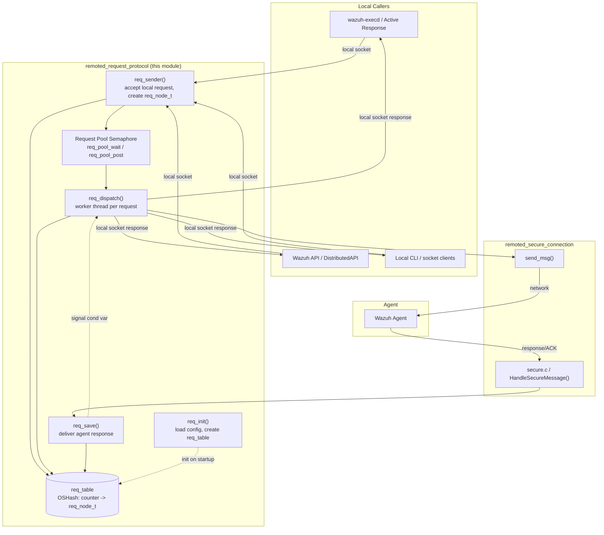
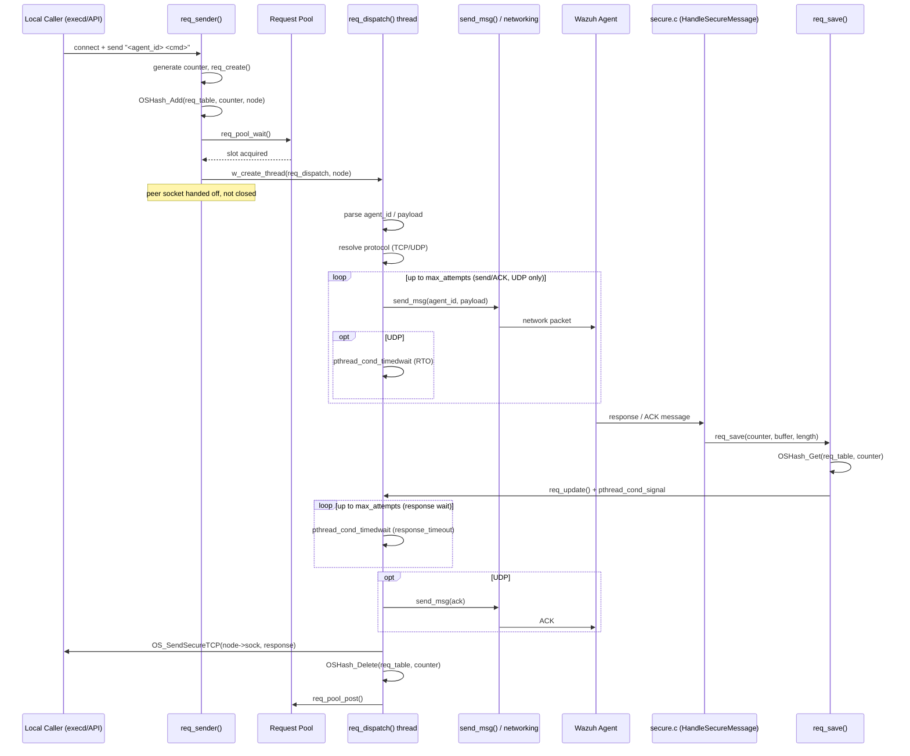
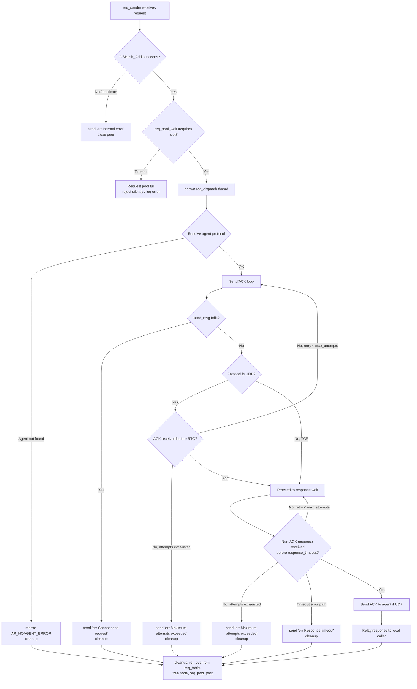
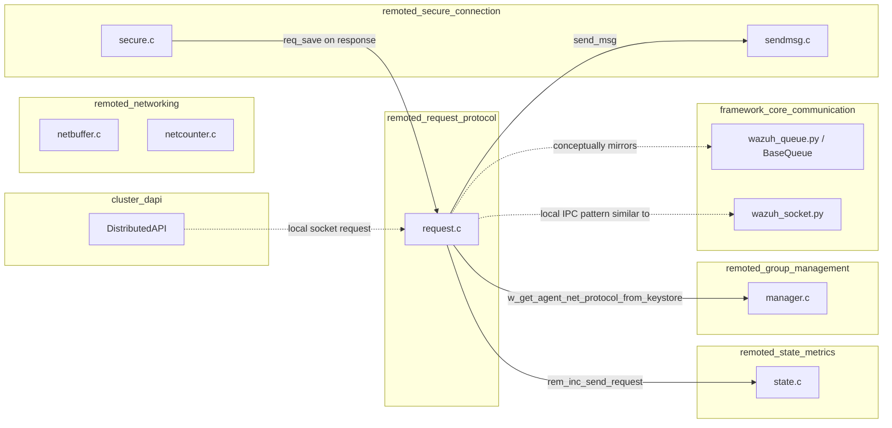
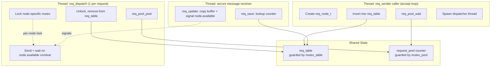

# Remoted Request Protocol

## Introduction

The **Remoted Request Protocol** module implements the synchronous "active request" mechanism inside the `remoted` daemon (the Wazuh manager's agent-communication service). It allows local Wazuh components — the manager's API layer, `wazuh-execd`, other daemons, or CLI tools — to send a command to a specific agent through a local UNIX socket and **block until the agent's response arrives** (or a timeout/attempt-limit is reached), instead of relying on `remoted`'s normal asynchronous, fire-and-forget message flow.

This capability underpins features such as:
- Active-response command dispatch to a single agent
- On-demand configuration retrieval (`getconfig`) from an agent
- Ad-hoc queries used by the Wazuh API/Framework via the `DistributedAPI` (see [cluster_dapi.md](cluster_dapi.md)) when contacting a specific agent

The module is implemented in a single source file, `src/remoted/request.c`, and is a sibling of other `remoted` subsystems such as connection handling (`remoted_secure_connection`), group/shared-file management, and state/metrics reporting.

---

## Purpose and Core Functionality

`remoted` normally pushes messages to agents and, separately, accepts asynchronous messages back from them through `save_controlmsg`/`HandleSecureMessage` (see [remoted_secure_connection](remoted_secure_connection.md)). The **request protocol** layers a synchronous request/response pattern on top of this asynchronous transport:

1. A local client (e.g., `execd`, an API worker, or a CLI tool) connects to `remoted`'s local request socket and sends a message formatted as `"<agent_id> <command...>"`.
2. `req_sender()` accepts this connection, generates a unique **request counter**, wraps the payload in a control-header envelope, and stores bookkeeping state (a `req_node_t`) in a global hash table keyed by that counter.
3. A pool-limited worker thread (`req_dispatch`) sends the wrapped request to the target agent through the normal agent messaging path (`send_msg`), then **blocks on a condition variable** waiting for the agent's ACK and/or response.
4. When the agent's reply arrives via the normal secure-message receive path, `req_save()` looks up the pending request by counter and delivers the payload to the waiting thread by signaling its condition variable.
5. The dispatcher thread relays the response back to the original local socket and cleans up.

Key responsibilities of this module:
- **Request lifecycle management**: creation, tracking, and cleanup of in-flight requests via a hash table (`req_table`) protected by `mutex_table`.
- **Concurrency control / backpressure**: a bounded "request pool" (`request_pool`) limits the number of concurrent in-flight requests; `req_pool_wait()`/`req_pool_post()` implement a counting semaphore with timeout.
- **Protocol-aware retry logic**: for UDP-connected agents, the module resends the request and waits for an ACK using a configurable retransmission timeout (RTO) and maximum attempt count; TCP-connected agents rely on the transport's own reliability and skip the ACK-wait loop.
- **Timeout enforcement**: separate timeouts govern request send/ACK (`request_timeout`, RTO) and full response wait (`response_timeout`).
- **Error surfacing**: standardized error strings (`err Internal error`, `err Cannot send request`, `err Maximum attempts exceeded`, `err Response timeout`) are sent back to the local caller when something goes wrong.

---

## Architecture Overview

---

## Component Reference

### `req_init()`
Initializes module-level state at `remoted` startup:
- Reads tunable parameters from `internal_options` via `getDefine_Int`: `request_pool`, `request_timeout`, `response_timeout`, `request_rto_sec`, `request_rto_msec`, `max_attempts`, `guess_agent_group`.
- Warns if `guess_agent_group` is enabled on a worker node (should be master-only).
- Creates the `req_table` (`OSHash`) that tracks in-flight requests, registering `req_free` as the value-destructor callback.

### `req_sender(int peer, char *buffer, ssize_t length)`
Entry point invoked when a new request arrives on the local socket:
- Generates a pseudo-random hexadecimal **counter** (`os_random()`) used to correlate the request with its eventual response.
- Builds a `req_node_t` via `req_create()` (from `request_op.h`, shared with other request-consuming daemons) and inserts it into `req_table`.
- On hash-table failure (allocation or duplicate counter), replies with `err Internal error` and closes the peer socket immediately.
- On success, waits for a free slot in the request pool (`req_pool_wait()`) and spawns a detached dispatcher thread (`req_dispatch`) — the local socket is *not* closed here; the dispatcher owns it until completion.

### `req_dispatch(req_node_t * node)` (static)
The heart of the protocol, run in its own thread per request:
1. Parses `"<agent_id> <payload>"` out of the raw buffer.
2. Wraps the payload with the control header and `HC_REQUEST` marker plus the request counter, producing the exact bytes to send to the agent.
3. Resolves the agent's transport protocol (TCP or UDP) using `w_get_agent_net_protocol_from_keystore()` under the keystore read lock (see [os_auth_key_request](os_auth_key_request.md) and [client_agent_native_communication](client_agent_native_communication.md) for key/protocol storage).
4. **Send-and-ACK loop** (bounded by `max_attempts`):
   - Sends the request via `send_msg()` (see [remoted_networking](remoted_networking.md)).
   - For UDP agents only, waits on `node->available` with a computed RTO-based deadline; on timeout, retries sending.
   - For TCP agents, breaks immediately after a successful send (TCP handles delivery reliability at the transport layer).
5. **Response-wait loop**: once an ACK/ping-back is observed, continues waiting (bounded by `max_attempts` again, this time using `response_timeout`) until a *non-ACK* buffer is delivered by `req_save()`.
6. For UDP agents, sends an explicit ACK back to the agent once a real response is received.
7. Relays the final response to the original local caller via `OS_SendSecureTCP(node->sock, ...)`.
8. Cleans up: removes the entry from `req_table`, frees the node, releases the request-id string and payload buffer, and calls `req_pool_post()` to free a pool slot for the next waiting request.

Errors at any stage cause a specific `err ...` string to be sent to the local caller before jumping to cleanup.

### `req_save(const char * counter, const char * buffer, size_t length)`
Called from the secure-message receive path (`remoted_secure_connection`) whenever a message tagged as a request-response/ACK arrives from an agent:
- Looks up the pending `req_node_t` by `counter` in `req_table`.
- If found, calls `req_update()` (shared helper) to copy the response payload into the node and signal its condition variable, waking the blocked `req_dispatch` thread.
- If not found (e.g., duplicate or stale message), logs a debug message and returns `-1`.

### `req_pool_post()` / `req_pool_wait()` (static)
A simple counting semaphore implemented with a mutex + condition variable:
- `req_pool_wait()`: blocks (bounded by `request_timeout`) until `request_pool > 0`, then decrements it. Returns `0` if the timeout expires (request pool exhausted) so the caller can reject the request instead of spawning an unbounded number of threads.
- `req_pool_post()`: increments `request_pool` and signals one waiter, called during dispatcher cleanup to return the slot.

### Data Structures

| Component | Defined in | Role |
|---|---|---|
| `req_node_t` | `src/headers/request_op.h` (shared header) | Per-request state: socket, counter, target, buffer, length, and a private mutex/condvar pair used to synchronize the dispatcher thread with `req_save()`. |
| `req_table` (`OSHash`) | `request.c` (module-private) | Maps request counter (string) → `req_node_t*`; guarded by `mutex_table`. |
| `remoted_state_t` / `sent_msgs_t` | `src/remoted/state.h` | `rem_inc_send_request()` (called on every request send attempt) feeds into `remoted`'s exposed statistics — see [remoted_state_metrics](remoted_state_metrics.md). |

---

## Data Flow: Successful Request/Response Cycle

---

## Process Flow: Error and Timeout Handling

---

## Component Interaction with the Rest of `remoted`

Notes on relationships:
- **`remoted_secure_connection`** ([remoted_secure_connection.md](remoted_secure_connection.md)) owns the inbound message path from agents; when it recognizes a request-response/ACK control message, it calls into this module's `req_save()`.
- **`remoted_networking`** ([remoted_networking.md](remoted_networking.md)) provides `send_msg()` used to actually transmit requests to agents, plus the counters/netbuffer infrastructure for the underlying sockets.
- **`remoted_state_metrics`** ([remoted_state_metrics.md](remoted_state_metrics.md)) receives increment calls (`rem_inc_send_request`) for observability; the module's request pool and timeout activity is indirectly visible through `remoted`'s exposed stats (`GET /manager/stats/remoted` in the [manager_module](manager_module.md) API, `get_stats_remoted`).
- **`remoted_group_management`** ([remoted_group_management.md](remoted_group_management.md)) supplies `w_get_agent_net_protocol_from_keystore()`, since the keystore (`keys`/`keyentry`) that stores each agent's negotiated protocol lives in `manager.c`/`shared/keys.c`.
- **`cluster_dapi`** ([cluster_dapi.md](cluster_dapi.md)) is the primary indirect consumer at the framework level: `DistributedAPI` requests targeting a single agent (e.g., agent-specific commands) are routed through the manager's local `remoted` request socket, which this module services.
- **`agent_upgrade_module`** and **active response** flows (see [active_response_module.md](active_response_module.md) and [agent_upgrade_module.md](agent_upgrade_module.md)) also rely on this synchronous request path when an immediate, per-agent acknowledgement is required (e.g., checking agent status before dispatching a WPK).

---

## Configuration Parameters

All parameters are sourced from `internal_options.conf` under the `remoted` section via `getDefine_Int()`:

| Parameter | Range | Purpose |
|---|---|---|
| `request_pool` | 1–4096 | Maximum number of concurrent in-flight requests (semaphore initial value). |
| `request_timeout` | 1–600 s | Max time a new request waits for a free pool slot. |
| `response_timeout` | 1–3600 s | Max time to wait for the agent's actual (non-ACK) response once ACK'd. |
| `request_rto_sec` / `request_rto_msec` | 0–60 s / 0–999 ms | Retransmission timeout components for UDP ACK waits. |
| `max_attempts` | 1–16 | Maximum number of send/ACK and response-wait retries. |
| `guess_agent_group` | 0/1 | Enables group inference heuristics; must only be enabled on the master node (a warning is logged otherwise). |

These are consistent with the broader `remoted` configuration model documented in [Remote_Config](Remote_Config.md) (`src/config/remote-config.h`).

---

## Concurrency Model

Each `req_node_t` carries its own mutex/condition-variable pair, so contention is limited to the shared hash table (`mutex_table`, held only briefly for insert/lookup/delete) and the pool counter (`mutex_pool`). This design allows many requests to be in flight and blocked independently without serializing on a single global lock.

---

## Related Documentation

- [remoted_secure_connection.md](remoted_secure_connection.md) — inbound agent message handling that feeds `req_save()`.
- [remoted_networking.md](remoted_networking.md) — `send_msg`, netbuffer, and netcounter used to transmit requests.
- [remoted_state_metrics.md](remoted_state_metrics.md) — statistics counters incremented by this module.
- [remoted_group_management.md](remoted_group_management.md) — agent keystore and protocol resolution (`manager.c`).
- [os_auth_key_request.md](os_auth_key_request.md) — related but distinct request/response mechanism used for agent key requests.
- [cluster_dapi.md](cluster_dapi.md) — framework-level distributed API that can trigger single-agent requests through this protocol.
- [active_response_module.md](active_response_module.md) / [agent_upgrade_module.md](agent_upgrade_module.md) — high-level features that depend on synchronous per-agent requests.
- [Remote_Config.md](Remote_Config.md) — configuration schema (`remoted` block) referenced by the tunables listed above.
