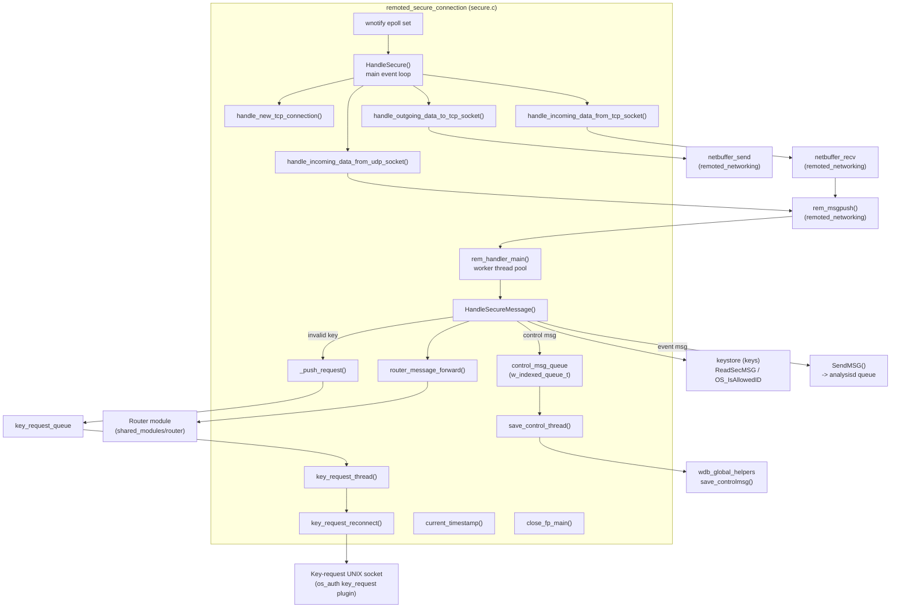
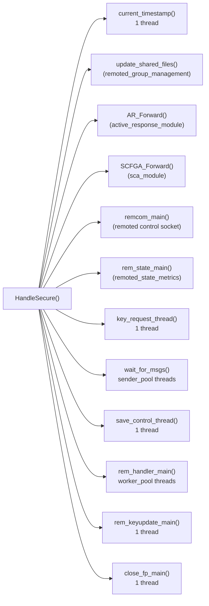
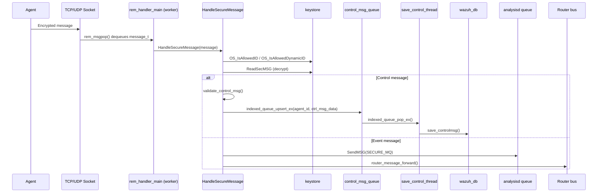
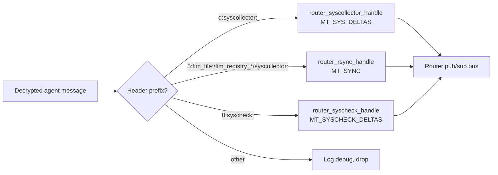
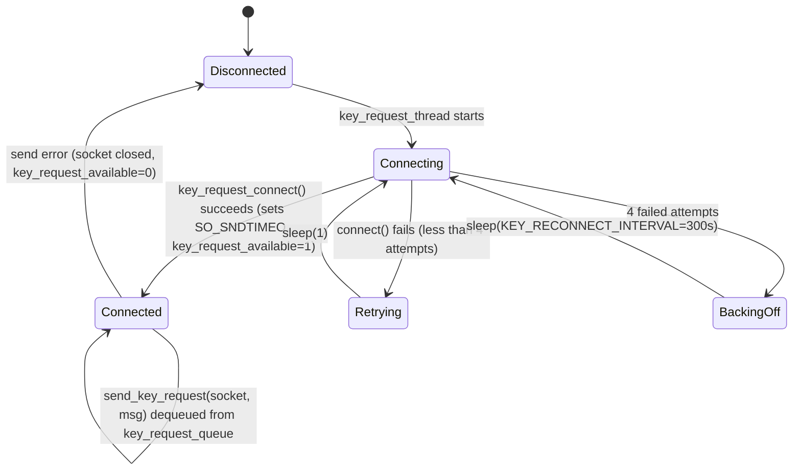
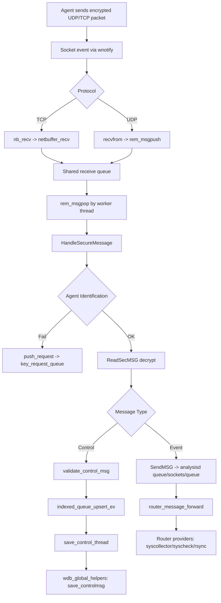

# Remoted Secure Connection Module

## Introduction

The **Remoted Secure Connection** module implements the core encrypted-communication engine of the Wazuh `remoted` daemon. It is the component responsible for accepting, authenticating, decrypting, dispatching and forwarding all traffic that arrives from Wazuh agents over the "secure" TCP/UDP channel (port 1514 by default). It also implements the *key-request* mechanism that allows the manager to ask an external provider (e.g. an authd plugin) to fetch or refresh an agent's key when a message cannot be validated against the local keystore.

This module is implemented entirely in a single translation unit — `src/remoted/secure.c` — and is one of several sibling sub-modules that together make up the `remoted` daemon (see [Related Modules](#related-modules) below). While the other sub-modules manage the daemon lifecycle, shared-configuration distribution, low level socket buffering, and metrics, **this module owns the entire secure-message state machine**: from raw socket I/O, through decryption and control-message validation, to final forwarding into the local analysis queue and the internal Router pub/sub bus.

---

## Responsibilities

| Responsibility | Description |
|---|---|
| Connection acceptance | Accepts new TCP connections and registers UDP/TCP sockets with the `wnotify` (epoll-like) event loop. |
| Secure message decryption | Uses the keystore (`keys`) and `ReadSecMSG` to authenticate and decrypt agent messages (AES/Blowfish). |
| Control message handling | Detects control headers (`startup`, `shutdown`, keepalive, request), validates them, and queues them for asynchronous persistence into Wazuh DB. |
| Event/log forwarding | Sends decrypted event payloads to the local `queue/sockets/queue` (analysisd) via `SendMSG`. |
| Router forwarding | Publishes syscollector delta/sync and syscheck delta messages onto the internal **Router** pub/sub bus for consumption by indexers/other modules. |
| Key request feature | Implements a background thread and reconnect logic that requests missing/invalid agent keys from an external key-request socket (`authd` key-request plugin). |
| Idle/duplicate socket handling | Detects and closes stale or duplicate TCP sockets when an agent reconnects (connection overtaking). |
| Housekeeping threads | Periodic timestamp updates, rids-file closing, and key-file reload detection. |

---

## Architecture Overview



---

## Thread Model

`HandleSecure()` is invoked once from the `remoted` main daemon startup path and spawns/owns the following threads (in addition to threads created by sibling modules such as `remoted_lifecycle` and `remoted_group_management`, both part of [Agent_&_Manager_Native_Daemons_(C)](Agent_%26_Manager_Native_Daemons_(C).md)):



Key configuration values (read via `getDefine_Int`, see [Configuration_Data_Structures_(C_Headers) → Remote_Config](Configuration_Data_Structures_(C_Headers).md)):

| Option | Purpose | Default |
|---|---|---|
| `remoted.control_msg_queue_size` | Capacity of the indexed control-message queue | 4096 |
| `remoted.sender_pool` | Number of `wait_for_msgs` sender threads | 1 |
| `remoted.worker_pool` | Number of `rem_handler_main` worker threads | 1 |
| `remoted.keyupdate_interval` | Seconds between checks for key-file changes | 1 |
| `logr.rids_closing_time` | Seconds of inactivity before closing an agent's rids file | (from `remoted.h`) |

---

## Core Components

### 1. `HandleSecure()`
The entry point of the module. It:
1. Initializes the `control_msg_queue` (an indexed queue keyed by agent ID, see `w_indexed_queue_t` in [Agent_&_Manager_Native_Daemons_(C) → shared_lib](Agent_%26_Manager_Native_Daemons_(C).md)).
2. Initializes the agent-state hash table (`remoted_agents_state`), manager subsystems, message queue (`rem_msginit`), and key mutex.
3. Spawns all housekeeping and worker threads described above.
4. Resets agents' connection status in Wazuh DB (`wdb_reset_agents_connection`) — see [wazuh_db](wazuh_db.md).
5. Creates Router providers for `deltas-syscollector`, `deltas-syscheck`, and `rsync` topics — see [Shared_Modules_Infrastructure_(C++)](Shared_Modules_Infrastructure_(C%2B%2B).md).
6. Reads authentication keys via `OS_ReadKeys` (from [Agent_&_Manager_Native_Daemons_(C) → os_crypto](Agent_%26_Manager_Native_Daemons_(C).md)).
7. Registers the TCP/UDP listening sockets with `wnotify` (an epoll wrapper) and enters the infinite event loop, dispatching to:
   - `handle_new_tcp_connection()`
   - `handle_incoming_data_from_udp_socket()`
   - `handle_incoming_data_from_tcp_socket()`
   - `handle_outgoing_data_to_tcp_socket()`

### 2. Socket Event Handlers
| Function | Trigger | Action |
|---|---|---|
| `handle_new_tcp_connection` | New connection on `logr.tcp_sock` | `accept()`s the client, opens buffers in `netbuffer_recv`/`netbuffer_send` (see `remoted_networking` sub-module), registers the fd for read events. |
| `handle_incoming_data_from_tcp_socket` | `WE_READ` event on a client fd | Calls `nb_recv()`; closes socket on error/EOF via `_close_sock()`. |
| `handle_outgoing_data_to_tcp_socket` | `WE_WRITE` event on a client fd | Calls `nb_send()`; closes socket on unrecoverable send errors. |
| `handle_incoming_data_from_udp_socket` | Data on `logr.udp_sock` | `recvfrom()`s a datagram and pushes it into the shared message queue via `rem_msgpush()`. |

### 3. `HandleSecureMessage()`
The heart of the module — executed by each `rem_handler_main` worker thread for every message popped from the shared receive queue (`rem_msgpop`). Main steps:

1. **Source resolution** – extracts source IP (`get_ipv4_string`/`get_ipv6_string`) from `sockaddr_storage`.
2. **Agent identification**:
   - If the message starts with `!<id>!`, resolves the agent by dynamic/static ID (`OS_IsAllowedDynamicID` / `OS_IsAllowedID`).
   - If it's a `#ping` message, replies with `#pong` directly (UDP `sendto` or `OS_SendSecureTCP`) and returns.
   - Otherwise, resolves the agent by source IP (`OS_IsAllowedIP`).
3. **Connection-overtaking check** – if an agent's key is already bound to a different active socket, either closes the *older* idle socket (when `connection_overtake_time` elapses) or rejects the new connection.
4. **Decryption** – calls `ReadSecMSG()`; on `KS_ENCKEY` failures triggers a key-request (`push_request`).
5. **Control-message branch** (`IsValidHeader`) :
   - Validates the message via `validate_control_msg()` (startup/shutdown detection).
   - Wraps the result in a `w_ctrl_msg_data_t` and **upserts** it into `control_msg_queue` (indexed by agent ID) so that only the latest control message per agent is retained — avoiding backlog explosion.
   - Updates socket bookkeeping via `OS_AddSocket`.
6. **Event-message branch** – forwards the decrypted payload to the local queue (`SendMSG` to `DEFAULTQUEUE`, i.e. analysisd), with automatic reconnection retry, then calls `router_message_forward()`.



### 4. Control-Message Queue (`w_ctrl_msg_data_t`)
```c
typedef struct {
    keyentry * key;        // Duplicated key entry of the sending agent
    char * message;        // Raw (decrypted) control message body
    int is_startup;        // Result of validate_control_msg(): startup flag
    int is_shutdown;        // Result of validate_control_msg(): shutdown flag
    bool post_startup;      // Keystore flag: pending full sync after startup
} w_ctrl_msg_data_t;
```
This structure decouples the fast socket/decrypt path (executed by the worker pool) from the slower, blocking Wazuh DB write path executed by `save_control_thread()`. The queue is a **key-indexed** queue (`w_indexed_queue_t`, from `shared_lib`'s `indexed_queue_op.c/.h`) so that a burst of keepalives from the same agent collapses into a single pending update (`indexed_queue_upsert_ex`), preventing unnecessary DB load while still processing every distinct agent as soon as capacity allows.

### 5. `save_control_thread()`
Runs in a dedicated thread, continuously popping from `control_msg_queue` and calling `save_controlmsg()` (implemented in the sibling `remoted_group_management` area / `wazuh_db/helpers/wdb_global_helpers.c`) to persist agent status, group sync flags, and startup/shutdown transitions. It also updates the in-memory keystore's `post_startup` flag once the first post-startup keepalive is processed, using `OS_IsAllowedID` for an efficient tree lookup instead of a linear scan.

### 6. Router Message Forwarding (`router_message_forward`)
Classifies decrypted event payloads by header prefix and republishes them, stripped of the internal header, onto the appropriate Router provider handle:

| Header | Router Handle | Schema Type |
|---|---|---|
| `d:syscollector:` | `router_syscollector_handle` (`deltas-syscollector`) | `MT_SYS_DELTAS` |
| `5:fim_file:` / `5:fim_registry_key:` / `5:fim_registry_value:` / `5:syscollector:` | `router_rsync_handle` (`rsync`) | `MT_SYNC` |
| `8:syscheck:` | `router_syscheck_handle` (`deltas-syscheck`) | `MT_SYSCHECK_DELTAS` |

The forwarded message is enriched with an `agent_ctx` (`agent_id`, `agent_name`, `agent_ip`, `agent_version` looked up from `agent_data_hash`) before being sent through `router_provider_send_fb_json()`. See [Shared_Modules_Infrastructure_(C++)](Shared_Modules_Infrastructure_(C%2B%2B).md) (`router` sub-module) for the receiving side of this bus.



### 7. Key-Request Subsystem
When an agent's key cannot be validated (unknown ID, unknown IP, or decryption/`KS_ENCKEY` failure), the module calls `push_request()`, a macro that only forwards to `_push_request()` when the key-request feature is available (`key_request_available`).



- `_push_request(request, type)` — formats `"<type>:<request>"` (e.g. `"id:001"`, `"ip:10.0.0.5"`) and pushes it onto `key_request_queue` (a bounded `w_queue_t`).
- `key_request_thread()` — the consumer loop: connects (or reconnects) to the key-request UNIX socket (`KEY_REQUEST_SOCK`) and sends queued requests via `send_key_request()` / `OS_SendUnix`.
- `key_request_reconnect()` — implements bounded retry (4 attempts, 1s apart) followed by a 5-minute backoff, matching the constant `KEY_RECONNECT_INTERVAL`.

This subsystem integrates with the `os_auth` key-request plugin family described in [Agent_&_Manager_Native_Daemons_(C)](Agent_%26_Manager_Native_Daemons_(C).md) (`os_auth_key_request` sub-module).

### 8. Idle Socket / Connection-Overtake Handling
To support agent reconnection scenarios (e.g., after a network blip) without requiring manual intervention, `HandleSecureMessage()` detects when an agent's key is already bound to a different, older socket:
- If `logr.connection_overtake_time` has elapsed since the last receive on the old socket, the **old** socket is closed (`sock_idle`) and the new one takes ownership.
- Otherwise, the new connection is rejected with a warning ("Agent key already in use").

### 9. Housekeeping Threads
- **`current_timestamp()`** — updates the global atomic `current_ts` every second; used throughout the module for cheap wall-clock comparisons (e.g., connection-overtake checks) without repeated `time()` syscalls.
- **`close_fp_main()`** — periodically walks the keystore's `opened_fp_queue` (a linked queue of agents with open rids files) and closes file pointers that have been idle longer than `logr.rids_closing_time`, releasing file descriptors for inactive agents.
- **`rem_keyupdate_main()`** — periodically calls `check_keyupdate()` to detect changes to the `client.keys` file on disk and triggers a reload, incrementing `rem_inc_keys_reload()` metrics (see `remoted_state_metrics` sub-module).

### 10. Socket Cleanup (`_close_sock`)
Central helper used by nearly every error path to safely tear down a TCP client:
1. Persists the last-seen counter (`rem_setCounter`) for anti-replay/duplicate detection.
2. Removes the socket from the shared keystore (`OS_DeleteSocket`).
3. Closes the OS socket and cleans up buffers in `netbuffer_recv` / `netbuffer_send` (`nb_close`).
4. Updates TCP connection metrics (`rem_dec_tcp`).

---

## Data Flow Summary



---

## Related Modules

This module depends on and cooperates closely with several sibling and cross-cutting modules within the [Agent_&_Manager_Native_Daemons_(C)](Agent_%26_Manager_Native_Daemons_(C).md) parent module family. Refer to their dedicated documentation for details not duplicated here:

- **`remoted_lifecycle`** (part of Agent_&_Manager_Native_Daemons_(C)) — daemon startup/shutdown, `remoted.h` shared structures (`message_t`, `netbuffer_t`, `pending_data_t`).
- **`remoted_networking`** (part of Agent_&_Manager_Native_Daemons_(C)) — low-level `netbuffer_recv`/`netbuffer_send` buffering (`netbuffer.c`), connection counters (`netcounter.c`), the shared receive queue (`queue.c`), and `sendmsg.c` used by the sender pool.
- **`remoted_group_management`** (part of Agent_&_Manager_Native_Daemons_(C)) — `manager.c` (agent group syncing) and `wdb_global_helpers.c`'s `save_controlmsg()`, the consumer of this module's control-message queue.
- **`remoted_state_metrics`** (part of Agent_&_Manager_Native_Daemons_(C)) — `state.c`/`state.h` counters incremented throughout this module (`rem_inc_recv_ctrl`, `rem_inc_recv_evt`, `rem_inc_ctrl_queue_*`, etc.).
- **`os_auth_key_request`** (part of Agent_&_Manager_Native_Daemons_(C)) — the external plugin consumed by the key-request subsystem.
- **`os_crypto`** (part of Agent_&_Manager_Native_Daemons_(C)) — `keys.c` (`OS_ReadKeys`, `OS_WriteKeys`) providing the keystore used for decryption and agent identification.
- **[wazuh_db](wazuh_db.md)** — receives control-message updates (`save_controlmsg`) and connection-status resets (`wdb_reset_agents_connection`).
- **[Shared_Modules_Infrastructure_(C++)](Shared_Modules_Infrastructure_(C%2B%2B).md)** (`router` sub-module) — the pub/sub bus that receives forwarded syscollector/syscheck/rsync messages via `router_message_forward()`.
- **`shared_lib`** (part of Agent_&_Manager_Native_Daemons_(C)) — generic primitives used throughout: `queue_op` (bounded queues), `indexed_queue_op` (the control-message queue implementation), `notify_op` (`wnotify_t` epoll wrapper), `hash_op` (`OSHash`), and `os_net`/`os_net.h` for socket helpers.
- **[Unit_Tests_-_Remoted](Unit_Tests_-_Remoted.md)** (`test_secure_remoted` sub-module) — the unit test suite (`test_secure.c`) that exercises this module's socket handling, `HandleSecureMessage` branches, and idle-socket logic.

---

## Security Considerations

- All agent traffic on this path is authenticated using the agent's per-agent symmetric key stored in the keystore; unauthenticated/undecryptable messages never reach `SendMSG` or the Router bus.
- Connection-overtaking logic mitigates trivial denial-of-service via socket exhaustion by allowing a genuinely reconnecting agent to reclaim its slot, while still rejecting concurrent use of the same key by two live sockets outside the overtake window.
- The key-request mechanism deliberately fails closed: if the key-request socket is unavailable, `key_request_available` remains `0` and requests are silently dropped (logged at debug level) rather than blocking the hot path.
- Control message contents are validated (`validate_control_msg`) before being queued, reducing the risk of malformed data reaching the persistent Wazuh DB layer.
