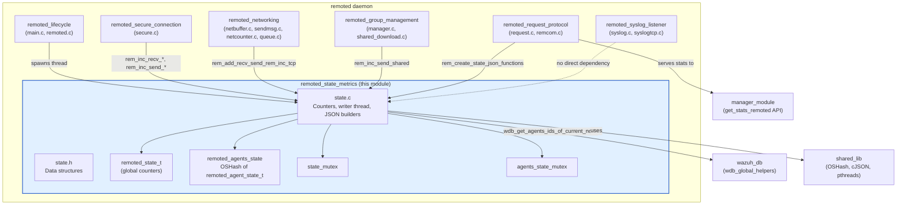
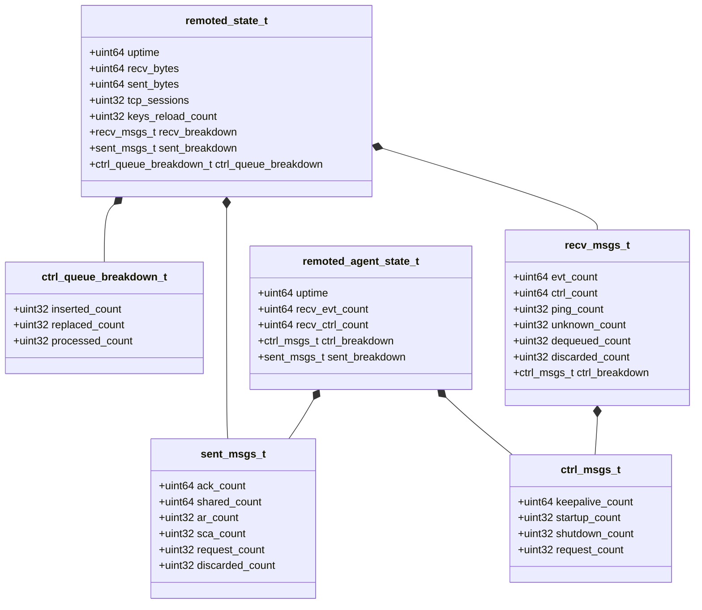
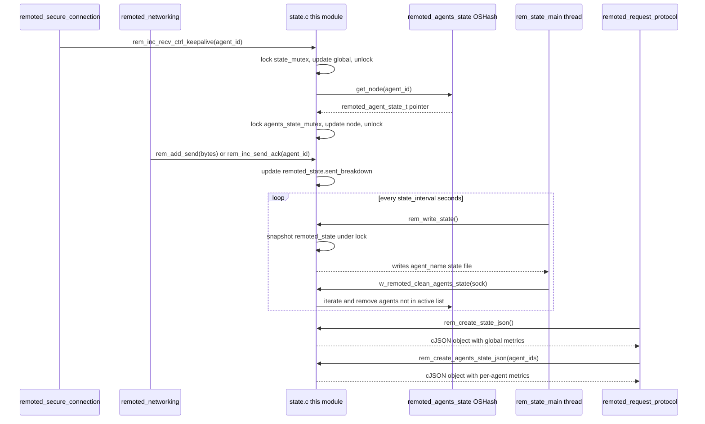
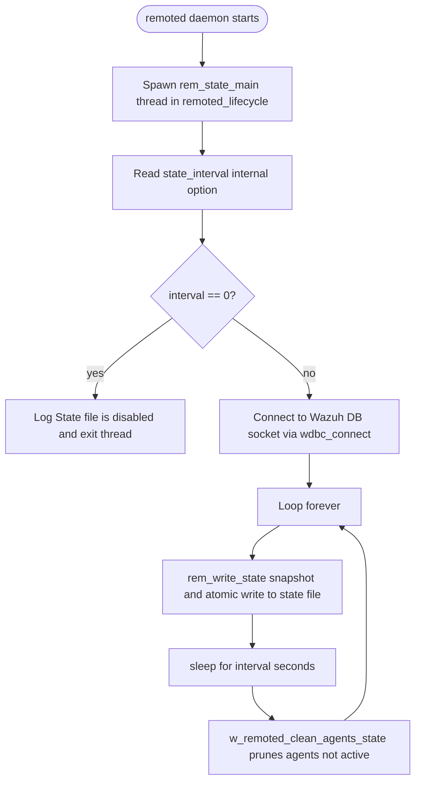

# Remoted State & Metrics (`remoted_state_metrics`)

## Introduction

The **`remoted_state_metrics`** module is the observability backbone of the `remoted` daemon — the Wazuh component that manages the secure, bidirectional communication channel between the manager and every enrolled agent. This module does not participate in message routing itself; instead, it **collects, aggregates and exposes runtime metrics** describing how `remoted` is behaving: how many bytes/messages were sent and received, how TCP sessions are trending, how the internal control-message queue is performing, and — per individual agent — how many keep-alives, shutdowns, ACKs, or Active-Response commands have been exchanged.

These metrics are consumed in two ways:

1. **Legacy flat-file state** (`<agent_name>.state`), periodically written to disk for backward-compatible monitoring tools.
2. **JSON state**, generated on demand and served through the `remoted` control socket (see [remoted_request_protocol](remoted_request_protocol.md)), which is what powers the Wazuh Manager API endpoint `GET /manager/stats/remoted` (see [manager_module](manager_module.md)).

Because almost every other `remoted` subsystem (secure connection handling, networking, group/file distribution, request handling) emits events into this module, `remoted_state_metrics` acts as a **shared, thread-safe counters hub** for the whole daemon.

---

## Purpose & Core Functionality

| Responsibility | Description |
|---|---|
| **Global counters** | Track daemon-wide totals: bytes sent/received, TCP session count, keys-reload count, and a full breakdown of received/sent message types. |
| **Per-agent counters** | Maintain a hash map (`remoted_agents_state`) of lightweight statistics per connected agent (keep-alives, control messages, ACKs, Active-Response, SCA, etc.). |
| **Control-queue metrics** | Track how the internal control-message queue (`control_msg_queue`) is being used: items inserted, replaced, and processed — used to detect backpressure. |
| **Periodic persistence** | A background thread (`rem_state_main`) writes the legacy `.state` file on a configurable interval (`remoted.state_interval`). |
| **Stale agent cleanup** | Periodically prunes agent statistics for agents that are no longer active, using the global agent list from `wdb_global_helpers` (Wazuh DB). |
| **On-demand JSON snapshots** | `rem_create_state_json()` and `rem_create_agents_state_json()` build point-in-time JSON representations for API/CLI consumers. |

---

## Architecture Overview



---

## Data Model

The module defines a compact, POD-style set of structures (in `state.h`) that are copied under mutex protection whenever a snapshot is required, avoiding long lock hold times.



> `remoted_agent_state_t` instances are stored in the global `OSHash *remoted_agents_state` (declared in [remoted_lifecycle](remoted_lifecycle.md) / `remoted.h`, implemented via the shared `hash_op` utilities from [shared_lib](shared_lib.md)), keyed by agent ID string.

---

## Component Interaction / Call Graph

Almost every counter-increment function follows the same pattern: lock the appropriate mutex, update the global struct, unlock, and — if an `agent_id` is supplied — also update the per-agent node (creating it on first use via `get_node()`).



---

## Key Functions (Core Components)

### `src/remoted/state.c`

| Function | Role |
|---|---|
| `rem_state_main()` | Background thread entry point. Reads `remoted.state_interval` from internal options; if `0`, the state file feature is disabled. Otherwise, loops forever writing the state file and pruning stale agents. |
| `rem_write_state()` | Serializes a snapshot of `remoted_state` to the legacy `<agent_name>.state` text file using an atomic write-then-rename pattern. |
| `get_node(agent_id)` *(static/STATIC)* | Looks up or lazily creates a `remoted_agent_state_t` entry in the `remoted_agents_state` hash. |
| `w_remoted_clean_agents_state(sock)` *(static/STATIC)* | Removes hash entries for agents no longer present in the "active" list returned by `wdb_get_agents_ids_of_current_node()` (from [wazuh_db](wazuh_db.md)). |
| `rem_inc_ctrl_queue_processed()` | Increments the count of control messages successfully dequeued/processed from the internal control-message queue (`control_msg_queue`), used to monitor queue health. |
| `rem_inc_keys_reload()` | Increments the counter tracking how many times the agent key store has been reloaded (relevant to enrollment/re-keying flows, see `os_auth` in the native daemons). |
| `rem_inc_send_ar(agent_id)` | Increments the counter of Active-Response commands sent to a specific agent (both globally and per-agent); consumed by [active_response_module](active_response_module.md) workflows. |
| `rem_inc_send_cfga(agent_id)` | Increments the counter of Security-Configuration-Assessment (SCA) related messages sent to an agent; correlates with [sca_module](sca_module.md). |
| `rem_inc_send_request(agent_id)` | Increments the counter of request-type messages sent to the agent (used by the request/response subsystem in `remoted_request_protocol`). |
| `rem_create_state_json()` | Builds a full JSON snapshot of daemon-wide metrics (bytes, message breakdowns, queue stats, TCP sessions) — the payload behind the Manager API's remoted stats endpoint. |
| `rem_create_agents_state_json(agent_ids)` | Builds a JSON array of per-agent metrics for a given list of agent IDs. |

Additional (non-"core" but present in the file) functions worth noting for completeness: `rem_inc_tcp` / `rem_dec_tcp`, `rem_add_recv` / `rem_add_send`, `rem_inc_recv_evt` / `rem_inc_recv_ctrl` / `rem_inc_recv_ping` / `rem_inc_recv_unknown` / `rem_inc_recv_dequeued` / `rem_inc_recv_discarded`, `rem_inc_recv_ctrl_keepalive` / `_startup` / `_shutdown` / `_request`, `rem_inc_send_ack` / `_shared` / `_discarded`, and `rem_inc_ctrl_queue_inserted` / `_replaced`. These follow the exact same lock → update-global → update-per-agent pattern as the highlighted core components above.

### `src/remoted/state.h`

Defines all POD structures listed in the [Data Model](#data-model) section plus the public increment/decrement API (`rem_inc_tcp`, `rem_dec_tcp`, `rem_add_recv`, `rem_add_send`, `rem_inc_recv_*`, `rem_inc_send_*`, etc.) used throughout the `remoted` codebase, and declares `remcom_main()` (implemented in `remcom.c`, part of [remoted_request_protocol](remoted_request_protocol.md)) which serves these metrics over the daemon's local control socket.

---

## Process Flow: State File Lifecycle



---

## Concurrency Model

- **`state_mutex`** protects the single global `remoted_state_t remoted_state` instance. All `rem_inc_*` / `rem_add_*` global counter functions acquire this mutex briefly.
- **`agents_state_mutex`** protects the `remoted_agents_state` OSHash and every `remoted_agent_state_t` node's fields. This is a coarser lock (shared across all agents) but each critical section is very short (a handful of integer increments).
- Snapshot functions (`rem_write_state`, `rem_create_state_json`, `rem_create_agents_state_json`) copy the protected structures into local stack variables while holding the lock, then release it before doing I/O or JSON serialization — minimizing contention with the high-frequency increment calls coming from the networking/secure-connection hot paths.

---

## Integration Points with Other Modules

| Related Module | Relationship |
|---|---|
| [remoted_lifecycle](remoted_lifecycle.md) | Starts the `rem_state_main()` thread during daemon startup; declares `OSHash *remoted_agents_state` and shared daemon-wide types (`remoted.h`). |
| [remoted_secure_connection](remoted_secure_connection.md) | Calls `rem_inc_recv_*` / `rem_inc_send_*` functions for every message decrypted/encrypted on the secure agent channel. |
| [remoted_networking](remoted_networking.md) | Uses `rem_add_recv`, `rem_add_send`, `rem_inc_tcp`, `rem_dec_tcp` while managing TCP/UDP buffers and connections. |
| [remoted_group_management](remoted_group_management.md) | Increments shared-file delivery counters (`rem_inc_send_shared`) when pushing group configuration files to agents. |
| [remoted_request_protocol](remoted_request_protocol.md) | Consumes `rem_create_state_json()` / `rem_create_agents_state_json()` in `remcom.c` to answer control-socket queries (`getstate` commands). |
| [manager_module](manager_module.md) | The Manager API's `get_stats_remoted` controller/framework function retrieves the JSON produced by this module through the cluster/local request pipeline. |
| [wazuh_db](wazuh_db.md) | `wdb_get_agents_ids_of_current_node()` (from `wdb_global_helpers`) is used to determine which agents are still active, enabling stale-state cleanup. |
| [shared_lib](shared_lib.md) | Provides the underlying `OSHash` implementation, `cJSON` library bindings, and pthread wrapper macros (`w_mutex_lock/unlock`) used throughout this module. |

---

## Configuration

The only tunable directly affecting this module is the internal option:

```
remoted.state_interval
```

- Valid range: `0`–`86400` seconds.
- `0` disables the legacy `.state` file writer thread entirely (JSON-on-demand queries via the control socket remain available regardless).
- Values `< 60` produce a per-second refresh notice; `< 3600` per-minute; otherwise per-hour — purely cosmetic text embedded in the state file header.

This option is parsed via the shared internal-options mechanism described in [Remote_Config](Remote_Config.md).

---

## Summary

`remoted_state_metrics` is a small but architecturally important module: it provides a **thread-safe, low-overhead counters and snapshot API** that decouples metric producers (networking, secure connection, group management) from metric consumers (legacy state file, JSON API, control socket). Its design — global lock-protected aggregates plus a hashed per-agent breakdown — mirrors patterns used elsewhere in Wazuh's native daemons (e.g., `wdb_state` in [wazuh_db](wazuh_db.md), `monitord_agent_monitoring` in [monitord](monitord.md)) and is a good reference implementation for adding observability to other C daemons in the codebase.
