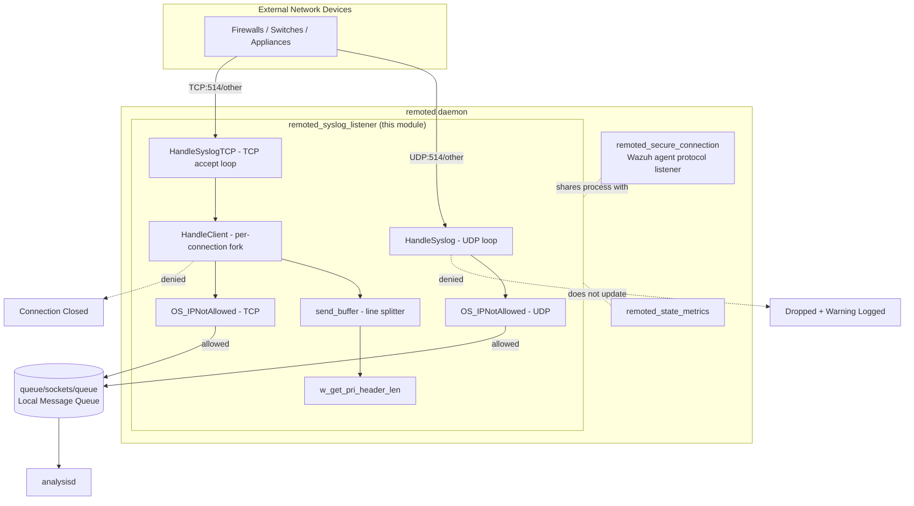
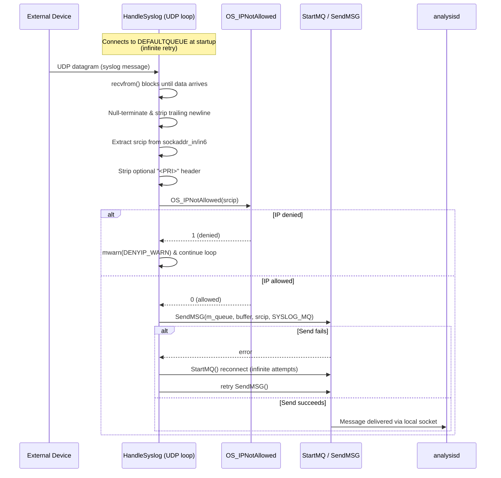
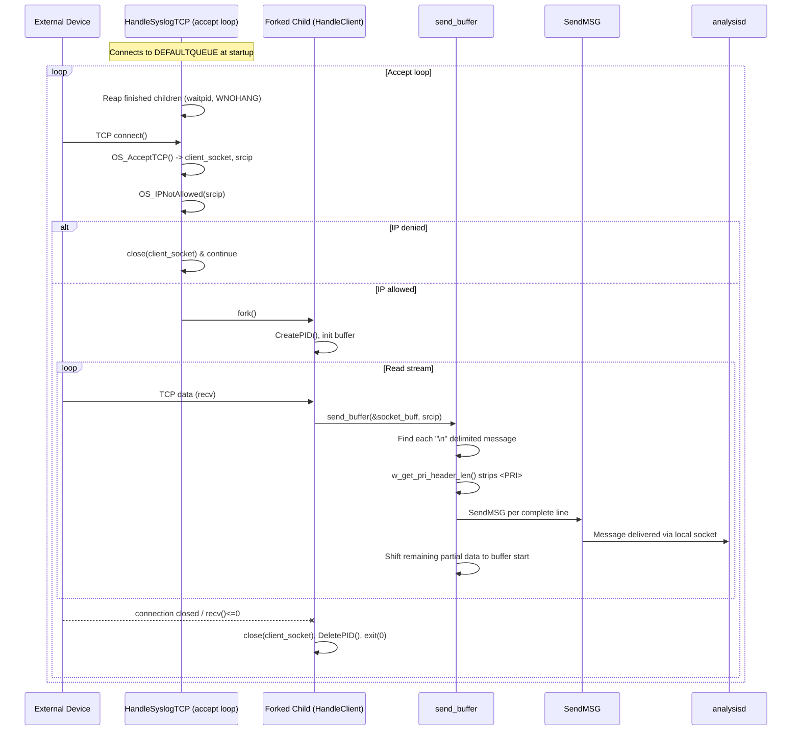
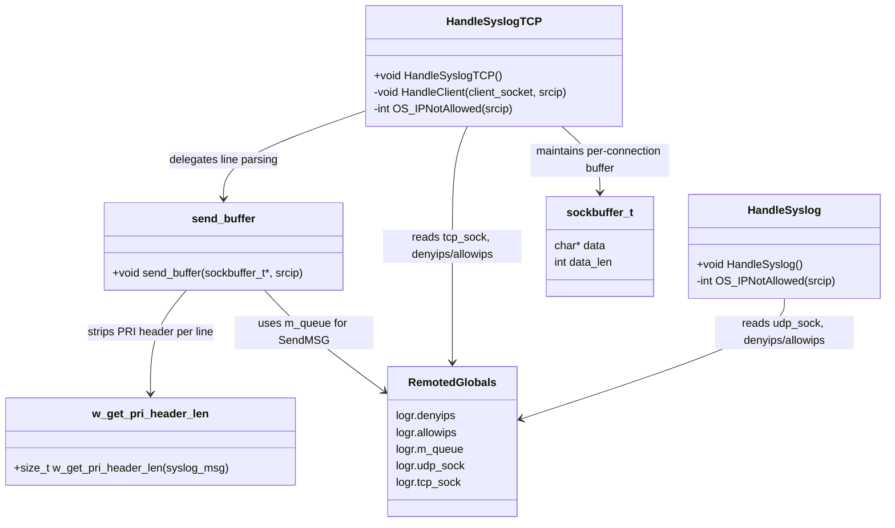
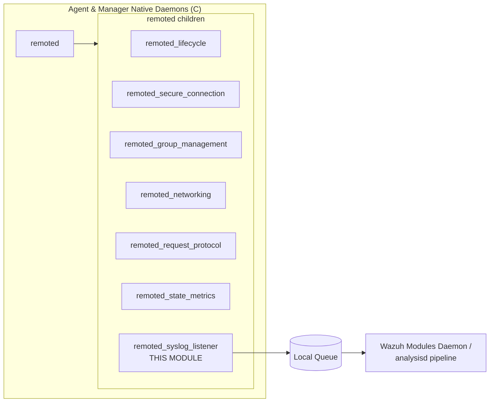

# Remoted Syslog Listener

## Introduction

The **Remoted Syslog Listener** is a small but focused subsystem of the Wazuh `remoted` daemon that allows the manager to receive **third-party syslog messages** over the network (in addition to the native, encrypted Wazuh agent protocol) and forward them into the manager's internal analysis pipeline. It implements two independent network listeners — one for **UDP syslog** and one for **TCP syslog** — that accept plain-text syslog datagrams/streams from external devices (firewalls, network appliances, switches, etc.), apply IP allow/deny filtering, strip the optional RFC3164 `<PRI>` header, and inject the resulting message into the local Wazuh queue (`ossec/queue/sockets/queue`) so it can be picked up by `analysisd` like any other event.

This module is a leaf component of the larger `remoted` daemon (see [remoted_state_metrics.md](remoted_state_metrics.md), [remoted_networking.md](remoted_networking.md), and [remoted_lifecycle.md](remoted_lifecycle.md) for sibling subsystems), and it depends on shared infrastructure such as the message queue API and IP-matching utilities documented in [shared_lib.md](shared_lib.md).

## Purpose & Scope

| Aspect | Description |
|---|---|
| **Module** | `remoted_syslog_listener` |
| **Location** | `src/remoted/syslog.c`, `src/remoted/syslogtcp.c` |
| **Parent daemon** | `remoted` (Wazuh Remote Daemon) |
| **Primary responsibility** | Accept raw syslog traffic (UDP/TCP) from non-Wazuh sources and relay it to the local analysis queue |
| **Consumers of output** | `analysisd` (via `queue/sockets/queue`), further documented in the Agent & Manager Native Daemons module tree |

The listener is an **optional feature** of `remoted`: it is only started when the manager's `<remote>` configuration block ([Remote_Config](Remote_Config.md)) defines a connection of type `syslog` with a `protocol` of `udp` or `tcp`. When enabled, it runs as a dedicated thread/loop inside the `remoted` process, parallel to the main secure-connection listener described in [remoted_secure_connection.md](remoted_secure_connection.md).

## Core Components

| Component | File | Description |
|---|---|---|
| `HandleSyslog()` | `src/remoted/syslog.c` | Main loop for the **UDP** syslog listener. Blocks on `recvfrom()`, extracts source IP, strips the PRI header, validates against allow/deny lists, and forwards to the queue. |
| `OS_IPNotAllowed()` (static, syslog.c) | `src/remoted/syslog.c` | IP filter check used by the UDP listener, backed by `logr.denyips` / `logr.allowips`. |
| `HandleSyslogTCP()` | `src/remoted/syslogtcp.c` | Main loop for the **TCP** syslog listener. Accepts connections, forks a child process per client, and manages an accounting loop over child PIDs. |
| `HandleClient()` (static, syslogtcp.c) | `src/remoted/syslogtcp.c` | Per-connection handler forked by `HandleSyslogTCP()`. Reads a stream of bytes into a growing buffer and delegates line-splitting/forwarding to `send_buffer()`. |
| `send_buffer()` | `src/remoted/syslogtcp.c` | Splits the raw TCP byte stream on `\n` boundaries, strips PRI headers per line, and sends each complete message to the queue via `SendMSG()`. |
| `w_get_pri_header_len()` (`STATIC`) | `src/remoted/syslogtcp.c` | Utility that computes the length of an optional `<PRI>` syslog header (RFC3164) so it can be skipped before forwarding the message body. |
| `OS_IPNotAllowed()` (static, syslogtcp.c) | `src/remoted/syslogtcp.c` | IP filter check used by the TCP listener (functionally identical to the UDP variant but operating on a different translation unit). |
| `sockaddr`, `sockaddr_in`, `sockaddr_in6`, `sockaddr_storage` | `src/remoted/syslog.c` | Standard BSD socket address structures used to receive and identify the source of incoming UDP datagrams. |

> Note: the module intentionally duplicates a small `OS_IPNotAllowed()` helper and IP handling logic between the UDP (`syslog.c`) and TCP (`syslogtcp.c`) implementations rather than sharing one function, since they evolved as separate protocol handlers within `remoted`.

## Architecture Overview

## Data Flow

### UDP Syslog Path (`HandleSyslog`)

### TCP Syslog Path (`HandleSyslogTCP` / `HandleClient` / `send_buffer`)

## Component Interaction

## Key Behaviors & Design Notes

1. **Two independent transports, two independent loops.** UDP is handled inline in a single-process loop (`HandleSyslog`), while TCP uses the classic **fork-per-connection** model (`HandleSyslogTCP` + `HandleClient`), consistent with legacy Wazuh/OSSEC networking code found throughout [remoted_networking.md](remoted_networking.md).
2. **IP allow/deny filtering** is applied identically in both transports using the `logr.denyips` / `logr.allowips` lists (populated from `remote-config` — see [Remote_Config](Remote_Config.md)). Deny takes precedence; if not explicitly denied, the IP must be present in `allowips` (when configured) to be accepted.
3. **PRI header stripping.** Syslog messages may optionally begin with a `<PRI>` header per RFC3164. Both listeners detect and skip this header before handing the message to `SendMSG()`, ensuring the stored event body doesn't carry redundant framing information. The TCP path exposes this as a testable static function `w_get_pri_header_len()` (visible under `STATIC` macro for unit testing — see `test_syslogtcp_remoted` in [Unit_Tests_-_Remoted.md](Unit_Tests_-_Remoted.md)).
4. **Reliable delivery to the local queue.** Both paths call `SendMSG()` against `logr.m_queue`, and on failure will attempt an **infinite-retry reconnect** via `StartMQ(DEFAULTQUEUE, WRITE, INFINITE_OPENQ_ATTEMPTS)`, mirroring the resiliency pattern used by other `remoted` senders (see `sendmsg.c` in [remoted_networking.md](remoted_networking.md)).
5. **TCP stream reassembly.** Because TCP is a byte stream, `send_buffer()` accumulates data in a `sockbuffer_t` buffer and only forwards complete `\n`-terminated messages, retaining any partial trailing data for the next `recv()` call.
6. **Child process lifecycle for TCP.** `HandleSyslogTCP()` reaps completed child processes on each loop iteration using non-blocking `waitpid(..., WNOHANG)`, preventing zombie process accumulation while still promptly accepting new connections.
7. **No dedicated metrics.** Unlike the main secure connection handler, this module does not update `remoted_state_t` counters (see [remoted_state_metrics.md](remoted_state_metrics.md)); syslog throughput is not separately tracked in `remoted`'s internal statistics.

## Dependencies

| Dependency | Where Documented | Used For |
|---|---|---|
| `logr` global config (denyips/allowips/sockets/m_queue) | [remoted_lifecycle.md](remoted_lifecycle.md) | Access to configured IP lists and active sockets |
| `SendMSG`, `StartMQ` | [shared_lib.md](shared_lib.md) (`src/shared/mq_op.c`) | Delivering messages to the local Wazuh queue |
| `OS_IPFoundList` | [shared_lib.md](shared_lib.md) (`src/shared/validate_op.c`) | Underlying IP list matching logic used by `OS_IPNotAllowed()` |
| `get_ipv4_string`, `get_ipv6_string`, `OS_AcceptTCP` | [os_net.md](os_net.md) (`src/os_net/os_net.c`) | Address formatting and TCP accept helper |
| `remote-config` (`<remote type="syslog">`) | [Remote_Config.md](Remote_Config.md) | Enables/configures this listener (protocol, allowed/denied IPs, port) |
| `remoted_state_metrics`, `remoted_secure_connection`, `remoted_networking` | Sibling `remoted` submodules | Peer subsystems running within the same daemon process |

## Where This Fits in the System

The syslog listener is one of several sibling components that make up the `remoted` daemon. It has minimal coupling with the rest of `remoted` — sharing only the global `logr` configuration structure and the local message queue handle — making it a self-contained, easily testable network ingestion path for non-Wazuh syslog sources.

## Testing

Unit tests for this module live under `src/unit_tests/remoted/test_syslogtcp.c`, focused specifically on the PRI-header parsing utility `w_get_pri_header_len()` (see `test_syslogtcp_remoted` in [Unit_Tests_-_Remoted.md](Unit_Tests_-_Remoted.md)). Broader `remoted` behaviors (secure connections, group management, etc.) are covered by sibling test suites within the same unit test module.
