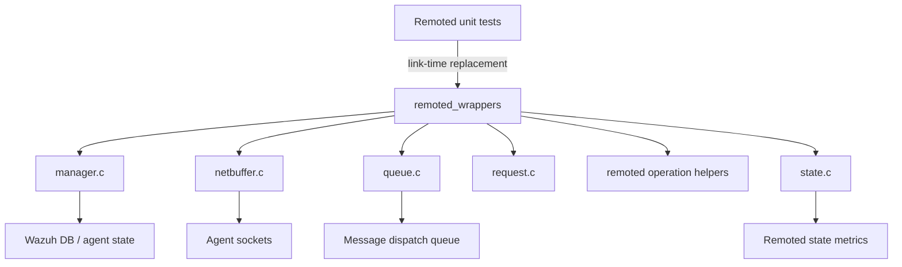
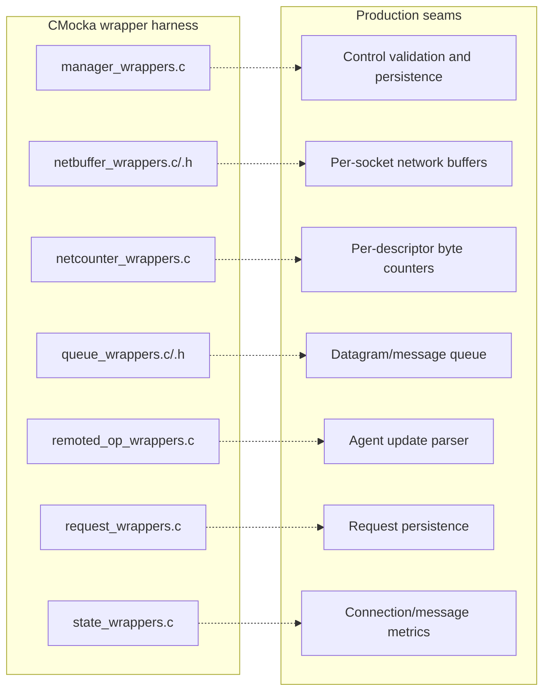
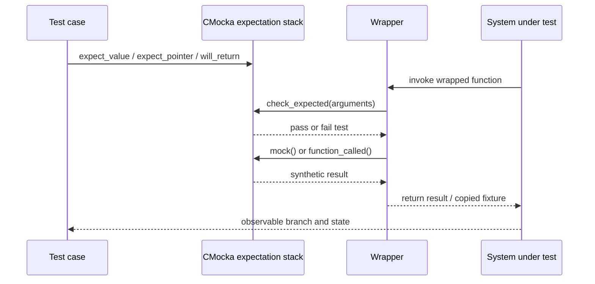
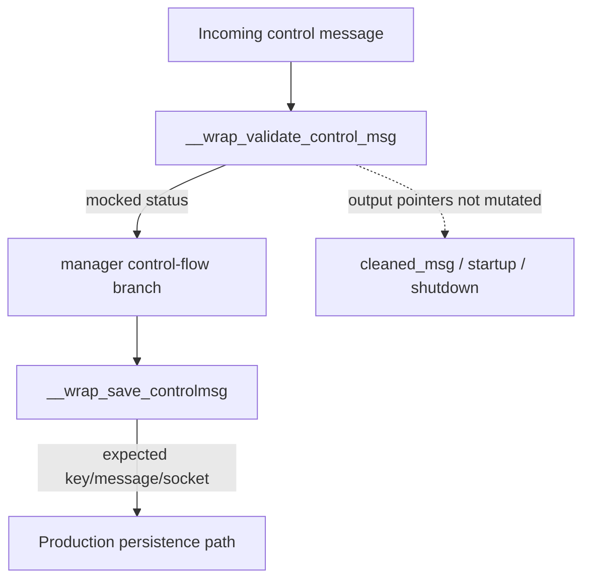
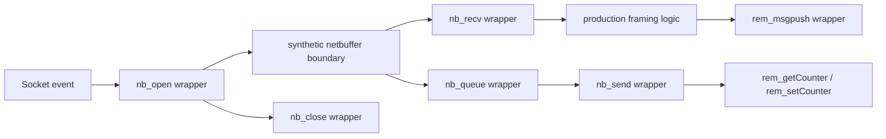
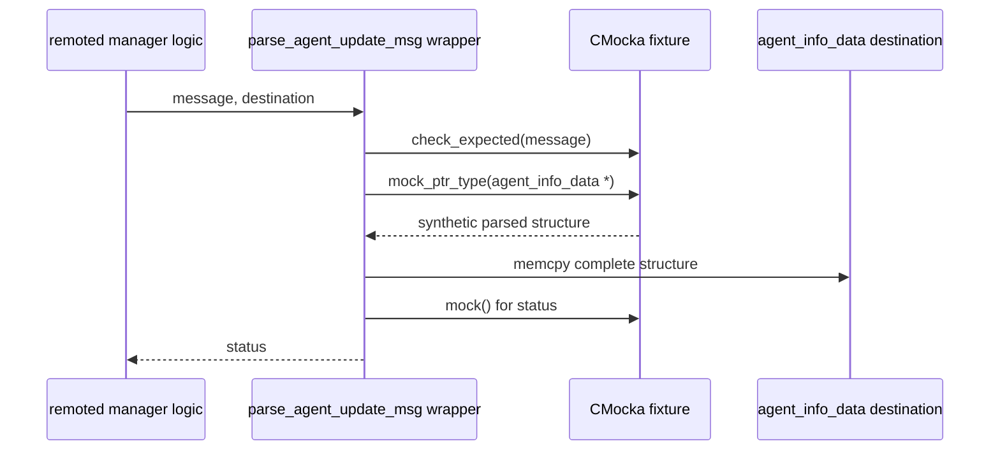
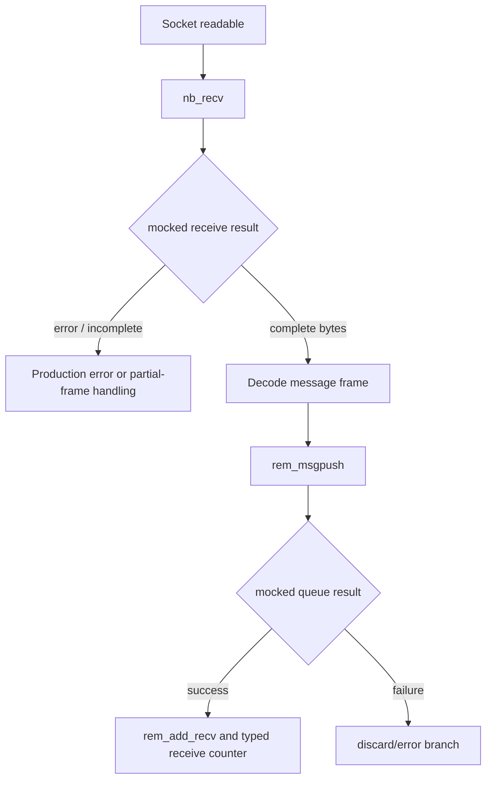
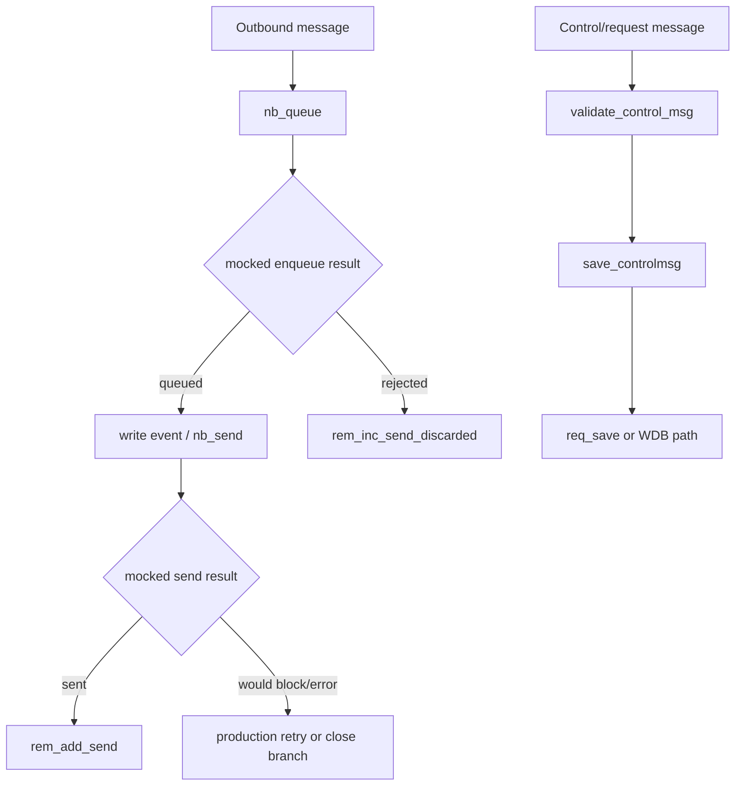
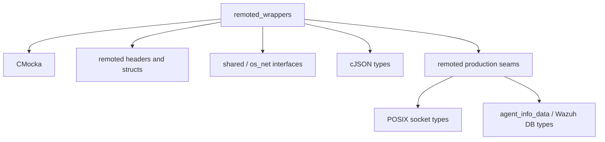

# `remoted_wrappers`

## Introduction

`remoted_wrappers` is the CMocka link-wrapper layer used by Wazuh `remoted` unit tests. It replaces selected production functions at link time so tests can control return values, inject synthetic data, and assert that the daemon invokes networking, queue, request, validation, and state APIs with the expected arguments.

The module contains no production remoted behavior and does not open sockets or update Wazuh DB. Its purpose is isolation: the system under test executes its real control flow while these wrappers substitute external boundaries.

## Module position

The wrappers sit between remoted unit-test cases and the native daemon components. The production responsibilities are documented in [remoted.md](remoted.md) and the focused documents listed below.



### Related documentation

| Reference | Scope |
|---|---|
| [remoted.md](remoted.md) | Complete daemon architecture and lifecycle. |
| [remoted_networking.md](remoted_networking.md) | Socket buffers, framing, reads, and writes. |
| [remoted_secure_connection.md](remoted_secure_connection.md) | Secure TCP/UDP connection processing and message delivery. |
| [remoted_group_management.md](remoted_group_management.md) | Agent-group and shared-file management. |
| [remoted_request_protocol.md](remoted_request_protocol.md) | Request persistence and request-sender behavior. |
| [remoted_state_metrics.md](remoted_state_metrics.md) | Counters and state JSON generation. |
| [test_netbuffer_remoted.md](test_netbuffer_remoted.md) | Tests that exercise the netbuffer boundary. |
| [save_controlmsg_tests.md](save_controlmsg_tests.md) | Manager control-message and Wazuh DB behavior. |
| [test_remoted_op.md](test_remoted_op.md) | Agent-update parsing behavior. |

## Architecture

The source files are organized by the production boundary they mock:



### Boundary inventory

| Wrapper source | Wrapped boundary | Main test purpose |
|---|---|---|
| `manager_wrappers.c` | `save_controlmsg`, `validate_control_msg`, and the related group-assignment seam | Verify control-message classification, persistence, and error propagation. |
| `netbuffer_wrappers.c/.h` | `nb_open`, `nb_close`, `nb_queue`, `nb_recv`, `nb_send` | Isolate socket-buffer lifecycle, framing, retries, and send/receive outcomes. POSIX-only. |
| `netcounter_wrappers.c` | `rem_getCounter`, `rem_setCounter` | Control per-file-descriptor byte counters. |
| `queue_wrappers.c/.h` | `rem_get_qsize`, `rem_get_tsize`, `rem_msgpush` | Control queue capacity and dispatch of complete messages. |
| `remoted_op_wrappers.c` | `parse_agent_update_msg` | Inject parsed `agent_info_data` and control parser success/failure. |
| `request_wrappers.c` | `req_save` | Assert request counter, payload, and length passed to persistence. |
| `state_wrappers.c` | Receive/send counters and state JSON functions | Verify metric increments and inject state snapshots. |

## CMocka interaction model

The wrappers use three complementary CMocka mechanisms:

1. `check_expected(value)` validates scalar values or pointer identity configured by the test.
2. `check_expected_ptr(value)` validates pointer identity for structures such as `sockaddr_storage`.
3. `mock()` / `mock_type()` / `mock_ptr_type()` return test-controlled values; `function_called()` verifies that a no-argument event occurred.



Wrappers generally preserve the production signature but deliberately do not perform the underlying operation. Parameters marked `__attribute__((unused))` are accepted for ABI compatibility while omitted from assertions when a test does not need them.

## Data-flow and component interaction

### Control-message path

`save_controlmsg` and `validate_control_msg` are the manager-side seams. The former is `void` and only checks the agent key, raw message, and Wazuh DB socket pointer. The latter checks the key, message, and length, then returns a mocked integer status. Its cleaned-message and startup/shutdown output parameters are intentionally ignored by this wrapper.



The supplied source also defines `__wrap_assign_group_to_agent`, which checks the agent ID and checksum and returns a mocked `cJSON *`. This is a manager test seam for group assignment, alongside the dedicated group-management behavior in [remoted_group_management.md](remoted_group_management.md).

### Network-buffer path

The netbuffer wrappers cover lifecycle and I/O operations without allocating or modifying a real `netbuffer_t`. `nb_queue` checks socket, encrypted message, size, and agent ID, then returns a mocked integer. `nb_recv` and `nb_send` check the descriptor and return mocked outcomes.



`netbuffer_wrappers.h` is POSIX-guarded with `#ifndef WIN32`, matching the implementation. It includes `remoted.h` so the `netbuffer_t` and `remoted` socket types remain ABI-compatible with the production declarations.

### Queue and request path

The queue wrappers provide two size queries and one message-insertion seam. `rem_msgpush` checks the socket, peer address pointer, and byte count, then returns `mock()`. `req_save` checks the persistence counter, buffer, and length before returning a mocked status.

```mermaid
flowchart TD
    Payload[Encrypted or decoded payload] --> QSize[rem_get_qsize]
    Payload --> TSize[rem_get_tsize]
    Payload --> Push[rem_msgpush(buffer, size, addr, sock)]
    Push --> Result[Mocked queue result]
    Request[Request data] --> Save[req_save(counter, buffer, length)]
    Save --> RequestResult[Mocked persistence result]
```

These wrappers test the contract at the boundary; queue internals and request-file semantics belong to [remoted_networking.md](remoted_networking.md) and [remoted_request_protocol.md](remoted_request_protocol.md).

### Agent-update parsing path

`__wrap_parse_agent_update_msg` checks the input message, obtains a test-owned `agent_info_data *` via `mock_ptr_type`, copies the complete structure into the caller-provided destination, and returns `mock()`.



The copy is significant: callers observe realistic populated output rather than merely a return code. Parsing rules and ownership expectations are documented in [test_remoted_op.md](test_remoted_op.md).

## State and metrics path

`state_wrappers.c` splits state behavior into event notifications, byte totals, typed control-message counters, and state JSON factories.

```mermaid
flowchart TB
    TCP[Connection lifecycle] --> IncTCP[rem_inc_tcp]
    TCP --> DecTCP[rem_dec_tcp]
    RX[Received bytes] --> AddRecv[rem_add_recv(bytes)]
    TX[Sent bytes] --> AddSend[rem_add_send(bytes)]
    Ctrl[Control message] --> Typed{message type}
    Typed --> Startup[rem_inc_recv_ctrl_startup(agent_id)]
    Typed --> Shutdown[rem_inc_recv_ctrl_shutdown(agent_id)]
    Typed --> Keepalive[rem_inc_recv_ctrl_keepalive(agent_id)]
    Typed --> Request[rem_inc_recv_ctrl_request(agent_id)]
    Typed --> Unknown[rem_inc_recv_unknown]
    Ack[Outgoing result] --> AckCounter[rem_inc_send_ack(agent_id)]
    Discard[Rejected outgoing message] --> DiscardCounter[rem_inc_send_discarded(agent_id)]
    Snapshot[State endpoint] --> StateJSON[rem_create_state_json]
    AgentSnapshot[Per-agent state endpoint] --> AgentJSON[rem_create_agents_state_json(ids)]
```

No-argument increment/decrement functions use `function_called()` rather than `mock()`: the test only needs to assert occurrence. Functions with meaningful values check the byte count or agent ID. The JSON factories return mocked `cJSON *` values; the wrappers do not construct JSON themselves.

## Process flows

### Receive and dispatch



### Send and persistence



### State snapshot generation

```mermaid
flowchart LR
    Query[State query] --> Global[rem_create_state_json]
    Query --> Agents[rem_create_agents_state_json(agent IDs)]
    Global --> MockGlobal[mocked cJSON result]
    Agents --> MockAgents[mocked cJSON result]
    MockGlobal --> API[caller/test assertion]
    MockAgents --> API
```

## Component contracts

| Function | Arguments asserted | Return/output behavior |
|---|---|---|
| `__wrap_save_controlmsg` | `key`, `r_msg`, `wdb_sock` | Returns `void`; no output mutation. |
| `__wrap_validate_control_msg` | `key`, `r_msg`, `msg_length` | Returns `mock_type(int)`; output pointers are ignored. |
| `__wrap_assign_group_to_agent` | `agent_id`, `md5` | Returns `mock_type(cJSON *)`. |
| `__wrap_nb_open` | `sock`, peer pointer | No return; validates peer identity. |
| `__wrap_nb_close` | `sock` | No return. |
| `__wrap_nb_queue` | socket, encrypted message, size, agent ID | Returns `mock()`. |
| `__wrap_nb_recv` / `__wrap_nb_send` | socket | Returns `mock()`. |
| `__wrap_rem_setCounter` | descriptor, counter | No return. |
| `__wrap_rem_getCounter` | descriptor | Returns `mock()` as `size_t`. |
| `__wrap_rem_get_qsize` / `__wrap_rem_get_tsize` | none | Return `mock()` as `size_t`. |
| `__wrap_rem_msgpush` | peer address, size, socket | Returns `mock()`. |
| `__wrap_parse_agent_update_msg` | message pointer | Copies mocked `agent_info_data`; returns `mock()`. |
| `__wrap_req_save` | counter, buffer, length | Returns `mock()`. |
| `__wrap_rem_add_recv` / `__wrap_rem_add_send` | byte count | Validates byte count. |
| Typed receive/send counters | agent ID where applicable | Validates ID; no return. |
| `__wrap_rem_inc_tcp`, `__wrap_rem_dec_tcp`, `__wrap_rem_inc_recv_evt`, `__wrap_rem_inc_recv_unknown` | none | Uses `function_called()`. |
| `__wrap_rem_create_state_json` | none | Returns mocked `cJSON *`. |
| `__wrap_rem_create_agents_state_json` | agent ID array | Validates array pointer and returns mocked `cJSON *`. |

## Dependencies



Important source-level dependencies include:

- CMocka headers and APIs: `check_expected`, `check_expected_ptr`, `mock`, `mock_type`, `mock_ptr_type`, and `function_called`.
- `src/remoted/remoted.h` through `netbuffer_wrappers.h`, providing `netbuffer_t` and remoted message structures.
- Shared networking and type headers used by the C implementation.
- `cJSON` pointer types for group assignment and state JSON factories.
- `agent_info_data`, which is copied by the parser wrapper.

The module is primarily a test-build dependency. It should not be linked into a production Wazuh binary.

## Maintenance guidance

When changing a production signature, update the corresponding wrapper declaration and implementation together. Then update every test expectation for argument order, pointer identity, and mocked return values.

Common regression risks are:

- Changing a pointer check from identity validation to value validation, or vice versa.
- Forgetting that `parse_agent_update_msg` must copy the complete fixture into the destination.
- Returning a value with the wrong promoted type; use `mock_type` for typed returns.
- Adding state counters without adding matching `function_called` or `check_expected` assertions.
- Removing the POSIX guard from netbuffer wrappers, which can break Windows test builds.
- Mutating output pointers in a wrapper that intentionally models only status behavior; such changes can hide production ownership or initialization bugs.

The best verification targets are the focused suites [test_netbuffer_remoted.md](test_netbuffer_remoted.md), [save_controlmsg_tests.md](save_controlmsg_tests.md), [test_remoted_op.md](test_remoted_op.md), [test_remote_state_remoted.md](test_remote_state_remoted.md), and [test_save_ctrlmsg_thread_remoted.md](test_save_ctrlmsg_thread_remoted.md).
