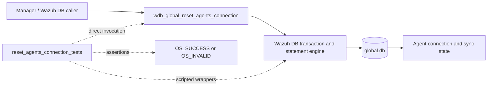
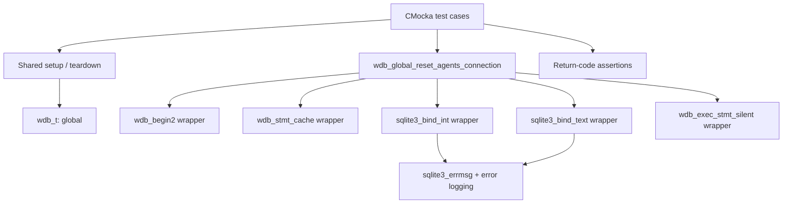
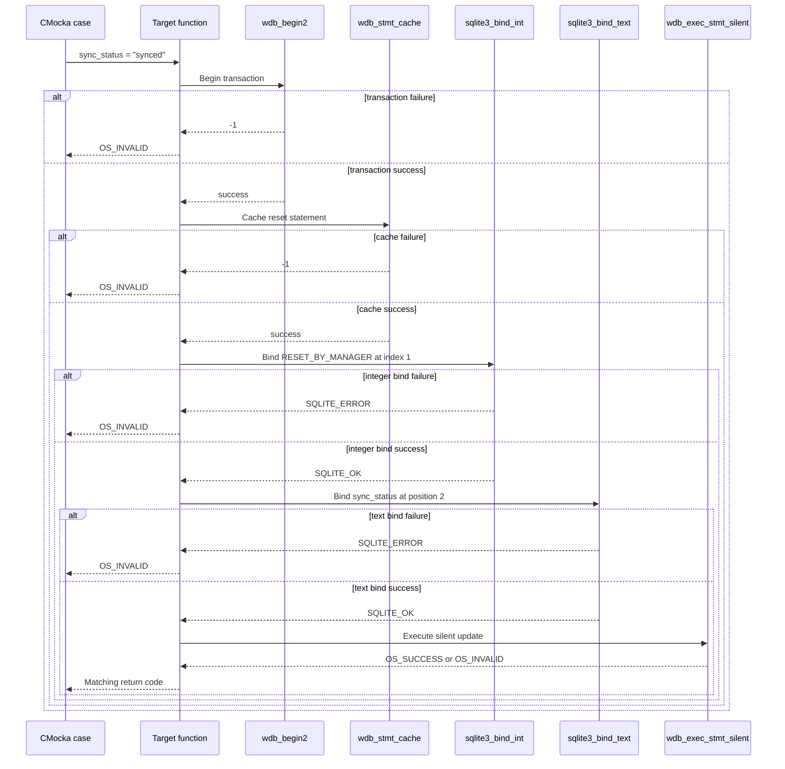

# `reset_agents_connection_tests`

## Introduction

`reset_agents_connection_tests` documents the focused CMocka coverage for
`wdb_global_reset_agents_connection()`, the Wazuh DB global-database operation
that resets agent connection state while applying a caller-supplied
synchronization status. The six tests are implemented in
`src/unit_tests/wazuh_db/test_wdb_global.c`.

This is a leaf of the broader global-database test suite. Shared fixture
allocation, linker-wrapper mechanics, and common SQLite failure conventions
are documented in
[`test_wdb_global_test_infrastructure.md`](test_wdb_global_test_infrastructure.md)
and [`test_wdb_global.md`](test_wdb_global.md). The production database
context is described in [`wazuh_db_global.md`](wazuh_db_global.md).

## Purpose and system position

The operation is a manager-side state-maintenance primitive. It is used when
the global Wazuh database must normalize agent connection records, such as
after manager startup or a connection-management reset. The test source shows
that the operation receives the synchronization status as input and binds the
constant `RESET_BY_MANAGER` as its first integer SQL parameter. The exact SQL
predicate and updated columns belong to the production implementation and are
not duplicated here.



## Contract under test

The exercised call has the following shape:

```c
int wdb_global_reset_agents_connection(wdb_t *wdb, const char *sync_status);
```

The expected execution sequence is:

1. Begin a transaction with `wdb_begin2()`.
2. Obtain/cache the reset statement with `wdb_stmt_cache()`.
3. Bind `RESET_BY_MANAGER` at SQLite parameter index 1.
4. Bind the supplied `sync_status` at parameter position 2.
5. Execute the update with `wdb_exec_stmt_silent()`.
6. Return `OS_SUCCESS` only when all stages succeed; otherwise return
   `OS_INVALID`.

```mermaid
flowchart TD
    Start([reset_agents_connection(wdb, sync_status)]) --> Tx{Begin transaction}
    Tx -- failure --> TxErr[Log: Cannot begin transaction] --> Invalid[Return OS_INVALID]
    Tx -- success --> Cache{Cache reset statement}
    Cache -- failure --> CacheErr[Log: Cannot cache statement] --> Invalid
    Cache -- success --> Bind1[Bind RESET_BY_MANAGER at index 1]
    Bind1 -- failure --> BindErr1[Log SQLite bind error] --> Invalid
    Bind1 -- success --> Bind2[Bind sync_status at position 2]
    Bind2 -- failure --> BindErr2[Log SQLite bind error] --> Invalid
    Bind2 -- success --> Execute[Execute silent update]
    Execute -- failure --> ExecErr[Return OS_INVALID]
    Execute -- success --> Done([Return OS_SUCCESS])
```

The tests verify parameter order and values, but deliberately do not assert
SQL text, affected-row counts, or the final schema representation. Those
details are responsibilities of the production global DB module.

## Test architecture

Each case uses the common `test_setup` and `test_teardown` fixture. The test
does not open a real SQLite database: it creates a minimal `wdb_t` whose ID is
`"global"`, supplies storage for a database pointer, initializes Wazuh DB
configuration, and scripts every relevant database boundary.



The fixture lifecycle and wrapper helper catalog are shared with neighboring
leaves such as [`get_all_agents_tests.md`](get_all_agents_tests.md),
[`get_sync_status_tests.md`](get_sync_status_tests.md), and
[`get_agents_by_connection_status_tests.md`](get_agents_by_connection_status_tests.md).

## Dependencies and interaction boundaries

| Dependency | Role in this test slice |
|---|---|
| `wdb.h` | Declares `wdb_t`, status constants, and the target function. |
| `wdb_begin2` wrapper | Controls transaction-start success or failure. |
| `wdb_stmt_cache` wrapper | Controls statement-cache success or failure. |
| `sqlite3_bind_int` wrapper | Verifies parameter 1 receives `RESET_BY_MANAGER`; injects bind failures. |
| `sqlite3_bind_text` wrapper | Verifies parameter 2 receives `sync_status`; injects bind failures. |
| `wdb_exec_stmt_silent` wrapper | Simulates execution success or failure without returning a result set. |
| `sqlite3_errmsg` wrapper | Supplies deterministic SQLite diagnostics for bind failures. |
| Logging wrappers | Verify transaction, cache, and SQLite error paths. |
| CMocka | Registers tests, scripts mocks, and checks return values. |

The reusable wrapper implementation is shared by the global Wazuh DB tests;
see [`test_wdb_global_test_infrastructure.md`](test_wdb_global_test_infrastructure.md)
for the broader dependency boundary.

## Test scenarios

| Test case | Simulated condition | Expected behavior |
|---|---|---|
| `test_wdb_global_reset_agents_connection_transaction_fail` | `wdb_begin2()` returns `-1`. | Logs `Cannot begin transaction`; returns `OS_INVALID`. |
| `test_wdb_global_reset_agents_connection_cache_fail` | Transaction succeeds, but `wdb_stmt_cache()` returns `-1`. | Logs `Cannot cache statement`; returns `OS_INVALID`. |
| `test_wdb_global_reset_agents_connection_bind1_fail` | Binding integer parameter 1 fails with `SQLITE_ERROR`. | Attempts to bind `RESET_BY_MANAGER`, logs the SQLite error path, and returns `OS_INVALID`. |
| `test_wdb_global_reset_agents_connection_bind2_fail` | Integer binding succeeds; text binding of `"synced"` fails. | Verifies the supplied synchronization status, logs the SQLite error path, and returns `OS_INVALID`. |
| `test_wdb_global_reset_agents_step_fail` | Both binds succeed; silent execution returns `OS_INVALID`. | Propagates execution failure as `OS_INVALID`. |
| `test_wdb_global_reset_agents_connection_success` | Transaction, cache, both binds, and execution succeed. | Returns `OS_SUCCESS`. |

The function is therefore tested as a short-circuiting pipeline: each failure
case stops at one boundary, while the success case proves the complete ordered
interaction.

## Component interaction flow



## Error-handling expectations

The tests establish several maintenance expectations for changes to this
operation:

- Transaction and statement-cache failures are reported through debug-level
  diagnostics and must not proceed to binding.
- The integer and text binds are ordered and must preserve their expected
  values. A bind error is reported using the SQLite error message and maps to
  `OS_INVALID`.
- Execution is silent from the caller’s perspective: the operation returns a
  status code rather than a JSON result. An execution failure must be
  propagated instead of being treated as a successful reset.
- The successful path uses `sync_status = "synced"` in the test fixture, but
  the function contract accepts the caller-provided status value.

## Test registration and maintenance

`main()` registers the six cases with
`cmocka_unit_test_setup_teardown()` and runs them through
`cmocka_run_group_tests()`. The registry places this group after the related
agent-query tests and before connection-status query tests.

When extending this leaf, preserve the existing pattern:

1. Configure only the wrapper calls needed for the branch under test.
2. Assert both the return code and important diagnostics.
3. Add a success case whenever a new dependency or parameter is introduced.
4. Keep schema, SQL text, and daemon routing documentation in the production
   module pages rather than duplicating it here.
